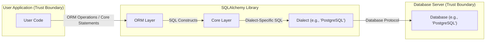
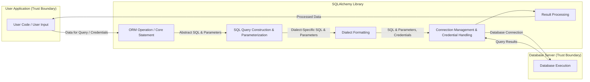

## Project Design Document: SQLAlchemy for Threat Modeling (Improved)

**1. Introduction**

This document provides an enhanced design overview of the SQLAlchemy project, a powerful and flexible Python SQL toolkit and Object-Relational Mapper (ORM). This detailed description is specifically crafted to facilitate comprehensive threat modeling activities. It meticulously outlines the system's architecture, dissects key components and their interactions, and meticulously maps data flow, with a particular focus on sensitive information. The objective is to provide security professionals with an in-depth understanding of SQLAlchemy's internal mechanisms and its relationships with external systems, thereby enabling the identification of potential vulnerabilities and attack vectors with greater precision.

**2. Goals and Objectives (for Threat Modeling)**

*   Deliver a precise and easily understandable description of SQLAlchemy's architecture and its diverse functionalities.
*   Pinpoint and describe the core components of SQLAlchemy, detailing their individual roles and interactions within the library.
*   Thoroughly map the movement of data within the system, with a specific emphasis on sensitive data such as SQL queries, user-supplied parameters, and database credentials.
*   Clearly delineate external dependencies and interactions with external systems, including database servers, user applications, and database drivers, highlighting trust boundaries.
*   Establish a robust foundation for the identification of potential threats, vulnerabilities, and attack surfaces within the SQLAlchemy ecosystem.
*   Serve as a definitive reference point for security assessments, penetration testing engagements, and the development of secure coding practices.

**3. System Architecture**

SQLAlchemy's architecture is structured into distinct layers, providing a separation of concerns and enabling flexibility. The two primary layers are the Core and the ORM, both of which rely on database Dialects to bridge the gap between SQLAlchemy's generic SQL expressions and the specific SQL syntax of various database systems.

*   **Core:** The foundational layer, offering a schema-centric perspective of the database. It allows for fine-grained control and direct interaction with SQL constructs, providing a lower-level interface.
*   **ORM (Object-Relational Mapper):** A higher-level abstraction layer that facilitates database interaction using object-oriented principles. It maps Python classes to database tables, simplifying data manipulation and retrieval.
*   **Dialects:** Database-specific implementations responsible for translating SQLAlchemy's abstract SQL expressions into the concrete SQL dialect understood by the target database (e.g., PostgreSQL, MySQL, SQLite). This layer also handles database-specific data type conversions and connection parameters.

**4. Data Flow**

The flow of data within SQLAlchemy encompasses the construction, transmission, and execution of SQL queries, as well as the retrieval and processing of results. Key data elements that are relevant for threat modeling include:

*   **SQL Queries:**  Representations of database operations, either explicitly constructed using the Core or implicitly generated by the ORM based on object manipulations. These can contain sensitive information depending on the application logic.
*   **Parameters:**  Values supplied to parameterized SQL queries. Proper use of parameters is crucial for preventing SQL injection vulnerabilities.
*   **Database Credentials:**  Sensitive information used to authenticate with the database server, including usernames, passwords, and connection strings. Secure handling of these credentials is paramount.
*   **Data Results:**  Data retrieved from the database in response to executed queries. This data may contain sensitive information that needs to be protected.
*   **User Input:** Data originating from the user application that might be incorporated into SQL queries or used to interact with the database. This is a primary source of potential vulnerabilities.

The typical data flow for executing a database operation initiated by the user application involves the following steps:

1. The user application initiates a database interaction, either through ORM operations or by directly constructing SQL queries using the Core.
2. If the ORM is used, it translates object-oriented actions (e.g., saving an object) into corresponding SQL queries.
3. The Core layer (or the ORM's underlying Core usage) constructs the SQL query, potentially incorporating user-provided data.
4. Crucially, if parameters are used, user-provided data is bound to the query separately from the SQL structure, mitigating SQL injection risks.
5. The appropriate Dialect formats the abstract SQL query into the specific SQL syntax required by the target database.
6. A Connection object manages the communication with the database server, sending the formatted SQL query and parameters.
7. The database server authenticates the connection using provided credentials and executes the query.
8. The database server returns the query results to SQLAlchemy.
9. SQLAlchemy processes the results, potentially mapping rows to Python objects (in the case of the ORM).
10. The processed results are returned to the user application.

**5. Key Components**

*   **Engine:** The central point of interaction with a database. It manages connection pooling, transaction management, and serves as a factory for Connection objects.
    *   Responsible for establishing and managing connections to the database server.
    *   Handles connection pooling to optimize resource utilization.
    *   Interacts with the configured Dialect to perform database-specific operations.
    *   Security Consideration: Misconfigured connection parameters or insecure storage of connection strings can lead to unauthorized access.
*   **Connection:** Represents an active communication channel with the database. It allows for the execution of SQL statements and management of transactions.
    *   Provides methods for executing SQL queries and fetching results.
    *   Manages the lifecycle of database transactions (commit, rollback).
    *   Security Consideration: Unencrypted connections expose data in transit. Improper handling of connection objects might lead to resource exhaustion.
*   **Dialects:** Database-specific adapters that translate SQLAlchemy's generic SQL expressions into the specific SQL dialect of the target database.
    *   Handles variations in SQL syntax, data types, and database-specific features.
    *   Security Consideration: Vulnerabilities within a specific dialect implementation could be exploited.
*   **SQL Expression Language (Core):** A powerful and flexible system for programmatically constructing SQL queries. It offers fine-grained control over SQL syntax.
    *   Provides a composable API for building SELECT, INSERT, UPDATE, and DELETE statements.
    *   Supports parameterized queries as the primary mechanism for preventing SQL injection.
    *   Security Consideration: Incorrectly constructed queries, especially those concatenating user input directly, are a major source of SQL injection vulnerabilities.
*   **ORM (Object-Relational Mapper):** A high-level layer that provides an object-oriented interface for interacting with databases. It maps Python classes to database tables.
    *   Simplifies database interactions by allowing developers to work with Python objects instead of raw SQL.
    *   Generates SQL queries based on object operations (e.g., saving, querying).
    *   Security Consideration: ORM misconfigurations or vulnerabilities in the ORM logic could lead to unintended data access or modification. Lazy loading issues might expose more data than intended.
*   **Session (ORM):** Represents a unit of work for interacting with the database using the ORM. It manages object states and transactions within an application context.
    *   Tracks changes to objects and synchronizes them with the database.
    *   Provides methods for querying, adding, updating, and deleting objects.
    *   Security Consideration: Improperly managed sessions or insecure session storage can lead to unauthorized access or data manipulation.
*   **Type System:** Manages the mapping between Python data types and database column types, ensuring data integrity and proper SQL generation.
    *   Handles type conversions between Python and the database.
    *   Security Consideration: Incorrect type mappings could lead to data truncation or unexpected behavior, potentially exploitable in certain scenarios.
*   **Events System:** Allows developers to hook into various stages of SQLAlchemy's operation, enabling custom logic for logging, auditing, or security enforcement.
    *   Provides a mechanism for intercepting and modifying SQLAlchemy's behavior.
    *   Security Consideration: Malicious or poorly written event listeners could introduce vulnerabilities or bypass security measures.

**6. External Interactions**

SQLAlchemy's functionality relies on interactions with several external entities, each representing a potential trust boundary:

*   **Database Servers (Trust Boundary):** The primary external interaction. SQLAlchemy connects to and executes queries against various database systems (e.g., PostgreSQL, MySQL, SQLite, Oracle, SQL Server).
    *   Communication typically occurs over network protocols (e.g., TCP/IP).
    *   Authentication is required to establish a connection, involving the transmission of database credentials.
    *   Security Consideration: Unencrypted communication channels expose credentials and data in transit. Vulnerabilities in the database server itself can be exploited.
*   **User Application Code (Trust Boundary):** The application that utilizes SQLAlchemy to interact with the database. This is where user input originates and where business logic resides.
    *   Provides the logic for data access and manipulation, including constructing queries or using the ORM.
    *   Supplies database connection parameters, which must be handled securely.
    *   Security Consideration: Vulnerabilities in the user application, such as improper input validation, can lead to SQL injection attacks even when using SQLAlchemy.
*   **Database Drivers (Trust Boundary):** Database-specific libraries (e.g., psycopg2 for PostgreSQL, mysqlclient for MySQL) that SQLAlchemy uses to communicate with the database server.
    *   These drivers are external dependencies and potential sources of vulnerabilities.
    *   Security Consideration: Outdated or vulnerable database drivers can be exploited to compromise the application or the database server.
*   **Operating System (Trust Boundary):** SQLAlchemy relies on the underlying operating system for network communication, file system access (e.g., for SQLite databases), and other system-level operations.
    *   Security Consideration: Vulnerabilities in the operating system can be exploited to compromise the application or the database.

**7. Security Considerations (Pre-Threat Modeling)**

This section expands on potential security concerns, framing them as potential attack vectors to guide the threat modeling process:

*   **SQL Injection:**  A critical risk arising from the construction of dynamic SQL queries using unsanitized user input. Attackers can inject malicious SQL code to manipulate the database. SQLAlchemy's parameterized queries are the primary defense.
    *   Attack Vector: Exploiting vulnerabilities where user input is directly concatenated into SQL queries without proper parameterization.
*   **Credential Compromise:**  Exposure or theft of database credentials can grant attackers unauthorized access to the database.
    *   Attack Vector: Storing credentials in plaintext, hardcoding credentials, or vulnerabilities in credential management mechanisms.
*   **Man-in-the-Middle (MitM) Attacks:**  Interception of communication between the application and the database server can expose sensitive data, including credentials and query results.
    *   Attack Vector: Exploiting unencrypted connections to eavesdrop on or manipulate data in transit.
*   **Data Integrity Violations:**  Unauthorized modification or deletion of data within the database.
    *   Attack Vector: Exploiting vulnerabilities in application logic or SQL queries to bypass access controls and alter data.
*   **Denial of Service (DoS):**  Overwhelming the database server with malicious queries or excessive connection attempts, making it unavailable.
    *   Attack Vector: Crafting resource-intensive queries or exploiting vulnerabilities in connection handling.
*   **Information Disclosure:**  Accidental or intentional exposure of sensitive data through error messages, logging, or insecure data retrieval practices.
    *   Attack Vector: Exploiting verbose error handling or insecure logging configurations to leak sensitive information.
*   **Dependency Vulnerabilities:**  Security flaws in the underlying database drivers or other third-party libraries used by SQLAlchemy.
    *   Attack Vector: Exploiting known vulnerabilities in outdated or insecure dependencies.
*   **ORM Misconfiguration Exploitation:**  Incorrectly configured ORM mappings or relationships can lead to unintended data access or modification.
    *   Attack Vector: Exploiting flaws in ORM configurations to bypass intended access controls or manipulate data in unexpected ways.
*   **Malicious Event Listeners:**  Compromised or intentionally malicious event listeners can be used to bypass security measures or introduce new vulnerabilities.
    *   Attack Vector: Injecting or modifying event listeners to perform unauthorized actions or leak sensitive information.

**8. Assumptions and Constraints**

*   It is assumed that the user application developers are aware of and adhere to secure coding practices, including proper input validation and sanitization, even when using SQLAlchemy's features.
*   This document primarily focuses on the security aspects of the SQLAlchemy library itself and its direct interactions. The security of the underlying database server infrastructure and the operating system environment are considered external factors.
*   The specific database system being used will influence the applicable security considerations and potential attack vectors.
*   The configuration and deployment environment of the user application utilizing SQLAlchemy will significantly impact the overall security posture. Secure deployment practices are assumed.

This improved design document provides a more granular and security-focused overview of SQLAlchemy, offering a solid foundation for conducting thorough threat modeling exercises. By understanding the intricacies of its architecture, data flow, and potential attack vectors, security professionals can effectively identify and mitigate risks associated with its use.