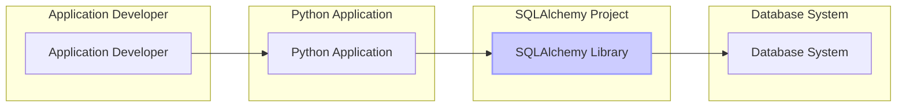
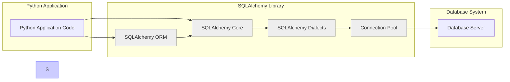

# BUSINESS POSTURE

This project, SQLAlchemy, is a widely adopted Python SQL toolkit and Object Relational Mapper. It provides a comprehensive set of tools for interacting with databases, abstracting away the complexities of raw SQL and database-specific dialects.

- Business Priorities and Goals:
  - Provide a reliable and performant database abstraction layer for Python developers.
  - Ensure compatibility with a wide range of database systems.
  - Offer a flexible and extensible architecture to accommodate diverse use cases.
  - Maintain a vibrant and active open-source community to support and evolve the project.
  - Enable developers to build robust and scalable applications that rely on relational databases.

- Business Risks:
  - Security vulnerabilities in SQLAlchemy could lead to data breaches or application compromise in dependent projects.
  - Performance bottlenecks in SQLAlchemy could impact the responsiveness and scalability of applications using it.
  - Lack of compatibility with new database versions or features could limit adoption and create maintenance burdens.
  - Decline in community support could lead to slower bug fixes and feature development, impacting user trust and project longevity.
  - Breaking changes in new versions could cause significant rework for existing users, hindering adoption of updates.

# SECURITY POSTURE

SQLAlchemy, as a mature open-source project, likely incorporates several security considerations in its development lifecycle. However, as a library, its security posture is also heavily dependent on how it is used by consuming applications.

- Existing Security Controls:
  - security control: Open Source Code Review - The codebase is publicly available on GitHub, allowing for community review and scrutiny. Implemented: GitHub repository.
  - security control: Static Code Analysis - Likely used by developers during development, although not explicitly documented. Implemented: Developer's local environment and potentially CI.
  - security control: Unit and Integration Testing - SQLAlchemy has a comprehensive test suite to ensure functionality and catch regressions. Implemented: GitHub Actions CI.
  - security control: Vulnerability Reporting - Public channels for reporting security vulnerabilities, likely through GitHub or dedicated security channels. Implemented: GitHub repository and project documentation.
  - security control: Secure Development Practices - Experienced developers contribute to the project, likely following secure coding guidelines. Implemented: Development process.
  - security control: Dependency Management - Project dependencies are managed, and updates are likely considered for security implications. Implemented: `requirements.txt` and `setup.py`.

- Accepted Risks:
  - accepted risk: Third-party Dependency Vulnerabilities - SQLAlchemy relies on third-party libraries, which could introduce vulnerabilities. Mitigation: Dependency scanning and updates.
  - accepted risk: Misuse by Developers - Developers might misuse SQLAlchemy in ways that introduce security vulnerabilities in their applications (e.g., SQL injection if used improperly). Mitigation: Documentation and best practices guidelines.
  - accepted risk: Denial of Service through Resource Exhaustion -  Improperly configured or used SQLAlchemy connections could lead to resource exhaustion and denial of service. Mitigation: Documentation and connection pooling recommendations.

- Recommended Security Controls:
  - security control: Automated Dependency Scanning - Implement automated dependency scanning in the CI/CD pipeline to detect and alert on vulnerable dependencies. Implemented: GitHub Actions CI.
  - security control: Regular Security Audits - Conduct periodic security audits by external security experts to identify potential vulnerabilities. Implemented: Project roadmap and funding.
  - security control: Fuzzing - Implement fuzzing techniques to discover unexpected behavior and potential vulnerabilities in core components. Implemented: Project roadmap and testing strategy.
  - security control: Security focused documentation - Enhance documentation with security best practices for developers using SQLAlchemy, especially around SQL injection prevention and secure connection handling. Implemented: Project documentation.

- Security Requirements:
  - Authentication:
    - SQLAlchemy itself does not handle application-level authentication.
    - Security Requirement: Applications using SQLAlchemy must implement their own authentication mechanisms to verify user identities.
    - Security Requirement: SQLAlchemy should support secure authentication methods to database servers (e.g., password hashing, certificate-based authentication, OAuth where applicable). Implemented: Database dialect implementations.
  - Authorization:
    - SQLAlchemy does not enforce application-level authorization.
    - Security Requirement: Applications must implement authorization logic to control user access to data and operations.
    - Security Requirement: SQLAlchemy should support database-level authorization mechanisms provided by the underlying database system (e.g., roles, permissions). Implemented: Database dialect implementations and SQL generation.
  - Input Validation:
    - Security Requirement: SQLAlchemy must provide mechanisms to prevent SQL injection vulnerabilities by properly escaping and parameterizing user inputs in SQL queries. Implemented: Core functionality of SQLAlchemy's query construction and ORM.
    - Security Requirement: Applications using SQLAlchemy must validate user inputs before passing them to SQLAlchemy to further mitigate injection risks and ensure data integrity. Implemented: Application code using SQLAlchemy.
  - Cryptography:
    - Security Requirement: SQLAlchemy should support encrypted connections to database servers (e.g., TLS/SSL). Implemented: Database dialect implementations and connection handling.
    - Security Requirement: If SQLAlchemy is used to handle sensitive data at rest (e.g., through custom data types or ORM features), it should provide guidance or mechanisms for data encryption at rest. Implemented: Application code using SQLAlchemy and potentially custom data type implementations.

# DESIGN

SQLAlchemy's design is centered around providing a flexible and powerful interface for interacting with databases. It is composed of two main components: Core and ORM, along with Dialects for database-specific interactions.

## C4 CONTEXT



- Context Diagram Elements:
  - - Name: Application Developer
    - Type: Person
    - Description: Software developers who use SQLAlchemy to build Python applications that interact with databases.
    - Responsibilities: Develops and maintains Python applications, writes code that uses SQLAlchemy to interact with databases, configures and deploys applications.
    - Security controls: Secure coding practices, input validation in application code, dependency management for application dependencies.
  - - Name: Python Application
    - Type: Software System
    - Description: The Python application that utilizes SQLAlchemy to perform database operations. This could be a web application, a data processing script, or any other Python program needing database interaction.
    - Responsibilities: Implements application logic, handles user requests, uses SQLAlchemy to query and manipulate data in the database, manages application-level security (authentication, authorization).
    - Security controls: Application-level authentication and authorization, input validation, secure session management, protection against common web application vulnerabilities (OWASP Top 10), secure configuration management.
  - - Name: SQLAlchemy Library
    - Type: Software System
    - Description: The SQLAlchemy Python library, providing Core and ORM functionalities for database interaction. It acts as an intermediary between the Python application and the database system.
    - Responsibilities: Provides an abstraction layer for database interactions, translates Python code into SQL queries, manages database connections, handles database dialects, offers ORM features for object-relational mapping.
    - Security controls: SQL injection prevention through parameterization, secure connection handling (TLS/SSL support in dialects), input validation within SQLAlchemy core (e.g., data type validation), vulnerability management and patching.
  - - Name: Database System
    - Type: Software System
    - Description: The relational database system (e.g., PostgreSQL, MySQL, SQLite, Oracle, SQL Server) that stores and manages the application's data.
    - Responsibilities: Stores and retrieves data, enforces database-level security (authentication, authorization, access control), executes SQL queries, ensures data integrity and consistency, provides database-specific features and functionalities.
    - Security controls: Database authentication and authorization mechanisms, access control lists (ACLs), encryption at rest and in transit, database auditing and logging, regular security patching and updates, database hardening configurations.

## C4 CONTAINER



- Container Diagram Elements:
  - - Name: Python Application Code
    - Type: Container (Code)
    - Description: Represents the application's codebase that interacts with SQLAlchemy. This is where developers write application logic and use SQLAlchemy to perform database operations.
    - Responsibilities: Application logic implementation, utilizing SQLAlchemy Core or ORM for data access, handling user requests, managing application-specific security concerns.
    - Security controls: Application-level security controls (authentication, authorization, input validation), secure coding practices, dependency management, secure configuration management.
  - - Name: SQLAlchemy ORM
    - Type: Container (Python Library)
    - Description: The Object Relational Mapper component of SQLAlchemy. Provides a high-level abstraction for interacting with databases using object-oriented paradigms.
    - Responsibilities: Mapping Python objects to database tables, providing an ORM API for querying and manipulating data, managing object relationships, simplifying database interactions for developers.
    - Security controls: Inherits security controls from SQLAlchemy Core, input validation within ORM layer, secure query generation, protection against ORM-specific injection vulnerabilities.
  - - Name: SQLAlchemy Core
    - Type: Container (Python Library)
    - Description: The foundational component of SQLAlchemy, providing a lower-level SQL toolkit. Offers more direct control over SQL queries and database interactions.
    - Responsibilities: SQL expression language, connection management, transaction handling, database dialect abstraction, core functionalities for database interaction.
    - Security controls: SQL injection prevention through parameterization, secure connection handling, input validation at the core level, robust error handling, protection against common SQL injection patterns.
  - - Name: SQLAlchemy Dialects
    - Type: Container (Python Library)
    - Description: Database-specific implementations that allow SQLAlchemy to communicate with different database systems. Each dialect handles the nuances of a particular database's SQL syntax and features.
    - Responsibilities: Translating SQLAlchemy's generic SQL expressions into database-specific SQL, handling database-specific connection parameters and behaviors, adapting to different database features and versions.
    - Security controls: Secure handling of database-specific connection parameters, ensuring compatibility with database security features, dialect-specific input validation and escaping where necessary.
  - - Name: Connection Pool
    - Type: Container (Software Component)
    - Description: Manages a pool of database connections to improve performance and resource utilization. Reuses existing connections instead of creating new ones for each database operation.
    - Responsibilities: Managing a pool of database connections, providing connections to SQLAlchemy Core and ORM, handling connection lifecycle, optimizing connection reuse, limiting the number of concurrent database connections.
    - Security controls: Secure connection management, preventing connection leaks, limiting resource consumption, potentially implementing connection timeouts and idle connection management for security and stability.
  - - Name: Database Server
    - Type: Container (Software System)
    - Description: The actual database server software (e.g., PostgreSQL server, MySQL server) that stores and manages the data.
    - Responsibilities: Data storage and retrieval, SQL query execution, database-level security enforcement, transaction management, data integrity and consistency, database administration and maintenance.
    - Security controls: Database authentication and authorization, access control lists, encryption at rest and in transit, database auditing and logging, security hardening, regular security updates and patching.

## DEPLOYMENT

SQLAlchemy itself is a library and doesn't have a deployment architecture in the same way as an application. However, applications using SQLAlchemy are typically deployed in standard application deployment architectures. A common deployment scenario is a web application deployed on an application server connecting to a separate database server.

- Deployment Architecture: Application Server and Database Server

```mermaid
flowchart LR
    subgraph "Deployment Environment"
        subgraph "Application Server"
            AS[Application Server Instance]
            AP[Python Application\n(with SQLAlchemy)]
        end
        subgraph "Database Server"
            DS[Database Server Instance]
            DB[Database System\n(e.g., PostgreSQL)]
        end
        INTERNET[Internet]
        USER[User]
    end

    USER --> INTERNET --> AS
    AS --> AP
    AP --> DS
    DS --> DB

    style AS fill:#eee,stroke:#999,stroke-width:1px
    style DS fill:#eee,stroke:#999,stroke-width:1px
    style AP fill:#ccf,stroke:#99f,stroke-width:2px
    style DB fill:#ccf,stroke:#99f,stroke-width:2px
```

- Deployment Diagram Elements:
  - - Name: User
    - Type: Person
    - Description: End-users who interact with the Python application through the internet.
    - Responsibilities: Accessing and using the application's features, providing input to the application, consuming data from the application.
    - Security controls: User authentication (handled by the application), secure communication (HTTPS), authorization based on user roles and permissions (handled by the application).
  - - Name: Internet
    - Type: Infrastructure
    - Description: The public internet network connecting users to the application server.
    - Responsibilities: Routing network traffic, providing connectivity between users and the application server.
    - Security controls: DDoS protection, network firewalls (at the edge of the deployment environment), intrusion detection and prevention systems (IDS/IPS).
  - - Name: Application Server Instance
    - Type: Infrastructure (Server)
    - Description: A server instance (physical or virtual) running the application server software (e.g., Apache, Nginx, uWSGI, Gunicorn).
    - Responsibilities: Hosting the Python application, handling incoming user requests, routing requests to the application, serving static content, managing application processes.
    - Security controls: Operating system hardening, web server security configurations, network firewalls (instance-level), intrusion detection and prevention systems (IDS/IPS), regular security patching and updates, access control to the server instance.
  - - Name: Python Application (with SQLAlchemy)
    - Type: Software System
    - Description: The deployed Python application that includes the SQLAlchemy library and application code.
    - Responsibilities: Implementing application logic, handling user requests, using SQLAlchemy to interact with the database, managing application-level security, processing data, generating responses.
    - Security controls: Application-level security controls (authentication, authorization, input validation), secure coding practices, secure configuration management, session management, protection against web application vulnerabilities, logging and monitoring.
  - - Name: Database Server Instance
    - Type: Infrastructure (Server)
    - Description: A server instance (physical or virtual) running the database server software.
    - Responsibilities: Hosting the database system, storing and managing data, executing SQL queries, enforcing database-level security, ensuring data integrity and availability.
    - Security controls: Operating system hardening, database server security configurations, network firewalls (instance-level), database access control lists, database auditing and logging, encryption at rest and in transit, regular security patching and updates, database backups and recovery mechanisms.
  - - Name: Database System (e.g., PostgreSQL)
    - Type: Software System
    - Description: The database system software running on the database server instance.
    - Responsibilities: Data storage and retrieval, SQL query processing, database-level security enforcement, transaction management, data integrity and consistency.
    - Security controls: Database authentication and authorization, access control lists, encryption at rest and in transit, database auditing and logging, security hardening configurations, regular security updates and patching.

## BUILD

The SQLAlchemy project utilizes a standard open-source build and release process, leveraging GitHub Actions for CI/CD.

```mermaid
flowchart LR
    subgraph "Developer Environment"
        DEV[Developer]
    end
    subgraph "GitHub"
        GH_REPO[GitHub Repository\n(SQLAlchemy)]
        GH_ACTIONS[GitHub Actions CI]
    end
    subgraph "Package Registry"
        PYPI[PyPI\n(Python Package Index)]
    end

    DEV --> GH_REPO
    GH_REPO --> GH_ACTIONS
    GH_ACTIONS --> PYPI

    subgraph "GitHub Actions Workflow"
        BUILD_STEP[Build & Test]
        SAST[SAST Scanners\n(e.g., Bandit)]
        LINTER[Linters\n(e.g., Flake8, MyPy)]
        PUBLISH[Publish to PyPI]
    end
    GH_ACTIONS --> BUILD_STEP
    BUILD_STEP --> SAST
    BUILD_STEP --> LINTER
    LINTER --> PUBLISH
    SAST --> PUBLISH

    style GH_ACTIONS fill:#eee,stroke:#999,stroke-width:1px
    style BUILD_STEP fill:#eee,stroke:#999,stroke-width:1px
    style SAST fill:#eee,stroke:#999,stroke-width:1px
    style LINTER fill:#eee,stroke:#999,stroke-width:1px
    style PUBLISH fill:#eee,stroke:#999,stroke-width:1px
```

- Build Process Elements:
  - - Name: Developer
    - Type: Person
    - Description: SQLAlchemy developers who write code, contribute changes, and maintain the project.
    - Responsibilities: Writing code, fixing bugs, developing new features, reviewing code contributions, committing code to the GitHub repository.
    - Security controls: Secure development practices, code review process, access control to the GitHub repository (write access), multi-factor authentication for GitHub accounts.
  - - Name: GitHub Repository (SQLAlchemy)
    - Type: Code Repository
    - Description: The central Git repository hosted on GitHub that stores the SQLAlchemy source code, history, and project metadata.
    - Responsibilities: Version control, source code management, collaboration platform for developers, issue tracking, pull request management.
    - Security controls: Access control (branch protection, permissions), audit logging of repository activities, vulnerability scanning of repository configurations, secure repository settings.
  - - Name: GitHub Actions CI
    - Type: CI/CD System
    - Description: GitHub's built-in CI/CD service used to automate the build, test, and release processes for SQLAlchemy.
    - Responsibilities: Automated build execution, running tests, performing static code analysis, linting, packaging, publishing releases, automating workflows based on repository events.
    - Security controls: Secure workflow definitions, secret management for credentials, access control to CI/CD configurations, audit logging of CI/CD activities, secure runner environments, dependency scanning within CI/CD pipelines.
  - - Name: Build & Test (GitHub Actions Workflow Step)
    - Type: Build Process Step
    - Description: A step in the GitHub Actions workflow that compiles the code, runs unit tests, and performs integration tests to ensure code quality and functionality.
    - Responsibilities: Code compilation (if necessary), execution of unit and integration tests, generating test reports, verifying code functionality, identifying and reporting build failures or test failures.
    - Security controls: Secure build environment, isolation of build processes, input validation for build inputs, secure handling of build artifacts, logging of build activities.
  - - Name: SAST Scanners (e.g., Bandit) (GitHub Actions Workflow Step)
    - Type: Security Tool
    - Description: Static Application Security Testing (SAST) tools integrated into the CI pipeline to automatically scan the codebase for potential security vulnerabilities. Example: Bandit for Python.
    - Responsibilities: Static analysis of source code, identifying potential security flaws (e.g., injection vulnerabilities, insecure configurations), generating security reports, providing feedback to developers on potential vulnerabilities.
    - Security controls: Regularly updated vulnerability rulesets, accurate vulnerability detection, minimal false positives, secure configuration of SAST tools, integration with CI/CD pipeline for automated scanning.
  - - Name: Linters (e.g., Flake8, MyPy) (GitHub Actions Workflow Step)
    - Type: Code Quality Tool
    - Description: Linters and type checkers used to enforce code style guidelines, identify potential code quality issues, and improve code maintainability. Examples: Flake8 for style and MyPy for type checking.
    - Responsibilities: Code style checking, identifying code quality issues, enforcing coding standards, improving code readability and maintainability, detecting potential bugs through static analysis.
    - Security controls: Consistent code style for better code review, early detection of potential bugs, improved code maintainability for easier security updates, integration with CI/CD pipeline for automated checks.
  - - Name: Publish to PyPI (GitHub Actions Workflow Step)
    - Type: Release Process Step
    - Description: A step in the GitHub Actions workflow that packages the built artifacts and publishes them to the Python Package Index (PyPI), making SQLAlchemy available for download and installation by users.
    - Responsibilities: Packaging releases, signing releases (e.g., using Sigstore), uploading packages to PyPI, creating release notes, managing package metadata, ensuring integrity and authenticity of published packages.
    - Security controls: Secure PyPI account management (MFA), secure API key management for PyPI uploads, package signing for integrity verification, provenance tracking of published packages, vulnerability scanning of published packages, protection against supply chain attacks.
  - - Name: PyPI (Python Package Index)
    - Type: Package Registry
    - Description: The official repository for Python packages, where SQLAlchemy releases are published and from where users download and install the library.
    - Responsibilities: Hosting Python packages, providing package download services, managing package metadata, ensuring package availability, providing package search and discovery features.
    - Security controls: Package signing verification, malware scanning of uploaded packages, vulnerability scanning of PyPI infrastructure, secure account management for package maintainers, protection against supply chain attacks targeting PyPI.

# RISK ASSESSMENT

- Critical Business Processes:
  - Data Access and Manipulation: SQLAlchemy is fundamental for applications that need to interact with databases. Any compromise in SQLAlchemy's security or availability can directly impact the ability of applications to access and manage critical business data.
  - Application Functionality: Many applications rely on SQLAlchemy for core functionalities related to data persistence and retrieval. Issues with SQLAlchemy can lead to application malfunctions or failures, disrupting business operations.
  - Software Development Lifecycle: SQLAlchemy is a key dependency for many Python projects. Security vulnerabilities in SQLAlchemy can introduce risks into the entire software supply chain, affecting numerous downstream projects and organizations.

- Data Sensitivity:
  - Data sensitivity depends entirely on the applications that use SQLAlchemy. SQLAlchemy itself does not store data. However, it facilitates access to potentially highly sensitive data stored in databases.
  - Sensitivity levels can range from publicly accessible information to highly confidential personal data, financial records, trade secrets, and other sensitive business information, depending on the application's domain and purpose.
  - The data handled through SQLAlchemy should be classified according to the organization's data classification policy, and appropriate security controls should be implemented to protect data confidentiality, integrity, and availability.

# QUESTIONS & ASSUMPTIONS

- Questions:
  - What are the specific types of applications that are the primary users of SQLAlchemy? (e.g., web applications, data analysis tools, etc.)
  - Are there any specific regulatory compliance requirements that applications using SQLAlchemy need to adhere to? (e.g., GDPR, HIPAA, PCI DSS)
  - What is the expected lifespan and maintenance commitment for the SQLAlchemy project?
  - Are there any known security vulnerabilities or past security incidents related to SQLAlchemy that should be considered?
  - What are the performance requirements and scalability goals for applications using SQLAlchemy?
  - What are the typical database systems that SQLAlchemy is used with in production environments?

- Assumptions:
  - SQLAlchemy is primarily used in web applications and backend systems that require robust database interaction capabilities.
  - Security is a high priority for the SQLAlchemy project and its users, given its role in data access.
  - The SQLAlchemy project has an active development and maintenance community.
  - Applications using SQLAlchemy are expected to implement their own application-level security controls in addition to relying on SQLAlchemy's security features.
  - SQLAlchemy is deployed in standard application server and database server architectures.
  - The build process for SQLAlchemy is automated and includes basic security checks like linting and static analysis.