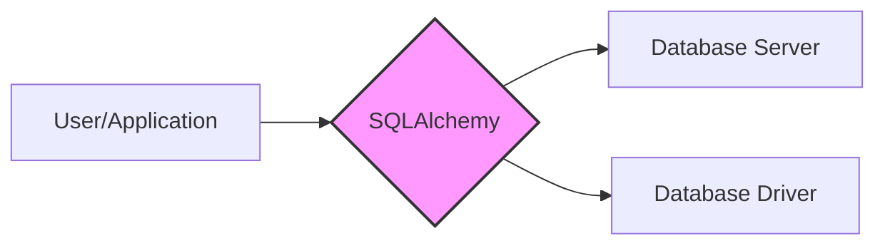
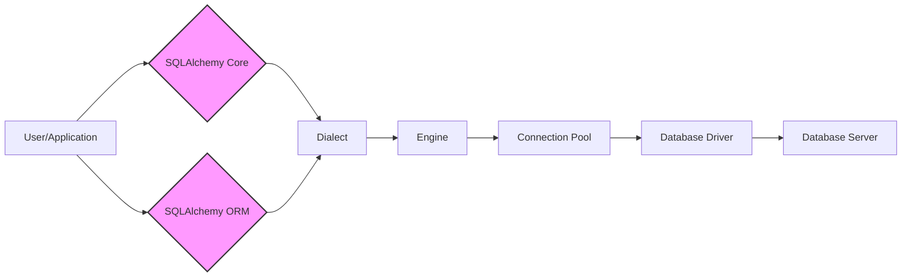
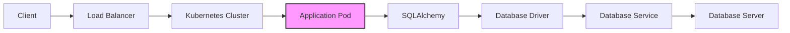

Okay, let's create a design document for SQLAlchemy, focusing on aspects relevant for threat modeling.

# BUSINESS POSTURE

SQLAlchemy is a widely-used, open-source SQL toolkit and Object-Relational Mapper (ORM) for Python.  It's a foundational library for many applications, from small scripts to large-scale web applications and data analysis pipelines.

Business Priorities and Goals:

*   Provide a stable, reliable, and performant database abstraction layer.
*   Support a wide range of database backends (PostgreSQL, MySQL, SQLite, Oracle, Microsoft SQL Server, and others).
*   Offer both a low-level SQL Expression Language and a high-level ORM.
*   Maintain backward compatibility where possible, minimizing disruption to existing users.
*   Enable developers to write database-agnostic code, improving portability.
*   Facilitate efficient and secure database interactions.
*   Foster a strong open-source community and encourage contributions.

Most Important Business Risks:

*   Security vulnerabilities (especially SQL injection) that could lead to data breaches or system compromise.  This is paramount due to SQLAlchemy's role as a database intermediary.
*   Performance bottlenecks that could impact the performance of applications using SQLAlchemy.
*   Compatibility issues with different database backends or Python versions, leading to application failures.
*   Lack of maintainability or extensibility, hindering future development and bug fixes.
*   Loss of community trust due to unaddressed security issues or poor communication.
*   Data corruption due to bugs in the library.

# SECURITY POSTURE

Existing Security Controls:

*   security control: Extensive documentation and examples promoting secure usage patterns (e.g., parameterized queries to prevent SQL injection). Location: SQLAlchemy documentation.
*   security control: A well-defined process for reporting and handling security vulnerabilities. Location: SQLAlchemy security policy (implied by responsible disclosure practices).
*   security control: Regular releases and updates to address bugs and security issues. Location: SQLAlchemy release history on GitHub and PyPI.
*   security control: Use of parameterized queries and prepared statements (when used correctly by developers). Location: Core and ORM components of SQLAlchemy.
*   security control: Escaping mechanisms for handling user-provided input in raw SQL queries (when used correctly). Location: SQLAlchemy's core components.
*   security control: Community code review and contributions, providing a form of crowdsourced security auditing. Location: GitHub pull requests and discussions.
*   security control: Testing suite, including unit and integration tests, to identify potential issues. Location: test/ directory in the GitHub repository.

Accepted Risks:

*   accepted risk: Reliance on developers to follow secure coding practices when using SQLAlchemy.  SQLAlchemy provides the tools, but misuse can still lead to vulnerabilities.
*   accepted risk: Potential for zero-day vulnerabilities in underlying database drivers or database systems themselves. SQLAlchemy relies on these components.
*   accepted risk: The complexity of the library, which increases the potential for subtle bugs that could have security implications.

Recommended Security Controls:

*   security control: Integrate static analysis tools (e.g., Bandit, CodeQL) into the CI/CD pipeline to automatically detect potential security issues in the codebase.
*   security control: Conduct regular security audits and penetration testing, focusing on common database interaction vulnerabilities.
*   security control: Implement fuzz testing to identify unexpected behavior and potential vulnerabilities.
*   security control: Provide more explicit security guidance and warnings in the documentation, particularly around the use of raw SQL and potential pitfalls.
*   security control: Consider adding optional security features, such as built-in input validation or sanitization helpers, even if they add some overhead.

Security Requirements:

*   Authentication: SQLAlchemy itself does not handle authentication directly. It relies on the underlying database connection and driver for authentication.  However, applications using SQLAlchemy *must* securely manage database credentials.
*   Authorization: SQLAlchemy does not implement authorization. Authorization is typically handled at the application level or within the database itself (e.g., using database roles and permissions).
*   Input Validation: SQLAlchemy provides mechanisms for parameterized queries, which are crucial for preventing SQL injection.  However, applications should also perform their own input validation to ensure data conforms to expected types and formats *before* passing it to SQLAlchemy.
*   Cryptography: SQLAlchemy does not directly handle encryption of data at rest or in transit.  This is typically handled by the database system (e.g., using TLS for connections, transparent data encryption). Applications using SQLAlchemy should ensure appropriate encryption is configured.

# DESIGN

## C4 CONTEXT



C4 Context Element List:

*   Element 1:
    *   Name: User/Application
    *   Type: External Entity (User or another system)
    *   Description: The application or user that interacts with the database through SQLAlchemy.
    *   Responsibilities: Initiates database requests, processes results, handles user interactions.
    *   Security controls: Implements application-level security controls (authentication, authorization, input validation).

*   Element 2:
    *   Name: SQLAlchemy
    *   Type: System
    *   Description: The SQL toolkit and ORM library.
    *   Responsibilities: Provides an abstraction layer for database interactions, translates Python code to SQL queries, manages database connections.
    *   Security controls: Provides parameterized query support, escaping mechanisms, encourages secure coding practices through documentation.

*   Element 3:
    *   Name: Database Server
    *   Type: External System
    *   Description: The database server (e.g., PostgreSQL, MySQL).
    *   Responsibilities: Stores and manages data, executes SQL queries, enforces database-level security.
    *   Security controls: Implements database-level security (authentication, authorization, access control, encryption).

*   Element 4:
    *   Name: Database Driver
    *   Type: External Library
    *   Description: The Python library that provides a low-level interface to the database server (e.g., psycopg2 for PostgreSQL, mysqlclient for MySQL).
    *   Responsibilities: Handles communication with the database server, executes queries, returns results.
    *   Security controls: Implements communication security (e.g., TLS), handles parameter serialization.

## C4 CONTAINER



C4 Container Element List:

*   Element 1:
    *   Name: User/Application
    *   Type: External Entity
    *   Description: The application or user that interacts with the database through SQLAlchemy.
    *   Responsibilities: Initiates database requests, processes results, handles user interactions.
    *   Security controls: Implements application-level security controls (authentication, authorization, input validation).

*   Element 2:
    *   Name: SQLAlchemy Core
    *   Type: Container (Library Component)
    *   Description: Provides the core SQL Expression Language and schema definition capabilities.
    *   Responsibilities: Constructs SQL queries, manages database metadata, provides a low-level interface for database interaction.
    *   Security controls: Parameterized query support, escaping mechanisms.

*   Element 3:
    *   Name: SQLAlchemy ORM
    *   Type: Container (Library Component)
    *   Description: Provides the Object-Relational Mapper, allowing developers to interact with the database using Python objects.
    *   Responsibilities: Maps Python classes to database tables, manages object relationships, translates object operations to SQL queries.
    *   Security controls: Relies on SQLAlchemy Core for secure query construction.

*   Element 4:
    *   Name: Dialect
    *   Type: Container (Library Component)
    *   Description: Adapts SQLAlchemy's core functionality to a specific database backend.
    *   Responsibilities: Translates generic SQL expressions to database-specific syntax, handles database-specific data types and features.
    *   Security controls: Implements database-specific escaping and quoting rules.

*   Element 5:
    *   Name: Engine
    *   Type: Container (Library Component)
    *   Description: Manages database connections and provides a factory for creating connections.
    *   Responsibilities: Establishes connections to the database, configures connection parameters.
    *   Security controls: Handles connection security parameters (e.g., SSL/TLS).

*   Element 6:
    *   Name: Connection Pool
    *   Type: Container (Library Component)
    *   Description: Manages a pool of database connections to improve performance and efficiency.
    *   Responsibilities: Creates, manages, and reuses database connections.
    *   Security controls: Can enforce connection limits and timeouts.

*   Element 7:
    *   Name: Database Driver
    *   Type: External Library
    *   Description: The Python library that provides a low-level interface to the database server.
    *   Responsibilities: Handles communication with the database server, executes queries, returns results.
    *   Security controls: Implements communication security (e.g., TLS), handles parameter serialization.

*   Element 8:
    *   Name: Database Server
    *   Type: External System
    *   Description: The database server (e.g., PostgreSQL, MySQL).
    *   Responsibilities: Stores and manages data, executes SQL queries, enforces database-level security.
    *   Security controls: Implements database-level security (authentication, authorization, access control, encryption).

## DEPLOYMENT

SQLAlchemy is a library, not a standalone application. Therefore, its deployment is intrinsically tied to the deployment of the application that uses it.  Here are some common deployment scenarios:

Possible Deployment Solutions:

1.  Traditional Server Deployment: The application (and SQLAlchemy) are deployed on a physical or virtual server.
2.  Containerized Deployment (Docker): The application (and SQLAlchemy) are packaged into a Docker container and deployed on a container orchestration platform (e.g., Kubernetes, Docker Swarm).
3.  Serverless Deployment (AWS Lambda, Azure Functions, Google Cloud Functions): The application (and SQLAlchemy) are deployed as serverless functions. This often requires careful consideration of database connection management.
4.  PaaS Deployment (Heroku, AWS Elastic Beanstalk): The application (and SQLAlchemy) are deployed on a Platform-as-a-Service provider.

Chosen Deployment Solution (Containerized Deployment with Kubernetes):



Deployment Element List:

*   Element 1:
    *   Name: Client
    *   Type: External Entity
    *   Description: The user or system accessing the application.
    *   Responsibilities: Initiates requests to the application.
    *   Security controls: May implement client-side security (e.g., browser security, API keys).

*   Element 2:
    *   Name: Load Balancer
    *   Type: Infrastructure
    *   Description: Distributes incoming traffic across multiple application instances.
    *   Responsibilities: Routes requests to healthy application pods.
    *   Security controls: May implement TLS termination, DDoS protection.

*   Element 3:
    *   Name: Kubernetes Cluster
    *   Type: Infrastructure
    *   Description: The container orchestration platform.
    *   Responsibilities: Manages the deployment, scaling, and networking of application containers.
    *   Security controls: Implements network policies, role-based access control (RBAC).

*   Element 4:
    *   Name: Application Pod
    *   Type: Container Instance
    *   Description: A running instance of the application container.
    *   Responsibilities: Executes the application code, interacts with the database via SQLAlchemy.
    *   Security controls: Runs with limited privileges, uses secure environment variables.

*   Element 5:
    *   Name: SQLAlchemy
    *   Type: Library
    *   Description: The SQL toolkit and ORM library (within the application pod).
    *   Responsibilities: Provides database abstraction.
    *   Security controls: Parameterized queries, escaping.

*   Element 6:
    *   Name: Database Driver
    *   Type: Library
    *   Description: The database driver (within the application pod).
    *   Responsibilities: Communicates with the database.
    *   Security controls: TLS connection.

*   Element 7:
    *   Name: Database Service
    *   Type: Kubernetes Service
    *   Description: A Kubernetes service that provides a stable endpoint for accessing the database.
    *   Responsibilities: Routes traffic to the database server.
    *   Security controls: Network policies.

*   Element 8:
    *   Name: Database Server
    *   Type: External System (or managed service)
    *   Description: The database server (e.g., PostgreSQL, MySQL). Could be a managed service (e.g., AWS RDS, Google Cloud SQL) or self-hosted.
    *   Responsibilities: Stores and manages data.
    *   Security controls: Database-level security (authentication, authorization, encryption).

## BUILD

SQLAlchemy's build process is crucial for ensuring the integrity and security of the library.

```mermaid
graph LR
    A[Developer] --> B[Git Commit];
    B --> C[GitHub Actions];
    C --> D[Linting (Flake8, etc.)];
    C --> E[Static Analysis (Bandit)];
    C --> F[Unit Tests];
    C --> G[Integration Tests];
    C --> H[Build Package (Wheel, sdist)];
    H --> I[PyPI];
        style C fill:#f9f,stroke:#333,stroke-width:2px
```

Build Process Description:

1.  Developer: Developers write code and commit changes to the Git repository (hosted on GitHub).
2.  Git Commit: Each commit triggers the CI/CD pipeline.
3.  GitHub Actions:  SQLAlchemy uses GitHub Actions for its CI/CD pipeline. This orchestrates the build, test, and packaging process.
4.  Linting: Code linters (e.g., Flake8) are used to enforce coding style and identify potential errors.
5.  Static Analysis: Static analysis tools (e.g., Bandit) are used to automatically detect potential security vulnerabilities.
6.  Unit Tests: A comprehensive suite of unit tests is executed to verify the functionality of individual components.
7.  Integration Tests: Integration tests are run to verify the interaction between different components and with various database backends.
8.  Build Package: If all tests pass, the library is packaged into distributable formats (wheel, sdist).
9.  PyPI: The packages are uploaded to the Python Package Index (PyPI), making them available for installation via pip.

Security Controls in Build Process:

*   security control: Code Review: All code changes are reviewed by other developers before being merged.
*   security control: Linting: Enforces coding standards and helps prevent common errors.
*   security control: Static Analysis: Automatically detects potential security vulnerabilities.
*   security control: Automated Testing: Comprehensive test suite helps ensure code quality and identify regressions.
*   security control: Signed Releases: Releases are likely signed to verify their authenticity.

# RISK ASSESSMENT

Critical Business Processes:

*   Database interaction for applications relying on SQLAlchemy. This is the core function.
*   Data retrieval, storage, and manipulation.
*   Application functionality that depends on database access.

Data to Protect and Sensitivity:

*   All data stored in databases accessed via SQLAlchemy is potentially at risk.
*   Data sensitivity varies greatly depending on the application using SQLAlchemy. It could range from non-sensitive public data to highly confidential personal, financial, or health information.
*   Database credentials used to connect to databases are highly sensitive and must be protected.

# QUESTIONS & ASSUMPTIONS

Questions:

*   What specific database backends are of highest priority for security testing and auditing?
*   Are there any specific application use cases of SQLAlchemy that are considered particularly high-risk?
*   What is the current process for handling security vulnerability reports?
*   What level of security expertise is assumed for developers using SQLAlchemy?
*   What is the frequency of security audits and penetration testing?

Assumptions:

*   BUSINESS POSTURE: SQLAlchemy aims to be a secure and reliable database abstraction layer, prioritizing the security of its users' data.
*   SECURITY POSTURE: Developers using SQLAlchemy are expected to have a basic understanding of database security principles and follow secure coding practices.
*   DESIGN: The design of SQLAlchemy prioritizes flexibility and extensibility, but this also introduces complexity that must be carefully managed from a security perspective. The library relies heavily on external components (database drivers, database servers) for security features like encryption and authentication.