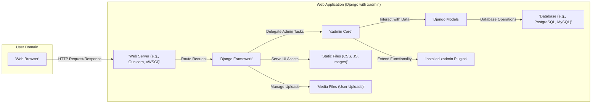
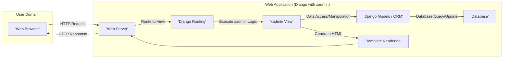

## Project Design Document: xadmin - Django Admin Replacement

**Version:** 1.1
**Date:** October 26, 2023
**Author:** AI Software Architect

### 1. Introduction

This document outlines the design of xadmin, a pluggable admin dashboard for the Django web framework. It aims to provide a comprehensive overview of the system's architecture, components, data flow, and key security considerations, specifically tailored for threat modeling exercises. This document serves as a foundation for identifying potential vulnerabilities and designing appropriate security controls.

### 2. Project Overview

xadmin is a popular open-source project providing an enhanced and customizable alternative to the default Django admin interface. It offers a richer user experience and extended functionality through its plugin architecture. Key functionalities include:

*   Comprehensive CRUD (Create, Read, Update, Delete) operations for managing Django models.
*   Advanced and customizable filtering and searching capabilities for efficient data retrieval.
*   Integrated data visualization and reporting tools for insightful data analysis.
*   A flexible plugin architecture enabling developers to extend and customize the admin interface.
*   Customizable themes and layouts for branding and user preference.
*   Import and export functionalities for seamless data migration.
*   Batch editing and action support for efficient bulk data manipulation.

This design document focuses on the core architecture, common deployment scenarios, and security implications of using xadmin within a Django project.

### 3. Architecture Overview

xadmin is a web application tightly integrated with the Django framework, adhering to the Model-View-Template (MVT) architectural pattern. It leverages Django's Object-Relational Mapper (ORM) for database interactions and its robust authentication and authorization mechanisms for securing access.

The high-level architecture can be visualized as follows:

### 4. Component Breakdown

This section provides a detailed breakdown of the key components within the xadmin system and their specific responsibilities.

*   **User (Web Browser):** The client-side interface through which users interact with the xadmin dashboard. This involves rendering HTML, CSS, and JavaScript received from the server and sending HTTP requests based on user actions.
*   **Web Server (e.g., Gunicorn, uWSGI):** The entry point for all incoming HTTP requests. It receives requests from users and forwards them to the Django application. It is also responsible for serving static and media files efficiently.
*   **Django Framework:** The foundational Python web framework providing core functionalities such as URL routing, request and response handling, middleware processing, and ORM capabilities. xadmin builds upon this framework.
*   **xadmin Core:** The heart of the xadmin library, responsible for:
    *   Providing custom admin views and templates that replace the default Django admin interface.
    *   Handling form rendering, submission, and validation logic for interacting with Django models.
    *   Integrating with Django's authentication and authorization system to enforce access controls.
    *   Offering base classes and APIs for developers to create custom admin interfaces and functionalities.
    *   Managing the plugin system, allowing for dynamic extension of xadmin's features.
*   **Django Models:** Python classes that define the data structure of the application and map to database tables. xadmin interacts with these models through Django's ORM to perform data manipulation.
*   **Database (e.g., PostgreSQL, MySQL):** The persistent storage layer for the application's data. xadmin interacts with the database through Django's ORM, abstracting away the underlying database specifics.
*   **Static Files (CSS, JS, Images):**  Assets required for rendering the user interface, including stylesheets, JavaScript files, and images. These are typically served directly by the web server or a Content Delivery Network (CDN) for performance.
*   **Media Files (User Uploads):** Files uploaded by users through the xadmin interface, such as images or documents. These are typically stored in a designated location on the server's file system or in cloud storage services.
*   **Installed xadmin Plugins:** Independent modules that extend the core functionality of xadmin. Plugins can introduce new views, modify existing ones, add custom form fields, integrate with external services, or provide specialized features. Examples include:
    *   **`excel` plugin:** Enables importing and exporting data in Excel format.
    *   **`charts` plugin:** Provides tools for generating data visualizations within the admin interface.
    *   Custom plugins developed for specific project needs.

### 5. Data Flow

The typical data flow for a user interaction within xadmin involves the following steps:

1. **User Action & Request:** A user interacts with the xadmin interface in their web browser (e.g., clicking a button, submitting a form), triggering an HTTP request (e.g., GET, POST, PUT, DELETE).
2. **Web Server Reception:** The web server (e.g., Gunicorn) receives the incoming HTTP request.
3. **Django URL Routing:** The web server passes the request to the Django framework. Django's URL dispatcher analyzes the request URL and determines which view function should handle it.
4. **xadmin View Processing:** If the request targets an xadmin-managed URL (typically under the `/admin/` path), the corresponding xadmin view function is invoked. This view might:
    *   Retrieve data from Django models using the ORM to display lists, details, or forms.
    *   Process data submitted through forms, including validation and saving changes to the database.
    *   Utilize functionalities provided by the xadmin core for filtering, searching, or pagination.
    *   Execute logic provided by installed xadmin plugins to extend or modify the default behavior.
5. **Database Interaction (if required):** If the view needs to access or modify data, Django's ORM generates and executes SQL queries against the configured database.
6. **Template Rendering:** The xadmin view renders an HTML template, dynamically incorporating data retrieved from the database and potentially using template tags and filters provided by xadmin.
7. **Static/Media File Serving:** The web server retrieves and serves any necessary static files (CSS, JavaScript, images) and media files required to render the page correctly.
8. **HTTP Response Generation:** The Django framework constructs an HTTP response containing the rendered HTML, along with appropriate headers.
9. **Response to User:** The web server sends the HTTP response back to the user's web browser.
10. **Browser Rendering:** The user's web browser interprets the HTML, CSS, and JavaScript in the response and renders the updated xadmin interface.

### 6. Security Considerations

Security is paramount for any web application, and xadmin, as an administrative interface, requires careful attention to potential vulnerabilities. Here are key security considerations for xadmin deployments, framed for threat modeling:

*   **Authentication and Authorization Vulnerabilities:**
    *   **Threat:** Unauthorized access to admin functionalities, data breaches, privilege escalation.
    *   **Considerations:** Ensure strong password policies, multi-factor authentication (MFA) where possible, and proper configuration of Django's permission system to restrict access based on user roles and groups. Regularly review user permissions.
*   **Input Validation Failures:**
    *   **Threat:** SQL injection, cross-site scripting (XSS), command injection.
    *   **Considerations:** Implement robust server-side input validation for all user-supplied data, including form fields and URL parameters. Utilize Django's built-in form handling and validation features. Sanitize user input before displaying it in templates to prevent XSS.
*   **Cross-Site Scripting (XSS) Attacks:**
    *   **Threat:** Malicious scripts injected into the admin interface, potentially stealing user credentials or performing unauthorized actions.
    *   **Considerations:** Employ Django's template auto-escaping mechanism by default. Be cautious when using `mark_safe` or similar functions. Implement Content Security Policy (CSP) headers to restrict the sources from which the browser can load resources.
*   **Cross-Site Request Forgery (CSRF) Attacks:**
    *   **Threat:** Unauthorized actions performed on behalf of an authenticated user without their knowledge.
    *   **Considerations:** Ensure Django's CSRF protection middleware is enabled and correctly configured. Use the `` template tag in all forms.
*   **Session Management Weaknesses:**
    *   **Threat:** Session hijacking, unauthorized access due to stolen session cookies.
    *   **Considerations:** Use secure, HTTP-only, and SameSite cookies for session management. Implement appropriate session timeouts. Consider using a secure session backend.
*   **Data Protection Deficiencies:**
    *   **Threat:** Exposure of sensitive data in transit or at rest.
    *   **Considerations:** Enforce HTTPS to encrypt communication between the browser and the server. Encrypt sensitive data at rest in the database. Implement proper access controls to database backups.
*   **Dependency Vulnerabilities:**
    *   **Threat:** Exploitation of known vulnerabilities in Django, xadmin, or other third-party libraries.
    *   **Considerations:** Regularly update Django, xadmin, and all project dependencies to the latest stable versions. Use dependency scanning tools to identify and address known vulnerabilities.
*   **Insecure Plugin Usage:**
    *   **Threat:** Vulnerabilities introduced by poorly written or malicious xadmin plugins.
    *   **Considerations:** Exercise caution when installing third-party plugins. Review plugin code if possible. Keep plugins updated. Isolate plugin functionalities where necessary.
*   **File Upload Vulnerabilities:**
    *   **Threat:** Uploading malicious files that could compromise the server or other users.
    *   **Considerations:** Implement strict validation of uploaded file types and sizes. Sanitize file contents. Store uploaded files in a secure location with appropriate access controls.
*   **Information Disclosure:**
    *   **Threat:** Exposure of sensitive information through error messages, debugging information, or misconfigured access controls.
    *   **Considerations:** Disable debugging mode in production environments. Implement custom error pages that do not reveal sensitive details. Carefully configure logging levels.
*   **Insufficient Security Headers:**
    *   **Threat:** Increased risk of various attacks due to missing or misconfigured security headers.
    *   **Considerations:** Implement security headers such as `Content-Security-Policy`, `X-Frame-Options`, `Strict-Transport-Security`, `X-Content-Type-Options`, and `Referrer-Policy`.

### 7. Deployment Considerations

xadmin is typically deployed as part of a larger Django web application. Common deployment scenarios include:

*   **Single Server Deployment:** The Django application (including xadmin), web server (e.g., Nginx or Apache with Gunicorn/uWSGI), and the database reside on a single physical or virtual server. This is suitable for low-traffic applications or development environments.
*   **Load-Balanced Deployment:** Multiple instances of the Django application are deployed behind a load balancer. This distributes incoming traffic and provides redundancy. Each instance typically runs xadmin.
*   **Containerized Deployment (e.g., Docker, Kubernetes):** The application, along with its dependencies, is packaged into Docker containers. These containers can be orchestrated using platforms like Kubernetes for scalability and resilience. xadmin is deployed within the containerized application.
*   **Cloud Deployment (e.g., AWS, Azure, GCP):** Leveraging cloud services for hosting different components of the application:
    *   **AWS:** Using services like EC2 for compute, RDS for database, S3 for static/media files, and Elastic Load Balancing.
    *   **Azure:** Using services like Azure App Service, Azure Database for PostgreSQL/MySQL, Azure Blob Storage, and Azure Load Balancer.
    *   **GCP:** Using services like Compute Engine, Cloud SQL, Cloud Storage, and Cloud Load Balancing.
    *   Cloud deployments often involve containerization and orchestration for better management and scaling.

Security considerations during deployment include securing the underlying infrastructure, configuring firewalls, managing access control lists, and regularly patching the operating system and other software.

### 8. Assumptions

The following assumptions are made in this design document:

*   xadmin is integrated into a well-structured Django project following standard conventions.
*   A supported and actively maintained version of Django is being used.
*   A compatible and properly configured database system is in place.
*   The web server is configured securely and is responsible for serving static and media files efficiently.
*   Basic web application security best practices are understood and intended to be followed by developers.

### 9. Out of Scope

This design document does not cover:

*   The detailed implementation specifics of individual xadmin plugins beyond their general purpose.
*   Specific infrastructure setup and configuration guides for different deployment environments.
*   In-depth performance optimization techniques for xadmin or the Django application.
*   The specific business logic implemented within the Django application that xadmin manages.

### 10. Diagrams

The architecture and data flow diagrams are included in the respective sections above using Mermaid syntax. These diagrams provide a visual representation of the system's structure and interactions.
