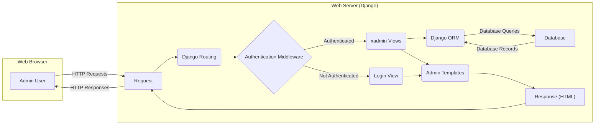

## Project Design Document: xadmin

**Version:** 1.1
**Date:** October 26, 2023
**Author:** AI Software Architect

### 1. Introduction

This document provides an enhanced and more detailed design overview of the xadmin project, a pluggable admin panel for Django. Building upon the previous version, this document further clarifies the architecture, components, and data flow within xadmin to facilitate even more effective threat modeling. It serves as a refined foundational resource for security analysis and the identification of potential vulnerabilities.

### 2. Goals

*   Provide a comprehensive and granular architectural overview of xadmin.
*   Clearly identify key components and their specific interactions, including data exchange.
*   Describe the data flow within the application with greater detail on data types and transformations.
*   Establish a precise understanding of the system for subsequent threat modeling activities, enabling more targeted analysis.

### 3. Scope

This document covers the core functionalities and architecture of the xadmin library as presented in the linked GitHub repository. It maintains a focus on the logical components and their interactions, while providing more specific details where relevant to xadmin's operation and potential security implications. It does not delve into the internal implementation details of the Django framework unless directly pertinent to xadmin's behavior.

### 4. Target Audience

This document is intended for:

*   Security engineers and architects performing detailed threat modeling and security assessments.
*   Developers actively contributing to or maintaining the xadmin project, requiring a deeper understanding of its architecture.
*   Anyone seeking a thorough and precise understanding of xadmin's internal workings for security analysis or development purposes.

### 5. Architectural Overview

xadmin enhances the default Django admin interface with a more feature-rich and customizable experience. It operates as a Django application, tightly integrated with Django's ORM and request/response lifecycle. Key aspects include its plugin-based architecture and extensive customization options.

### 6. Key Components

*   **Web Browser:** The user interface through which administrators interact with xadmin. This includes rendering HTML, executing JavaScript, and handling user input.
*   **Web Server (Django):** The underlying web server (e.g., Gunicorn, uWSGI) responsible for receiving HTTP requests and serving responses for the Django application hosting xadmin.
*   **xadmin Application:** The core Python code of the xadmin library, encompassing various modules and functionalities:
    *   **Admin Views:** Django views responsible for handling HTTP requests and rendering admin pages. These views orchestrate data retrieval, processing, and template rendering. Examples include list views, detail views, create views, update views, and delete views.
    *   **Admin Models (ModelAdmin configurations):** Python classes that extend Django's `ModelAdmin` to define how specific models are displayed and managed within the admin interface. This includes defining fields to display, filters, search fields, and custom actions.
    *   **Admin Forms:** Django forms used for creating and editing data. These forms handle user input validation and data sanitization (to a degree).
    *   **Admin Templates:** HTML templates (often extending base Django admin templates) used to structure and render the admin interface. These templates often include Jinja2 template logic.
    *   **Admin Actions:** Custom Python functions that can be executed on selected objects in the admin list view, allowing for batch operations.
    *   **Admin Filters:** Components that allow users to filter data in the admin list view based on specific criteria. These often translate to database queries.
    *   **Admin Search:** Functionality for searching data within the admin interface, typically implemented using database queries based on user-provided search terms.
    *   **Admin Widgets:** Custom form widgets that enhance user input capabilities and the presentation of form fields.
    *   **Plugins:** An extensible mechanism allowing developers to add custom functionality to xadmin. Plugins can hook into various parts of the request/response cycle and modify the admin interface or behavior.
    *   **Authentication and Authorization:**  Relies directly on Django's built-in authentication and authorization framework to manage user login, session management, and permissions. This includes user models, groups, and permissions.
*   **Database:** The persistent storage backend (e.g., PostgreSQL, MySQL, SQLite) used by the Django application to store application data. xadmin interacts with the database through Django's ORM.
*   **Static Files:** CSS, JavaScript, image files, and other static assets required for rendering the admin interface's styling and client-side behavior.
*   **Media Files:** User-uploaded files managed through the admin interface (if file upload fields are used in models). These are typically stored in a designated media directory.

### 7. Data Flow

The following outlines the typical data flow within xadmin for common administrative operations, with more detail on the data exchanged:

*   **User Login:**
    *   The "Admin User" accesses the admin login page via the "Web Browser".
    *   The "Web Browser" sends an HTTP `GET` request containing no sensitive data to the "Web Server (Django)".
    *   "Django Routing" directs the request to the login view.
    *   The "Authentication Middleware" checks for existing authentication credentials (e.g., session cookie). If not found, it proceeds.
    *   The "Login View" renders the login form (HTML) using "Admin Templates".
    *   The "Web Server (Django)" sends the login form (HTML) as a "Response (HTML)" back to the "Web Browser".
    *   The "Admin User" submits their credentials (username and password) via the "Web Browser".
    *   The "Web Browser" sends an HTTP `POST` request containing "User Credentials" to the "Web Server (Django)".
    *   "Django Routing" directs the request to the login view.
    *   The "Authentication Middleware" attempts to authenticate the user against the configured authentication backend (typically by querying the "Database" for user credentials via "Django ORM").
    *   If authentication is successful, the "Authentication Middleware" establishes a session (setting a session cookie in the response).
    *   The "Login View" redirects the "Admin User" to the admin dashboard or a specific admin page via a "Response (HTML)" with a redirect instruction.

*   **Viewing a List of Objects:**
    *   The "Admin User" navigates to a specific model's list view in the "Web Browser".
    *   The "Web Browser" sends an HTTP `GET` request, potentially including "Query Parameters" for filtering, sorting, or pagination, to the "Web Server (Django)".
    *   "Django Routing" directs the request to the corresponding "xadmin Views" for that model.
    *   The "xadmin Views" construct a database query using "Django ORM", incorporating any provided "Query Parameters".
    *   "Django ORM" queries the "Database" to retrieve the relevant "Database Records".
    *   The "xadmin Views" process the retrieved "Database Records".
    *   The "xadmin Views" pass the processed "Database Records" to the appropriate "Admin Templates".
    *   The "Admin Templates" render the HTML for the list view.
    *   The "Web Server (Django)" sends the rendered "Response (HTML)" back to the "Web Browser".
    *   The "Web Browser" renders the list of objects.

*   **Viewing Details of an Object:**
    *   The "Admin User" clicks on an object in the list view in the "Web Browser".
    *   The "Web Browser" sends an HTTP `GET` request, including the object's ID as a "Query Parameter", to the "Web Server (Django)".
    *   "Django Routing" directs the request to the corresponding "xadmin Views" for viewing object details.
    *   The "xadmin Views" retrieve the specific object from the "Database" using its ID via "Django ORM".
    *   The "xadmin Views" pass the retrieved "Database Record" to the appropriate "Admin Templates".
    *   The "Admin Templates" render the HTML for the object's details.
    *   The "Web Server (Django)" sends the rendered "Response (HTML)" back to the "Web Browser".
    *   The "Web Browser" renders the object's details.

*   **Creating a New Object:**
    *   The "Admin User" navigates to the "add new" page for a specific model in the "Web Browser".
    *   The "Web Browser" sends an HTTP `GET` request to the "Web Server (Django)".
    *   "Django Routing" directs the request to the corresponding "xadmin Views" for creating objects.
    *   The "xadmin Views" render the creation form (HTML) based on the model's fields using "Admin Templates" and "Admin Forms".
    *   The "Web Server (Django)" sends the creation form (HTML) as a "Response (HTML)" back to the "Web Browser".
    *   The "Admin User" fills out the form and submits it via the "Web Browser".
    *   The "Web Browser" sends an HTTP `POST` request containing "Form Data" to the "Web Server (Django)".
    *   "Django Routing" directs the request to the corresponding "xadmin Views".
    *   The "xadmin Views" validate the submitted "Form Data" using "Admin Forms".
    *   If valid, the "xadmin Views" create a new object in the "Database" using "Django ORM" with the "Form Data".
    *   The "xadmin Views" redirect the "Admin User" to the list view or the detail view of the newly created object via a "Response (HTML)" with a redirect instruction.

*   **Editing an Existing Object:**
    *   The "Admin User" navigates to the edit page for a specific object in the "Web Browser".
    *   The "Web Browser" sends an HTTP `GET` request, including the object's ID as a "Query Parameter", to the "Web Server (Django)".
    *   "Django Routing" directs the request to the corresponding "xadmin Views" for editing objects.
    *   The "xadmin Views" retrieve the object from the "Database" using its ID via "Django ORM".
    *   The "xadmin Views" render the edit form (HTML), pre-populated with the object's data, using "Admin Templates" and "Admin Forms".
    *   The "Web Server (Django)" sends the edit form (HTML) as a "Response (HTML)" back to the "Web Browser".
    *   The "Admin User" modifies the data and submits the form via the "Web Browser".
    *   The "Web Browser" sends an HTTP `POST` request containing "Form Data" to the "Web Server (Django)".
    *   "Django Routing" directs the request to the corresponding "xadmin Views".
    *   The "xadmin Views" validate the submitted "Form Data" using "Admin Forms".
    *   If valid, the "xadmin Views" update the object in the "Database" using "Django ORM" with the "Form Data".
    *   The "xadmin Views" redirect the "Admin User" to the list view or the detail view of the updated object via a "Response (HTML)" with a redirect instruction.

*   **Deleting an Object:**
    *   The "Admin User" selects an object (or multiple objects) for deletion in the "Web Browser".
    *   The "Web Browser" sends an HTTP `POST` request (or potentially a `GET` request for single deletions) containing object IDs as "Form Data" or "Query Parameters" to the "Web Server (Django)".
    *   "Django Routing" directs the request to the corresponding "xadmin Views" for deleting objects.
    *   The "xadmin Views" retrieve the selected object(s) from the "Database" using their IDs via "Django ORM".
    *   The "xadmin Views" (potentially after confirmation) delete the object(s) from the "Database".
    *   The "xadmin Views" redirect the "Admin User" to the list view via a "Response (HTML)" with a redirect instruction.

### 8. Security Considerations

This section provides more specific examples of potential security considerations based on the architecture and data flow.

*   **Authentication and Authorization:**
    *   **Vulnerability:** Weak password policies enforced by the Django application could lead to brute-force attacks on administrator accounts.
    *   **Vulnerability:**  Insufficient protection against session fixation or session hijacking could allow attackers to impersonate administrators.
    *   **Vulnerability:**  Misconfigured permission settings in Django could grant unauthorized users access to sensitive admin functionalities or data.
    *   **Vulnerability:** Lack of multi-factor authentication makes accounts more susceptible to compromise.

*   **Input Validation:**
    *   **Vulnerability:**  SQL injection vulnerabilities could arise if user-provided data in admin forms (e.g., filter parameters, search terms) is not properly sanitized before being used in database queries.
    *   **Vulnerability:** Cross-site scripting (XSS) vulnerabilities could occur if user input is displayed in the admin interface without proper escaping, allowing attackers to inject malicious scripts.
    *   **Vulnerability:**  Insufficient validation of file uploads could allow attackers to upload malicious files (e.g., web shells) to the server.

*   **Cross-Site Scripting (XSS):**
    *   **Vulnerability:**  Stored XSS vulnerabilities could be introduced if malicious scripts are injected into database fields through the admin interface and then rendered to other users.
    *   **Vulnerability:** Reflected XSS vulnerabilities could occur if malicious scripts are included in URL parameters and then reflected back to the user in error messages or other parts of the admin interface.

*   **Cross-Site Request Forgery (CSRF):**
    *   **Vulnerability:**  Admin actions that modify data (e.g., creating, updating, deleting objects) are susceptible to CSRF attacks if Django's CSRF protection is not properly implemented or is bypassed.

*   **SQL Injection:**
    *   **Vulnerability:**  Custom admin actions or plugins that construct raw SQL queries without proper parameterization are highly vulnerable to SQL injection.
    *   **Vulnerability:**  Complex filtering logic implemented in views without careful consideration of potential injection points can introduce vulnerabilities.

*   **Data Security:**
    *   **Vulnerability:** Sensitive data stored in the database (e.g., user credentials, personal information) could be exposed if the database is not properly secured or if access controls are insufficient.
    *   **Vulnerability:** Lack of encryption for sensitive data at rest or in transit could lead to data breaches.

*   **Session Management:**
    *   **Vulnerability:**  Using insecure session cookies (e.g., without the `HttpOnly` or `Secure` flags) can make sessions more vulnerable to interception.
    *   **Vulnerability:**  Long session timeouts could increase the window of opportunity for session hijacking.

*   **Plugin Security:**
    *   **Vulnerability:**  Malicious or poorly written plugins could introduce vulnerabilities that compromise the entire xadmin installation. This includes code injection, unauthorized data access, or denial-of-service attacks.
    *   **Vulnerability:**  Plugins might not adhere to the same security standards as the core xadmin library.

*   **Logging and Auditing:**
    *   **Vulnerability:** Insufficient logging of administrative actions makes it difficult to detect and respond to security incidents.
    *   **Vulnerability:** Lack of auditing trails for data modifications can hinder forensic investigations.

### 9. Deployment Environment

xadmin is typically deployed as an integral part of a Django web application. Common deployment environments include:

*   **Operating System:** Linux (common), macOS, Windows.
*   **Web Server:** Nginx, Apache (often used as reverse proxies in front of application servers).
*   **Application Server:** Gunicorn, uWSGI (Python WSGI servers that run the Django application).
*   **Database Server:** PostgreSQL, MySQL, SQLite (production environments typically use robust database servers like PostgreSQL or MySQL).
*   **Python Interpreter:**  The specific version of Python supported by the Django and xadmin versions in use.
*   **Dependencies:**  Python packages listed in the `requirements.txt` file of the xadmin project and the Django project.
*   **Cloud Providers:** AWS (using services like EC2, ECS, or Elastic Beanstalk), Google Cloud Platform (using Compute Engine, App Engine, or Cloud Run), Azure (using Virtual Machines, App Service, or Azure Container Instances).
*   **Containerization:** Docker (often used to package the application and its dependencies for consistent deployment).
*   **Orchestration:** Kubernetes (for managing containerized deployments at scale).

### 10. Data Flow Diagram

### 11. Conclusion

This enhanced document provides a more granular and detailed design overview of the xadmin project, further clarifying its components, data flow, and potential security considerations. The added specificity in describing data exchange and potential vulnerabilities aims to facilitate more targeted and effective threat modeling efforts. This document serves as a valuable and refined resource for security analysis, development, and maintenance of the xadmin project.