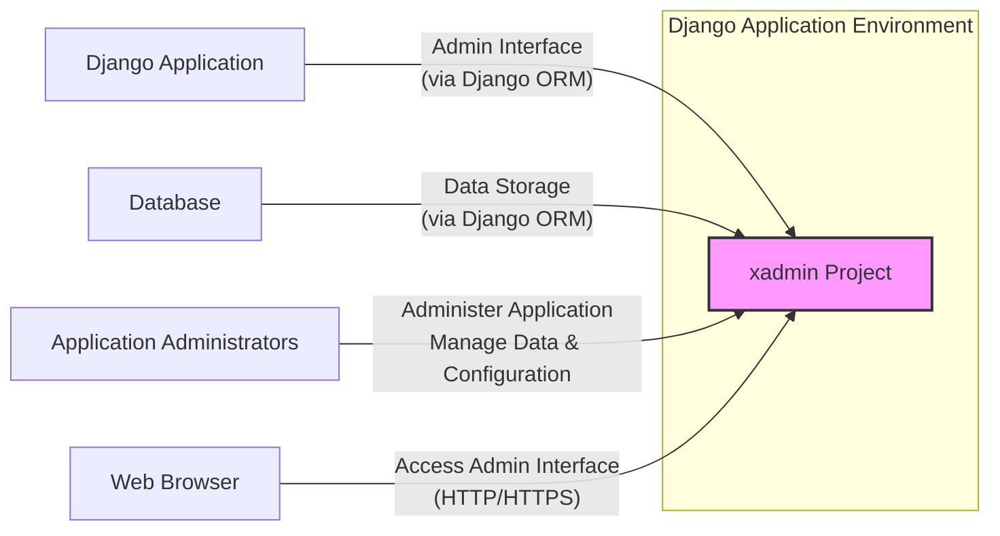
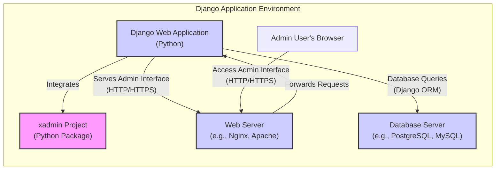
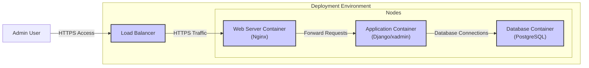

# BUSINESS POSTURE

- Business Priorities and Goals:
  - Provide an enhanced administration interface for Django applications, offering more features and flexibility compared to the default Django admin.
  - Simplify common administrative tasks and improve developer productivity when managing Django applications.
  - Offer a customizable and extensible admin panel solution that can be adapted to various project requirements.
- Business Risks:
  - Security vulnerabilities within xadmin could compromise the security of Django applications that rely on it for administration.
  - Compatibility issues with future Django versions or other Python packages could lead to maintenance overhead and potential application instability.
  - Lack of community adoption or insufficient documentation could hinder user adoption and limit the project's long-term viability.
  - Potential performance bottlenecks introduced by xadmin could negatively impact the responsiveness of the admin interface and the overall application.

# SECURITY POSTURE

- Existing Security Controls:
  - security control: Django Framework Security Features - xadmin is built on top of Django and inherits Django's built-in security features, including protection against common web vulnerabilities like SQL injection, cross-site scripting (XSS), and cross-site request forgery (CSRF). (Implemented in Django framework)
  - security control: Django Authentication and Authorization - xadmin leverages Django's user authentication and permission system to control access to the admin interface and its functionalities. (Implemented in Django framework)
  - security control: Secure Password Handling - Django's user management system, used by xadmin, includes secure password hashing and storage mechanisms. (Implemented in Django framework)
- Accepted Risks:
  - accepted risk: Reliance on Django's security best practices - xadmin's security posture is heavily dependent on the underlying Django framework being securely configured and maintained.
  - accepted risk: Third-party dependencies - xadmin relies on various Python packages, and vulnerabilities in these dependencies could indirectly affect xadmin's security.
- Recommended Security Controls:
  - security control: Regular Security Audits - Conduct periodic security audits and penetration testing of xadmin to identify and address potential vulnerabilities.
  - security control: Dependency Scanning - Implement automated dependency scanning to detect and update vulnerable third-party packages used by xadmin.
  - security control: Input Validation and Sanitization - Ensure robust input validation and sanitization throughout xadmin to prevent injection attacks and other input-related vulnerabilities.
  - security control: Secure Coding Practices - Adhere to secure coding practices during development, including code reviews and static analysis, to minimize the introduction of security flaws.
  - security control: Security Headers - Configure appropriate security headers (e.g., Content Security Policy, X-Frame-Options, Strict-Transport-Security) in the web server serving xadmin to enhance client-side security.
- Security Requirements:
  - Authentication:
    - Requirement: Securely authenticate administrators accessing the xadmin interface.
    - Requirement: Support strong password policies and consider multi-factor authentication for enhanced security.
  - Authorization:
    - Requirement: Implement fine-grained authorization controls to manage access to different features and data within xadmin based on user roles and permissions.
    - Requirement: Follow the principle of least privilege when assigning permissions to admin users.
  - Input Validation:
    - Requirement: Validate all user inputs received by xadmin to prevent injection attacks (e.g., SQL injection, command injection, XSS).
    - Requirement: Sanitize user inputs before displaying them in the admin interface to mitigate XSS risks.
  - Cryptography:
    - Requirement: Utilize Django's secure password hashing for storing administrator passwords.
    - Requirement: Ensure sensitive data transmitted between the browser and the server (e.g., during login) is protected using HTTPS.
    - Requirement: Consider encryption for sensitive data stored within the application's database if applicable and not already handled by Django or database features.

# DESIGN

## C4 CONTEXT

- Context Diagram Elements:
  - Element:
    - Name: xadmin Project
    - Type: Software System
    - Description: The xadmin project itself, providing an enhanced Django admin interface. It is a Python package that is integrated into a Django application.
    - Responsibilities:
      - Provide a user-friendly and feature-rich web interface for administering Django applications.
      - Handle user authentication and authorization for admin access.
      - Interact with the Django application's models and database through the Django ORM.
    - Security controls:
      - Leverages Django's security features for authentication, authorization, and protection against common web vulnerabilities.
      - Implements input validation and sanitization to prevent injection attacks.
  - Element:
    - Name: Django Application
    - Type: Software System
    - Description: The Django web application that integrates and utilizes xadmin for its administration interface.
    - Responsibilities:
      - Define data models and business logic for the application.
      - Integrate xadmin to provide an admin interface for managing application data and configuration.
      - Rely on Django's framework for core functionalities and security features.
    - Security controls:
      - Implements application-specific security logic and access controls.
      - Configures Django's security settings and middleware.
  - Element:
    - Name: Database
    - Type: Data Store
    - Description: The database system used by the Django application to store application data and potentially admin-related data.
    - Responsibilities:
      - Persistently store application data.
      - Provide data access to the Django application and xadmin through database queries.
      - Ensure data integrity and availability.
    - Security controls:
      - Implements database-level access controls and authentication.
      - May employ data encryption at rest and in transit.
  - Element:
    - Name: Application Administrators
    - Type: Person
    - Description: Users who are responsible for managing and configuring the Django application through the xadmin interface.
    - Responsibilities:
      - Administer the Django application, including managing data, users, and settings.
      - Monitor application health and performance.
      - Ensure the security and integrity of the application and its data.
    - Security controls:
      - Authenticate with strong credentials to access the admin interface.
      - Adhere to security best practices when managing the application.
  - Element:
    - Name: Web Browser
    - Type: Software System
    - Description: The web browser used by administrators to access the xadmin interface.
    - Responsibilities:
      - Render the xadmin web interface.
      - Send HTTP requests to the xadmin application.
      - Receive and display responses from the xadmin application.
    - Security controls:
      - Implements browser security features to protect against web-based attacks.
      - Relies on HTTPS for secure communication with the xadmin application.

## C4 CONTAINER

- Container Diagram Elements:
  - Element:
    - Name: xadmin Project (Python Package)
    - Type: Library/Package
    - Description: The xadmin Python package, which provides the core logic and templates for the enhanced Django admin interface. It is installed and integrated into the Django Web Application.
    - Responsibilities:
      - Implement the enhanced admin interface features and functionalities.
      - Provide views, forms, and templates for admin pages.
      - Extend Django's admin framework.
    - Security controls:
      - Relies on secure coding practices to prevent vulnerabilities in its code.
      - Benefits from Django's security features.
  - Element:
    - Name: Django Web Application (Python)
    - Type: Web Application
    - Description: The main Django application, written in Python, which utilizes xadmin to provide its administration interface. It handles application logic, data models, and integrates with the database.
    - Responsibilities:
      - Host and run the xadmin admin interface.
      - Handle HTTP requests and responses for the admin interface.
      - Interact with the Database Server using Django ORM.
      - Enforce application-level security controls.
    - Security controls:
      - Implements Django's security middleware and settings.
      - Handles user authentication and authorization.
      - Performs input validation and sanitization within the application logic.
  - Element:
    - Name: Web Server (e.g., Nginx, Apache)
    - Type: Web Server
    - Description: A web server like Nginx or Apache that acts as a reverse proxy, handling incoming HTTP/HTTPS requests and forwarding them to the Django Web Application. It also serves static files.
    - Responsibilities:
      - Receive HTTP/HTTPS requests from admin users' browsers.
      - Terminate SSL/TLS connections (HTTPS).
      - Serve static files (CSS, JavaScript, images).
      - Forward requests to the Django Web Application.
    - Security controls:
      - Enforces HTTPS for secure communication.
      - Can be configured with security headers (e.g., HSTS, CSP).
      - May include web application firewall (WAF) features.
  - Element:
    - Name: Database Server (e.g., PostgreSQL, MySQL)
    - Type: Database
    - Description: The database server, such as PostgreSQL or MySQL, used to store the Django application's data, including data managed through xadmin.
    - Responsibilities:
      - Store and manage application data persistently.
      - Process database queries from the Django Web Application.
      - Ensure data integrity and availability.
    - Security controls:
      - Implements database user authentication and authorization.
      - May employ database-level encryption.
      - Regularly backed up to prevent data loss.
  - Element:
    - Name: Admin User's Browser
    - Type: Client Application
    - Description: The web browser used by application administrators to access the xadmin interface.
    - Responsibilities:
      - Render the xadmin web interface.
      - Communicate with the Web Server over HTTP/HTTPS.
      - Provide a user interface for interacting with xadmin.
    - Security controls:
      - Relies on browser security features.
      - Should be kept up-to-date with security patches.

## DEPLOYMENT

- Deployment Options:
  - Option 1: Traditional Server Deployment - Deploying the Django application and xadmin on virtual machines or physical servers.
  - Option 2: Containerized Deployment - Using containers (e.g., Docker) and container orchestration (e.g., Kubernetes) for deployment.
  - Option 3: Platform-as-a-Service (PaaS) - Deploying to a PaaS provider like Heroku or AWS Elastic Beanstalk.

- Detailed Deployment (Option 2: Containerized Deployment with Docker):

- Deployment Diagram Elements:
  - Element:
    - Name: Load Balancer
    - Type: Network Component
    - Description: Distributes incoming HTTPS traffic across multiple Web Server Containers for high availability and scalability.
    - Responsibilities:
      - Load balancing incoming requests.
      - SSL/TLS termination.
      - Health checks for Web Server Containers.
    - Security controls:
      - SSL/TLS encryption.
      - May include DDoS protection and rate limiting.
  - Element:
    - Name: Web Server Container (Nginx)
    - Type: Container
    - Description: A Docker container running Nginx web server, serving as a reverse proxy for the Application Container and serving static files.
    - Responsibilities:
      - Receive requests from the Load Balancer.
      - Forward requests to the Application Container.
      - Serve static files.
    - Security controls:
      - Configured with security headers.
      - Regularly updated container image.
  - Element:
    - Name: Application Container (Django/xadmin)
    - Type: Container
    - Description: A Docker container running the Django application with xadmin integrated. It processes application logic and interacts with the Database Container.
    - Responsibilities:
      - Run the Django/xadmin application.
      - Handle application logic and admin interface.
      - Connect to the Database Container.
    - Security controls:
      - Built from a secure base image.
      - Application-level security controls (Django security features).
      - Regularly updated container image.
  - Element:
    - Name: Database Container (PostgreSQL)
    - Type: Container
    - Description: A Docker container running the PostgreSQL database server, storing the application's data.
    - Responsibilities:
      - Store application data.
      - Manage database connections.
      - Ensure data persistence.
    - Security controls:
      - Database user authentication and authorization.
      - Data encryption at rest (optional, depending on configuration).
      - Regularly updated container image.
  - Element:
    - Name: Admin User
    - Type: Person
    - Description: An administrator accessing the xadmin interface through their web browser.
    - Responsibilities:
      - Manage the Django application via the admin interface.
    - Security controls:
      - Uses HTTPS for secure access.
      - Authenticates to the admin interface.

## BUILD

```mermaid
flowchart LR
    A["Developer"] -- "Code Changes\n(Git Push)" --> B["Version Control\n(GitHub)"]
    B -- "Webhook Trigger" --> C["CI/CD Pipeline\n(GitHub Actions)"]
    subgraph "CI/CD Pipeline"
        D["Source Code Checkout"]
        E["Dependency Installation"]
        F["Static Analysis\n(Linters, SAST)"]
        G["Unit & Integration Tests"]
        H["Build Artifacts\n(Python Package)"]
        I["Container Image Build\n(Docker)"]
        J["Artifact Repository\n(e.g., GitHub Packages, Docker Hub)"]
    end
    C --> D --> E --> F --> G --> H --> I --> J
    J -- "Deployment" --> K["Deployment Environment"]

    style C fill:#ccf,stroke:#333,stroke-width:2px
    style J fill:#ccf,stroke:#333,stroke-width:2px
```

- Build Process Description:
  - Developer commits code changes and pushes them to the Version Control System (e.g., GitHub).
  - A webhook triggers the CI/CD Pipeline (e.g., GitHub Actions).
  - CI/CD Pipeline Steps:
    - Source Code Checkout: Retrieves the latest code from the repository.
    - Dependency Installation: Installs project dependencies using a package manager (e.g., pip).
    - Static Analysis (Linters, SAST): Performs static code analysis using linters and Static Application Security Testing (SAST) tools to identify potential code quality issues and security vulnerabilities.
    - Unit & Integration Tests: Executes automated unit and integration tests to ensure code functionality and stability.
    - Build Artifacts (Python Package): Builds the Python package (e.g., using `setup.py`).
    - Container Image Build (Docker): Builds Docker container images for the application and potentially other components (e.g., web server).
    - Artifact Repository (e.g., GitHub Packages, Docker Hub): Stores the build artifacts, including Python packages and container images, in an artifact repository.
  - Deployment: The build artifacts from the Artifact Repository are then deployed to the target Deployment Environment.
- Build Process Security Controls:
  - security control: Version Control - Using a version control system (Git/GitHub) to track code changes and provide auditability.
  - security control: Automated CI/CD Pipeline - Automating the build and deployment process to ensure consistency and reduce manual errors.
  - security control: Static Analysis (SAST) - Integrating SAST tools into the pipeline to automatically detect potential security vulnerabilities in the code.
  - security control: Dependency Scanning - Incorporating dependency scanning tools to identify vulnerable third-party libraries.
  - security control: Automated Testing - Running automated unit and integration tests to verify code functionality and prevent regressions.
  - security control: Secure Artifact Repository - Storing build artifacts in a secure artifact repository with access controls.
  - security control: Code Review - Implementing code review processes before merging code changes to the main branch.
  - security control: Build Environment Security - Securing the CI/CD build environment itself to prevent supply chain attacks.

# RISK ASSESSMENT

- Critical Business Processes:
  - Management of application data and configuration through the admin interface. This includes creating, reading, updating, and deleting data, as well as modifying application settings.
  - User management and access control for the Django application.
  - Monitoring and maintenance of the Django application.
- Data Sensitivity:
  - The sensitivity of data managed through xadmin depends entirely on the Django application it is used with. It could range from low sensitivity (e.g., blog content) to high sensitivity (e.g., personal user data, financial transactions, healthcare records).
  - Consider the potential impact of unauthorized access, modification, or deletion of data managed through xadmin on the business and users.

# QUESTIONS & ASSUMPTIONS

- BUSINESS POSTURE:
  - Question: What is the primary use case for Django applications that will utilize xadmin? (e.g., e-commerce, content management, internal tools).
  - Assumption: xadmin is intended to be used in a variety of Django application types requiring an enhanced admin interface.
  - Question: What are the expected scalability and performance requirements for the admin interface?
  - Assumption: Performance of the admin interface is important for administrator productivity, but it is not expected to handle public-facing traffic.

- SECURITY POSTURE:
  - Question: Are there any specific compliance requirements (e.g., GDPR, HIPAA, PCI DSS) that the Django applications using xadmin must adhere to?
  - Assumption: Standard web application security best practices are sufficient, but specific compliance requirements might necessitate additional controls.
  - Question: What is the organization's risk tolerance regarding security vulnerabilities in the admin interface?
  - Assumption: Security of the admin interface is a high priority due to its access to sensitive application data and configuration.

- DESIGN:
  - Question: What is the expected deployment environment for Django applications using xadmin (e.g., cloud, on-premise, hybrid)?
  - Assumption: xadmin is designed to be deployable in various environments, including cloud and on-premise infrastructure.
  - Question: Are there any specific integrations with other systems or services beyond the Django application and database?
  - Assumption: xadmin primarily interacts with the Django application and its database, with no significant external system integrations assumed at this stage.
  - Question: What is the expected level of customization and extension required for the admin interface?
  - Assumption: xadmin is designed to be customizable and extensible to meet diverse project needs.