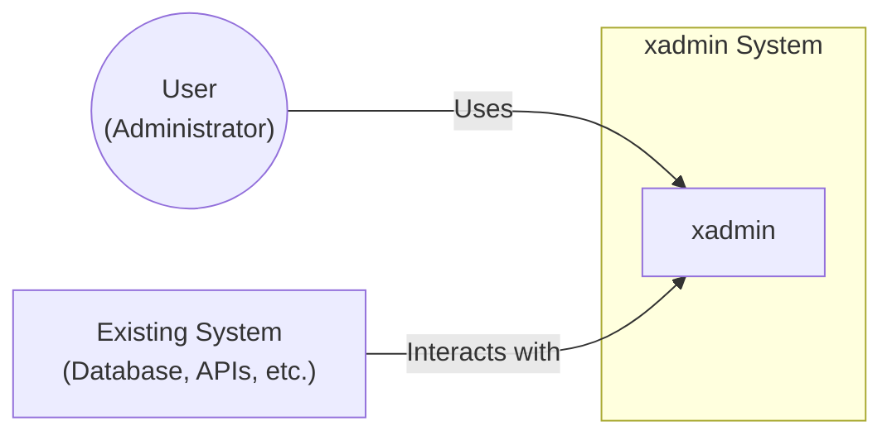
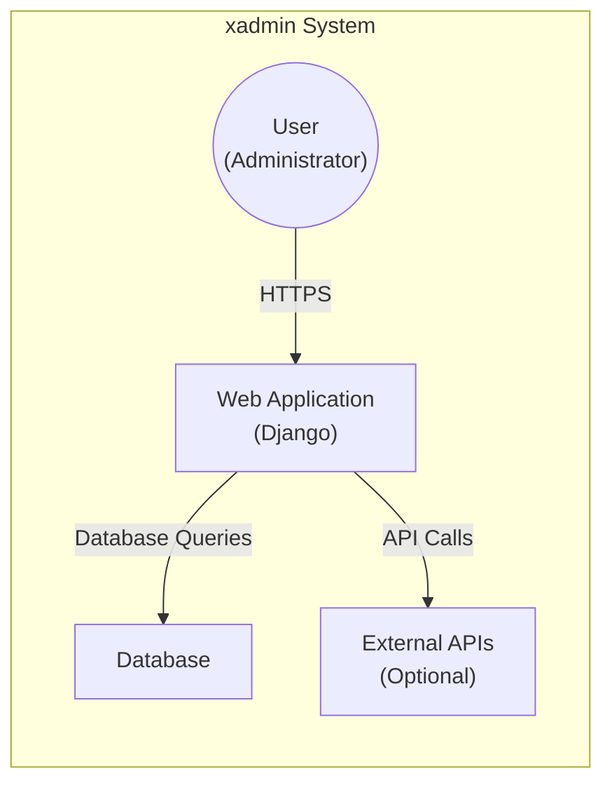
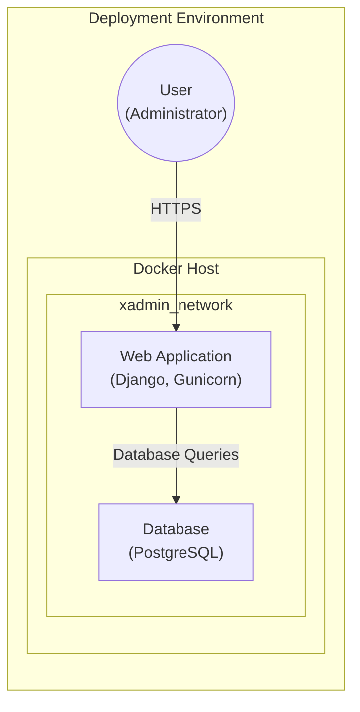
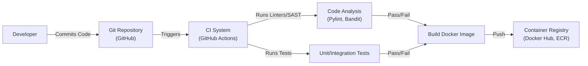

Okay, let's create a design document for the xadmin project.

# BUSINESS POSTURE

Business Priorities and Goals:

*   Provide a simple, extensible web-based administration interface for managing various aspects of a system or application.
*   Offer a user-friendly experience for administrators, even those with limited technical expertise.
*   Reduce the time and effort required to build custom administrative dashboards.
*   Enable rapid development and deployment of administrative features.
*   Provide a visually appealing and modern interface.

Business Risks:

*   Unauthorized access to administrative functions could lead to data breaches, system compromise, or service disruption.
*   Injection vulnerabilities (e.g., SQL injection, cross-site scripting) could allow attackers to manipulate data or execute malicious code.
*   Lack of proper input validation and sanitization could expose the system to various attacks.
*   Insufficient logging and auditing could hinder incident response and forensic analysis.
*   Exposure of sensitive information (e.g., credentials, API keys) in the codebase or configuration files.
*   Vulnerabilities in third-party dependencies could be exploited by attackers.
*   Lack of regular security updates and patching could leave the system vulnerable to known exploits.

# SECURITY POSTURE

Existing Security Controls:

*   security control: Authentication: The project uses Django's built-in authentication system (mentioned in the README and visible in the code structure).
*   security control: Authorization: Django's permission system is likely used to control access to different administrative features (implied by the use of Django's admin interface).
*   security control: Basic CSRF protection: Django's built-in CSRF protection is likely enabled by default.
*   security control: Session management: Django's session management is used.

Accepted Risks:

*   accepted risk: The project's documentation does not explicitly mention specific security hardening measures beyond the standard Django configurations. This implies a reliance on Django's defaults and the developer's responsibility to implement additional security best practices.
*   accepted risk: The project's reliance on third-party libraries (e.g., Django, Bootstrap) introduces a potential risk of supply chain vulnerabilities.
*   accepted risk: The level of input validation and output encoding is not explicitly documented, creating a potential risk of injection vulnerabilities if not handled carefully in the application code.

Recommended Security Controls:

*   security control: Implement comprehensive input validation and output encoding to prevent injection attacks (XSS, SQLi, etc.).
*   security control: Enforce strong password policies and consider implementing multi-factor authentication (MFA).
*   security control: Regularly update all dependencies to patch known vulnerabilities.
*   security control: Implement detailed logging and auditing of all administrative actions.
*   security control: Conduct regular security assessments and penetration testing.
*   security control: Use a Content Security Policy (CSP) to mitigate the impact of XSS attacks.
*   security control: Implement rate limiting to protect against brute-force attacks.
*   security control: Securely store sensitive configuration data (e.g., API keys, database credentials) outside of the codebase.
*   security control: Implement a robust role-based access control (RBAC) system to limit user privileges.

Security Requirements:

*   Authentication:
    *   All users must be authenticated before accessing any administrative functionality.
    *   Support for strong passwords and password complexity rules.
    *   Consider support for multi-factor authentication (MFA).
    *   Secure session management with appropriate timeouts and protection against session hijacking.

*   Authorization:
    *   Implement a fine-grained authorization mechanism to control access to specific resources and actions.
    *   Follow the principle of least privilege, granting users only the necessary permissions.
    *   Regularly review and update user permissions.

*   Input Validation:
    *   Validate all user inputs on the server-side, using a whitelist approach whenever possible.
    *   Sanitize all user inputs to prevent injection attacks (e.g., XSS, SQLi).
    *   Validate data types, lengths, and formats.

*   Cryptography:
    *   Use strong, industry-standard cryptographic algorithms for password hashing (e.g., bcrypt, Argon2).
    *   Protect sensitive data in transit using TLS/SSL.
    *   Consider encrypting sensitive data at rest.
    *   Securely manage cryptographic keys.

*   Output Encoding:
    *   Encode all output to prevent cross-site scripting (XSS) vulnerabilities.
    *   Use context-specific encoding methods (e.g., HTML encoding, JavaScript encoding).

# DESIGN

## C4 CONTEXT

Element Descriptions:

*   Element: User
    *   Name: User
    *   Type: Person
    *   Description: An administrator who uses xadmin to manage the existing system.
    *   Responsibilities: Interacts with the xadmin interface to perform administrative tasks.
    *   Security controls: Authentication, Authorization, Session Management.

*   Element: xadmin
    *   Name: xadmin
    *   Type: Software System
    *   Description: The web-based administration interface.
    *   Responsibilities: Provides a user interface for managing the existing system, handles user authentication and authorization, interacts with the existing system to perform administrative actions.
    *   Security controls: Input Validation, Output Encoding, CSRF Protection, Authentication, Authorization.

*   Element: Existing System
    *   Name: Existing System
    *   Type: Software System
    *   Description: The system or application being managed by xadmin (e.g., a database, a set of APIs, a web application).
    *   Responsibilities: Provides the data and functionality that xadmin manages.
    *   Security controls: Depends on the specific system being managed. Should include its own security measures.

## C4 CONTAINER

Element Descriptions:

*   Element: Web Application
    *   Name: Web Application
    *   Type: Web Application
    *   Description: The Django-based web application that provides the xadmin interface.
    *   Responsibilities: Handles user requests, renders the user interface, interacts with the database and external APIs, enforces security controls.
    *   Security controls: Input Validation, Output Encoding, CSRF Protection, Authentication, Authorization, Session Management.

*   Element: Database
    *   Name: Database
    *   Type: Database
    *   Description: The database that stores the data managed by xadmin.
    *   Responsibilities: Stores and retrieves data, enforces data integrity.
    *   Security controls: Access Control, Encryption (at rest and in transit), Auditing.

*   Element: External APIs
    *   Name: External APIs
    *   Type: API
    *   Description: Optional external APIs that xadmin might interact with.
    *   Responsibilities: Provides specific functionalities or data to xadmin.
    *   Security controls: Depends on the specific API. Should include authentication, authorization, and input validation.

## DEPLOYMENT

Possible Deployment Solutions:

1.  Traditional Web Server (Apache/Nginx) + WSGI Server (Gunicorn/uWSGI) + Database Server (PostgreSQL/MySQL).
2.  Cloud-based Platform-as-a-Service (PaaS) (e.g., Heroku, AWS Elastic Beanstalk, Google App Engine).
3.  Containerized Deployment (Docker) + Orchestration (Kubernetes/Docker Compose).

Chosen Solution (for detailed description): Containerized Deployment (Docker) + Orchestration (Docker Compose). This approach offers portability, scalability, and ease of management.

Element Descriptions:

*   Element: Docker Host
    *   Name: Docker Host
    *   Type: Server
    *   Description: The physical or virtual machine that runs the Docker engine.
    *   Responsibilities: Hosts the Docker containers.
    *   Security controls: Operating System Hardening, Firewall, Intrusion Detection System.

*   Element: Web Application
    *   Name: Web Application
    *   Type: Docker Container
    *   Description: A Docker container running the Django application and a WSGI server (e.g., Gunicorn).
    *   Responsibilities: Serves the xadmin web interface, handles user requests, interacts with the database.
    *   Security controls: Container Isolation, Minimal Base Image, Regular Image Updates, Secure Configuration.

*   Element: Database
    *   Name: Database
    *   Type: Docker Container
    *   Description: A Docker container running the database server (e.g., PostgreSQL).
    *   Responsibilities: Stores and manages the application data.
    *   Security controls: Container Isolation, Secure Configuration, Data Encryption (at rest and in transit), Access Control.

* Element: xadmin_network
    * Name: xadmin_network
    * Type: Network
    * Description: Docker compose create network for internal communication.
    * Responsibilities: Isolate network communication between containers.
    * Security controls: Network isolation.

## BUILD

The build process likely involves the following steps:

1.  Developer writes code and commits it to a Git repository (e.g., GitHub).
2.  A Continuous Integration (CI) system (e.g., GitHub Actions, Jenkins) is triggered by the commit.
3.  The CI system checks out the code.
4.  The CI system runs linters and static analysis tools (e.g., Pylint, Bandit) to check for code quality and potential security vulnerabilities.
5.  The CI system runs unit and integration tests.
6.  If all tests pass, the CI system builds a Docker image.
7.  The Docker image is pushed to a container registry (e.g., Docker Hub, AWS ECR).

Security Controls in Build Process:

*   security control: Code Review: All code changes should be reviewed by another developer before being merged.
*   security control: Static Application Security Testing (SAST): Use tools like Bandit to identify potential security vulnerabilities in the code.
*   security control: Dependency Scanning: Use tools to scan for known vulnerabilities in third-party dependencies.
*   security control: Secure Build Environment: The CI system should be configured securely, with limited access and appropriate permissions.
*   security control: Image Signing: Consider signing Docker images to ensure their integrity.

# RISK ASSESSMENT

Critical Business Processes:

*   User Authentication and Authorization: Ensuring only authorized users can access and modify sensitive data and system configurations.
*   Data Management: Protecting the integrity and confidentiality of the data managed by xadmin.
*   System Administration: Maintaining the availability and stability of the xadmin system and the systems it manages.

Data Sensitivity:

*   User Credentials (passwords, usernames): Highly sensitive.
*   System Configuration Data: Potentially sensitive, depending on the specific configuration.
*   Data managed by xadmin: Sensitivity depends on the specific application and the data it manages. This could range from low to highly sensitive.

# QUESTIONS & ASSUMPTIONS

Questions:

*   What specific systems will xadmin be used to manage? This will significantly impact the data sensitivity and security requirements.
*   What are the existing security policies and procedures of the organization?
*   What is the expected user base and their technical expertise?
*   Are there any specific regulatory compliance requirements (e.g., GDPR, HIPAA)?
*   What is the deployment environment (cloud, on-premise, hybrid)?
*   What level of logging and auditing is required?
*   What are the specific external APIs that xadmin will interact with, and what are their security characteristics?

Assumptions:

*   BUSINESS POSTURE: The organization has a moderate risk appetite, balancing the need for rapid development with the importance of security.
*   SECURITY POSTURE: The organization has basic security controls in place, but there is room for improvement. Django's default security settings are enabled.
*   DESIGN: The system will be deployed using Docker containers and Docker Compose. The primary database will be PostgreSQL. The system will primarily interact with a single database, but may optionally connect to external APIs. The build process will utilize GitHub Actions for CI/CD.