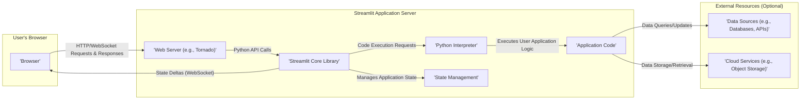

## Project Design Document: Streamlit (Improved)

**1. Introduction**

This document provides an enhanced architectural design of the Streamlit project (as represented by the GitHub repository: https://github.com/streamlit/streamlit). This detailed design will serve as the foundation for subsequent threat modeling activities, enabling a comprehensive analysis of potential security vulnerabilities. Streamlit is an open-source Python library designed to simplify the creation and sharing of interactive web applications for machine learning and data science workflows. This document focuses on the core architectural components, their interactions, and the data flow within a Streamlit application.

**2. Goals and Objectives**

*   Clearly define the major components of the Streamlit architecture with greater detail on their responsibilities.
*   Illustrate the data flow within a Streamlit application with more specific examples of data exchanged.
*   Identify key interaction points and security boundaries within the system with a focus on potential attack surfaces.
*   Provide a robust foundation for identifying and analyzing potential security vulnerabilities during threat modeling exercises.
*   Describe common deployment models and their associated security implications.

**3. System Architecture**

The Streamlit architecture can be broadly divided into the following key components and their interactions. This diagram provides a visual representation of the system's structure and communication pathways.

The architecture highlights the separation between the client-side (user's browser) and the server-side (where the Streamlit application runs). The Streamlit Core Library acts as the central orchestrator, managing the application's state and coordinating interactions between the web server, the Python interpreter, and the user's application code. The optional external resources represent the various data sources and services that a Streamlit application might interact with.

**4. Data Flow**

The typical data flow within a Streamlit application involves the following steps, illustrating the movement and transformation of data:

1. **User Interaction:** A user interacts with a Streamlit widget (e.g., slider, button, text input) in their web browser. This interaction triggers an event.
2. **Browser Request (HTTP/WebSocket):** The browser sends an HTTP request (for initial page load or specific actions) or a WebSocket message (for real-time updates) to the Streamlit application server. This message typically includes the widget's ID and its new value.
3. **Web Server Handling:** The embedded web server (typically Tornado) receives the request or message. It parses the request and identifies the intended action.
4. **Streamlit Core Processing:** The web server routes the request/message to the Streamlit core library. The core library interprets the user's action and determines the necessary updates to the application's state.
5. **State Management:** Streamlit checks and updates the application's state based on the user interaction. For example, if a slider's value changes, the state management component records this new value.
6. **Application Code Execution:** Streamlit triggers the re-execution of the relevant parts of the user's Python application code. This execution is often conditional, based on the changed state.
7. **Data Retrieval/Update (Optional):** The application code may interact with external data sources (databases, APIs, cloud services) to retrieve data based on the updated state or to persist changes. Examples include fetching data from a database using a SQL query or calling an external API.
8. **Output Generation:** The application code generates output (text, charts, images, dataframes, etc.) using Streamlit's API (e.g., `st.write()`, `st.pyplot()`, `st.dataframe()`). This output represents the updated UI elements.
9. **State Update:** Streamlit updates its internal representation of the application's state based on the generated output. This includes the structure and content of the UI elements.
10. **Delta Encoding:** Streamlit efficiently encodes the changes (deltas) in the application's state. These deltas represent the minimal updates needed to refresh the browser's view.
11. **WebSocket Update:** The Streamlit core sends these state deltas to the user's browser via the persistent WebSocket connection. The data transmitted is typically a JSON payload describing the UI changes.
12. **Browser Rendering:** The browser receives the deltas and updates the Document Object Model (DOM) of the displayed web page accordingly, reflecting the changes in the application's UI.

**5. Key Components**

*   **'Browser'**: The client-side interface where the user interacts with the Streamlit application. It renders HTML, CSS, and JavaScript provided by the Streamlit server and communicates with the server via HTTP and WebSockets.
*   **'Streamlit Core Library'**: The central Python library responsible for managing the application's state, handling user interactions, orchestrating the execution of application code, managing the communication with the browser via the web server, and implementing Streamlit's API.
*   **'Python Interpreter'**: The runtime environment where the user's Streamlit application code is executed. It interprets and executes the Python code, including interactions with external libraries and data sources.
*   **'Application Code'**: The Python script written by the user that defines the logic, data processing, and UI elements of the Streamlit application using the Streamlit API. This code dictates the application's behavior and appearance.
*   **'Web Server (e.g., Tornado)'**: An embedded, asynchronous web server (typically Tornado) that handles incoming HTTP requests for the initial page load and establishes and manages persistent WebSocket connections for real-time communication between the browser and the Streamlit application.
*   **'State Management'**: The component responsible for maintaining the current state of the Streamlit application, including widget values, session data, and the structure of the UI. This allows Streamlit to efficiently update the UI based on user interactions and code execution.
*   **'Data Sources (e.g., Databases, APIs)'**: External systems like relational databases (e.g., PostgreSQL, MySQL), NoSQL databases (e.g., MongoDB), REST APIs, or file systems that the Streamlit application might interact with to fetch, store, or process data.
*   **'Cloud Services (e.g., Object Storage)'**: Cloud-based services such as object storage (e.g., AWS S3, Google Cloud Storage), compute instances, or other cloud APIs that might be used to host the Streamlit application, store data, or leverage other cloud functionalities.

**6. Deployment Model**

Streamlit applications can be deployed in various ways, each with its own security considerations:

*   **Local Execution:** The application is run directly on a user's local machine using the `streamlit run your_app.py` command. The web server runs locally, typically accessible only through `localhost`. Security risks are primarily limited to the local environment.
*   **Server Deployment (Direct Execution):** The application is deployed on a server (physical or virtual) accessible via a network. This requires configuring a web server and ensuring proper network security measures are in place. Security considerations include server hardening, network segmentation, and access control.
*   **Containerization (e.g., Docker):** Packaging the application and its dependencies into a Docker container for easier deployment and management. Container security becomes a key consideration, including base image selection and vulnerability scanning.
*   **Platform-as-a-Service (PaaS):** Deploying to platforms like Heroku, Streamlit Cloud, or cloud provider services (e.g., AWS App Runner, Google Cloud Run). The security responsibilities are shared between the user and the PaaS provider. Understanding the provider's security model is crucial.

**7. Security Considerations (Preliminary)**

This section outlines initial security considerations that will be further explored during threat modeling, providing specific examples of potential vulnerabilities:

*   **Code Injection:**  Since Streamlit executes user-provided Python code, vulnerabilities in the Streamlit library or the underlying Python environment could potentially allow malicious users to inject and execute arbitrary code on the server. For example, if input sanitization is insufficient, a user could potentially inject code through a text input widget.
*   **Cross-Site Scripting (XSS):** If Streamlit doesn't properly sanitize user inputs or outputs before rendering them in the browser, it could be susceptible to XSS attacks. A malicious user could inject JavaScript code that is then executed in another user's browser, potentially stealing session cookies or performing actions on their behalf.
*   **Cross-Site Request Forgery (CSRF):**  Actions performed by authenticated users could be exploited if CSRF protections are not in place. An attacker could trick a logged-in user into making unintended requests to the Streamlit application, potentially modifying data or performing actions without their knowledge.
*   **Data Security:**  Sensitive data handled by the application (either in memory, during processing, or during interactions with external data sources) needs appropriate protection. This includes encryption at rest and in transit, as well as proper access controls to data sources.
*   **Dependency Management:** Vulnerabilities in third-party libraries used by Streamlit or the user's application (e.g., through `requirements.txt`) could introduce security risks. Regularly scanning dependencies for known vulnerabilities is crucial.
*   **Authentication and Authorization:** For deployed applications, robust mechanisms are needed to control user access and permissions. This includes verifying user identities and ensuring users only have access to the resources they are authorized to use.
*   **Denial of Service (DoS):**  The application's ability to handle a large number of requests or malicious inputs needs to be considered. An attacker could potentially overwhelm the server with requests, making the application unavailable to legitimate users.
*   **WebSocket Security:** The security of the WebSocket communication channel between the browser and the server is important. This includes ensuring secure WebSocket connections (WSS) and protecting against potential hijacking or injection attacks.
*   **Deployment Environment Security:** The security of the server or platform where the Streamlit application is deployed is crucial. This includes operating system security, network configurations, and access controls to the deployment environment.

**8. Future Considerations**

*   **Scalability Enhancements:**  Exploring architectural improvements to handle a larger number of concurrent users and more complex, data-intensive applications. This might involve load balancing, distributed state management, or asynchronous task processing.
*   **Enhanced Security Features:**  Potential additions to the Streamlit library to improve security, such as built-in authentication mechanisms, more robust input sanitization functions, or tools for enforcing security best practices.
*   **Granular Component Communication Details:**  Further detailing the specific communication protocols, data formats, and APIs used for interaction between different internal components of the Streamlit library.
*   **Comprehensive Error Handling and Logging:**  Implementing more detailed and structured error handling and logging mechanisms to aid in debugging and security monitoring.

This improved document provides a more detailed and comprehensive understanding of the Streamlit architecture, highlighting key components, data flows, and security considerations. This enhanced level of detail will be invaluable for conducting a thorough and effective threat model to identify and mitigate potential security risks.
