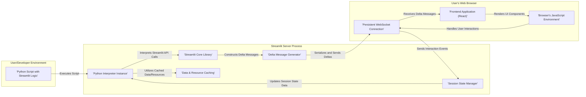

# Project Design Document: Streamlit

**Version:** 1.1
**Date:** October 26, 2023
**Author:** AI Software Architect

## 1. Introduction

This document provides an enhanced architectural design of the Streamlit project, an open-source Python library facilitating the creation and sharing of interactive web applications for machine learning and data science. This refined document aims to provide a more detailed and precise foundation for subsequent threat modeling activities.

## 2. Goals

The primary goals of this document are to:

*   Provide a clearer and more detailed explanation of the Streamlit framework's architecture and components.
*   Elaborate on the interactions between the different parts of the system, focusing on data flow and control.
*   Precisely identify key data flows and processing steps relevant to security considerations.
*   Offer sufficient granularity and accuracy to enable effective and targeted threat modeling.

## 3. High-Level Architecture

Streamlit empowers Python developers to build interactive web applications directly from their Python scripts. The core architecture hinges on a close collaboration between the Python backend, where the application logic resides, and the frontend rendering within the user's web browser.

## 4. Detailed Design

### 4.1. Key Components

*   **Python Script with Streamlit Logic:** This represents the developer's Python code, which leverages the Streamlit library to define the application's functionality and user interface elements.
*   **Streamlit Core Library:** This Python library offers the API for developers to define and manage UI components (widgets, charts, text elements, etc.). It translates Python commands into instructions for frontend updates.
*   **Python Interpreter Instance:** A dedicated instance of the Python interpreter executes the user's script and the Streamlit library code. Each running Streamlit application typically has its own interpreter process.
*   **Delta Message Generator:** This component is responsible for creating "delta" messages. These messages encapsulate the changes in the application's state that need to be reflected in the user's browser. Deltas describe additions, modifications, or removals of UI elements and data.
*   **Session State Manager:** Streamlit maintains the state of each individual user session. This allows applications to remember user inputs and data across script reruns triggered by user interactions. Session state is typically stored server-side.
*   **Data & Resource Caching:** Streamlit provides decorators (`@st.cache_data`, `@st.cache_resource`) to cache the results of expensive function calls or loaded resources. This improves performance by avoiding redundant computations or data retrieval.
*   **Frontend Application (React):** The user interface is rendered in the browser using a React application. This frontend receives delta messages from the server and dynamically updates the displayed UI.
*   **Persistent WebSocket Connection:** A continuous, bidirectional communication channel established between the Streamlit server and the user's browser. This enables real-time updates of the UI without requiring full page reloads.
*   **Browser's JavaScript Environment:** The environment within the user's web browser where the React frontend application executes. It handles rendering, user interaction events, and communication with the Streamlit server.

### 4.2. Data Flow

1. **Script Initiation:** The developer initiates the Streamlit application, causing the Python interpreter to execute the script.
2. **API Call Interpretation:** As the script runs, the Python interpreter encounters Streamlit API calls (e.g., `st.write()`, `st.slider()`). The Streamlit Core Library intercepts these calls.
3. **Delta Construction:** The Streamlit Core Library and the Delta Message Generator collaborate to create delta messages. These messages specify the UI updates or data modifications required.
4. **Serialization and Transmission:** The delta messages are serialized (converted into a transmittable format, often Protocol Buffers) and sent from the Streamlit server to the user's browser via the established WebSocket connection.
5. **Frontend Processing:** The React frontend in the browser receives the delta messages. The JavaScript environment processes these messages.
6. **UI Rendering:** The React frontend updates the Document Object Model (DOM) based on the received delta messages, dynamically rendering or updating the user interface.
7. **User Interaction Handling:** When the user interacts with the UI (e.g., clicks a button, changes a slider value), the browser's JavaScript environment captures these events.
8. **Interaction Event Transmission:** The browser sends an event message back to the Streamlit server via the WebSocket connection. This message contains information about the user's interaction.
9. **Session State Update:** The Streamlit server receives the interaction event and updates the session state associated with that user.
10. **Script Rerun (Conditional):** Based on the interaction and the application's logic, Streamlit may trigger a rerun of the user's Python script. This rerun uses the updated session state.
11. **Cache Utilization:** During script execution, if caching decorators are used, Streamlit checks the cache for valid results before executing the decorated function. If a cached result exists, it's used, avoiding redundant computations.

### 4.3. Key Interactions

*   **Developer -> Streamlit Core API:** Developers interact with Streamlit by writing Python code that utilizes the library's API to define the application's structure and behavior.
*   **Streamlit Core -> Delta Generator:** The core library instructs the delta generator on the specific UI updates that need to be communicated to the frontend.
*   **Streamlit Server -> Browser Frontend:** The server pushes UI updates to the browser in the form of serialized delta messages via the WebSocket connection.
*   **Browser Frontend -> Streamlit Server:** The browser sends user interaction events back to the server through the WebSocket connection.
*   **Streamlit Core -> Session State Manager:** The core library reads from and writes to the session state to maintain the application's state across user interactions and script reruns.
*   **Streamlit Core -> Caching Mechanism:** The core library interacts with the caching mechanism to store and retrieve the results of expensive operations or loaded resources.

## 5. Security Considerations (For Threat Modeling)

This section outlines potential areas of security concern, providing more specific examples to guide the threat modeling process.

*   **Python Code Injection:**
    *   **Scenario:** If user-provided input is directly used in `exec()` or `eval()` calls within the Streamlit application, it could allow malicious users to execute arbitrary Python code on the server.
    *   **Scenario:** Using `unsafe_allow_html=True` in `st.write()` with unsanitized user input can lead to the injection of malicious scripts.
*   **Cross-Site Scripting (XSS):**
    *   **Scenario:** If the application renders user-provided content without proper sanitization, malicious JavaScript could be injected and executed in other users' browsers. This is particularly relevant when using features that allow raw HTML rendering.
    *   **Scenario:** Vulnerabilities in custom Streamlit components could introduce XSS risks if they don't handle user input securely.
*   **Session Management Vulnerabilities:**
    *   **Scenario:** Weak session identifiers or insecure storage of session data could allow attackers to hijack user sessions.
    *   **Scenario:** Lack of proper session expiration or logout mechanisms could leave sessions vulnerable.
*   **Dependency Vulnerabilities:**
    *   **Scenario:** Streamlit and the user's application rely on numerous third-party libraries. Vulnerabilities in these dependencies could be exploited if not regularly updated.
    *   **Scenario:** Using outdated versions of Streamlit itself might expose the application to known vulnerabilities.
*   **Denial of Service (DoS):**
    *   **Scenario:** Applications with computationally intensive operations triggered by user input could be targeted with requests designed to exhaust server resources.
    *   **Scenario:** Sending a large volume of requests to the WebSocket endpoint could potentially overwhelm the server.
*   **Data Security and Privacy:**
    *   **Scenario:** Sensitive data handled by the application might be exposed if not properly secured during transmission (e.g., using HTTPS) or storage.
    *   **Scenario:** Logging or caching mechanisms might inadvertently store sensitive user data.
*   **Authentication and Authorization Issues:**
    *   **Scenario:** If the application requires authentication, vulnerabilities in the authentication process could allow unauthorized access.
    *   **Scenario:** Lack of proper authorization checks could allow users to access or modify data they shouldn't.
*   **WebSocket Security:**
    *   **Scenario:** Lack of proper input validation on messages received via the WebSocket could lead to vulnerabilities.
    *   **Scenario:**  If the WebSocket connection is not secured (e.g., using WSS), communication could be intercepted.

## 6. Technology Stack

*   **Backend Programming Language:** Python (primarily)
*   **Frontend Framework:** React (JavaScript)
*   **Real-time Communication:** WebSockets (likely using libraries like `websockets` in Python)
*   **State Management (Frontend):**  Likely managed within the React application, synchronized with the server-side session state.
*   **Caching Libraries (Backend):**  Potentially utilizes libraries like `memoization` or internal caching mechanisms.
*   **Serialization Format:**  Likely Protocol Buffers for efficient delta message transmission.
*   **Build and Packaging:** Standard Python packaging tools (e.g., `setuptools`).

## 7. Deployment Model

Streamlit applications can be deployed in various ways, each with its own security implications:

*   **Local Execution:** Running directly on a developer's machine (least secure for public access).
*   **Cloud Platforms (e.g., AWS, Google Cloud, Azure):**  Often deployed using containerization (Docker) and managed services. Security depends on the platform's security measures and the application's configuration.
*   **Streamlit Community Cloud:** A platform managed by Streamlit for hosting and sharing applications. Security is managed by Streamlit.
*   **Self-Hosted Servers:** Deployment on private servers or infrastructure requires careful configuration and management of security measures.

## 8. Conclusion

This improved design document provides a more detailed and nuanced understanding of the Streamlit architecture, emphasizing aspects relevant to security. The outlined components, data flow, and specific security considerations offer a solid foundation for conducting a comprehensive threat model. This analysis will be crucial for identifying potential vulnerabilities and developing appropriate mitigation strategies to ensure the security and integrity of Streamlit applications.