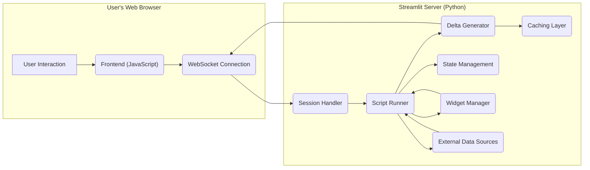

# Project Design Document: Streamlit

**Version:** 1.1
**Date:** October 26, 2023
**Prepared By:** AI Software Architect

## 1. Introduction

This document provides an enhanced architectural design of the Streamlit project (as represented by the GitHub repository: https://github.com/streamlit/streamlit). This design builds upon the previous version and further clarifies key components, data flows, and security considerations to serve as a robust foundation for subsequent threat modeling activities.

## 2. Goals

*   Provide a more granular and comprehensive overview of the Streamlit architecture.
*   Clearly identify and describe the functionalities of key components and their sub-components.
*   Detail the data flow within a Streamlit application, including specific data types and transformations.
*   Explicitly highlight potential trust boundaries and security concerns from an architectural perspective.
*   Serve as a precise and detailed basis for conducting a thorough threat model.

## 3. High-Level Architecture

Streamlit empowers developers to create interactive web applications using pure Python scripts. The architecture centers around a Python backend that serves a dynamic frontend web application. User interactions within the browser trigger communication with the backend, leading to updates and re-renders of the application based on the execution of the Python code.

*   **User:** Interacts with the Streamlit application through a standard web browser.
*   **Streamlit Application (Python Script):** The developer-written Python code defining the application's logic, UI elements, and data processing.
*   **Streamlit Server:** A persistent Python process responsible for hosting the Streamlit application, managing user sessions, handling communication, and orchestrating application updates.
*   **Frontend (Web Browser):**  The client-side component responsible for rendering the user interface, capturing user interactions, and displaying updates received from the server.
*   **External Data Sources (Optional):**  External systems such as databases, APIs, cloud storage, or file systems that the Streamlit application may interact with to retrieve or persist data.

## 4. Detailed Architecture

The following diagram provides a more detailed view of the key components and their interactions:

### 4.1. Key Components

*   **Frontend (JavaScript):**
    *   **UI Rendering:** Responsible for dynamically rendering the user interface elements (text, charts, widgets, etc.) in the browser based on instructions from the backend.
    *   **Event Handling:** Captures user interactions with UI elements (clicks, input changes, etc.) and transmits these events to the Streamlit Server via the WebSocket connection.
    *   **WebSocket Client:** Manages the persistent WebSocket connection with the Streamlit Server, sending user events and receiving UI update deltas.

*   **WebSocket Connection:**
    *   A persistent, full-duplex communication channel established using the WebSocket protocol between the frontend and the Streamlit Server.
    *   Facilitates real-time, bidirectional exchange of messages for user interactions and UI updates.
    *   Typically secured using WSS (WebSocket Secure).

*   **Streamlit Server (Python):**
    *   **Session Handler:**
        *   Manages individual user sessions, isolating user-specific data and application state.
        *   Authenticates and authorizes user connections (if authentication is implemented).
        *   Maintains session lifecycle and handles session termination.
    *   **Script Runner:**
        *   Executes the user's Python script in response to user interactions or initial page load.
        *   Provides the execution environment for Streamlit commands (`st.*`).
        *   Manages the execution context and dependencies of the script.
    *   **Delta Generator:**
        *   Compares the current state of the application's UI with the previous state after script execution.
        *   Generates "deltas" representing the minimal set of changes required to update the frontend UI.
        *   Serializes these deltas and sends them to the frontend via the WebSocket connection.
    *   **Caching Layer (`@st.cache_data`, `@st.cache_resource`):**
        *   Provides decorators for caching the results of function calls, improving performance by avoiding redundant computations or data fetching.
        *   Manages the storage and retrieval of cached data, potentially using in-memory or disk-based storage.
        *   Includes mechanisms for cache invalidation and management.
    *   **State Management (`st.session_state`):**
        *   Provides a dictionary-like object (`st.session_state`) for storing and accessing persistent data across reruns of the script within a user's session.
        *   Enables the creation of stateful applications where user interactions can modify application behavior across multiple script executions.
    *   **Widget Manager:**
        *   Manages the lifecycle and state of UI widgets (buttons, sliders, text inputs, etc.).
        *   Handles the communication of widget interactions from the frontend to the backend.
        *   Ensures consistency between the frontend and backend representation of widget states.
    *   **External Data Sources Interface:**
        *   Represents the points of interaction between the Streamlit application and external systems.
        *   Involves making API calls, database queries, or file system operations based on the application's logic.
        *   Requires handling authentication, authorization, and data serialization/deserialization.

## 5. Data Flow

The typical data flow within a Streamlit application can be broken down into the following steps:

1. **User Interaction:** A user interacts with a UI element in the web browser (e.g., clicks a button, types in a text input).
2. **Frontend Event Transmission:** The browser's JavaScript captures the user interaction event and sends a message describing the event to the Streamlit Server via the established WebSocket connection.
3. **Server Receives Event:** The Streamlit Server's Session Handler receives the event message, identifying the user session and the specific interaction.
4. **Script Runner Invocation:** The Session Handler triggers the Script Runner to re-execute the user's Python script. The script execution context includes the updated widget values based on the user interaction.
5. **Script Execution and State Update:** The Script Runner executes the Python script. During execution, the script might:
    *   Access or modify `st.session_state`.
    *   Fetch data from External Data Sources.
    *   Perform computations.
    *   Use Streamlit commands (`st.*`) to define the desired UI state.
6. **Delta Generation:** After script execution, the Delta Generator compares the newly rendered UI elements and their properties with the previous state. It generates a set of "delta" messages representing the changes needed in the frontend.
7. **Delta Transmission:** The Delta Generator sends these delta messages to the frontend via the WebSocket connection.
8. **Frontend UI Update:** The browser's JavaScript receives the delta messages and updates the user interface accordingly, efficiently reflecting the changes without a full page reload.
9. **Display Updated UI:** The user observes the updated application state in their web browser.

## 6. Trust Boundaries

Identifying trust boundaries is crucial for threat modeling. In the context of Streamlit:

*   **User's Web Browser:** Generally considered an untrusted environment. The Streamlit application has limited control over the user's browser.
*   **WebSocket Connection:**  A critical trust boundary. Data transmitted over this connection should be treated as potentially exposed if not properly secured (WSS).
*   **Streamlit Server:**  The core trusted component where the application logic resides and sensitive operations are performed. However, vulnerabilities within the server itself can compromise the entire application.
*   **External Data Sources:** Trust boundaries depend on the specific data source. Interactions with external systems require careful consideration of authentication, authorization, and data security.
*   **Caching Layer:** Data stored in the cache should be treated according to its sensitivity. Improperly secured caching mechanisms can lead to information disclosure.

## 7. Security Considerations (Architectural Level)

Building upon the initial considerations, here are more specific security aspects to consider:

*   **WebSocket Security (WSS):** Ensuring all WebSocket communication uses WSS to encrypt data in transit and prevent eavesdropping.
*   **Session Management Security:**
    *   Using strong, unpredictable session IDs.
    *   Implementing secure session cookie attributes (HttpOnly, Secure, SameSite).
    *   Implementing appropriate session timeouts and idle timeouts.
    *   Protecting against session fixation and session hijacking attacks.
*   **Input Validation and Sanitization:**  Thoroughly validating and sanitizing user inputs received from the frontend to prevent injection attacks (XSS, command injection, etc.) when used in script logic or when interacting with external systems.
*   **Output Encoding:** Properly encoding data sent to the frontend to prevent XSS vulnerabilities.
*   **Dependency Vulnerabilities:** Regularly scanning and updating Streamlit dependencies to patch known security vulnerabilities.
*   **External Data Source Security:**
    *   Using secure authentication and authorization mechanisms when connecting to external databases or APIs.
    *   Encrypting sensitive data in transit and at rest.
    *   Implementing proper input validation and output encoding when interacting with external systems to prevent injection attacks.
*   **Caching Security:**
    *   Avoiding caching sensitive data if not absolutely necessary.
    *   Implementing appropriate access controls and encryption for cached data.
    *   Carefully considering the lifetime and scope of cached data.
*   **Denial of Service (DoS) Protection:** Implementing rate limiting, request throttling, and other mechanisms to protect the Streamlit Server from DoS and DDoS attacks.
*   **Authentication and Authorization:** Implementing robust authentication mechanisms to verify user identities and authorization controls to restrict access to specific application features or data based on user roles or permissions. This often requires integration with external authentication providers.
*   **Deployment Environment Security:**  Securing the underlying infrastructure where the Streamlit application is deployed, including operating system hardening, network security configurations, and access controls.
*   **Code Security Practices:** Encouraging developers to follow secure coding practices to avoid introducing vulnerabilities in the application logic.

## 8. Deployment Options

The security implications of different deployment options should be carefully considered:

*   **Locally:**  Security relies heavily on the developer's machine security.
*   **Streamlit Community Cloud:** Streamlit manages the underlying infrastructure security.
*   **Cloud Platforms (AWS, Azure, GCP):** Security is a shared responsibility model. Developers need to configure security settings for their deployed resources.
*   **On-Premise Servers:** Organizations have full control over security but also bear the full responsibility.

## 9. Technologies Used

*   **Python:** The core programming language for the backend and application logic.
*   **JavaScript:** Used for the frontend implementation and handling user interactions.
*   **HTML/CSS:** For structuring and styling the user interface elements.
*   **WebSockets (and potentially WSS):** For real-time, bidirectional communication between the frontend and backend.
*   **Potentially other Python libraries:**  Such as Pandas, NumPy, Plotly, Requests, SQLAlchemy, depending on the application's specific requirements.

This enhanced design document provides a more detailed and nuanced understanding of the Streamlit architecture, specifically tailored for the purpose of conducting a comprehensive threat model. The identified components, data flows, and trust boundaries, along with the highlighted security considerations, will serve as valuable inputs for systematically identifying and mitigating potential security risks.