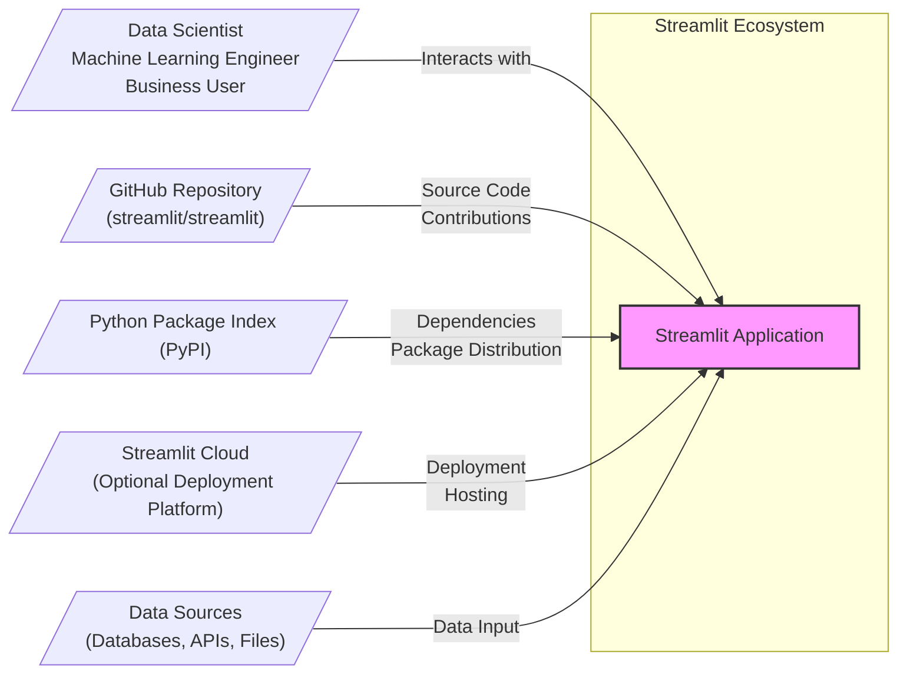
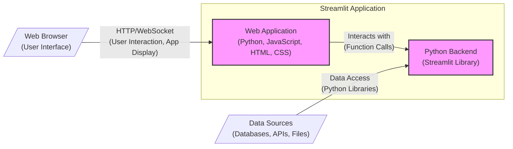
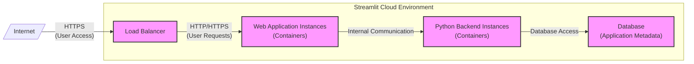

# BUSINESS POSTURE

- Business Priorities and Goals:
  - Democratize machine learning and data science by making it easier to build and share interactive web applications.
  - Empower data scientists and machine learning engineers to quickly prototype and deploy their models and analyses as web apps without extensive web development expertise.
  - Foster a community around Streamlit, encouraging contributions and growth of the ecosystem.
  - Provide a user-friendly and efficient platform for data exploration, visualization, and presentation.
- Business Risks:
  - Security vulnerabilities in Streamlit could lead to data breaches or unauthorized access to applications built with Streamlit.
  - Lack of trust in the platform due to security concerns could hinder adoption, especially in enterprise environments.
  - Open-source nature means reliance on community contributions for security updates and vulnerability patching, which might have delays.
  - Potential misuse of Streamlit for malicious purposes if security is not adequately addressed.
  - Dependency on underlying Python ecosystem and its security posture.

# SECURITY POSTURE

- Existing Security Controls:
  - security control: Regular dependency updates to address known vulnerabilities in Python packages. (Implemented in: Project's development practices and dependency management.)
  - security control: Code reviews for contributions to the open-source project. (Implemented in: GitHub pull request review process.)
  - security control: Input sanitization and output encoding to prevent common web vulnerabilities like XSS. (Implemented in: Streamlit framework codebase.)
  - security control: HTTPS enabled for Streamlit Cloud deployments. (Implemented in: Streamlit Cloud infrastructure.)
  - accepted risk: Reliance on user-provided Python code, which could introduce vulnerabilities if not written securely.
  - accepted risk: Open-source nature implies public disclosure of vulnerabilities, potentially increasing exploitation window.
  - accepted risk: Security of applications built with Streamlit is ultimately the responsibility of the application developer.

- Recommended Security Controls:
  - security control: Implement automated security scanning (SAST/DAST) in the CI/CD pipeline for Streamlit framework development.
  - security control: Conduct regular penetration testing and security audits of the Streamlit framework and Streamlit Cloud.
  - security control: Provide security best practices and guidelines for developers building Streamlit applications.
  - security control: Implement rate limiting and abuse prevention mechanisms in Streamlit Cloud to protect against denial-of-service attacks.
  - security control: Enhance input validation and sanitization within the Streamlit framework to further mitigate injection vulnerabilities.

- Security Requirements:
  - Authentication:
    - Requirement: For Streamlit Cloud, implement robust authentication mechanisms to control access to deployed applications and user accounts.
    - Requirement: For self-hosted Streamlit applications, provide guidance and mechanisms for developers to integrate their own authentication solutions.
  - Authorization:
    - Requirement: Implement authorization controls within Streamlit Cloud to manage user permissions and access to applications and resources.
    - Requirement: For self-hosted applications, provide guidance on implementing authorization logic within Streamlit applications based on user roles or permissions.
  - Input Validation:
    - Requirement: Streamlit framework must enforce input validation to prevent injection attacks (e.g., SQL injection, command injection, XSS) in user-provided code and Streamlit framework itself.
    - Requirement: Provide clear documentation and examples for developers on how to properly validate user inputs within their Streamlit applications.
  - Cryptography:
    - Requirement: Use cryptography appropriately to protect sensitive data in transit and at rest within Streamlit Cloud infrastructure.
    - Requirement: Provide guidance to developers on how to use cryptography securely within their Streamlit applications when handling sensitive data.
    - Requirement: Ensure secure storage of secrets and API keys used by Streamlit Cloud and Streamlit applications.

# DESIGN

## C4 CONTEXT

- Context Diagram Elements:
  - Element:
    - Name: Streamlit Application
    - Type: Software System
    - Description: The Streamlit application being designed and developed. It allows users to create interactive web applications from Python scripts.
    - Responsibilities:
      - Run user-provided Python scripts to generate web applications.
      - Handle user interactions and display results in a web browser.
      - Connect to various data sources to retrieve and process data.
    - Security controls:
      - Input validation of user inputs within the application code.
      - Output encoding to prevent XSS vulnerabilities.
      - Potentially authentication and authorization if implemented by the application developer.
  - Element:
    - Name: User
    - Type: Person
    - Description: Data scientists, machine learning engineers, and business users who interact with Streamlit applications.
    - Responsibilities:
      - Develop and run Streamlit applications.
      - Interact with deployed Streamlit applications to explore data and insights.
    - Security controls:
      - Responsible for writing secure Python code for their Streamlit applications.
      - For Streamlit Cloud, user account management and authentication.
  - Element:
    - Name: GitHub Repository (streamlit/streamlit)
    - Type: Software System
    - Description: The public GitHub repository hosting the Streamlit framework source code.
    - Responsibilities:
      - Source code management and version control.
      - Issue tracking and bug reporting.
      - Accepting community contributions through pull requests.
    - Security controls:
      - Code review process for pull requests.
      - Publicly accessible, allowing for community security review.
  - Element:
    - Name: Python Package Index (PyPI)
    - Type: Software System
    - Description: The repository for Python packages, used to distribute the Streamlit library and its dependencies.
    - Responsibilities:
      - Hosting and distributing Python packages.
      - Ensuring package integrity and availability.
    - Security controls:
      - Package signing and verification mechanisms.
      - Vulnerability scanning of packages.
  - Element:
    - Name: Streamlit Cloud
    - Type: Software System (Optional)
    - Description: Streamlit's cloud hosting platform for deploying and sharing Streamlit applications.
    - Responsibilities:
      - Hosting and running Streamlit applications in the cloud.
      - Providing user account management and application deployment features.
      - Managing infrastructure and ensuring application availability.
    - Security controls:
      - Authentication and authorization for user accounts and application access.
      - HTTPS for secure communication.
      - Infrastructure security controls (firewalls, intrusion detection, etc.).
  - Element:
    - Name: Data Sources
    - Type: External System
    - Description: External systems such as databases, APIs, and files that Streamlit applications connect to for data.
    - Responsibilities:
      - Providing data to Streamlit applications.
      - Ensuring data availability and integrity.
    - Security controls:
      - Data source specific security controls (authentication, authorization, encryption).
      - Network security controls to protect data in transit.

## C4 CONTAINER

- Container Diagram Elements:
  - Element:
    - Name: Web Application
    - Type: Container
    - Description: The front-end web application component of Streamlit, responsible for rendering the user interface in the browser. It's built using standard web technologies (HTML, CSS, JavaScript) and dynamically generated by the Python backend.
    - Responsibilities:
      - Rendering the user interface based on instructions from the Python backend.
      - Handling user interactions in the browser and sending them to the Python backend.
      - Managing the application state in the browser.
    - Security controls:
      - Output encoding to prevent XSS vulnerabilities.
      - Secure handling of user input received from the browser.
      - Content Security Policy (CSP) to mitigate XSS risks.
  - Element:
    - Name: Python Backend
    - Type: Container
    - Description: The core Python component of Streamlit, which interprets user scripts, manages application state, and communicates with the web application container. It uses the Streamlit library.
    - Responsibilities:
      - Executing user-provided Python scripts.
      - Managing application state and data.
      - Generating UI instructions for the web application container.
      - Interacting with data sources.
    - Security controls:
      - Input validation of user-provided Python code and data inputs.
      - Secure handling of data retrieved from data sources.
      - Protection against code injection vulnerabilities.
  - Element:
    - Name: Web Browser
    - Type: External Container
    - Description: The user's web browser, which displays the Streamlit application and allows user interaction.
    - Responsibilities:
      - Rendering the web application UI.
      - Handling user input and sending it to the web application container.
    - Security controls:
      - Browser security features (e.g., same-origin policy, XSS protection).
      - User responsibility for browser security and extensions.
  - Element:
    - Name: Data Sources
    - Type: External Container
    - Description: External data sources that the Python backend interacts with to retrieve data for the Streamlit application.
    - Responsibilities:
      - Providing data to the Python backend.
      - Enforcing data source specific security controls.
    - Security controls:
      - Data source specific security controls (authentication, authorization, encryption).
      - Network security controls for data access.

## DEPLOYMENT

Deployment Solution: Streamlit Cloud (Managed Deployment)

- Deployment Diagram Elements:
  - Element:
    - Name: Load Balancer
    - Type: Infrastructure Component
    - Description: Distributes incoming user traffic across multiple web application instances for scalability and availability in Streamlit Cloud.
    - Responsibilities:
      - Load balancing user requests.
      - SSL termination for HTTPS.
      - Routing traffic to healthy web application instances.
    - Security controls:
      - DDoS protection.
      - Web Application Firewall (WAF) capabilities.
      - SSL/TLS encryption.
  - Element:
    - Name: Web Application Instances
    - Type: Container Instance
    - Description: Multiple instances of the web application container running in Streamlit Cloud to handle user requests.
    - Responsibilities:
      - Serving the front-end web application.
      - Communicating with Python backend instances.
    - Security controls:
      - Container security hardening.
      - Regular security patching.
      - Network segmentation.
  - Element:
    - Name: Python Backend Instances
    - Type: Container Instance
    - Description: Multiple instances of the Python backend container running in Streamlit Cloud to execute user scripts and manage application logic.
    - Responsibilities:
      - Executing user Python code.
      - Managing application state.
      - Interacting with the database.
    - Security controls:
      - Container security hardening.
      - Regular security patching.
      - Network segmentation.
  - Element:
    - Name: Database
    - Type: Data Store
    - Description: A database used by Streamlit Cloud to store application metadata, user accounts, and other persistent data.
    - Responsibilities:
      - Storing application data.
      - Ensuring data persistence and availability.
    - Security controls:
      - Database access controls and authentication.
      - Encryption at rest and in transit.
      - Regular backups.
  - Element:
    - Name: Internet
    - Type: Network
    - Description: The public internet through which users access Streamlit Cloud applications.
    - Responsibilities:
      - Providing network connectivity for users.
    - Security controls:
      - No direct security controls from Streamlit Cloud perspective, relies on general internet security.

## BUILD

```mermaid
flowchart LR
    Developer[/"Developer\n(Code Changes)"/] -- "Code Commit\nPull Request" --> GitHubRepo[/"GitHub Repository\n(streamlit/streamlit)"/]
    GitHubRepo -- "Webhook Trigger" --> CI[/"CI System\n(GitHub Actions)"/]
    CI -- "Build Process\n(Linting, Testing, SAST, Build)" --> BuildArtifacts[/"Build Artifacts\n(Python Package, Distribution)"/]
    BuildArtifacts -- "Publish" --> PyPI[/"Python Package Index (PyPI)"/]

    style GitHubRepo fill:#f9f,stroke:#333,stroke-width:2px
    style CI fill:#f9f,stroke:#333,stroke-width:2px
    style BuildArtifacts fill:#f9f,stroke:#333,stroke-width:2px
    style PyPI fill:#f9f,stroke:#333,stroke-width:2px
```

- Build Diagram Elements:
  - Element:
    - Name: Developer
    - Type: Person
    - Description: Software developers contributing to the Streamlit project.
    - Responsibilities:
      - Writing and committing code changes.
      - Creating pull requests for code contributions.
    - Security controls:
      - Secure coding practices.
      - Code review participation.
      - Local development environment security.
  - Element:
    - Name: GitHub Repository (streamlit/streamlit)
    - Type: Code Repository
    - Description: The central repository for Streamlit source code, used for version control and collaboration.
    - Responsibilities:
      - Storing and managing source code.
      - Triggering CI/CD pipelines on code changes.
      - Managing pull requests and code reviews.
    - Security controls:
      - Access control to the repository.
      - Branch protection policies.
      - Audit logging of repository activities.
  - Element:
    - Name: CI System (GitHub Actions)
    - Type: Automation System
    - Description: Continuous Integration system (likely GitHub Actions) that automates the build, test, and security checks for Streamlit.
    - Responsibilities:
      - Automating the build process.
      - Running linters and static analysis security testing (SAST).
      - Executing unit and integration tests.
      - Building and packaging artifacts.
    - Security controls:
      - Secure configuration of CI pipelines.
      - Secrets management for CI credentials.
      - SAST tools to identify vulnerabilities.
  - Element:
    - Name: Build Artifacts
    - Type: Software Artifact
    - Description: The output of the build process, typically a Python package and distribution files.
    - Responsibilities:
      - Packaging the Streamlit library for distribution.
      - Storing build artifacts temporarily before publishing.
    - Security controls:
      - Integrity checks of build artifacts.
      - Secure storage of artifacts before publishing.
  - Element:
    - Name: Python Package Index (PyPI)
    - Type: Package Registry
    - Description: The public repository where the Streamlit Python package is published for users to download and install.
    - Responsibilities:
      - Hosting and distributing the Streamlit package.
      - Making the package available to users.
    - Security controls:
      - Package signing and verification.
      - Vulnerability scanning of published packages.

# RISK ASSESSMENT

- Critical Business Processes:
  - Development and distribution of the Streamlit library.
  - Operation of Streamlit Cloud service (if applicable).
  - Maintaining community trust and adoption of Streamlit.
- Data to Protect and Sensitivity:
  - Streamlit Framework Source Code: High sensitivity, compromise could lead to widespread vulnerabilities.
  - Streamlit Cloud User Data (if applicable): Medium to High sensitivity, depending on data stored (user accounts, application configurations).
  - Application Data processed by Streamlit applications: Sensitivity varies greatly depending on the application, could be highly sensitive (e.g., financial data, personal information). Streamlit itself does not directly handle this data, but applications built with it do.
  - Build and Release Pipeline Secrets: High sensitivity, compromise could lead to malicious code injection.

# QUESTIONS & ASSUMPTIONS

- BUSINESS POSTURE Questions:
  - What is the acceptable level of risk for security vulnerabilities in Streamlit, considering its open-source nature and target audience?
  - What are the specific business SLAs for Streamlit Cloud (if applicable) regarding availability and security incidents?

- BUSINESS POSTURE Assumptions:
  - The primary business goal is to increase adoption and usage of Streamlit by data scientists and ML engineers.
  - Security is important for building trust and ensuring long-term sustainability of the project.

- SECURITY POSTURE Questions:
  - What security tools (SAST/DAST) are currently used in the Streamlit development process?
  - Are there regular penetration tests or security audits conducted for Streamlit and Streamlit Cloud?
  - What is the incident response plan for security vulnerabilities discovered in Streamlit?

- SECURITY POSTURE Assumptions:
  - Security is considered important but might not be the top priority compared to feature development in an open-source project.
  - Streamlit Cloud (if applicable) has a higher security bar compared to the open-source framework itself.

- DESIGN Questions:
  - What are the specific technologies used for Streamlit Cloud infrastructure (e.g., cloud provider, database type)?
  - What are the scaling and performance requirements for Streamlit Cloud?
  - Are there specific security certifications or compliance requirements for Streamlit Cloud (e.g., SOC 2, GDPR)?

- DESIGN Assumptions:
  - Streamlit Cloud (if applicable) is deployed on a major cloud provider (AWS, GCP, Azure).
  - Streamlit Cloud uses standard web application architecture patterns (load balancer, web servers, database).
  - The build process is automated using CI/CD pipelines.