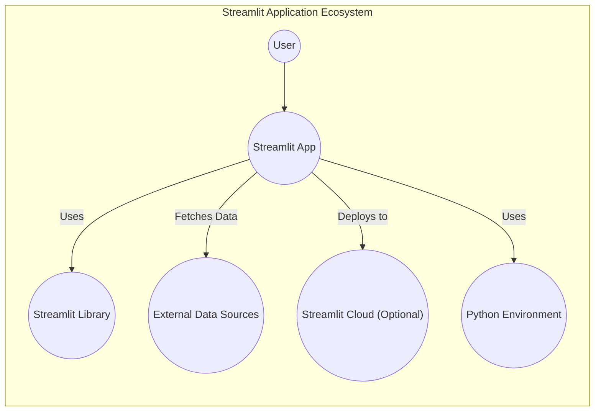
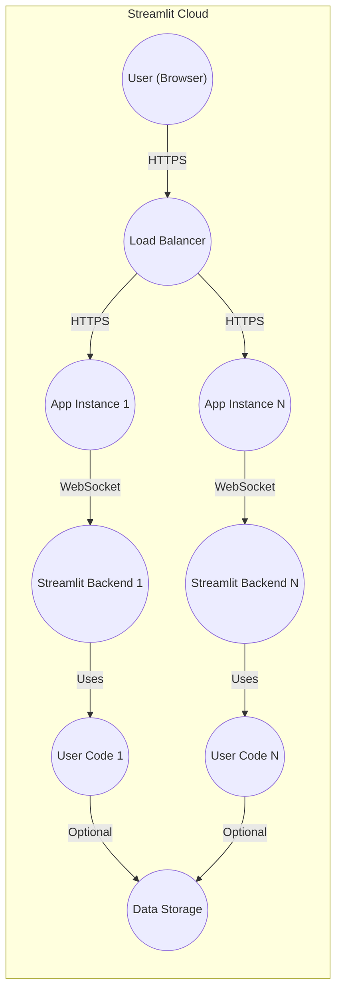

Okay, let's create a design document for the Streamlit project, focusing on aspects relevant for threat modeling.

# BUSINESS POSTURE

Streamlit is an open-source Python library that simplifies the creation of web applications for data science and machine learning.  It allows users to quickly turn data scripts into shareable web apps without requiring front-end development experience.  The business priorities likely revolve around:

*   Rapid Prototyping: Enabling data scientists and ML engineers to quickly visualize and interact with their data and models.
*   Ease of Use: Minimizing the barrier to entry for creating web apps, eliminating the need for HTML, CSS, or JavaScript knowledge.
*   Collaboration and Sharing: Facilitating the sharing of data insights and models with others, potentially including non-technical stakeholders.
*   Community Growth: Expanding the user base and fostering a vibrant open-source community.
*   Extensibility: Allowing users to extend Streamlit's functionality with custom components and integrations.
*   Monetization (Streamlit Cloud): Offering a commercial cloud platform for deploying and managing Streamlit apps, which introduces revenue generation as a key priority.

Based on these priorities, the most important business risks are:

*   Data Breaches (especially in Streamlit Cloud): Unauthorized access to sensitive data hosted within Streamlit applications, particularly on the commercial cloud platform.
*   Application Vulnerabilities: Exploitable weaknesses in Streamlit applications that could lead to data leakage, denial of service, or other malicious actions.
*   Supply Chain Attacks: Compromise of the Streamlit library itself or its dependencies, leading to widespread vulnerabilities in deployed applications.
*   Reputational Damage: Security incidents that erode trust in the Streamlit platform and community.
*   Intellectual Property Theft: Unauthorized access to proprietary models or algorithms deployed through Streamlit.
*   Compliance Violations: Failure to meet data privacy regulations (e.g., GDPR, CCPA) when handling user data within Streamlit applications.

# SECURITY POSTURE

Streamlit's security posture is a combination of built-in features, recommended practices, and the security measures implemented by users when developing and deploying their applications.

Existing Security Controls:

*   security control: Input Sanitization (Limited): Streamlit provides some built-in input sanitization to prevent basic XSS attacks. This is evident in how Streamlit handles user inputs and renders them in the browser. (Described in Streamlit documentation and source code).
*   security control: Component Sandboxing: Streamlit components run in a sandboxed iframe, limiting their access to the main application context. (Described in Streamlit documentation and source code).
*   security control: TLS Encryption (Streamlit Cloud): Streamlit Cloud uses TLS to encrypt data in transit between the user's browser and the cloud platform. (Described in Streamlit Cloud documentation).
*   security control: Authentication (Streamlit Cloud): Streamlit Cloud offers authentication mechanisms to control access to deployed applications. (Described in Streamlit Cloud documentation).
*   security control: Dependency Management: Streamlit uses package managers like pip and requirements.txt to manage dependencies, allowing for vulnerability scanning. (Described in Streamlit documentation and source code).

Accepted Risks:

*   accepted risk: User-Implemented Application Logic: Streamlit itself cannot guarantee the security of the application logic implemented by users. Users are responsible for writing secure code and following security best practices.
*   accepted risk: Third-Party Component Security: The security of custom components created by the community is not directly controlled by Streamlit.
*   accepted risk: Limited Built-in Security Features: Streamlit prioritizes ease of use, which means it may not have the same level of built-in security features as more complex web frameworks.

Recommended Security Controls (High Priority):

*   Implement robust input validation and sanitization in all user-facing components.
*   Enforce strong authentication and authorization mechanisms, especially for applications handling sensitive data.
*   Regularly update Streamlit and all dependencies to patch known vulnerabilities.
*   Conduct security audits and penetration testing of deployed applications.
*   Implement Content Security Policy (CSP) to mitigate XSS and other code injection attacks.
*   Use a Web Application Firewall (WAF) to protect against common web attacks.

Security Requirements:

*   Authentication:
    *   For applications handling sensitive data, strong authentication is required. This could include multi-factor authentication (MFA).
    *   Streamlit Cloud should provide robust authentication options, including integration with identity providers (IdPs).
    *   Session management should be secure, with appropriate timeouts and protection against session hijacking.

*   Authorization:
    *   Access control should be implemented to restrict access to data and functionality based on user roles and permissions.
    *   The principle of least privilege should be followed, granting users only the necessary access.

*   Input Validation:
    *   All user inputs should be validated and sanitized to prevent injection attacks (XSS, SQL injection, etc.).
    *   Data types and formats should be strictly enforced.
    *   Input length limits should be implemented to prevent buffer overflows.

*   Cryptography:
    *   Sensitive data should be encrypted both in transit (using TLS) and at rest.
    *   Strong cryptographic algorithms and key management practices should be used.
    *   Secrets (API keys, passwords, etc.) should be securely stored and managed, never hardcoded in the application.

*   Output Encoding
    *   All data rendered in the browser should be properly encoded to prevent cross-site scripting vulnerabilities.

# DESIGN

## C4 CONTEXT



Element Descriptions:

*   Element:
    *   Name: User
    *   Type: Person
    *   Description: A person interacting with the Streamlit application through a web browser.
    *   Responsibilities: Viewing data, interacting with widgets, triggering actions within the application.
    *   Security controls: Browser security settings, network security.

*   Element:
    *   Name: Streamlit App
    *   Type: Software System
    *   Description: The web application created using the Streamlit library.
    *   Responsibilities: Processing data, rendering UI components, handling user interactions.
    *   Security controls: Input validation, output encoding, authentication (if implemented), authorization (if implemented).

*   Element:
    *   Name: Streamlit Library
    *   Type: Library
    *   Description: The open-source Python library that provides the core functionality for building Streamlit apps.
    *   Responsibilities: Providing APIs for creating UI elements, managing application state, handling communication between the frontend and backend.
    *   Security controls: Built-in input sanitization, component sandboxing.

*   Element:
    *   Name: External Data Sources
    *   Type: External System
    *   Description: Any external data sources that the Streamlit app interacts with, such as databases, APIs, or files.
    *   Responsibilities: Providing data to the Streamlit application.
    *   Security controls: Authentication, authorization, data encryption (depending on the specific data source).

*   Element:
    *   Name: Streamlit Cloud (Optional)
    *   Type: External System
    *   Description: The commercial cloud platform for deploying and managing Streamlit apps.
    *   Responsibilities: Hosting Streamlit applications, providing scalability, managing infrastructure.
    *   Security controls: TLS encryption, authentication, network security, platform-level security measures.

*   Element:
    *   Name: Python Environment
    *   Type: Environment
    *   Description: The Python environment where the Streamlit app and its dependencies are installed.
    *   Responsibilities: Providing the runtime environment for the Streamlit application.
    *   Security controls: Dependency management, vulnerability scanning.

## C4 CONTAINER

```mermaid
graph LR
    subgraph Streamlit Application
        User(("User (Browser)")) -- "HTTPS" --> WebServer((Web Server))
        WebServer -- "WebSocket" --> Backend((Streamlit Backend))
        Backend -- "Uses" --> UserCode((User Code))
        Backend -- "Reads/Writes" --> DataStorage((Data Storage (Optional)))
        UserCode -- "Uses" --> ThirdPartyLibs((Third-Party Libraries))
    end
```

Element Descriptions:

*   Element:
    *   Name: User (Browser)
    *   Type: Person
    *   Description: The user's web browser, where the Streamlit application's frontend runs.
    *   Responsibilities: Rendering the UI, handling user interactions, communicating with the backend.
    *   Security controls: Browser security settings, network security.

*   Element:
    *   Name: Web Server
    *   Type: Web Server
    *   Description: The web server that serves the Streamlit application to the user's browser.  This could be the built-in Tornado server or a separate web server (e.g., Nginx, Apache) when deployed.
    *   Responsibilities: Handling HTTP requests, serving static assets, proxying requests to the Streamlit backend.
    *   Security controls: TLS encryption, request filtering, rate limiting.

*   Element:
    *   Name: Streamlit Backend
    *   Type: Application Server
    *   Description: The Python process that runs the Streamlit application logic.
    *   Responsibilities: Executing user code, managing application state, communicating with the frontend via WebSockets.
    *   Security controls: Input validation, output encoding, authentication (if implemented), authorization (if implemented).

*   Element:
    *   Name: User Code
    *   Type: Code
    *   Description: The Python code written by the user to define the Streamlit application's functionality.
    *   Responsibilities: Processing data, defining UI components, handling user interactions.
    *   Security controls: User-implemented security measures, adherence to secure coding practices.

*   Element:
    *   Name: Data Storage (Optional)
    *   Type: Data Store
    *   Description: Any data storage used by the Streamlit application, such as a database, file system, or cloud storage.
    *   Responsibilities: Storing and retrieving data.
    *   Security controls: Data encryption, access control, backups.

*   Element:
    *   Name: Third-Party Libraries
    *   Type: Libraries
    *   Description: Any third-party Python libraries used by the Streamlit application.
    *   Responsibilities: Providing additional functionality to the application.
    *   Security controls: Dependency management, vulnerability scanning.

## DEPLOYMENT

Streamlit applications can be deployed in several ways:

1.  Local Development: Running the app directly on the developer's machine.
2.  Self-Hosted Server: Deploying the app to a server managed by the user (e.g., a virtual machine, a containerized environment).
3.  Streamlit Cloud: Deploying the app to the Streamlit Cloud platform.
4.  Other Cloud Platforms: Deploying the app to other cloud platforms (e.g., AWS, GCP, Azure) using containerization (Docker) and orchestration (Kubernetes).

We'll describe the Streamlit Cloud deployment in detail:



Element Descriptions:

*   Element:
    *   Name: User (Browser)
    *   Type: Person
    *   Description: The user's web browser.
    *   Responsibilities: Accessing the deployed Streamlit application.
    *   Security controls: Browser security settings, network security.

*   Element:
    *   Name: Load Balancer
    *   Type: Load Balancer
    *   Description: Distributes incoming traffic across multiple application instances.
    *   Responsibilities: Ensuring high availability and scalability.
    *   Security controls: TLS termination, DDoS protection.

*   Element:
    *   Name: App Instance 1 / App Instance N
    *   Type: Container
    *   Description: Instances of the Streamlit application running in isolated containers.
    *   Responsibilities: Serving the Streamlit application.
    *   Security controls: Container isolation, resource limits.

*   Element:
    *   Name: Streamlit Backend 1 / Streamlit Backend N
    *   Type: Application Server
    *   Description: The Python process running the Streamlit application logic within each instance.
    *   Responsibilities: Executing user code, managing application state.
    *   Security controls: Input validation, output encoding, authentication (if implemented), authorization (if implemented).

*   Element:
    *   Name: User Code 1 / User Code N
    *   Type: Code
    *   Description: The user's application code running within each instance.
    *   Responsibilities: Defining the application's functionality.
    *   Security controls: User-implemented security measures.

*   Element:
    *   Name: Data Storage
    *   Type: Data Store
    *   Description: Any external data storage used by the application (optional).
    *   Responsibilities: Storing and retrieving data.
    *   Security controls: Data encryption, access control, backups.

## BUILD

The build process for a Streamlit application typically involves:

1.  Development: The developer writes the Python code for the application.
2.  Dependency Management: Dependencies are managed using `pip` and a `requirements.txt` file.
3.  Testing: (Optional) Unit tests and integration tests are written and executed.
4.  Packaging: (Optional) The application can be packaged into a Docker container for deployment.
5.  Deployment: The application is deployed to the target environment (local, self-hosted, or cloud).

For a Streamlit Cloud deployment, the build process is largely handled by the platform.  However, users can still leverage CI/CD pipelines for their own testing and quality assurance.

```mermaid
graph LR
    Developer(("Developer")) -- "Writes Code" --> CodeRepo((Code Repository (e.g., GitHub)))
    CodeRepo -- "Trigger" --> CI_CD(("CI/CD Pipeline (e.g., GitHub Actions)"))
    CI_CD -- "Run Tests" --> Tests((Tests))
    CI_CD -- "Build Container" --> DockerBuild((Docker Build))
    DockerBuild -- "Push Image" --> ContainerRegistry((Container Registry))
    ContainerRegistry -- "Deploy" --> StreamlitCloud((Streamlit Cloud))
```

Security Controls in the Build Process:

*   security control: Dependency Scanning: Tools like `pip-audit` or Snyk can be used to scan dependencies for known vulnerabilities during the CI/CD process.
*   security control: Static Code Analysis: Linters (e.g., Pylint, Flake8) and static analysis tools (e.g., Bandit) can be used to identify potential security issues in the code.
*   security control: Secret Scanning: Tools like git-secrets or truffleHog can be used to prevent secrets from being committed to the code repository.
*   security control: Container Image Scanning: If using Docker, container images should be scanned for vulnerabilities before deployment.

# RISK ASSESSMENT

*   Critical Business Processes:
    *   Rapid prototyping and sharing of data insights and models.
    *   (Streamlit Cloud) Hosting and managing Streamlit applications for users.

*   Data We Are Trying to Protect:
    *   User-provided data within Streamlit applications: This can range from publicly available data to highly sensitive personal or proprietary information. Sensitivity varies greatly depending on the application.
    *   (Streamlit Cloud) User account information and application metadata.
    *   (Streamlit Cloud) Potentially, data stored within the Streamlit Cloud platform if users choose to connect to external data sources through the platform.
    *   Source code of Streamlit applications.
    *   Configuration files.
    *   Authentication tokens.

Data Sensitivity:

*   User-provided data: Varies from low (public data) to high (sensitive personal or proprietary information).
*   Streamlit Cloud user data: Medium (account information) to high (application data).
*   Source code: Medium to high, depending on the presence of proprietary algorithms or sensitive information.

# QUESTIONS & ASSUMPTIONS

Questions:

*   What specific data privacy regulations (e.g., GDPR, CCPA) are applicable to Streamlit applications and Streamlit Cloud?
*   What level of security auditing and penetration testing is conducted on the Streamlit library and Streamlit Cloud platform?
*   What are the specific security responsibilities of Streamlit users versus Streamlit (the company) in the shared responsibility model?
*   What mechanisms are in place to detect and respond to security incidents in Streamlit Cloud?
*   Are there any plans to add more built-in security features to the Streamlit library, such as more robust input validation or support for CSP?
*   What kind of data loss prevention (DLP) mechanisms are in place, or are planned, for Streamlit Cloud?

Assumptions:

*   BUSINESS POSTURE: Streamlit prioritizes ease of use and rapid development, which may influence security decisions.
*   SECURITY POSTURE: Users are responsible for the security of their application logic and data. Streamlit provides some basic security features, but it is not a comprehensive security solution.
*   DESIGN: The Streamlit architecture is relatively simple, with a clear separation between the frontend and backend. The primary communication channel is WebSockets.
*   DESIGN: Streamlit Cloud provides a managed environment for deploying Streamlit applications, with additional security features compared to self-hosting.
*   DESIGN: Users will follow security best practices when developing and deploying their Streamlit applications.
*   DESIGN: Streamlit Cloud has implemented appropriate security controls to protect user data and applications.