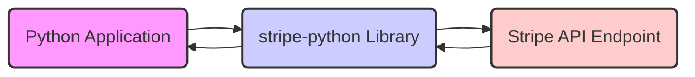
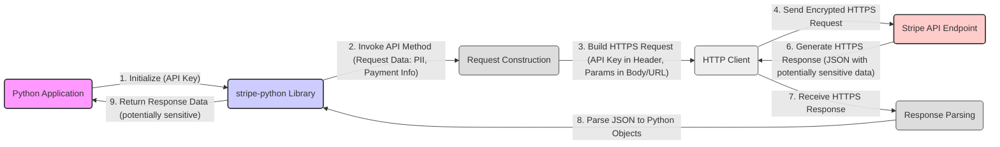

# Project Design Document: stripe-python Library

**Version:** 1.1
**Date:** October 26, 2023
**Author:** AI Software Architect

## 1. Introduction

This document provides a detailed design overview of the `stripe-python` library, the official Python client for the Stripe API. This document is specifically tailored to serve as a foundation for subsequent threat modeling activities. It outlines the library's architecture, key components, data flow with a focus on sensitive information, and security considerations with potential threats and mitigations.

## 2. Goals and Objectives

The primary goals of the `stripe-python` library are to:

* **Simplify Interaction with the Stripe API:** Offer a developer-friendly and Pythonic interface for making requests to the Stripe API.
* **Abstract HTTP Complexity:** Handle the underlying complexities of HTTP requests, including authentication, headers, and error management, allowing developers to concentrate on application logic.
* **Facilitate Data Handling:**  Automatically manage the serialization of Python objects into JSON for API requests and the deserialization of JSON responses back into Python objects.
* **Enhance Developer Experience:** Provide comprehensive type hints and clear documentation to improve code readability, reduce errors, and facilitate integration.
* **Maintain API Alignment:** Ensure ongoing compatibility with the latest Stripe API versions and features, providing access to new functionalities.
* **Enable Secure Communication:**  Enforce and facilitate secure communication with the Stripe API exclusively over HTTPS.

## 3. System Architecture

The `stripe-python` library operates as a client-side Software Development Kit (SDK) that wraps the Stripe REST API. It does not involve any persistent data storage or server-side components managed by the library itself.

**Components:**

* **"Python Application"**: The user's Python codebase that integrates and utilizes the `stripe-python` library to interact with Stripe services. This is where the library is instantiated and its methods are called.
* **"stripe-python Library"**: The core SDK, encompassing various modules and functionalities. Key aspects include:
    * **API Client:**  Handles the low-level details of making HTTP requests to Stripe's API endpoints.
    * **Resource Modules:**  Organized modules within the `stripe` package (e.g., `stripe.customers`, `stripe.charges`, `stripe.payment_intents`) that provide classes and methods corresponding to specific Stripe API resources. These modules encapsulate the logic for interacting with those resources.
        * **Request Object Construction:**  Responsible for building the appropriate HTTP request structure (method, headers, parameters, body) based on the method called.
        * **Response Handling and Parsing:**  Processes the raw HTTP response from the Stripe API, including status codes and JSON body, converting the JSON into Python objects.
        * **Error Handling and Exception Management:**  Implements logic to catch and raise specific exceptions for different types of API errors returned by Stripe.
    * **Configuration Management:**  Handles the configuration of the library, primarily the setting of the Stripe API key.
* **"Stripe API Endpoint"**: The remote server infrastructure maintained by Stripe that receives, processes, and responds to API requests initiated by the `stripe-python` library.

## 4. Data Flow

The interaction between the Python application and the Stripe API via the `stripe-python` library involves the following data flow steps, with a focus on the types of data being transmitted:

1. **Initialization and Configuration:** The Python application initializes the `stripe` library, typically by providing the Stripe API key.
    * Data involved: Stripe API key (a highly sensitive secret).
2. **API Request Invocation:** The Python application calls a specific method within the `stripe` library's resource modules, corresponding to a desired Stripe API operation (e.g., creating a customer, initiating a payment). This involves passing parameters relevant to the operation.
    * Data involved: API endpoint URL (implicitly determined by the method called), request parameters (which can include Personally Identifiable Information (PII) like customer names, email addresses, payment details, and transaction amounts).
3. **Request Construction by the Library:** The `stripe-python` library constructs a well-formed HTTP request (typically a POST, GET, PUT, or DELETE request) targeted at the appropriate Stripe API endpoint.
    * Data involved:
        * Authentication credentials: The Stripe API key is included in the request headers (typically the `Authorization` header).
        * Request parameters: The data provided by the application is serialized (usually into JSON) and included in the request body or as URL parameters.
        * API version:  The library specifies the Stripe API version being used.
4. **Secure HTTP Transmission:** The constructed HTTP request is transmitted over the network to the Stripe API endpoint. This communication is **always** over HTTPS, ensuring encryption of the data in transit.
    * Data involved: Encrypted request data, including the API key and request parameters.
5. **API Processing by Stripe:** The Stripe API receives the request, authenticates it using the provided API key, and processes the requested operation.
6. **Response Generation by Stripe:** The Stripe API generates an HTTP response containing the outcome of the operation. This response is typically in JSON format and includes a status code indicating success or failure, along with relevant data.
    * Data involved: Response data, which can include sensitive information such as customer details, transaction status, payment information, and error messages.
7. **Response Reception by the Library:** The `stripe-python` library receives the HTTP response from the Stripe API.
8. **Response Parsing and Object Creation:** The library parses the JSON response body and converts it into corresponding Python objects, making the data accessible to the application in a structured format.
    * Data involved: Raw JSON response data.
9. **Return to the Application:** The Python objects representing the API response are returned to the calling Python application.
    * Data involved: Processed response data, potentially containing sensitive information.

## 5. Security Considerations

Security is a critical aspect of interacting with the Stripe API. The following points outline key security considerations related to the `stripe-python` library and its usage, including potential threats and mitigation strategies:

* **API Key Management:**
    * **Threat:** Exposure of the Stripe API key can lead to unauthorized access to the Stripe account, potentially resulting in data breaches, fraudulent transactions, and account compromise.
    * **Mitigation:**
        * **Secure Storage:**  Never hardcode API keys directly in the application code. Utilize secure storage mechanisms such as environment variables, secrets management systems (e.g., HashiCorp Vault, AWS Secrets Manager), or configuration files with restricted access.
        * **Principle of Least Privilege:** Use restricted API keys with specific permissions tailored to the application's needs, limiting the potential impact of a compromise.
        * **Regular Rotation:** Periodically rotate API keys as a security best practice.
        * **Avoid Committing to Version Control:** Ensure API keys are excluded from version control systems.
* **HTTPS Communication:**
    * **Threat:** Man-in-the-middle (MITM) attacks could intercept communication between the application and the Stripe API, potentially exposing sensitive data if HTTPS is not enforced.
    * **Mitigation:**
        * **Enforced HTTPS:** The `stripe-python` library inherently enforces communication over HTTPS. Ensure the underlying HTTP client library (`requests`) is configured correctly and does not allow insecure connections.
        * **Certificate Validation:** The library relies on the underlying HTTP client to perform proper SSL certificate validation, ensuring communication is with the legitimate Stripe API server.
* **Input Validation:**
    * **Threat:**  Malicious or improperly formatted input data sent to the Stripe API can lead to unexpected behavior, errors, or potentially exploitable vulnerabilities on the Stripe side. While the library doesn't perform extensive validation, the application using it must.
    * **Mitigation:**
        * **Application-Level Validation:** Implement robust input validation within the Python application before sending data to the `stripe-python` library. Sanitize and validate all user-provided data and any data sourced from external systems.
        * **Type Checking:** Utilize type hints and runtime type checking to ensure data conforms to expected formats.
* **Dependency Management:**
    * **Threat:** Vulnerabilities in the `stripe-python` library's dependencies (e.g., `requests`) can be exploited to compromise the application.
    * **Mitigation:**
        * **Regular Updates:** Keep all dependencies, including the `stripe-python` library itself, updated to the latest stable versions to patch known security vulnerabilities.
        * **Vulnerability Scanning:** Utilize dependency scanning tools (e.g., Snyk, OWASP Dependency-Check) to identify and address potential vulnerabilities in project dependencies.
        * **Supply Chain Security:** Be mindful of the provenance and security of third-party libraries.
* **Error Handling:**
    * **Threat:**  Exposing detailed error messages from the Stripe API in the application's user interface or logs can reveal sensitive information or provide attackers with insights into the system's internal workings.
    * **Mitigation:**
        * **Generic Error Messages:** Implement generic error messages for end-users and log detailed error information securely on the server-side for debugging purposes.
        * **Secure Logging:** Ensure logs containing sensitive information are stored securely and access is restricted.
* **Rate Limiting:**
    * **Threat:**  Failure to handle Stripe's rate limits can lead to temporary blocking of API access, impacting application functionality. While not a direct security vulnerability, it can be used for denial-of-service attempts.
    * **Mitigation:**
        * **Implement Retry Logic:** Implement robust retry mechanisms with exponential backoff to handle rate limit errors gracefully.
        * **Monitor API Usage:** Monitor API usage to anticipate and avoid hitting rate limits.
* **Data Serialization:**
    * **Threat:**  Accidentally serializing and sending sensitive data that is not intended for the Stripe API could lead to data leaks.
    * **Mitigation:**
        * **Careful Data Handling:**  Be mindful of the data being passed to the `stripe-python` library methods. Only include necessary information.
        * **Data Masking/Redaction:** Consider masking or redacting sensitive data before sending it to the API if it's not strictly required.
* **Code Injection (Indirect):**
    * **Threat:** While the library itself is not directly vulnerable to code injection, vulnerabilities in the calling application that allow for the construction of malicious API requests (e.g., through unsanitized user input used to build API parameters) can indirectly lead to issues.
    * **Mitigation:**
        * **Secure Coding Practices:** Adhere to secure coding practices to prevent vulnerabilities in the application that could be exploited to manipulate API requests.

## 6. Dependencies

The `stripe-python` library relies on the following key Python packages:

* **`requests`:**  A fundamental library for making HTTP requests in Python. It handles the underlying communication with the Stripe API.
* **`typing-extensions`:**  Provides backports of type hints for older Python versions, enhancing code clarity and enabling static analysis.

Maintaining awareness of these dependencies and their security status is crucial.

## 7. Deployment

The `stripe-python` library is deployed as an integral part of a Python application. Deployment typically involves:

* **Installation:** Installing the library using `pip install stripe` within the application's environment.
* **Configuration:** Configuring the library with the necessary Stripe API key, usually done within the application's initialization or configuration phase.

The library itself does not have a separate deployment process. Its security posture is heavily influenced by how the application using it is deployed and configured.

## 8. Future Considerations

Potential future developments or changes that could impact the design and security landscape of the `stripe-python` library include:

* **Asynchronous API Support:**  Introducing support for asynchronous API calls using libraries like `asyncio` or `aiohttp`. This would necessitate changes in the request handling mechanisms and could introduce new concurrency-related security considerations.
* **Enhanced Type Hinting and Validation:**  Further improvements to type hints and potentially the introduction of runtime validation within the library itself to catch common data format errors.
* **Built-in Retry and Backoff Mechanisms:**  Implementing more sophisticated built-in mechanisms for handling rate limits and transient API errors, potentially reducing the burden on developers.
* **Integration with Security Tooling:**  Exploring tighter integration with security-focused libraries or frameworks for tasks like secure secret management or request signing.
* **Expanded Authentication Options:**  Potentially supporting alternative authentication methods beyond API keys in the future.

This document provides a detailed design overview of the `stripe-python` library, specifically tailored for threat modeling. By understanding the architecture, data flow with a focus on sensitive data, and the outlined security considerations, developers and security professionals can effectively identify and mitigate potential vulnerabilities associated with its use.