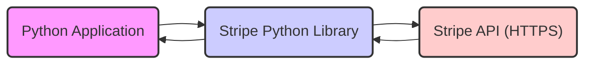
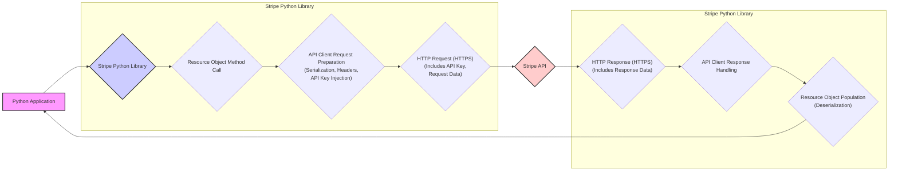

# Project Design Document: Stripe Python Library

**Project Name:** Stripe Python Library (`stripe-python`)

**Version:** 1.1 (Improved Design for Threat Modeling)

**Date:** October 26, 2023

**Author:** AI Software Architect

## 1. Introduction

This document provides an enhanced design overview of the `stripe-python` library, a client library facilitating interaction with the Stripe API. This document is specifically tailored to serve as a robust foundation for subsequent threat modeling exercises. It details the library's architecture, key components with a focus on potential attack vectors, data flow emphasizing sensitive data handling, and comprehensive security considerations.

## 2. Goals

*   To offer a Pythonic and intuitive interface for interacting with the Stripe API.
*   To abstract the complexities of direct HTTP communication with Stripe's services.
*   To manage authentication and authorization processes for accessing the Stripe API.
*   To seamlessly convert data between Python objects and the JSON format expected by the Stripe API.
*   To provide well-structured documentation and a user-friendly experience for developers.

## 3. Non-Goals

*   Implementation of business logic related to payment processing or financial management. This remains the responsibility of the application utilizing the library.
*   Provision of a graphical user interface (GUI) for Stripe API interaction.
*   Direct handling of server-side webhook events originating from Stripe. This is typically managed by a separate backend service.
*   Secure storage or management of Stripe API keys within the library itself. Secure key management is the responsibility of the library's user.

## 4. High-Level Architecture

The `stripe-python` library functions as a crucial intermediary between a Python application and the Stripe API. It encapsulates the necessary logic for constructing and dispatching HTTP requests to Stripe API endpoints, managing authentication credentials, and interpreting the received responses.

*   **Python Application:** The user's application code that leverages the `stripe-python` library to communicate with Stripe. This is the primary point of control and potential vulnerability if not secured properly.
*   **Stripe Python Library:** The focus of this design document. Its role is to simplify and secure interactions with the Stripe API. Potential vulnerabilities lie in its handling of API keys and data serialization/deserialization.
*   **Stripe API (HTTPS):** Stripe's backend infrastructure, accessible via HTTPS. Security relies on Stripe's infrastructure and the secure transmission facilitated by the `stripe-python` library.

## 5. Key Components

The `stripe-python` library comprises several key components, each with its own role and potential attack surface:

*   **API Client:**
    *   **Functionality:** Responsible for constructing and dispatching HTTP requests to Stripe API endpoints. This includes handling request methods (GET, POST, etc.), headers, and parameters.
    *   **Authentication:**  Injects the Stripe API key into request headers for authentication with the Stripe API.
    *   **HTTP Library:**  Relies on a library like `requests` for the underlying HTTP communication. Vulnerabilities in the HTTP library could be exploited.
    *   **Request Management:** Handles setting API version headers and generating idempotency keys to ensure safe retries.
    *   **Error Handling & Retries:** Implements logic for retrying failed requests and handling various HTTP error codes. Improper error handling can leak sensitive information.
    *   **Potential Attack Vectors:**
        *   Exploiting vulnerabilities in the underlying HTTP client library.
        *   Man-in-the-middle attacks if HTTPS is not strictly enforced.
        *   Injection of malicious headers if input validation is insufficient.
*   **Resource Objects:**
    *   **Functionality:** Python classes that mirror Stripe API resources (e.g., "Customer", "Charge", "PaymentIntent"). These provide an object-oriented interface to the API.
    *   **Method Mapping:** Offer methods that directly correspond to actions available for each resource in the Stripe API (e.g., `Customer.create()`, `Charge.retrieve()`).
    *   **Serialization:**  Handle the conversion of Python objects into the JSON format required by the Stripe API for requests. Incorrect serialization could lead to unexpected behavior or vulnerabilities.
    *   **Deserialization:**  Process JSON responses received from the Stripe API, converting them into Python objects. Vulnerabilities could arise if malicious JSON is not handled correctly.
    *   **Potential Attack Vectors:**
        *   Exploiting vulnerabilities in the serialization/deserialization process.
        *   Object injection vulnerabilities if response data is not carefully handled.
*   **Authentication Handler:**
    *   **Functionality:** Manages the Stripe API key used for authenticating requests.
    *   **Key Provisioning:** Typically expects the API key to be provided by the user during library initialization.
    *   **Environment Variable Support:** May offer alternative methods for providing the API key, such as through environment variables.
    *   **Potential Attack Vectors:**
        *   If the library inadvertently logs or exposes the API key.
        *   If the library doesn't adequately warn against insecure key storage practices.
*   **Error Handling:**
    *   **Functionality:** Provides custom exception classes that correspond to specific error types returned by the Stripe API (e.g., "AuthenticationError", "InvalidRequestError").
    *   **Error Parsing:**  Parses error responses from the Stripe API to identify the type of error and raise the appropriate exception.
    *   **Potential Attack Vectors:**
        *   Information disclosure through overly detailed error messages.
        *   Denial of service if error handling logic is flawed and leads to infinite loops or resource exhaustion.
*   **Utility Functions:**
    *   **Functionality:** Offers helper functions for common tasks, such as generating unique idempotency keys.
    *   **Webhook Signature Verification (Limited Scope):** May include utilities for verifying signatures of webhook events, although full webhook handling is outside the core library's scope. Incorrect signature verification can lead to accepting fraudulent events.
    *   **Potential Attack Vectors:**
        *   Vulnerabilities in random number generation for idempotency keys could lead to replay attacks.
        *   Flaws in webhook signature verification could allow attackers to forge webhook events.
*   **Configuration:**
    *   **Functionality:** Allows users to customize library settings, such as the base API URL and request timeout values.
    *   **Custom HTTP Client:** May provide options for users to supply their own HTTP client implementation. This introduces risks if the custom client is not secure.
    *   **Potential Attack Vectors:**
        *   If the library allows setting insecure API URLs, leading to man-in-the-middle attacks.
        *   If custom HTTP clients are not properly validated, introducing potential vulnerabilities.

## 6. Data Flow

Understanding the data flow is crucial for identifying where sensitive data is processed and potential interception points.

1. **Python Application initiates API interaction:** The application calls a method on a resource object within the `stripe-python` library. This often involves passing sensitive data like payment information.
2. **Resource Object prepares the request:** The resource object method formats the data for the API request, serializing Python objects into JSON.
3. **API Client adds authentication and headers:** The API client injects the Stripe API key into the request headers for authentication. This is a critical point for API key security.
4. **HTTPS Request to Stripe API:** The API client sends an HTTPS request to the appropriate Stripe API endpoint. This transmission includes the API key and the request data.
5. **Stripe API processes the request:** The Stripe API validates the request and performs the requested action.
6. **HTTPS Response from Stripe API:** The Stripe API sends back an HTTPS response, containing either success data or error information.
7. **API Client handles the response:** The API client receives the response and begins processing.
8. **Resource Object populates data:** The response data (in JSON format) is deserialized and used to populate the attributes of a resource object.
9. **Result returned to the application:** The populated resource object or an exception is returned to the Python application.

**Key Data Elements in Transit:**

*   **Stripe API Key:** Used for authentication. Its confidentiality is paramount.
*   **Request Data:** Data sent to the Stripe API, potentially including sensitive information like customer details, payment method information, etc.
*   **Response Data:** Data received from the Stripe API, which may also contain sensitive information.

## 7. Security Considerations

This section details key security considerations relevant to the `stripe-python` library and its usage:

*   **API Key Management (User Responsibility, Library Guidance):**
    *   The library itself *does not* persistently store API keys.
    *   Users are solely responsible for the secure management of their Stripe API keys.
    *   The library should provide clear guidance and warnings against insecure practices like hardcoding keys.
    *   **Threats:**
        *   Compromised API keys leading to unauthorized access and financial loss.
        *   Accidental exposure of keys in version control or logs.
*   **TLS/HTTPS Enforcement:**
    *   All communication with the Stripe API *must* be over HTTPS to protect data in transit.
    *   The library should enforce HTTPS and potentially warn if insecure connections are attempted (though the underlying `requests` library handles this primarily).
    *   **Threats:**
        *   Man-in-the-middle attacks intercepting sensitive data.
        *   Data breaches due to unencrypted communication.
*   **Input Validation and Output Encoding:**
    *   While primary validation occurs server-side at Stripe, the library should perform basic input validation to prevent malformed requests or unexpected errors.
    *   The library should correctly handle and encode output to prevent injection vulnerabilities in applications using the library.
    *   **Threats:**
        *   Injection attacks if malicious data is sent to the Stripe API.
        *   Cross-site scripting (XSS) if the library is used in a web context and doesn't handle output properly.
*   **Error Handling and Information Disclosure:**
    *   Error responses from the Stripe API can contain sensitive information.
    *   The library should avoid exposing overly detailed error messages to end-users.
    *   **Threats:**
        *   Information leakage revealing internal details or API keys.
        *   Attackers gaining insights into the system's workings through error messages.
*   **Dependency Management and Supply Chain Security:**
    *   The library depends on other Python packages. Vulnerabilities in these dependencies can impact the library's security.
    *   Regularly updating dependencies and using dependency scanning tools is crucial.
    *   **Threats:**
        *   Exploiting known vulnerabilities in dependency libraries.
        *   Compromised dependencies introducing malicious code.
*   **Idempotency Key Generation:**
    *   The library supports idempotency keys to prevent duplicate requests. Secure generation of these keys is important.
    *   **Threats:**
        *   Replay attacks if idempotency keys are not generated securely or are reused inappropriately.
*   **Rate Limiting and API Abuse:**
    *   The library should handle rate limiting responses from the Stripe API gracefully.
    *   Poor handling of rate limits could be exploited for denial-of-service attacks against the application or the Stripe API.
    *   **Threats:**
        *   Denial of service against the application or Stripe.
        *   Unexpected costs due to excessive API calls.
*   **Webhook Security (Out of Core Scope, but Relevant):**
    *   While not a primary function, applications using the library will likely handle webhooks. The library may provide utilities for signature verification.
    *   **Threats:**
        *   Accepting fraudulent webhook events if signature verification is not implemented correctly.

## 8. Deployment

The `stripe-python` library is deployed as a dependency within Python applications.

*   **Installation:** Installed using `pip`: `pip install stripe`.
*   **Integration:** Imported into Python code and initialized with the user's Stripe API key.
*   **Environment:** Typically runs within the application's execution environment, inheriting its security context.

## 9. Dependencies

The `stripe-python` library relies on the following key dependencies:

*   `requests`: A fundamental Python library for making HTTP requests. Security vulnerabilities in `requests` directly impact `stripe-python`.
*   `urllib3`: A powerful HTTP client for Python, often a dependency of `requests`. Its security is also critical.

## 10. Future Considerations

*   **Asynchronous Operations (asyncio):**  Adding support for asynchronous operations could improve performance but introduces new complexities for security auditing.
*   **Enhanced Error Handling:**  Providing more specific and actionable error messages without revealing sensitive information.
*   **Type Hinting:**  Adding comprehensive type hints improves code maintainability and enables static analysis for security vulnerabilities.
*   **Pluggable HTTP Client:** Allowing users to configure a custom HTTP client (with appropriate security warnings and validation).

This improved design document provides a more detailed and security-focused overview of the `stripe-python` library. It highlights potential attack vectors and emphasizes security considerations crucial for threat modeling and secure application development.