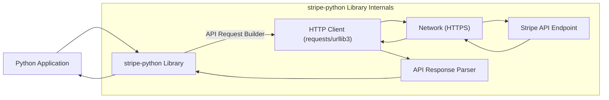
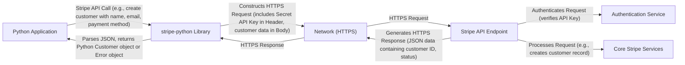

# Project Design Document: Stripe Python Library Integration

**Version:** 1.1
**Date:** October 26, 2023
**Author:** AI Software Architect

## 1. Introduction

This document provides an enhanced design overview of the integration of the `stripe-python` library (as found at [https://github.com/stripe/stripe-python](https://github.com/stripe/stripe-python)) within a hypothetical Python application. This iteration builds upon the previous version, offering more granular detail on the library's architecture, data flow, and security considerations, specifically tailored for subsequent threat modeling activities. The aim is to provide a robust understanding of the library's functionalities and interactions to facilitate effective security analysis.

## 2. Goals and Objectives

The primary goal of this design document remains to provide a comprehensive overview of the `stripe-python` library's usage and architecture within a Python application context, optimized for threat modeling. The enhanced objectives are:

*   Clearly define the components involved in using the `stripe-python` library with a greater level of detail.
*   Illustrate the data flow between the application, the library, and the Stripe API, highlighting sensitive data points.
*   Identify key areas, interfaces, and data elements that are particularly relevant for security considerations and threat modeling, including potential attack vectors.
*   Describe the dependencies and external interactions of the library, emphasizing potential supply chain vulnerabilities.
*   Provide more specific examples and context for security best practices related to API key management and error handling.

## 3. System Architecture

The `stripe-python` library serves as a crucial intermediary, abstracting the complexities of the Stripe API for Python developers. The following diagram provides a more detailed view of the architecture:

**Components:**

*   **Python Application:** The user's application code that initiates interactions with Stripe services through the `stripe-python` library. This includes business logic and data handling.
*   **stripe-python Library:** The core component, providing Pythonic bindings for the Stripe API. It encapsulates functionalities for request construction, secure communication, and response processing.
    *   **API Request Builder:**  Responsible for constructing well-formed HTTP requests (including headers, authentication, and request body) based on the application's calls.
    *   **HTTP Client (requests/urllib3):**  The underlying library (typically `requests`, which uses `urllib3`) responsible for making the actual network requests over HTTPS.
    *   **API Response Parser:** Handles the parsing of HTTP responses from the Stripe API, converting JSON data into Python objects and handling error codes.
*   **Network (HTTPS):** Represents the secure communication channel over the internet, ensuring confidentiality and integrity of data transmitted between the library and the Stripe API.
*   **Stripe API Endpoint:** The external, publicly accessible service provided by Stripe that processes API requests related to various financial operations.

**Key Interactions:**

*   The Python application invokes methods within the `stripe-python` library to interact with Stripe (e.g., `stripe.Customer.create()`).
*   The `API Request Builder` within the library takes these calls and constructs the corresponding HTTPS request, including necessary authentication (API keys) and parameters.
*   The `HTTP Client` sends the HTTPS request over the `Network` to the `Stripe API Endpoint`.
*   The `Stripe API Endpoint` processes the request and returns an HTTPS response.
*   The `HTTP Client` receives the response, and the `API Response Parser` within the library processes it.
*   The parsed response (either a Python object representing the requested data or an error object) is returned to the `Python Application`.

## 4. Data Flow

The following diagram provides a more detailed illustration of the data flow, highlighting the movement of sensitive information:

**Data Elements:**

*   **Stripe API Call:** The specific action initiated by the application, including potentially sensitive data like customer names, email addresses, and payment information.
*   **Secret API Key:** A highly sensitive credential used for authentication. It's crucial this is handled securely and transmitted only over HTTPS. Typically included in the request header.
*   **HTTPS Request Body:** Contains the parameters for the API call, which can include personally identifiable information (PII) or other sensitive data.
*   **Network (HTTPS):** The encrypted communication channel protecting the confidentiality and integrity of the request and response.
*   **Stripe API Endpoint:** Receives the request and initiates processing.
*   **Authentication Service:** A component within Stripe's infrastructure responsible for verifying the authenticity of the request using the provided API key.
*   **Core Stripe Services:** The internal Stripe systems that handle the actual processing of the API request (e.g., creating a customer record in the database).
*   **HTTPS Response (JSON data):** The response from Stripe, containing the results of the operation, including potentially sensitive information like customer IDs or error details.
*   **Python Customer Object/Error Object:** The parsed representation of the JSON response, allowing the application to interact with the data programmatically.

## 5. Security Considerations

Security is paramount when integrating with payment processing services. The following points elaborate on potential threats and mitigation strategies:

*   **API Key Management (Critical Vulnerability):**
    *   **Threat:** Exposure of the Secret API Key can lead to unauthorized access to the Stripe account, allowing malicious actors to perform actions like creating charges, accessing customer data, or modifying account settings.
    *   **Mitigation:**
        *   **Never hardcode API keys in the application code.**
        *   **Utilize environment variables:** Store API keys as environment variables on the server or within container configurations.
        *   **Employ secure secrets management systems:** Integrate with services like HashiCorp Vault, AWS Secrets Manager, Azure Key Vault, or Google Cloud Secret Manager to securely store and manage API keys.
        *   **Implement Role-Based Access Control (RBAC) within Stripe:** Use restricted API keys with specific permissions to limit the potential damage if a key is compromised.
        *   **Regularly rotate API keys:** Periodically generate new API keys and revoke old ones.
*   **HTTPS Communication (Mandatory):**
    *   **Threat:** Man-in-the-middle (MITM) attacks could intercept sensitive data transmitted between the application and Stripe if communication is not encrypted.
    *   **Mitigation:** The `stripe-python` library enforces HTTPS. Ensure the underlying Python environment and network infrastructure support TLS 1.2 or higher. Regularly update SSL/TLS libraries.
*   **Input Validation (Application Responsibility):**
    *   **Threat:** While the library handles outbound requests, vulnerabilities in the application's data handling before passing it to the library could lead to unexpected behavior or injection attacks (though less direct than in web applications).
    *   **Mitigation:** Implement robust input validation and sanitization on the application side before passing data to the `stripe-python` library.
*   **Response Handling (Information Disclosure Risk):**
    *   **Threat:** Improper handling of API responses, especially error responses, could inadvertently expose sensitive information in logs or error messages.
    *   **Mitigation:** Implement secure logging practices. Avoid logging sensitive data from API responses. Implement generic error handling and provide user-friendly error messages without revealing internal details.
*   **Dependency Management (Supply Chain Risk):**
    *   **Threat:** Vulnerabilities in the `stripe-python` library or its dependencies could be exploited to compromise the application.
    *   **Mitigation:** Regularly update the `stripe-python` library and all its dependencies. Use dependency scanning tools to identify and address known vulnerabilities. Pin dependency versions to ensure consistent and tested deployments.
*   **Rate Limiting and Error Handling (Availability and Abuse Prevention):**
    *   **Threat:** Failure to handle API rate limits or errors gracefully could lead to service disruption or create opportunities for malicious actors to exploit these limitations.
    *   **Mitigation:** Implement retry mechanisms with exponential backoff for rate-limited requests. Implement robust error handling to prevent application crashes and provide informative feedback without exposing sensitive details.

## 6. Dependencies

Understanding the dependencies of `stripe-python` is crucial for assessing potential security risks and ensuring compatibility. Key dependencies include:

*   `requests`: A widely used and feature-rich library for making HTTP requests. Security vulnerabilities in `requests` could impact the security of `stripe-python`.
*   `urllib3`: A powerful and robust HTTP client for Python, often used as the underlying engine for `requests`.
*   `typing-extensions`:  Provides backports of type hints for older Python versions. While not directly a security risk, understanding its role is important for maintainability.

Refer to the `requirements.txt` or `pyproject.toml` file within the `stripe-python` repository for the definitive list of dependencies and their versions. Regularly audit these dependencies for known vulnerabilities.

## 7. Deployment Considerations

Secure deployment practices are essential for protecting the integration:

*   **Secure Environment Configuration:** Ensure the server or container environment where the application runs is hardened, with appropriate firewall rules and access controls.
*   **Secure Secret Injection:** Utilize secure methods for injecting API keys and other sensitive configuration into the application during deployment (e.g., environment variables managed by orchestration tools, secrets management services).
*   **Network Segmentation:** Isolate the application environment from other less trusted networks.
*   **Regular Security Audits:** Conduct periodic security assessments of the deployment environment.

## 8. Future Considerations

*   **Webhooks Security:**  Applications often use Stripe webhooks for asynchronous event notifications. Securely verifying the authenticity of webhook events is critical to prevent malicious actors from forging events. This involves verifying the webhook signature using the signing secret.
*   **Idempotency Keys:**  Leveraging idempotency keys provided by the `stripe-python` library is crucial for ensuring that API requests are processed only once, even in cases of network errors or retries. This helps prevent accidental duplicate charges or other unintended consequences.
*   **Stripe Connect Security:** For applications integrating with Stripe Connect, the security considerations become more complex, involving OAuth flows, handling platform and connected account API keys, and ensuring secure data sharing between the platform and connected accounts. This would warrant a separate, more detailed design document.

This enhanced design document provides a more in-depth understanding of the `stripe-python` library integration, specifically focusing on aspects relevant for threat modeling. By understanding the components, data flow, and potential security vulnerabilities, security professionals can effectively analyze and mitigate risks associated with this integration.