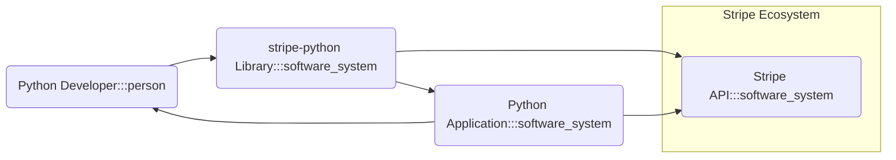

# BUSINESS POSTURE

This project, `stripe-python`, provides a Python client library for interacting with the Stripe API.

- Business Priorities and Goals:
  - Simplify integration with the Stripe API for Python developers.
  - Enable developers to easily build applications that utilize Stripe's payment processing and other financial services.
  - Maintain a reliable and up-to-date library that reflects the latest Stripe API features.
  - Foster a strong developer community around Stripe and its Python integration.

- Business Risks:
  - Security vulnerabilities in the library could lead to unauthorized access to Stripe accounts or sensitive financial data.
  - Library instability or bugs could disrupt critical business processes for users relying on Stripe.
  - Poor documentation or difficult usability could hinder adoption and developer satisfaction.
  - Failure to keep the library updated with Stripe API changes could lead to compatibility issues and developer frustration.

# SECURITY POSTURE

- Security Controls:
  - security control: HTTPS is enforced for all communication with the Stripe API. (Implemented by Stripe API and underlying HTTP client in Python).
  - security control: API keys are used for authentication with the Stripe API. (Managed by Stripe and used by developers in their applications).
  - security control: Stripe's API follows security best practices, including rate limiting, input validation, and access controls. (Implemented by Stripe API).
  - security control: The library code is publicly available on GitHub, allowing for community review and security audits. (Implemented by project maintainers by using GitHub).

- Accepted Risks:
  - accepted risk: Users are responsible for securely managing their Stripe API keys and preventing unauthorized access.
  - accepted risk: The security of the Stripe API itself is outside the scope of this library and is the responsibility of Stripe.
  - accepted risk: Potential vulnerabilities in third-party dependencies used by the library.

- Recommended Security Controls:
  - recommended security control: Implement automated dependency scanning to identify and address vulnerabilities in third-party libraries.
  - recommended security control: Provide clear documentation and guidance to developers on secure API key management practices, including recommendations for environment variables or secure configuration management.
  - recommended security control: Integrate static analysis security testing (SAST) into the development process to identify potential code-level vulnerabilities.
  - recommended security control: Implement a process for regularly updating dependencies to patch known security vulnerabilities.

- Security Requirements:
  - Authentication:
    - Requirement: The library must securely handle Stripe API keys for authentication.
    - Requirement: The library should not store API keys directly in code.
    - Requirement: The library should encourage users to use secure methods for API key management, such as environment variables or dedicated secret management solutions.
  - Authorization:
    - Requirement: The library must correctly implement Stripe's authorization model, ensuring that API requests are made with the appropriate permissions based on the API key used.
    - Requirement: The library should not grant users permissions beyond what is necessary to interact with the Stripe API.
  - Input Validation:
    - Requirement: The library should perform basic input validation to prevent common injection attacks and ensure data integrity before sending requests to the Stripe API.
    - Requirement: The library should rely on Stripe's API for comprehensive input validation and error handling.
  - Cryptography:
    - Requirement: The library must use HTTPS for all communication with the Stripe API to ensure data confidentiality and integrity in transit.
    - Requirement: The library should not implement custom cryptography unless absolutely necessary and after thorough security review. Rely on well-established and vetted cryptographic libraries provided by Python and the underlying operating system.

# DESIGN

## C4 CONTEXT



- Context Diagram Elements:
  - - Name: Python Developer
    - Type: Person
    - Description: Software developers who use the `stripe-python` library to integrate Stripe services into their Python applications.
    - Responsibilities: Develops Python applications, integrates Stripe functionality using the `stripe-python` library, manages Stripe API keys.
    - Security controls: Responsible for secure API key management in their development and deployment environments, follows secure coding practices in their applications.
  - - Name: stripe-python Library
    - Type: Software System
    - Description: A Python client library that simplifies interaction with the Stripe API. It provides convenient methods and abstractions for making API requests and handling responses.
    - Responsibilities: Provides a Python interface to the Stripe API, handles HTTP communication, serialization and deserialization of data, error handling, and documentation.
    - Security controls: Implements HTTPS for API communication, performs basic input validation, relies on Stripe API for core security functions, undergoes community review on GitHub.
  - - Name: Stripe API
    - Type: Software System
    - Description: Stripe's backend API that provides payment processing, financial services, and related functionalities.
    - Responsibilities: Handles payment processing, manages customer data, provides API endpoints for various Stripe services, enforces security controls for its platform.
    - Security controls: Implements HTTPS, API key authentication, authorization controls, rate limiting, input validation, data encryption at rest and in transit, regular security audits.
  - - Name: Python Application
    - Type: Software System
    - Description: The Python application developed by Python Developers that utilizes the `stripe-python` library to interact with Stripe API.
    - Responsibilities: Implements business logic, uses `stripe-python` library to interact with Stripe, handles user interactions, manages application data.
    - Security controls: Application specific security controls, including authentication, authorization, input validation, secure data storage, and protection against application-level vulnerabilities.

## C4 CONTAINER

```mermaid
flowchart LR
    subgraph Python Developer Environment
        D1("Python Developer":::person)
        D2("Python Application Code":::container)
    end
    subgraph User Application Deployment Environment
        C1("Python Application":::container)
        C2("stripe-python Library":::container)
    end
    subgraph Stripe Cloud
        A1("Stripe API":::container)
    end

    D1 --> D2
    D2 --> C2: Uses
    C2 --> A1: HTTPS Requests
    C1 --> C2: Imports and Uses

    classDef person fill:#AFEEEE,stroke:#3b82f6,stroke-width:2px
    classDef container fill:#ADD8E6,stroke:#3b82f6,stroke-width:2px
```

- Container Diagram Elements:
  - - Name: Python Developer
    - Type: Person
    - Description: Software developers who write and test Python applications using the `stripe-python` library.
    - Responsibilities: Develops, tests, and debugs Python application code that integrates with Stripe.
    - Security controls: Secure development practices on their local machines, responsible for not committing secrets into code repositories.
  - - Name: Python Application Code
    - Type: Container
    - Description: The source code of the Python application that will use the `stripe-python` library.
    - Responsibilities: Contains the application's business logic and integration with Stripe using the library.
    - Security controls: Source code repository access controls, code review processes.
  - - Name: stripe-python Library
    - Type: Container
    - Description: The Python package that provides the client interface to the Stripe API. It's installed and used within the Python Application.
    - Responsibilities: Encapsulates the logic for interacting with the Stripe API, handles request construction and response parsing.
    - Security controls: HTTPS for communication, input validation, dependency management, security scanning during development and release.
  - - Name: Python Application
    - Type: Container
    - Description: The deployed instance of the Python application that utilizes the `stripe-python` library in a user's environment (server, cloud, etc.).
    - Responsibilities: Executes the application logic, interacts with the `stripe-python` library, and processes data.
    - Security controls: Application-level security controls, operating system and infrastructure security, secure configuration management, monitoring and logging.
  - - Name: Stripe API
    - Type: Container
    - Description: Stripe's API endpoints in their cloud infrastructure that handle requests from the `stripe-python` library.
    - Responsibilities: Processes API requests, manages Stripe accounts and data, performs financial transactions.
    - Security controls: Stripe's comprehensive security infrastructure, including network security, application security, data encryption, access controls, and compliance certifications.

## DEPLOYMENT

Deployment is primarily about how the *users* of the `stripe-python` library deploy their applications that *use* the library. The library itself is deployed as a package to PyPI. Let's focus on a typical deployment scenario for a Python application using `stripe-python`.

Deployment Architecture: Cloud Deployment (e.g., AWS, GCP, Azure)

```mermaid
flowchart LR
    subgraph Cloud Provider (e.g., AWS)
        subgraph Virtual Network
            E1("Load Balancer":::infrastructure)
            E2("Application Server(s)":::infrastructure)
            E3("Database (Optional)":::infrastructure)
        end
        E1 --> E2
        E2 --> E3
        E2 --> F1("Internet")
    end
    F1 --> E1

    subgraph Internet
        F2("User":::person)
    end
    F2 --> F1

    E2 --> G1("Stripe API":::software_system)

    classDef person fill:#AFEEEE,stroke:#3b82f6,stroke-width:2px
    classDef software_system fill:#ADD8E6,stroke:#3b82f6,stroke-width:2px
    classDef infrastructure fill:#FAEBD7,stroke:#3b82f6,stroke-width:2px
```

- Deployment Diagram Elements:
  - - Name: Load Balancer
    - Type: Infrastructure
    - Description: Distributes incoming traffic across multiple Application Servers for scalability and availability.
    - Responsibilities: Traffic distribution, SSL termination, health checks.
    - Security controls: DDoS protection, SSL/TLS configuration, access control lists.
  - - Name: Application Server(s)
    - Type: Infrastructure
    - Description: Servers running the Python Application that uses the `stripe-python` library.
    - Responsibilities: Executes application code, processes user requests, interacts with the database and Stripe API.
    - Security controls: Operating system hardening, application firewalls, intrusion detection systems, regular security patching, secure configuration management, runtime environment security.
  - - Name: Database (Optional)
    - Type: Infrastructure
    - Description: A database system used by the Python Application to store application-specific data (if needed). Not directly related to `stripe-python` but common in web applications.
    - Responsibilities: Data persistence, data management, data retrieval.
    - Security controls: Database access controls, data encryption at rest, database auditing, regular backups.
  - - Name: Internet
    - Type: Infrastructure
    - Description: The public internet, allowing users to access the application and the application to communicate with external services like Stripe API.
    - Responsibilities: Provides network connectivity.
    - Security controls: N/A - inherent risks of public network.
  - - Name: User
    - Type: Person
    - Description: End-users who interact with the Python Application through the internet.
    - Responsibilities: Uses the application to perform intended tasks.
    - Security controls: User authentication within the application, secure password management, awareness of phishing and other online threats.
  - - Name: Stripe API
    - Type: Software System
    - Description: Stripe's API endpoints accessed over the internet by the Application Servers via the `stripe-python` library.
    - Responsibilities: Processes API requests from the application, handles Stripe functionalities.
    - Security controls: Stripe's security controls as described in previous sections.

## BUILD

```mermaid
flowchart LR
    A1("Developer":::person) --> B1("Code Changes":::artifact)
    B1 --> C1("GitHub Repository":::code_repository)
    C1 --> D1("GitHub Actions CI":::ci_cd)
    D1 --> E1("Build Process":::build_process)
    E1 --> F1("Unit Tests & Linters":::security_check)
    F1 --> G1("Security Scanners (SAST, Dependency)":::security_check)
    G1 --> H1("Build Artifacts (Python Package)":::artifact)
    H1 --> I1("PyPI":::package_registry)

    classDef person fill:#AFEEEE,stroke:#3b82f6,stroke-width:2px
    classDef artifact fill:#FAEBD7,stroke:#3b82f6,stroke-width:2px
    classDef code_repository fill:#D3D3D3,stroke:#3b82f6,stroke-width:2px
    classDef ci_cd fill:#90EE90,stroke:#3b82f6,stroke-width:2px
    classDef build_process fill:#ADD8E6,stroke:#3b82f6,stroke-width:2px
    classDef security_check fill:#FFA07A,stroke:#3b82f6,stroke-width:2px
    classDef package_registry fill:#D3D3D3,stroke:#3b82f6,stroke-width:2px
```



- Build Process Elements:
  - - Name: Developer
    - Type: Person
    - Description: A developer contributing to the `stripe-python` library.
    - Responsibilities: Writes code, commits changes, creates pull requests.
    - Security controls: Local development environment security, secure coding practices, code review participation.
  - - Name: Code Changes
    - Type: Artifact
    - Description: Modifications to the source code of the `stripe-python` library.
    - Responsibilities: Represents the changes being introduced to the codebase.
    - Security controls: Version control in Git, code review process.
  - - Name: GitHub Repository
    - Type: Code Repository
    - Description: The GitHub repository hosting the `stripe-python` source code.
    - Responsibilities: Stores and manages the codebase, tracks changes, facilitates collaboration.
    - Security controls: Access controls, branch protection rules, audit logs.
  - - Name: GitHub Actions CI
    - Type: CI/CD
    - Description: GitHub Actions workflows configured for continuous integration and continuous delivery of the `stripe-python` library.
    - Responsibilities: Automates the build, test, and release process.
    - Security controls: Secure workflow definitions, secrets management for CI/CD pipelines, access controls to GitHub Actions.
  - - Name: Build Process
    - Type: Build Process
    - Description: The automated steps in GitHub Actions to compile, package, and test the `stripe-python` library.
    - Responsibilities: Compiles code, runs tests, packages the library, prepares for release.
    - Security controls: Defined in GitHub Actions workflows, should include steps for security checks.
  - - Name: Unit Tests & Linters
    - Type: Security Check
    - Description: Automated unit tests and code linters run during the build process to ensure code quality and catch basic errors.
    - Responsibilities: Verifies code functionality and style.
    - Security controls: Part of the automated build process, helps identify and prevent bugs and coding style issues that could lead to vulnerabilities.
  - - Name: Security Scanners (SAST, Dependency)
    - Type: Security Check
    - Description: Static Application Security Testing (SAST) and dependency scanning tools integrated into the build process to identify potential security vulnerabilities in the code and dependencies.
    - Responsibilities: Identifies potential security flaws before release.
    - Security controls: Automated security checks in the CI/CD pipeline, reports findings for remediation.
  - - Name: Build Artifacts (Python Package)
    - Type: Artifact
    - Description: The packaged `stripe-python` library (e.g., a wheel or tar.gz file) ready for distribution.
    - Responsibilities: Distributable package of the library.
    - Security controls: Signing of packages (if implemented), integrity checks during download.
  - - Name: PyPI
    - Type: Package Registry
    - Description: The Python Package Index, where the `stripe-python` library is published for public consumption.
    - Responsibilities: Hosts and distributes Python packages.
    - Security controls: Package integrity checks, malware scanning (PyPI's responsibility), HTTPS for download.

# RISK ASSESSMENT

- Critical Business Processes:
  - Secure integration with Stripe API for payment processing and financial operations by users of the library.
  - Maintaining the integrity and availability of the `stripe-python` library as a critical tool for developers.

- Data to Protect and Sensitivity:
  - Stripe API Keys: High sensitivity. Unauthorized access can lead to financial loss and data breaches.
  - Potentially sensitive data passed through the library to the Stripe API (e.g., customer data, transaction details): Medium to High sensitivity, depending on the application and data being processed.
  - Source code of the `stripe-python` library: Low to Medium sensitivity. Publicly available but integrity is important to prevent malicious modifications.

# QUESTIONS & ASSUMPTIONS

- Questions:
  - What specific SAST and dependency scanning tools are used in the `stripe-python` build process?
  - Is there a process for security vulnerability disclosure and response for the `stripe-python` library?
  - What guidelines are provided to developers using `stripe-python` regarding secure API key management and handling of sensitive data?
  - Are the published Python packages signed to ensure integrity and authenticity?

- Assumptions:
  - Stripe API is inherently secure and follows industry best practices for API security.
  - Developers using the `stripe-python` library are responsible for the overall security of their applications and how they use the library.
  - The primary security focus for the `stripe-python` library is to avoid introducing vulnerabilities that could compromise the security of applications using it or the Stripe API interactions.
  - The build and release process for `stripe-python` is intended to be secure and prevent supply chain attacks.