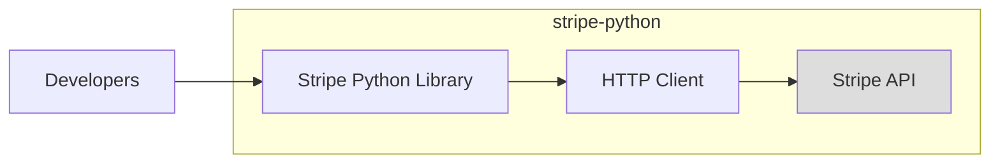
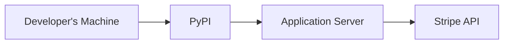
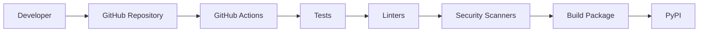

# BUSINESS POSTURE

Business Priorities and Goals:

*   Provide a Python library for developers to easily integrate with the Stripe API.
*   Enable secure and reliable payment processing for businesses using Python.
*   Maintain a high level of developer trust and satisfaction.
*   Ensure compliance with relevant payment industry regulations (e.g., PCI DSS).
*   Provide comprehensive and up-to-date documentation.
*   Offer timely support and address user issues effectively.
*   Continuously improve the library based on user feedback and evolving API features.

Most Important Business Risks:

*   Security vulnerabilities in the library that could lead to financial losses or data breaches.
*   Incorrect or outdated API integration that causes payment processing errors.
*   Lack of compliance with payment industry regulations, leading to penalties or reputational damage.
*   Poor developer experience, resulting in low adoption and negative feedback.
*   Inadequate support and maintenance, leading to user frustration and abandonment.
*   Supply chain attacks that compromise the integrity of the library.

# SECURITY POSTURE

Existing Security Controls:

*   security control: The library interacts with the Stripe API exclusively over HTTPS, ensuring encrypted communication. (Described in Stripe API documentation and enforced by the library's code.)
*   security control: API keys are used for authentication, providing a secure way to identify and authorize users. (Described in Stripe API documentation and handled by the library.)
*   security control: The library likely includes input validation to prevent common vulnerabilities like injection attacks. (Needs to be verified in the codebase.)
*   security control: Stripe itself handles the secure storage and processing of sensitive payment data, reducing the security burden on the library. (Described in Stripe's security documentation.)
*   security control: The library is open-source, allowing for community review and contributions to identify and fix security issues. (Visible on GitHub.)
*   security control: Stripe likely has a bug bounty program, incentivizing security researchers to find and report vulnerabilities. (Described in Stripe's security documentation.)
*   security control: The library uses a versioning system (SemVer), allowing users to track changes and security updates. (Visible on GitHub.)
*   security control: Automated tests are used to ensure code quality and prevent regressions. (Visible in the GitHub repository.)
*   security control: Dependencies are managed, and their versions are tracked. (Visible in the GitHub repository, e.g., `setup.py` or `requirements.txt`.)

Accepted Risks:

*   accepted risk: The library relies on the security of the underlying Python environment and its dependencies. Vulnerabilities in these components could potentially impact the library's security.
*   accepted risk: The library's security depends on the user securely managing their API keys. Compromised API keys could lead to unauthorized access and financial losses.
*   accepted risk: While Stripe handles the core payment processing, the library is still responsible for correctly integrating with the API. Errors in integration could lead to payment failures or incorrect transactions.

Recommended Security Controls:

*   security control: Implement a regular security audit process, including penetration testing and code review, to identify and address potential vulnerabilities.
*   security control: Integrate static application security testing (SAST) and dynamic application security testing (DAST) tools into the development pipeline.
*   security control: Implement a Software Composition Analysis (SCA) tool to identify and manage vulnerabilities in third-party dependencies.
*   security control: Provide clear and concise security documentation for developers, including best practices for using the library securely.
*   security control: Implement a mechanism for securely reporting vulnerabilities, such as a dedicated security contact or a vulnerability disclosure program.

Security Requirements:

*   Authentication:
    *   All API requests must be authenticated using valid Stripe API keys.
    *   The library should support both secret keys and restricted keys.
    *   The library should handle API key rotation gracefully.
*   Authorization:
    *   The library should enforce the principle of least privilege, only allowing access to the resources and actions required for a given task.
    *   The library should respect the permissions associated with restricted API keys.
*   Input Validation:
    *   All user-provided input should be validated to prevent injection attacks and other vulnerabilities.
    *   The library should handle invalid input gracefully, returning appropriate error messages.
*   Cryptography:
    *   All communication with the Stripe API must be encrypted using TLS/SSL (HTTPS).
    *   The library should use strong cryptographic algorithms and protocols.
    *   Sensitive data, such as API keys, should never be stored in the codebase or logs.

# DESIGN

## C4 CONTEXT

```mermaid
graph LR
    subgraph stripe-python
        A[Stripe Python Library]
    end
    B[Developers] --> A
    C[Stripe API] <-- A
    D[End Customers] -.-> B
    style D fill:#ddd
```

Element Descriptions:

*   Element:
    *   Name: Developers
    *   Type: Person
    *   Description: Software developers who integrate the Stripe Python library into their applications.
    *   Responsibilities:
        *   Integrate the Stripe Python library into their applications.
        *   Handle API responses and errors.
        *   Securely manage API keys.
        *   Implement appropriate user interfaces for payment processing.
    *   Security controls:
        *   Use strong, unique passwords and enable multi-factor authentication for their Stripe accounts.
        *   Securely store and manage API keys.
        *   Follow secure coding practices to prevent vulnerabilities in their applications.

*   Element:
    *   Name: Stripe Python Library
    *   Type: Software System
    *   Description: A Python library that provides a convenient interface for interacting with the Stripe API.
    *   Responsibilities:
        *   Provide functions for creating charges, customers, subscriptions, etc.
        *   Handle API requests and responses.
        *   Manage authentication and authorization.
        *   Perform input validation.
    *   Security controls:
        *   Use HTTPS for all API communication.
        *   Authenticate requests using API keys.
        *   Validate user input.
        *   Handle errors securely.

*   Element:
    *   Name: Stripe API
    *   Type: Software System
    *   Description: The core payment processing platform provided by Stripe.
    *   Responsibilities:
        *   Process payments securely.
        *   Manage customer data.
        *   Provide webhooks for event notifications.
        *   Enforce security and compliance requirements.
    *   Security controls:
        *   PCI DSS compliance.
        *   Data encryption at rest and in transit.
        *   Fraud prevention mechanisms.
        *   Regular security audits and penetration testing.

*   Element:
    *   Name: End Customers
    *   Type: Person
    *   Description: Individuals or businesses making payments through applications that use the Stripe Python library.
    *   Responsibilities:
        *   Provide payment information.
        *   Authorize transactions.
    *   Security controls:
        *   Use strong, unique passwords for their accounts.
        *   Monitor their bank and credit card statements for unauthorized activity.

## C4 CONTAINER



Element Descriptions:

*   Element:
    *   Name: Stripe Python Library
    *   Type: Container (Python Package)
    *   Description: A Python library that provides a convenient interface for interacting with the Stripe API.
    *   Responsibilities:
        *   Provide functions for creating charges, customers, subscriptions, etc.
        *   Handle API requests and responses.
        *   Manage authentication and authorization.
        *   Perform input validation.
    *   Security controls:
        *   Use HTTPS for all API communication.
        *   Authenticate requests using API keys.
        *   Validate user input.
        *   Handle errors securely.

*   Element:
    *   Name: HTTP Client
    *   Type: Container (Library/Component)
    *   Description: A library or component used to make HTTP requests to the Stripe API. (e.g., `requests` library in Python)
    *   Responsibilities:
        *   Send HTTP requests to the Stripe API.
        *   Receive HTTP responses from the Stripe API.
        *   Handle network connectivity and errors.
    *   Security controls:
        *   Use HTTPS for all communication.
        *   Validate SSL/TLS certificates.
        *   Handle timeouts and retries securely.

*   Element:
    *   Name: Stripe API
    *   Type: Software System
    *   Description: The core payment processing platform provided by Stripe.
    *   Responsibilities:
        *   Process payments securely.
        *   Manage customer data.
        *   Provide webhooks for event notifications.
        *   Enforce security and compliance requirements.
    *   Security controls:
        *   PCI DSS compliance.
        *   Data encryption at rest and in transit.
        *   Fraud prevention mechanisms.
        *   Regular security audits and penetration testing.

*   Element:
    *   Name: Developers
    *   Type: Person
    *   Description: Software developers who integrate the Stripe Python library into their applications.
    *   Responsibilities:
        *   Integrate the Stripe Python library into their applications.
        *   Handle API responses and errors.
        *   Securely manage API keys.
        *   Implement appropriate user interfaces for payment processing.
    *   Security controls:
        *   Use strong, unique passwords and enable multi-factor authentication for their Stripe accounts.
        *   Securely store and manage API keys.
        *   Follow secure coding practices to prevent vulnerabilities in their applications.

## DEPLOYMENT

Possible Deployment Solutions:

1.  Installation via pip (from PyPI): This is the standard and most common way to install Python packages.
2.  Installation from source (GitHub): Users can clone the repository and install the library directly from the source code.
3.  Inclusion as a dependency in a larger project: The library can be listed as a dependency in a project's `setup.py`, `requirements.txt`, or similar file.
4.  Containerization (Docker): While not a direct deployment of the library itself, applications using the library can be containerized, including the library as a dependency.

Chosen Solution (pip from PyPI):



Element Descriptions:

*   Element:
    *   Name: Developer's Machine
    *   Type: Infrastructure Node
    *   Description: The machine where the developer writes and tests code.
    *   Responsibilities:
        *   Develop and test the application that uses the Stripe Python library.
    *   Security controls:
        *   Keep the operating system and software up to date.
        *   Use a firewall and antivirus software.
        *   Securely store API keys.

*   Element:
    *   Name: PyPI (Python Package Index)
    *   Type: Infrastructure Node (Package Repository)
    *   Description: The official repository for Python packages.
    *   Responsibilities:
        *   Host and distribute the Stripe Python library.
    *   Security controls:
        *   Package signing.
        *   Malware scanning.
        *   Access controls.

*   Element:
    *   Name: Application Server
    *   Type: Infrastructure Node
    *   Description: The server where the application that uses the Stripe Python library is deployed.
    *   Responsibilities:
        *   Run the application.
        *   Handle user requests.
        *   Communicate with the Stripe API.
    *   Security controls:
        *   Keep the operating system and software up to date.
        *   Use a firewall and intrusion detection/prevention system.
        *   Securely store API keys.
        *   Implement appropriate access controls.

*   Element:
    *   Name: Stripe API
    *   Type: Software System
    *   Description: The core payment processing platform provided by Stripe.
    *   Responsibilities:
        *   Process payments securely.
        *   Manage customer data.
        *   Provide webhooks for event notifications.
        *   Enforce security and compliance requirements.
    *   Security controls:
        *   PCI DSS compliance.
        *   Data encryption at rest and in transit.
        *   Fraud prevention mechanisms.
        *   Regular security audits and penetration testing.

## BUILD



Build Process Description:

1.  Developer: The developer writes code and commits it to the GitHub repository.
2.  GitHub Repository: The code is stored in the GitHub repository.
3.  GitHub Actions: GitHub Actions is used as the CI/CD system. Workflows are triggered by events like pushes and pull requests.
4.  Tests: Automated tests (unit tests, integration tests) are run to ensure code quality and functionality.
5.  Linters: Linters (e.g., flake8, pylint) are used to enforce code style and identify potential errors.
6.  Security Scanners: Security scanners (e.g., Bandit, Snyk) are used to identify potential security vulnerabilities in the code and its dependencies.
7.  Build Package: If all tests, linters, and security scanners pass, the package is built for distribution.
8.  PyPI: The built package is published to PyPI, making it available for installation via pip.

Security Controls in Build Process:

*   Automated Tests: Ensure code quality and prevent regressions.
*   Linters: Enforce code style and identify potential errors.
*   Security Scanners (SAST, SCA): Identify potential security vulnerabilities in the code and its dependencies.
*   Signed Commits: Verify the integrity and authenticity of code changes.
*   Dependency Management: Track and manage dependencies to minimize the risk of using vulnerable libraries.
*   Least Privilege: CI/CD pipelines should run with the minimum necessary permissions.

# RISK ASSESSMENT

Critical Business Processes:

*   Payment processing: The primary function of the library is to facilitate payment processing. Any disruption or failure in this process could lead to significant financial losses and reputational damage.
*   Customer data management: The library interacts with customer data, including payment information. Protecting this data is crucial for maintaining customer trust and complying with regulations.
*   API integration: The library's core functionality relies on seamless integration with the Stripe API. Any errors or inconsistencies in this integration could disrupt payment processing.

Data Sensitivity:

*   API Keys: Secret keys and restricted keys are highly sensitive and must be protected from unauthorized access.
*   Customer IDs: While not directly containing sensitive payment information, customer IDs can be used to access customer data through the Stripe API.
*   Payment Method IDs: Similar to customer IDs, these IDs can be used to access payment method details.
*   Transaction Data: Information about transactions, such as amounts, currencies, and timestamps, may be considered sensitive depending on the context.

# QUESTIONS & ASSUMPTIONS

Questions:

*   What specific security scanners are currently used in the build process?
*   Are there any existing security audit reports or penetration testing results for the library?
*   What is the process for handling security vulnerabilities reported by external researchers?
*   What is the frequency of dependency updates and security patching?
*   Are there any specific compliance requirements beyond PCI DSS that the library needs to adhere to?
*   What is the process for rotating API keys?
*   What monitoring and logging capabilities are in place to detect and respond to security incidents?

Assumptions:

*   BUSINESS POSTURE: The primary business goal is to provide a secure and reliable way for Python developers to integrate with Stripe.
*   SECURITY POSTURE: Stripe handles the majority of the security burden related to payment processing and data storage. The library follows secure coding practices and leverages Stripe's security features.
*   DESIGN: The library uses a standard HTTP client to communicate with the Stripe API. The build process is automated using GitHub Actions. The primary deployment method is via pip from PyPI.