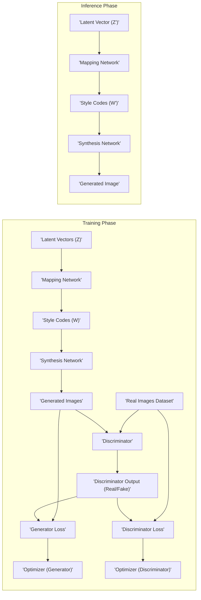

# Project Design Document: StyleGAN

**Version:** 1.1
**Date:** October 26, 2023
**Author:** AI Architecture Expert

## 1. Introduction

This document provides a detailed design overview of the StyleGAN project, based on the publicly available repository at [https://github.com/NVlabs/stylegan](https://github.com/NVlabs/stylegan). This document aims to clearly articulate the system's architecture, components, and data flow to facilitate subsequent threat modeling activities. It focuses on the core elements of the StyleGAN model and its training process.

## 2. Project Overview

StyleGAN (Stylized Generative Adversarial Network) is a generative model architecture primarily used for generating high-resolution photorealistic images. It builds upon traditional GANs by introducing a style-based generator architecture that allows for fine-grained control over the generated images through learned style vectors. The project, as represented in the linked repository, encompasses the model architecture, training methodologies, and potentially pre-trained models and utilities for image generation.

## 3. Goals

* To provide a comprehensive architectural overview of the StyleGAN model.
* To clearly define the key components and their interactions.
* To illustrate the data flow within the system, particularly during training and inference.
* To serve as a foundation for identifying potential security vulnerabilities and threats.

## 4. Scope

This design document focuses on the core StyleGAN architecture and its training process as described in the provided repository. It includes:

* The generator network and its components (mapping network, synthesis network).
* The discriminator network.
* The training process and data flow.
* Key dependencies and technologies.

This document does not cover:

* Specific implementation details within the code.
* Deployment strategies or infrastructure in detail (covered conceptually for threat context).
* Detailed analysis of pre-trained models.
* Downstream applications built on top of StyleGAN.

## 5. System Architecture

### 5.1. High-Level Diagram

### 5.2. Component Descriptions

* **Real Images Dataset:** A collection of real-world images used to train the discriminator to distinguish between authentic and generated images.
* **Latent Vectors (Z):** Random vectors sampled from a latent space (typically a normal distribution). These serve as the initial input to the generator.
* **Mapping Network:** A multi-layer perceptron (MLP) that transforms the latent vector (Z) into an intermediate latent space (W). This process aims to disentangle the latent space, enabling more granular control over image styles.
* **Style Codes (W):** The output of the mapping network. These codes represent the "style" characteristics that will be injected into the synthesis network.
* **Synthesis Network:** The core image generation component. It progressively generates the output image, layer by layer, conditioned on the style codes (W). Style information is injected at multiple points within the network.
* **Generated Images:** The output of the synthesis network, intended to be indistinguishable from real images in the training dataset.
* **Discriminator:** A convolutional neural network that attempts to classify input images as either real (from the dataset) or fake (generated by the generator).
* **Discriminator Output (Real/Fake):** The discriminator's probabilistic prediction, indicating the likelihood that the input image is real or fake.
* **Generator Loss:** A scalar value quantifying how well the generator is deceiving the discriminator. The generator's objective is to minimize this loss.
* **Discriminator Loss:** A scalar value quantifying how well the discriminator is distinguishing between real and fake images. The discriminator's objective is to minimize this loss.
* **Optimizer (Generator):** An optimization algorithm (e.g., Adam, SGD) used to update the weights of the generator network based on the calculated generator loss.
* **Optimizer (Discriminator):** An optimization algorithm (e.g., Adam, SGD) used to update the weights of the discriminator network based on the calculated discriminator loss.
* **Latent Vector (Z'):** A new random latent vector sampled during the inference phase to generate a novel image.
* **Style Codes (W'):** The style code generated from the new latent vector (Z') during inference by passing it through the trained mapping network.
* **Generated Image:** The final image produced by the trained generator during the inference phase.

### 5.3. Data Flow

#### 5.3.1. Training Phase

1. **Real Image Input:** A batch of real images is sampled from the training dataset and fed as input to the discriminator.
2. **Latent Vector Sampling:** A batch of random latent vectors (Z) is sampled from a predefined probability distribution.
3. **Mapping Network Transformation:** The sampled latent vectors (Z) are passed through the mapping network to generate corresponding style codes (W).
4. **Synthesis Network Generation:** The generated style codes (W) are fed into the synthesis network, which produces a batch of synthetic images.
5. **Discriminator Evaluation:** Both the batch of real images and the batch of generated images are presented to the discriminator for evaluation.
6. **Loss Calculation:** The discriminator's outputs are used to compute the generator loss and the discriminator loss, reflecting the performance of each network.
7. **Weight Update:** The optimizers utilize the calculated losses to update the internal weights of the generator and discriminator networks, aiming to improve their respective performance. This process is repeated iteratively.

#### 5.3.2. Inference Phase

1. **Latent Vector Sampling:** A random latent vector (Z') is sampled from the latent space.
2. **Mapping Network Transformation:** The sampled latent vector (Z') is passed through the trained mapping network to obtain a style code (W').
3. **Synthesis Network Generation:** The generated style code (W') is fed into the trained synthesis network, resulting in the generation of a new image.

## 6. Key Technologies

* **Programming Language:** Python
* **Deep Learning Framework:** TensorFlow or PyTorch (implementation dependent)
* **GPU Acceleration:** CUDA (for NVIDIA GPUs) or similar for other hardware.
* **Core Libraries:**
    * NumPy (for numerical computations)
    * SciPy (for scientific and technical computing)
    * Potentially image processing libraries (e.g., PIL/Pillow, OpenCV)
    * Libraries for data handling (e.g., `torchvision.datasets`, `tensorflow.data`)

## 7. Deployment Considerations (Conceptual for Threat Modeling)

Understanding potential deployment scenarios helps contextualize threats:

* **Local Execution:** Running training or inference scripts directly on a local machine. This exposes the system to local security vulnerabilities and data access risks.
* **Cloud-Based Training/Inference:** Utilizing cloud platforms (e.g., AWS, GCP, Azure) for resource-intensive tasks. This introduces cloud-specific security concerns related to access management, data storage security, and network configurations.
* **API Endpoint for Image Generation:** Deploying the trained model as a service accessible via an API. This opens attack vectors related to API security, input validation, authentication, and authorization.
* **Integration into Applications:** Embedding the StyleGAN model into other software applications. This inherits the security posture of the host application and introduces potential data leakage or misuse risks.
* **Pre-trained Model Distribution:** Sharing or distributing pre-trained StyleGAN models. This raises concerns about model integrity and potential malicious modifications.

## 8. Security Considerations (For Threat Modeling)

This section outlines potential security threats relevant to the StyleGAN project:

* **Data Poisoning:**
    * **Description:** Attackers inject malicious or biased data into the training dataset to manipulate the model's behavior or output.
    * **Impact:** Generation of undesirable, biased, or harmful images.
* **Model Inversion Attacks:**
    * **Description:** Attackers attempt to reverse-engineer the trained model to extract sensitive information about the training data or model parameters.
    * **Impact:** Exposure of private data used in training, intellectual property theft.
* **Adversarial Attacks:**
    * **Description:** Crafting specific latent vectors or inputs to generate targeted, potentially harmful, or misleading images.
    * **Impact:** Creation of deepfakes, malicious content generation.
* **Supply Chain Attacks:**
    * **Description:** Compromising dependencies (e.g., libraries, frameworks) used by the project to introduce vulnerabilities.
    * **Impact:** Code execution, data breaches, model corruption.
* **Unauthorized Access:**
    * **Description:** Gaining unauthorized access to the system, model, or deployment environment.
    * **Impact:** Data breaches, model theft, misuse of resources.
* **Resource Exhaustion (Denial of Service):**
    * **Description:** Overloading the system with excessive requests to make it unavailable.
    * **Impact:** Inability to use the service, financial losses.
* **Code Injection Vulnerabilities:**
    * **Description:** Exploiting vulnerabilities in the code to inject and execute arbitrary code.
    * **Impact:** Full system compromise, data theft, malicious actions.
* **Parameter Manipulation (if exposed):**
    * **Description:** If model parameters are exposed or modifiable, attackers could alter the model's behavior directly.
    * **Impact:** Generation of incorrect or malicious outputs.
* **Model Stealing:**
    * **Description:** Unauthorized copying or extraction of the trained model.
    * **Impact:** Intellectual property theft, unauthorized commercial use.

## 9. Future Considerations

* **Advancements in GAN Architectures:** Continuous research in GANs may lead to more efficient, controllable, and higher-fidelity image generation techniques.
* **Improved Explainability and Interpretability:** Efforts to understand the latent space and the factors influencing image generation are crucial for building trust and mitigating biases.
* **Addressing Ethical Implications:** Ongoing discussion and development of methods to detect and prevent the misuse of StyleGAN for malicious purposes (e.g., deepfakes).
* **Resource Optimization:** Research into techniques to reduce the computational cost of training and inference, making StyleGAN more accessible.

This document provides a comprehensive design overview of the StyleGAN project, serving as a valuable resource for subsequent threat modeling activities. Understanding the architecture, components, and potential deployment scenarios is essential for identifying and mitigating security risks.
