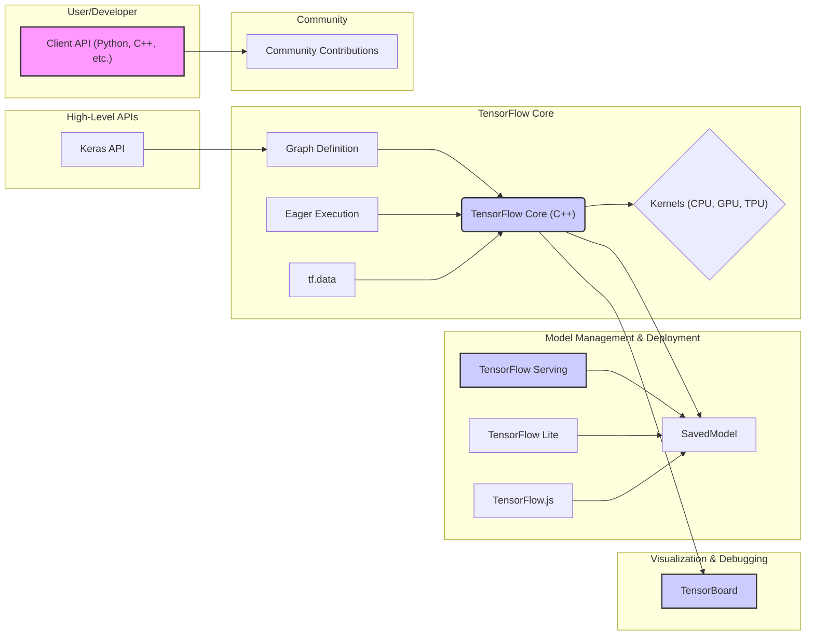

## Project Design Document: TensorFlow

**1. Introduction**

This document provides a high-level architectural design overview of the TensorFlow project (as represented by the repository at [https://github.com/tensorflow/tensorflow](https://github.com/tensorflow/tensorflow)). This document is intended to serve as a foundation for subsequent threat modeling activities. It outlines the key components, their interactions, and the overall system architecture.

**2. Goals**

*   Provide a clear and concise architectural overview of TensorFlow.
*   Identify key components and their functionalities.
*   Illustrate the data flow within the system.
*   Highlight potential areas of interest for security analysis and threat modeling.

**3. Target Audience**

*   Security engineers
*   Software architects
*   Developers contributing to TensorFlow
*   Individuals performing threat modeling on TensorFlow

**4. System Overview**

TensorFlow is an open-source machine learning framework. At its core, it's a computational graph execution engine. Users define computational graphs representing their machine learning models, and TensorFlow executes these graphs efficiently across various hardware platforms. The system is designed to be highly flexible and extensible, supporting a wide range of machine learning tasks.

**5. Key Components**

*   **Client APIs (Python, C++, Java, JavaScript, Go, Swift):** These are the primary interfaces through which users interact with TensorFlow. They provide libraries for defining and executing computations.
*   **Graph Definition:**  Users define their machine learning models as dataflow graphs. These graphs represent the sequence of operations to be performed on tensors.
*   **TensorFlow Core (C++):** This is the underlying engine responsible for executing the computational graphs. It manages resource allocation, operation scheduling, and communication between different hardware devices.
*   **Kernels (C++, CUDA, ROCm):** These are implementations of individual operations (e.g., matrix multiplication, convolution) optimized for specific hardware architectures (CPUs, GPUs, TPUs).
*   **Eager Execution:** An imperative programming environment that executes operations immediately, without building a static graph first. This is often used for debugging and prototyping.
*   **tf.data:** A module for building complex input pipelines for feeding data to the model.
*   **Keras API:** A high-level API for building and training neural networks. It can run on top of TensorFlow (and other backends).
*   **SavedModel:** A universal serialization format for saving and loading TensorFlow models. It includes the graph definition, weights, and other metadata.
*   **TensorBoard:** A visualization toolkit for understanding and debugging TensorFlow programs. It can display graphs, metrics, and other information.
*   **TensorFlow Serving:** A flexible, high-performance serving system for machine learning models. It allows deploying trained models for inference.
*   **TensorFlow Lite:** A lightweight version of TensorFlow for mobile and embedded devices.
*   **TensorFlow.js:** A version of TensorFlow for running machine learning models in web browsers and Node.js.
*   **Community Contributions (Addons, Agents, etc.):**  Extensions and tools built by the TensorFlow community, expanding its functionality.

**6. System Architecture Diagram**

**7. Data Flow**

The typical data flow in TensorFlow involves the following steps:

*   **Model Definition:** Users define their machine learning model using a Client API, typically Python. This involves creating a computational graph.
*   **Graph Compilation (Implicit or Explicit):** TensorFlow compiles the graph into an executable form.
*   **Data Input:** Data is fed into the graph through `tf.data` pipelines.
*   **Graph Execution:** The TensorFlow Core executes the graph, utilizing appropriate kernels for the target hardware.
*   **Result Output:** The results of the computation (e.g., model predictions, training metrics) are returned to the user.
*   **Model Saving:** Trained models can be saved in the SavedModel format.
*   **Model Deployment:** Saved models can be deployed using TensorFlow Serving, TensorFlow Lite, or TensorFlow.js.
*   **Monitoring and Visualization:** TensorBoard can be used to monitor the training process and visualize the model graph.

**8. Trust Boundaries**

Identifying trust boundaries is crucial for threat modeling. Key trust boundaries within the TensorFlow ecosystem include:

*   **User Space vs. TensorFlow Core:** User-provided graph definitions and data are processed by the TensorFlow Core. Maliciously crafted graphs or data could potentially exploit vulnerabilities in the core.
*   **Client API vs. TensorFlow Core:** The communication between the client API and the core needs to be secure.
*   **TensorFlow Core vs. Kernels:** The core relies on the correctness and security of the underlying kernels.
*   **SavedModel Loading:** Loading a SavedModel from an untrusted source poses a risk, as the model could contain malicious code or configurations.
*   **TensorFlow Serving Deployment:**  The security of the deployment environment for TensorFlow Serving is critical.
*   **Community Contributions:**  Code from community contributions should be treated with caution, as it may not have the same level of scrutiny as the core TensorFlow codebase.

**9. Potential Threat Actors**

*   **Malicious Users:** Users who intentionally craft malicious models or data to exploit vulnerabilities.
*   **Compromised Developers:** Developers with access to the codebase whose accounts or machines are compromised.
*   **Supply Chain Attackers:** Attackers who compromise dependencies or build processes to inject malicious code.
*   **External Attackers:** Individuals or groups attempting to exploit vulnerabilities in deployed TensorFlow systems.

**10. Potential Attack Vectors**

*   **Model Poisoning:** Injecting malicious data into the training process to manipulate model behavior.
*   **Adversarial Attacks:** Crafting inputs designed to fool the model at inference time.
*   **Code Injection:** Exploiting vulnerabilities in graph execution or kernel implementations to execute arbitrary code.
*   **Denial of Service (DoS):**  Crafting graphs or data that consume excessive resources, leading to service disruption.
*   **Information Disclosure:** Exploiting vulnerabilities to gain access to sensitive data, such as model weights or training data.
*   **Supply Chain Attacks:** Compromising dependencies or build processes to introduce vulnerabilities.
*   **Side-Channel Attacks:** Exploiting information leaked through hardware or software behavior (e.g., timing attacks).
*   **Deserialization Vulnerabilities:** Exploiting vulnerabilities in the SavedModel loading process.

**11. Security Considerations for Threat Modeling**

When performing threat modeling on TensorFlow, consider the following:

*   **Input Validation:** How are user-provided graph definitions and data validated?
*   **Sandboxing and Isolation:** Are there mechanisms to isolate the execution of user-provided code?
*   **Memory Safety:** Are memory safety vulnerabilities addressed in the C++ core and kernels?
*   **Access Control:** How is access to sensitive resources (e.g., model weights, training data) controlled?
*   **Secure Communication:** Is communication between components (e.g., client API and core) secured?
*   **Dependency Management:** How are dependencies managed and vetted for security vulnerabilities?
*   **Build Process Security:** Are the build and release processes secure from tampering?
*   **Vulnerability Management:** How are security vulnerabilities identified, reported, and patched?
*   **Secure Defaults:** Are secure defaults configured for deployment and usage?

**12. Future Considerations**

*   Detailed analysis of individual components and their specific security risks.
*   Exploration of specific attack scenarios and their potential impact.
*   Identification of mitigation strategies for identified threats.

This document provides a foundational understanding of the TensorFlow architecture for the purpose of threat modeling. Further detailed analysis of individual components and their interactions will be necessary for a comprehensive security assessment.
