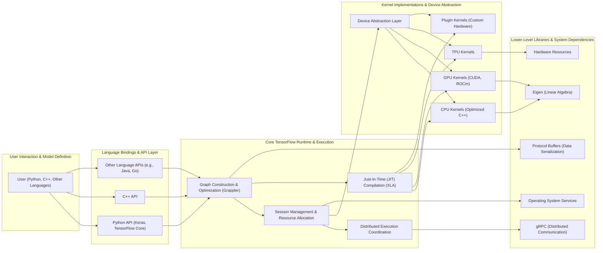
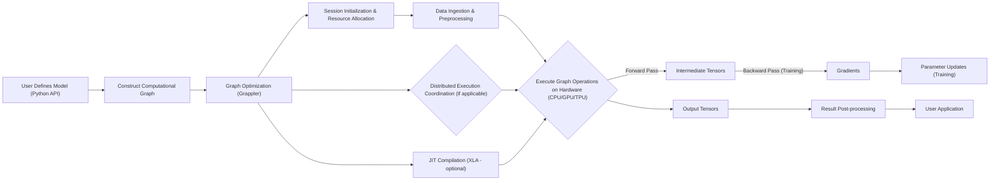

## Project Design Document: TensorFlow (Improved)

**1. Introduction**

This document provides an enhanced architectural overview of the TensorFlow project, drawing from the publicly available codebase at [https://github.com/tensorflow/tensorflow](https://github.com/tensorflow/tensorflow). This improved design document aims to provide a more detailed foundation for subsequent threat modeling activities. It elaborates on the key components, data flows with greater granularity, and deployment considerations to facilitate a deeper understanding of the potential attack surface of the TensorFlow framework.

**2. Goals and Objectives**

The primary goals of this design document are to:

*   Present a clear, concise, and more detailed description of the TensorFlow architecture.
*   Thoroughly identify the major components and their intricate interactions.
*   Outline the typical data flow within the system with a greater level of specificity.
*   Describe common and emerging deployment scenarios, highlighting their unique characteristics.
*   Emphasize key areas critical for security considerations and comprehensive threat modeling.

**3. High-Level Architecture**

TensorFlow employs a layered architecture to manage the complexities of machine learning workflows. The interactions between these layers are crucial for understanding the system.

**4. Key Components**

The TensorFlow architecture is built upon these fundamental components:

*   **User Interface (Python, C++, Other Languages):** This serves as the primary interaction point for users to define, train, evaluate, and deploy machine learning models. The Python API, particularly through Keras and TensorFlow Core, is the most widely adopted. Other language bindings provide access for diverse development needs.
*   **Language Bindings (Python API, C++ API, Other Language APIs):** These APIs offer high-level abstractions and utility functions that simplify interaction with the underlying TensorFlow runtime. They translate user-defined model structures and operations into the core TensorFlow representation.
*   **Graph Construction and Optimization (Grappler):** This component is responsible for building the computational graph representing the machine learning model's operations. Grappler performs crucial optimizations on this graph, such as constant folding, operator fusion, and device placement, to enhance performance and efficiency.
*   **Session Management and Resource Allocation:** This manages the lifecycle of TensorFlow sessions, which are environments for executing the computational graph. It handles resource allocation on target hardware (CPUs, GPUs, TPUs) and manages the execution context.
*   **Distributed Execution Coordination:** Enables the distribution of training and inference workloads across multiple devices and machines. This involves coordinating communication and data transfer between different workers, often leveraging gRPC.
*   **Just-In-Time (JIT) Compilation (XLA):** The Accelerated Linear Algebra (XLA) compiler further optimizes TensorFlow computations by performing ahead-of-time or just-in-time compilation of the computational graph into optimized machine code for specific hardware targets.
*   **Kernel Implementations and Device Abstraction:**
    *   **CPU Kernels (Optimized C++):** Highly optimized implementations of mathematical operations designed for execution on CPUs.
    *   **GPU Kernels (CUDA, ROCm):** Implementations leveraging the parallel processing capabilities of GPUs using CUDA (NVIDIA) or ROCm (AMD) platforms.
    *   **TPU Kernels:**  Specialized kernels designed for execution on Google's Tensor Processing Units (TPUs), offering significant performance advantages for certain workloads.
    *   **Plugin Kernels (Custom Hardware):** Allows for extending TensorFlow to support custom hardware accelerators through plugin mechanisms.
    *   **Device Abstraction Layer:** Provides a unified interface for the core runtime to interact with different hardware devices, abstracting away the underlying hardware-specific details.
*   **Lower-Level Libraries and System Dependencies:**
    *   **Eigen (Linear Algebra):** A core C++ template library for high-performance linear algebra operations, heavily utilized within the kernel implementations.
    *   **Protocol Buffers (Data Serialization):** Used extensively for serializing and deserializing data structures, particularly for defining the computational graph (`GraphDef`), configuration options, and exchanging data in distributed environments.
    *   **gRPC (Distributed Communication):** A high-performance, open-source RPC framework used for communication between distributed TensorFlow processes, enabling scalable training and inference.
    *   **Operating System Services:** TensorFlow relies on underlying operating system services for memory management, threading, and other system-level functionalities.
    *   **Hardware Resources:** The physical hardware (CPUs, GPUs, TPUs, memory) on which TensorFlow executes.

**5. Data Flow (Detailed)**

The data flow within TensorFlow is a multi-stage process:

*   **Model Definition and Construction:**
    *   The user defines the model architecture using the chosen API (e.g., Python with Keras).
    *   This definition is translated into a symbolic representation of the computation, forming the initial computational graph.
*   **Graph Optimization (Static Analysis):**
    *   The Grappler component analyzes the computational graph for potential optimizations.
    *   Optimizations like constant folding, common subexpression elimination, and layout optimization are applied.
    *   Device placement decisions are made, assigning operations to specific hardware devices.
*   **Session Initialization and Resource Allocation:**
    *   A TensorFlow session is initiated, establishing the execution environment.
    *   Memory and other resources are allocated on the designated hardware devices based on the graph's requirements.
*   **Data Ingestion and Preprocessing:**
    *   Input data is fed into the graph through input tensors or placeholders.
    *   Data preprocessing steps, defined within the graph, are executed (e.g., normalization, augmentation).
*   **Graph Execution (Forward and Backward Pass):**
    *   The operations within the computational graph are executed in order.
    *   For training, this involves a forward pass to compute predictions and a backward pass to calculate gradients.
    *   Kernel implementations specific to the target hardware are invoked for each operation.
    *   Intermediate tensors are passed between operations.
*   **Distributed Execution (if applicable):**
    *   In distributed settings, the graph is partitioned and executed across multiple workers.
    *   gRPC is used for communication and data synchronization between workers.
    *   Gradient aggregation and parameter updates are coordinated.
*   **Just-In-Time Compilation (Optional):**
    *   XLA may compile portions of the graph into optimized machine code just before execution, further improving performance.
*   **Result Output and Post-processing:**
    *   The output tensors containing the results of the computation are produced.
    *   Post-processing steps may be applied to the output.

Detailed Data Flow Diagram:

**6. Deployment Model (Expanded)**

TensorFlow's versatility allows for deployment in a wide range of environments:

*   **Local Development Environment:** Running TensorFlow directly on a developer's workstation or laptop. This is typical for prototyping, experimentation, and small-scale model development. Security considerations are often focused on local access control and data protection.
*   **On-Premise Servers and Data Centers:** Deploying TensorFlow on privately owned infrastructure within a server room or data center. This offers greater control over hardware and security, but requires managing the infrastructure. Security focuses on network security, physical security, and access management.
*   **Cloud Platforms (AWS, GCP, Azure):** Utilizing cloud-based services for scalable training and inference. Cloud providers offer managed TensorFlow services (e.g., Vertex AI, SageMaker, Azure Machine Learning) and infrastructure (e.g., virtual machines with GPUs/TPUs). Security becomes a shared responsibility model, relying on both the user's configuration and the cloud provider's security measures.
*   **Edge Devices (Mobile, IoT, Embedded Systems):** Deploying lightweight TensorFlow models on resource-constrained devices for on-device inference. TensorFlow Lite is specifically designed for this, optimizing models for size and performance. Security focuses on model protection, data privacy on the device, and secure communication.
*   **Web Browsers (TensorFlow.js):** Running TensorFlow models directly within web browsers using JavaScript. This enables client-side machine learning without requiring server-side processing for inference. Security considerations include protecting the model code and data within the browser environment.
*   **Containers (Docker, Kubernetes):** Deploying TensorFlow applications within containers for portability and scalability. Kubernetes is often used for orchestrating containerized TensorFlow deployments, especially in cloud environments. Security focuses on container image security, orchestration security, and network policies.

**7. Security Considerations (More Specific)**

Building upon the initial considerations, here are more specific security aspects for threat modeling:

*   **Supply Chain Vulnerabilities:**  Compromised dependencies (e.g., PyPI packages) could introduce malicious code. Verifying checksums and using dependency scanning tools are crucial.
*   **Code Injection:**  Careless handling of user-provided input in model definitions or data pipelines could lead to code injection vulnerabilities, especially in custom operations or callbacks.
*   **Data Poisoning:**  Attackers might try to inject malicious data into the training dataset to manipulate the model's behavior. Robust data validation and sanitization are necessary.
*   **Model Extraction/Inversion:**  Adversaries might attempt to extract sensitive information or the model architecture itself through techniques like model inversion attacks or by exploiting vulnerabilities in model serving mechanisms.
*   **Adversarial Attacks:** Crafting specific input data designed to fool the model into making incorrect predictions. This is particularly relevant for deployed models.
*   **Access Control and Authentication:**  Securing access to TensorFlow resources, APIs, and deployed models. Implementing proper authentication and authorization mechanisms is vital.
*   **Serialization/Deserialization Exploits:**  Vulnerabilities in the `SavedModel` format or other serialization mechanisms could be exploited to execute arbitrary code during model loading.
*   **Distributed Training Security:**  Securing communication channels (e.g., gRPC) between distributed training workers to prevent eavesdropping or tampering. Mutual TLS and authentication are important.
*   **Hardware Security:**  Considering potential hardware-level vulnerabilities or side-channel attacks, especially when deploying on untrusted hardware.
*   **Denial of Service (DoS):**  Exploiting resource-intensive operations or vulnerabilities to overload TensorFlow services and make them unavailable.
*   **Side-Channel Attacks:**  Leaking information through unintended channels like timing variations or power consumption during model execution.

**8. Future Considerations**

The TensorFlow landscape is constantly evolving. Future developments and security considerations may include:

*   Enhanced security features directly integrated into the TensorFlow framework (e.g., differential privacy, federated learning).
*   Improved tooling for security analysis and vulnerability detection in TensorFlow models and deployments.
*   Standardized security best practices and guidelines for TensorFlow development and deployment.
*   Addressing security challenges related to emerging hardware architectures and deployment paradigms.
*   Strengthening the security of the TensorFlow ecosystem, including TensorFlow Serving, TensorBoard, and TFX.

This improved design document provides a more granular and security-focused overview of the TensorFlow architecture, intended to be a valuable resource for comprehensive threat modeling. Each component, data flow, and deployment scenario outlined here warrants further scrutiny to identify and mitigate potential security risks.
