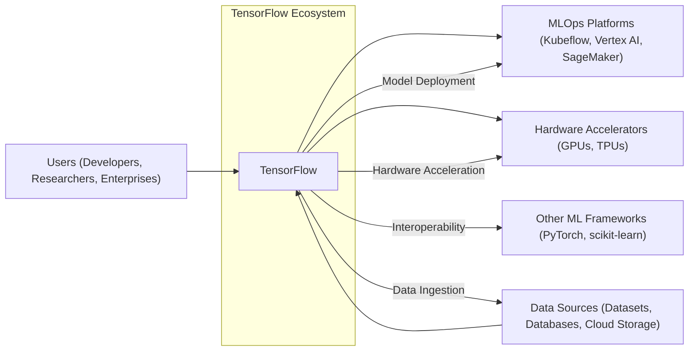
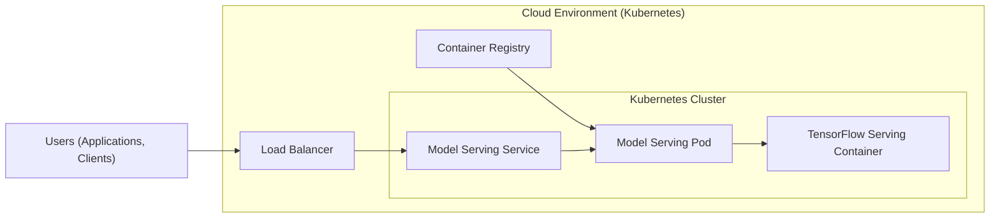
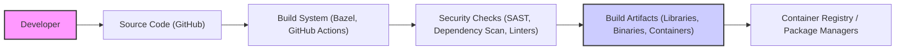

# BUSINESS POSTURE

TensorFlow is an open-source machine learning framework widely used across academia and industry. Its primary business goal is to be the leading platform for machine learning model development and deployment, fostering innovation and adoption of AI technologies.

Business priorities include:
- Maintaining a robust and feature-rich framework that meets the evolving needs of the machine learning community.
- Ensuring cross-platform compatibility and performance across diverse hardware and software environments.
- Fostering a strong and active community of developers and researchers.
- Enabling seamless integration with other popular tools and platforms in the AI/ML ecosystem.
- Supporting enterprise adoption through stability, scalability, and security.

Most important business risks that need to be addressed:
- Security vulnerabilities in the framework could lead to misuse, data breaches, or model manipulation, damaging user trust and adoption.
- Performance bottlenecks or lack of scalability could hinder enterprise adoption and limit the framework's applicability to large-scale AI problems.
- Community fragmentation or lack of contributions could slow down development and innovation.
- Competition from other emerging machine learning frameworks could reduce TensorFlow's market share and influence.
- Legal and ethical concerns related to AI models built with TensorFlow (e.g., bias, fairness, privacy) could impact its reputation and adoption.

# SECURITY POSTURE

Existing security controls:
- security control: Open source code review process. Implemented through GitHub pull requests and community contributions.
- security control: Regular security audits and vulnerability scanning. Details of these audits are not publicly available but are common practice for projects of this scale.
- security control: Community reporting and response to security vulnerabilities. Managed through GitHub issues and security mailing lists.
- security control: Secure software development lifecycle practices are likely followed by contributors, including testing and code quality checks.
- security control: Use of standard build and packaging processes, which may include some basic security checks.
- accepted risk: Reliance on community contributions for security fixes, which may have variable response times.
- accepted risk: Potential for vulnerabilities to be present in third-party dependencies.
- accepted risk: Security of user-developed models and applications built on top of TensorFlow is the responsibility of the user.

Recommended security controls:
- security control: Implement automated security scanning tools (SAST, DAST, dependency scanning) in the CI/CD pipeline.
- security control: Establish a formal Security Response Team with clear processes for vulnerability handling and disclosure.
- security control: Conduct regular penetration testing by external security experts.
- security control: Provide security guidelines and best practices for users developing applications with TensorFlow.
- security control: Enhance supply chain security measures for dependencies and build artifacts.

Security requirements:
- Authentication: TensorFlow itself does not handle user authentication as it is a library. Authentication is relevant in the context of systems built using TensorFlow, such as model serving platforms or data pipelines.
- Authorization: Similar to authentication, authorization is relevant for systems built using TensorFlow. Access control mechanisms are needed to manage access to models, data, and APIs in those systems.
- Input validation: TensorFlow models are susceptible to adversarial attacks through carefully crafted inputs. Robust input validation and sanitization are crucial for applications using TensorFlow to prevent model manipulation and unexpected behavior. This should be implemented at the application level using TensorFlow.
- Cryptography: TensorFlow utilizes cryptography for various purposes, including:
    - Secure communication (e.g., HTTPS for model serving).
    - Data encryption at rest and in transit in systems built using TensorFlow.
    - Secure computation techniques like federated learning and differential privacy, which are increasingly important in machine learning. TensorFlow provides cryptographic primitives that can be used for these purposes.

# DESIGN

## C4 CONTEXT



Context Diagram Elements:

- Element:
    - Name: "TensorFlow"
    - Type: Software System
    - Description: The core machine learning framework, providing APIs, runtime, and tools for developing and deploying ML models.
    - Responsibilities:
        - Providing a comprehensive set of APIs for building and training machine learning models.
        - Managing computation and execution of ML models across different hardware.
        - Offering tools for model evaluation, debugging, and optimization.
        - Supporting various machine learning paradigms (deep learning, classical ML, etc.).
    - Security controls:
        - Security control: Code review process.
        - security control: Vulnerability scanning.
        - security control: Community security reporting.

- Element:
    - Name: "Users (Developers, Researchers, Enterprises)"
    - Type: Person
    - Description: Individuals and organizations that use TensorFlow to build, train, and deploy machine learning models for various applications.
    - Responsibilities:
        - Utilizing TensorFlow APIs and tools to develop ML solutions.
        - Providing data for training models.
        - Deploying and managing ML models in their respective environments.
        - Reporting issues and contributing to the TensorFlow community.
    - Security controls:
        - Security control: Responsible for secure usage of TensorFlow APIs and best practices in their applications.
        - security control: Responsible for securing their own data and infrastructure.

- Element:
    - Name: "Data Sources (Datasets, Databases, Cloud Storage)"
    - Type: External System
    - Description: Systems that provide data used for training and evaluating machine learning models in TensorFlow.
    - Responsibilities:
        - Storing and providing access to datasets for model training.
        - Ensuring data quality and integrity.
        - Managing data access control and security.
    - Security controls:
        - Security control: Data encryption at rest and in transit.
        - security control: Access control mechanisms to restrict data access.
        - security control: Data validation and sanitization to prevent malicious data injection.

- Element:
    - Name: "MLOps Platforms (Kubeflow, Vertex AI, SageMaker)"
    - Type: External System
    - Description: Platforms that provide infrastructure and tools for managing the machine learning lifecycle, including model deployment, monitoring, and scaling, often integrating with TensorFlow.
    - Responsibilities:
        - Providing infrastructure for deploying and serving TensorFlow models.
        - Managing model versions and deployments.
        - Monitoring model performance and health.
        - Scaling model serving infrastructure.
    - Security controls:
        - Security control: Authentication and authorization for platform access.
        - security control: Secure deployment pipelines.
        - security control: Monitoring and logging of platform activities.

- Element:
    - Name: "Hardware Accelerators (GPUs, TPUs)"
    - Type: External System
    - Description: Specialized hardware used to accelerate the computation of machine learning models in TensorFlow.
    - Responsibilities:
        - Providing efficient computation for model training and inference.
        - Ensuring compatibility with TensorFlow framework.
    - Security controls:
        - Security control: Hardware security features (if applicable).
        - security control: Secure drivers and firmware.

- Element:
    - Name: "Other ML Frameworks (PyTorch, scikit-learn)"
    - Type: External System
    - Description: Other machine learning frameworks that may interoperate with TensorFlow or be used in conjunction with it.
    - Responsibilities:
        - Providing alternative or complementary ML functionalities.
        - Supporting model conversion and interoperability with TensorFlow.
    - Security controls:
        - Security control: Framework-specific security controls.
        - security control: Secure interoperability mechanisms.

## C4 CONTAINER

```mermaid
graph LR
    subgraph "TensorFlow System"
        subgraph "API Containers"
            PythonAPI["Python API"]
            CPPAPI["C++ API"]
            JavaAPI["Java API"]
            JSAPI["JavaScript API"]
            SwiftAPI["Swift API"]
        end
        Runtime["Runtime Engine (C++)"]
        subgraph "Kernel Containers"
            CPUKernels["CPU Kernels"]
            GP Kernels["GPU Kernels (CUDA, ROCm)"]
            TPUKernels["TPU Kernels"]
            CustomKernels["Custom Kernels"]
        end
        Compiler["Compiler (XLA)"]
        GraphExecution["Graph Execution Engine"]
        DeviceDrivers["Device Drivers (CPU, GPU, TPU)"]
    end

    Users --> PythonAPI
    Users --> CPPAPI
    Users --> JavaAPI
    Users --> JSAPI
    Users --> SwiftAPI

    PythonAPI --> Runtime
    CPPAPI --> Runtime
    JavaAPI --> Runtime
    JSAPI --> Runtime
    SwiftAPI --> Runtime

    Runtime --> GraphExecution
    GraphExecution --> Compiler
    Compiler --> KernelContainers
    KernelContainers --> DeviceDrivers
    DeviceDrivers --> HardwareAccelerators

    Runtime -- Data & Control --> CPUKernels
    Runtime -- Data & Control --> GP Kernels
    Runtime -- Data & Control --> TPUKernels
    Runtime -- Data & Control --> CustomKernels
```

Container Diagram Elements:

- Element:
    - Name: "Python API"
    - Type: Container - Library
    - Description: Python interface to TensorFlow, widely used for model development and research.
    - Responsibilities:
        - Providing a high-level Python API for building and training ML models.
        - Exposing TensorFlow functionalities to Python users.
    - Security controls:
        - Security control: Input validation at API level.
        - security control: Secure coding practices in API implementation.

- Element:
    - Name: "C++ API"
    - Type: Container - Library
    - Description: C++ interface for high-performance applications and core TensorFlow development.
    - Responsibilities:
        - Providing a low-level C++ API for performance-critical applications.
        - Used for developing core TensorFlow components.
    - Security controls:
        - security control: Memory safety and buffer overflow protection in C++ code.
        - security control: Input validation at API level.

- Element:
    - Name: "Java API", "JavaScript API", "Swift API"
    - Type: Container - Libraries
    - Description: APIs for other languages to enable TensorFlow usage in different environments (Java for Android, JavaScript for web, Swift for iOS/macOS).
    - Responsibilities:
        - Providing TensorFlow access from Java, JavaScript, and Swift environments.
    - Security controls:
        - security control: Language-specific security best practices.
        - security control: Input validation at API level.

- Element:
    - Name: "Runtime Engine (C++)"
    - Type: Container - Application
    - Description: Core runtime engine written in C++ that manages graph execution and resource allocation.
    - Responsibilities:
        - Managing the execution of TensorFlow graphs.
        - Resource management (memory, devices).
        - Interfacing with kernels and device drivers.
    - Security controls:
        - security control: Memory safety and buffer overflow protection.
        - security control: Access control for resource management.
        - security control: Secure inter-process communication (if applicable).

- Element:
    - Name: "CPU Kernels", "GPU Kernels (CUDA, ROCm)", "TPU Kernels", "Custom Kernels"
    - Type: Container - Libraries
    - Description: Libraries containing optimized kernel implementations for different hardware architectures (CPU, GPU, TPU, and custom accelerators).
    - Responsibilities:
        - Providing efficient implementations of ML operations for specific hardware.
        - Hardware-specific optimizations.
    - Security controls:
        - security control: Hardware-specific security considerations.
        - security control: Optimized and hardened kernel implementations.

- Element:
    - Name: "Compiler (XLA)"
    - Type: Container - Application
    - Description: XLA (Accelerated Linear Algebra) compiler that optimizes TensorFlow graphs for specific hardware.
    - Responsibilities:
        - Graph optimization and compilation.
        - Hardware-specific code generation.
    - Security controls:
        - security control: Compiler security to prevent malicious code injection.
        - security control: Secure compilation process.

- Element:
    - Name: "Graph Execution Engine"
    - Type: Container - Application
    - Description: Engine responsible for executing the TensorFlow computation graph.
    - Responsibilities:
        - Orchestrating the execution of operations in the graph.
        - Managing data flow between operations.
    - Security controls:
        - security control: Secure graph execution environment.
        - security control: Resource isolation during graph execution.

- Element:
    - Name: "Device Drivers (CPU, GPU, TPU)"
    - Type: Container - Application
    - Description: Device-specific drivers that enable TensorFlow to interact with hardware accelerators.
    - Responsibilities:
        - Hardware communication and control.
        - Exposing hardware capabilities to TensorFlow runtime.
    - Security controls:
        - security control: Secure driver development and updates.
        - security control: Hardware access control through drivers.

## DEPLOYMENT

TensorFlow models can be deployed in various environments, including:
- Local machines (desktops, laptops)
- Cloud platforms (AWS, GCP, Azure)
- Mobile devices (Android, iOS)
- Edge devices (IoT devices, embedded systems)
- Web browsers (using TensorFlow.js)

Let's consider a cloud deployment scenario using a containerized model serving platform like Kubernetes.



Deployment Diagram Elements:

- Element:
    - Name: "Users (Applications, Clients)"
    - Type: External System
    - Description: Applications or clients that send inference requests to the deployed TensorFlow model.
    - Responsibilities:
        - Sending valid inference requests to the model serving endpoint.
        - Handling responses from the model serving service.
    - Security controls:
        - security control: Client-side input validation.
        - security control: Secure communication channels (HTTPS).
        - security control: Authentication and authorization to access the model serving endpoint.

- Element:
    - Name: "Load Balancer"
    - Type: Infrastructure
    - Description: Distributes incoming inference requests across multiple instances of the model serving service for scalability and high availability.
    - Responsibilities:
        - Load balancing incoming traffic.
        - Health checks for backend services.
        - SSL termination (optional).
    - Security controls:
        - security control: DDoS protection.
        - security control: SSL/TLS encryption.
        - security control: Access control lists (ACLs).

- Element:
    - Name: "Model Serving Service"
    - Type: Software System
    - Description: Kubernetes service that exposes the TensorFlow model serving pods.
    - Responsibilities:
        - Routing traffic to backend pods.
        - Service discovery within the Kubernetes cluster.
    - Security controls:
        - security control: Network policies to restrict access within the cluster.
        - security control: Service account-based authentication.

- Element:
    - Name: "Model Serving Pod"
    - Type: Container
    - Description: Kubernetes pod that encapsulates the TensorFlow Serving container.
    - Responsibilities:
        - Running the TensorFlow Serving container.
        - Managing resources for the container.
    - Security controls:
        - security control: Pod security policies/Pod security admission.
        - security control: Resource limits and quotas.

- Element:
    - Name: "TensorFlow Serving Container"
    - Type: Container - Application
    - Description: Container image that packages TensorFlow Serving and the trained model.
    - Responsibilities:
        - Loading and serving the TensorFlow model.
        - Handling inference requests.
        - Model versioning and management.
    - Security controls:
        - security control: Container image vulnerability scanning.
        - security control: Least privilege container execution.
        - security control: Input validation and sanitization in model serving logic.

- Element:
    - Name: "Container Registry"
    - Type: Infrastructure
    - Description: Stores and manages container images, including the TensorFlow Serving container image.
    - Responsibilities:
        - Storing container images.
        - Providing access to container images for deployment.
        - Image versioning and management.
    - Security controls:
        - security control: Access control for container images.
        - security control: Container image signing and verification.
        - security control: Vulnerability scanning of container images in the registry.

## BUILD



Build Process Description:

1. Developer: Developers write and commit code changes to the TensorFlow GitHub repository.
2. Source Code (GitHub): The TensorFlow source code is hosted and managed on GitHub.
3. Build System (Bazel, GitHub Actions): TensorFlow uses Bazel as its primary build system. GitHub Actions are used for CI/CD pipelines, including automated builds and tests.
4. Security Checks (SAST, Dependency Scan, Linters): During the build process, various security checks are performed:
    - Static Application Security Testing (SAST) tools analyze the source code for potential vulnerabilities.
    - Dependency scanning tools check for known vulnerabilities in third-party libraries.
    - Linters enforce code quality and style guidelines, which can indirectly improve security.
5. Build Artifacts (Libraries, Binaries, Containers): The build process produces various artifacts, including:
    - Libraries (Python packages, C++ libraries).
    - Command-line binaries.
    - Container images (e.g., TensorFlow Serving images).
6. Container Registry / Package Managers: Build artifacts are published to:
    - Container registries (e.g., Docker Hub, Google Container Registry) for container images.
    - Package managers (e.g., PyPI, Maven Central) for libraries and binaries.

Build Security Controls:
- security control: Automated build process using Bazel and GitHub Actions.
- security control: Source code hosted on GitHub with access controls and history tracking.
- security control: Integration of SAST tools in the CI/CD pipeline.
- security control: Dependency scanning to identify vulnerable dependencies.
- security control: Code linters and style checks to improve code quality.
- security control: Code review process for all code changes.
- security control: Signing of build artifacts (not explicitly mentioned for TensorFlow, but a recommended practice).
- security control: Vulnerability scanning of container images before publishing to registries.

# RISK ASSESSMENT

Critical business processes we are trying to protect:
- Development and distribution of the TensorFlow framework itself.
- User adoption and trust in TensorFlow as a secure and reliable platform.
- Integrity of machine learning models built and deployed using TensorFlow.
- Confidentiality and integrity of data processed by TensorFlow models in user applications.
- Availability and performance of TensorFlow framework and applications built on it.

Data we are trying to protect and their sensitivity:
- TensorFlow source code: High sensitivity. Confidentiality and integrity are crucial to prevent malicious modifications and maintain trust in the framework.
- Build artifacts (libraries, binaries, containers): High sensitivity. Integrity is paramount to ensure users are downloading and using legitimate and untampered artifacts.
- User data processed by TensorFlow models: Sensitivity varies depending on the application. Can range from low (public datasets) to high (sensitive personal or financial data). Requires confidentiality, integrity, and availability depending on the context.
- Trained machine learning models: Sensitivity varies. Models can contain proprietary algorithms or be trained on sensitive data. Requires confidentiality and integrity to protect intellectual property and prevent model theft or manipulation.
- Security vulnerabilities information: High sensitivity. Confidentiality is crucial to prevent exploitation before patches are available. Integrity is important to ensure accurate vulnerability information and remediation guidance.

# QUESTIONS & ASSUMPTIONS

Questions:
- What specific SAST/DAST tools and dependency scanning tools are integrated into the TensorFlow CI/CD pipeline?
- Is there a formal Security Response Team for TensorFlow? What are their processes for vulnerability handling and disclosure?
- Are regular penetration tests conducted by external security experts? If so, what is the frequency and scope?
- Are build artifacts (libraries, binaries, containers) digitally signed to ensure integrity?
- Are there specific security guidelines and best practices provided to users developing applications with TensorFlow?

Assumptions:
- TensorFlow follows secure software development lifecycle practices, including code reviews, testing, and security considerations.
- TensorFlow community and maintainers are responsive to security vulnerability reports.
- Standard security practices are applied in the build and deployment processes for TensorFlow components.
- Users of TensorFlow are responsible for securing their own applications, data, and infrastructure built using TensorFlow.
- TensorFlow project prioritizes security as a key aspect of the framework's development and maintenance.