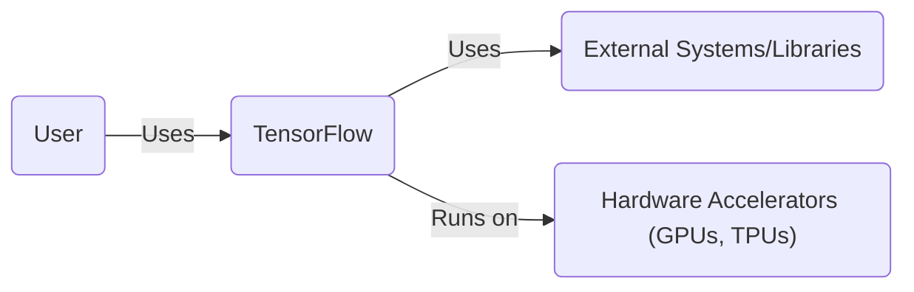
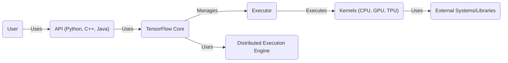
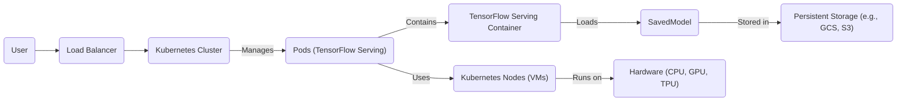
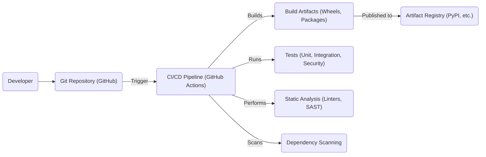

# BUSINESS POSTURE

Business Priorities and Goals:

*   Provide a leading open-source machine learning framework.
*   Enable widespread adoption and use of machine learning across various industries and applications.
*   Foster a strong community of contributors and users.
*   Support cutting-edge research and development in machine learning.
*   Offer a flexible and scalable platform for deploying machine learning models in diverse environments, from mobile devices to large-scale data centers.
*   Maintain compatibility and interoperability with a wide range of hardware and software platforms.

Most Important Business Risks:

*   Malicious actors could exploit vulnerabilities in the framework to compromise models, data, or infrastructure.
*   The complexity of the framework could lead to unintentional misconfigurations or misuse, resulting in security breaches or incorrect model behavior.
*   The framework's reliance on external dependencies could introduce supply chain vulnerabilities.
*   Lack of proper access controls and authentication mechanisms could allow unauthorized access to sensitive data or models.
*   Insufficient input validation could lead to model poisoning or denial-of-service attacks.
*   Failure to address privacy concerns could lead to legal and reputational damage.

# SECURITY POSTURE

Existing Security Controls:

*   security control: TensorFlow Security Policy (described in SECURITY.md) provides guidelines for reporting vulnerabilities and describes the support lifecycle.
*   security control: Code reviews are performed for all changes to the codebase.
*   security control: Static analysis tools are used to identify potential security vulnerabilities.
*   security control: Fuzzing is employed to test the robustness of the framework against unexpected inputs.
*   security control: TensorFlow Lite provides options for on-device machine learning, reducing the need to transmit sensitive data to the cloud.
*   security control: TensorFlow Federated offers a framework for decentralized machine learning, enhancing data privacy.

Accepted Risks:

*   accepted risk: The framework's complexity and extensive feature set make it challenging to guarantee complete security.
*   accepted risk: The open-source nature of the project exposes the codebase to potential scrutiny by malicious actors.
*   accepted risk: The framework's reliance on external dependencies introduces a degree of supply chain risk.

Recommended Security Controls:

*   Implement a comprehensive Software Bill of Materials (SBOM) to track all dependencies and their versions.
*   Integrate dynamic analysis tools (e.g., DAST) into the testing pipeline.
*   Develop and enforce a secure coding standard specifically tailored to machine learning applications.
*   Provide detailed security documentation and best practices for developers and users.
*   Establish a dedicated security team responsible for vulnerability management and incident response.
*   Offer security training and awareness programs for contributors and users.
*   Regularly conduct penetration testing and red team exercises.

Security Requirements:

*   Authentication:
    *   Strong authentication mechanisms should be used to protect access to sensitive data, models, and infrastructure.
    *   Multi-factor authentication should be considered for critical operations.
*   Authorization:
    *   Role-based access control (RBAC) should be implemented to restrict access based on user roles and responsibilities.
    *   The principle of least privilege should be enforced.
*   Input Validation:
    *   All inputs to the framework, including model inputs, training data, and configuration parameters, should be rigorously validated.
    *   Input validation should be performed at multiple layers of the framework.
*   Cryptography:
    *   Sensitive data, such as model weights and training data, should be encrypted at rest and in transit.
    *   Strong cryptographic algorithms and key management practices should be used.
    *   Consider using hardware security modules (HSMs) for key storage and cryptographic operations.

# DESIGN

## C4 CONTEXT

Element Descriptions:

*   Element:
    *   Name: User
    *   Type: Person
    *   Description: Represents individuals or systems that utilize TensorFlow for machine learning tasks.
    *   Responsibilities: Develop, train, deploy, and manage machine learning models using TensorFlow.
    *   Security controls: Implement appropriate authentication and authorization mechanisms when interacting with TensorFlow deployments.
*   Element:
    *   Name: TensorFlow
    *   Type: Software System
    *   Description: The open-source machine learning framework.
    *   Responsibilities: Provide APIs and tools for building, training, and deploying machine learning models.
    *   Security controls: Code reviews, static analysis, fuzzing, security policy.
*   Element:
    *   Name: External Systems/Libraries
    *   Type: Software System
    *   Description: External libraries and systems that TensorFlow depends on (e.g., NumPy, protobuf).
    *   Responsibilities: Provide supporting functionalities for TensorFlow.
    *   Security controls: Dependency management, vulnerability scanning.
*   Element:
    *   Name: Hardware Accelerators (GPUs, TPUs)
    *   Type: Hardware
    *   Description: Specialized hardware used to accelerate machine learning computations.
    *   Responsibilities: Execute computationally intensive operations.
    *   Security controls: Hardware-level security features, secure boot, firmware integrity checks.

## C4 CONTAINER

Element Descriptions:

*   Element:
    *   Name: User
    *   Type: Person
    *   Description: Represents individuals or systems that utilize TensorFlow for machine learning tasks.
    *   Responsibilities: Develop, train, deploy, and manage machine learning models using TensorFlow.
    *   Security controls: Implement appropriate authentication and authorization mechanisms when interacting with TensorFlow deployments.
*   Element:
    *   Name: API (Python, C++, Java)
    *   Type: API
    *   Description: Provides interfaces for interacting with TensorFlow in different programming languages.
    *   Responsibilities: Expose TensorFlow functionalities to users.
    *   Security controls: Input validation, API security best practices.
*   Element:
    *   Name: TensorFlow Core
    *   Type: Component
    *   Description: The core runtime of TensorFlow.
    *   Responsibilities: Manages graph execution, resource allocation, and operation dispatching.
    *   Security controls: Code reviews, static analysis, fuzzing.
*   Element:
    *   Name: Executor
    *   Type: Component
    *   Description: Responsible for executing TensorFlow graphs.
    *   Responsibilities: Schedule and execute operations on available devices.
    *   Security controls: Secure handling of graph execution, resource isolation.
*   Element:
    *   Name: Distributed Execution Engine
    *   Type: Component
    *   Description: Enables distributed training and execution of TensorFlow models.
    *   Responsibilities: Coordinate communication and data transfer between different devices and processes.
    *   Security controls: Secure communication protocols, authentication, authorization.
*   Element:
    *   Name: Kernels (CPU, GPU, TPU)
    *   Type: Component
    *   Description: Implementations of TensorFlow operations for specific hardware devices.
    *   Responsibilities: Perform the actual computations.
    *   Security controls: Code reviews, performance optimization, security hardening.
*   Element:
    *   Name: External Systems/Libraries
    *   Type: Software System
    *   Description: External libraries and systems that TensorFlow depends on (e.g., NumPy, protobuf, CUDA, cuDNN).
    *   Responsibilities: Provide supporting functionalities for TensorFlow.
    *   Security controls: Dependency management, vulnerability scanning.

## DEPLOYMENT

Possible Deployment Solutions:

1.  Local Machine: TensorFlow can be installed and run directly on a user's local machine (CPU or GPU).
2.  Cloud Virtual Machines (VMs): TensorFlow can be deployed on VMs in cloud environments like Google Cloud Platform (GCP), Amazon Web Services (AWS), or Microsoft Azure.
3.  Containers (Docker): TensorFlow can be packaged and deployed within Docker containers, providing portability and consistency.
4.  Kubernetes: TensorFlow can be deployed and managed at scale using Kubernetes, an orchestration platform for containerized applications.
5.  Serverless Platforms: TensorFlow models can be deployed on serverless platforms like AWS Lambda or Google Cloud Functions.
6.  Edge Devices (TensorFlow Lite): TensorFlow Lite enables deployment on mobile and embedded devices.
7.  TensorFlow Serving: A dedicated system for serving TensorFlow models in production.

Chosen Deployment Solution (Kubernetes):

Element Descriptions:

*   Element:
    *   Name: User
    *   Type: Person
    *   Description: Represents individuals or systems that interact with the deployed TensorFlow model.
    *   Responsibilities: Send requests to the model and receive predictions.
    *   Security controls: Authentication, authorization, rate limiting.
*   Element:
    *   Name: Load Balancer
    *   Type: Network Infrastructure
    *   Description: Distributes incoming requests across multiple instances of the TensorFlow Serving application.
    *   Responsibilities: Ensure high availability and scalability.
    *   Security controls: SSL/TLS termination, DDoS protection.
*   Element:
    *   Name: Kubernetes Cluster
    *   Type: Container Orchestration Platform
    *   Description: Manages the deployment, scaling, and operation of containerized applications.
    *   Responsibilities: Provide a platform for running TensorFlow Serving.
    *   Security controls: Network policies, RBAC, pod security policies.
*   Element:
    *   Name: Pods (TensorFlow Serving)
    *   Type: Kubernetes Pod
    *   Description: Run one or more containers that host the TensorFlow Serving application.
    *   Responsibilities: Serve TensorFlow models.
    *   Security controls: Resource limits, container security context.
*   Element:
    *   Name: TensorFlow Serving Container
    *   Type: Docker Container
    *   Description: Contains the TensorFlow Serving application and its dependencies.
    *   Responsibilities: Load and serve TensorFlow models.
    *   Security controls: Container image scanning, minimal base image.
*   Element:
    *   Name: SavedModel
    *   Type: File
    *   Description: The trained TensorFlow model in a standardized format.
    *   Responsibilities: Provide the model for inference.
    *   Security controls: Model signing, integrity checks.
*   Element:
    *   Name: Persistent Storage (e.g., GCS, S3)
    *   Type: Storage Service
    *   Description: Stores the SavedModel files.
    *   Responsibilities: Provide durable storage for models.
    *   Security controls: Access control, encryption at rest.
*   Element:
    *   Name: Kubernetes Nodes (VMs)
    *   Type: Virtual Machine
    *   Description: The worker nodes in the Kubernetes cluster.
    *   Responsibilities: Run the Kubernetes pods.
    *   Security controls: OS hardening, vulnerability patching.
*   Element:
    *   Name: Hardware (CPU, GPU, TPU)
    *   Type: Hardware
    *   Description: The underlying hardware resources.
    *   Responsibilities: Provide compute power.
    *   Security controls: Hardware-level security features.

## BUILD

Build Process Description:

1.  Developer: Developers write and modify TensorFlow code and push changes to the Git repository (GitHub).
2.  Git Repository (GitHub): The central repository for TensorFlow source code.
3.  CI/CD Pipeline (GitHub Actions): GitHub Actions is used to automate the build, test, and packaging process.
    *   Triggers: The pipeline is triggered by events such as pushes to the repository or pull requests.
    *   Builds: The pipeline builds TensorFlow from source, creating build artifacts like Python wheels and other packages.
    *   Tests: The pipeline runs various tests, including unit tests, integration tests, and security tests.
    *   Static Analysis: Static analysis tools (linters, SAST) are used to identify code quality issues and potential security vulnerabilities.
    *   Dependency Scanning: Dependencies are scanned for known vulnerabilities.
4.  Build Artifacts (Wheels, Packages): The output of the build process, including installable packages.
5.  Artifact Registry (PyPI, etc.): Build artifacts are published to artifact registries like PyPI, making them available for users to install.

Security Controls:

*   Code Reviews: All code changes are reviewed by other developers before being merged.
*   Static Analysis (SAST): Tools like linters and SAST scanners are used to identify potential security vulnerabilities in the code.
*   Dependency Scanning: Dependencies are scanned for known vulnerabilities.
*   Tests: Automated tests, including security tests, are run to verify the security of the framework.
*   Signed Commits: Developers are encouraged to sign their commits to ensure authenticity.
*   Build Automation: The build process is fully automated, reducing the risk of manual errors.

# RISK ASSESSMENT

Critical Business Processes:

*   Model Training: The process of training machine learning models using TensorFlow.
*   Model Deployment: The process of deploying trained models for inference.
*   Data Processing: The handling and processing of data used for training and inference.
*   Research and Development: The ongoing development of new features and improvements to TensorFlow.

Data Sensitivity:

*   Model Weights: Highly sensitive, as they represent the learned knowledge of the model and could be used for malicious purposes if compromised.
*   Training Data: Can range from publicly available datasets to highly sensitive and confidential data, depending on the application.
*   Inference Data: Can also range in sensitivity, depending on the application.
*   User Data: Data collected from users interacting with TensorFlow-based applications.
*   Configuration Data: Information about the deployment environment, which could be exploited to gain access to the system.

# QUESTIONS & ASSUMPTIONS

Questions:

*   What specific threat actors are of greatest concern (e.g., nation-state actors, script kiddies, insiders)?
*   What are the regulatory and compliance requirements for the applications built using TensorFlow?
*   What is the expected lifespan of the models and the data used to train them?
*   What are the performance requirements for the deployed models?
*   Are there any specific hardware or software constraints that need to be considered?
*   What level of support and maintenance will be provided for TensorFlow?
*   What is the process for handling security incidents and vulnerabilities?

Assumptions:

*   BUSINESS POSTURE: The primary goal is to provide a robust and widely used open-source machine learning framework, balancing security with usability and performance.
*   SECURITY POSTURE: The existing security controls are a good starting point, but there is room for improvement, particularly in areas like dynamic analysis, secure coding standards, and security training.
*   DESIGN: The deployment architecture will be based on Kubernetes, providing scalability and resilience. The build process will be fully automated using GitHub Actions.