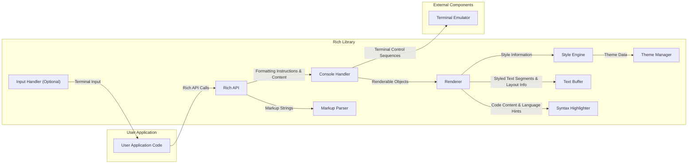
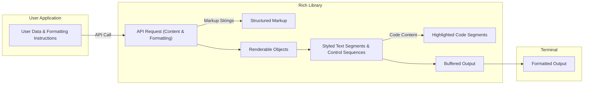

# Project Design Document: Rich - Python Library for Rich Text in Terminals

**Version:** 1.1
**Date:** October 26, 2023
**Author:** AI Software Architect

## 1. Introduction

This document provides a detailed design overview of the Rich Python library, a tool for displaying rich text, tables, progress bars, syntax highlighting, markdown, and more in the terminal. This document aims to capture the key architectural components, data flow, and interactions within the library, making it suitable for subsequent threat modeling activities. This version includes more detailed descriptions and refined diagrams for improved clarity.

## 2. Goals and Objectives

The primary goals of the Rich library are:

*   Provide a user-friendly Python API for generating visually appealing and informative terminal output with features like:
    *   Coloring (foreground and background).
    *   Text styling (bold, italic, underline, etc.).
    *   Layout elements (tables, columns, panels).
    *   Animated elements (progress bars, spinners).
*   Support a wide range of formatting options, including ANSI escape codes and platform-specific terminal capabilities.
*   Offer high-level abstractions for common terminal output tasks, such as displaying tables, progress bars, and syntax-highlighted code.
*   Be easily integrable into existing Python applications with minimal configuration.
*   Maintain broad cross-platform compatibility across different operating systems (Linux, macOS, Windows) and terminal emulators.

## 3. System Architecture

The Rich library can be conceptually divided into several key interacting components. The following diagram illustrates the high-level architecture:

### 3.1. Component Descriptions

*   **User Application Code:** The Python code that utilizes the Rich library to generate terminal output by instantiating Rich objects and calling its methods.
*   **Rich API:** The public interface of the Rich library, providing functions, classes, and decorators for creating and displaying rich content. This includes:
    *   The top-level `print()` replacement.
    *   The `Console` class for managing output.
    *   Factory functions and classes for creating renderable objects like `Text`, `Table`, `Progress`, `Syntax`, `Markdown`, etc.
    *   Context managers for applying styles and themes.
*   **Console Handler:** Manages the terminal output stream and provides a consistent interface for writing to the terminal, abstracting away platform-specific differences. It handles:
    *   Buffering and flushing output.
    *   Interacting with the terminal's standard output (stdout) or standard error (stderr).
    *   Detecting terminal capabilities (e.g., color support, terminal size).
    *   Handling terminal resizing events.
*   **Renderer:** Responsible for taking high-level Rich objects and converting them into a concrete sequence of styled text segments and terminal control sequences that can be understood by the terminal. This involves:
    *   Iterating through renderable objects.
    *   Applying styles based on the current context and theme.
    *   Calculating layout for complex elements like tables and columns.
    *   Generating appropriate ANSI escape codes or platform-specific terminal commands.
*   **Style Engine:** Manages the application of styles (colors, bold, italic, etc.) to text. It interprets style strings and maps them to terminal control sequences. It also handles style inheritance and precedence rules.
*   **Theme Manager:** Handles the loading, management, and application of color themes, allowing users to customize the appearance of Rich output. It provides a way to define and switch between different color palettes and style configurations.
*   **Text Buffer:** An internal data structure that holds the styled text segments and control sequences generated by the `Renderer` before they are sent to the terminal. It acts as an intermediate representation of the output.
*   **Input Handler (Optional):** Provides functionality for capturing and processing user input within the terminal, often used for interactive applications built with Rich. This might involve handling keyboard events or mouse clicks within the terminal.
*   **Markup Parser:** Responsible for parsing Rich's custom markup language (e.g., `[bold red]text[/bold red]`) and converting it into structured data that can be processed by the `Renderer`.
*   **Syntax Highlighter:**  Uses a library like Pygments to perform syntax highlighting of code snippets embedded within Rich output. It analyzes the code and applies styles based on the programming language.
*   **Terminal Emulator:** The external application (e.g., iTerm2, Windows Terminal, gnome-terminal) that interprets the terminal control sequences generated by Rich and displays the formatted output to the user.

## 4. Data Flow

The typical data flow within the Rich library follows these steps:

1. **User Application Interaction:** The user application code calls functions within the Rich API, providing content and formatting instructions (e.g., `console.print("Hello, [bold red]World[/bold red]!")`, or creates Rich objects like `Table`).
2. **API Processing and Markup Parsing:** The Rich API receives the user's request. If the input contains Rich markup, the `Markup Parser` processes it to create structured representations of the styled text.
3. **Console Handling:** The API passes the structured content (renderable objects) to the `Console` handler.
4. **Rendering:** The `Console` invokes the `Renderer` to process the renderable objects. The `Renderer` iterates through the objects, determines the appropriate styles (using the `Style Engine` and `Theme Manager`), and calculates the layout. For code blocks, the `Renderer` utilizes the `Syntax Highlighter`.
5. **Style Application:** The `Style Engine` and `Theme Manager` provide the `Renderer` with the terminal control sequences corresponding to the requested styles.
6. **Text Buffering:** The `Renderer` populates the `Text Buffer` with styled text segments and the necessary terminal control sequences.
7. **Output to Terminal:** The `Console` takes the formatted output from the `Text Buffer` and writes it to the `Terminal Emulator`'s output stream (stdout or stderr).
8. **Terminal Display:** The `Terminal Emulator` interprets the control sequences and displays the formatted text to the user.

The following diagram illustrates the data flow:

## 5. Security Considerations (Preliminary)

This section outlines preliminary security considerations. A more detailed threat model will be developed based on this design.

*   **Input Validation and Sanitization (Markup Parser):** The `Markup Parser` must carefully validate and sanitize user-provided markup strings to prevent injection of malicious terminal control sequences or unexpected behavior. Improper parsing could lead to:
    *   Arbitrary code execution if the terminal emulator interprets crafted sequences in a dangerous way.
    *   Denial-of-service by overwhelming the terminal with excessive output or control sequences.
    *   Spoofing or misleading output by manipulating the terminal display.
*   **Terminal Escape Sequence Generation (Renderer & Style Engine):** The `Renderer` and `Style Engine` are responsible for generating terminal escape sequences. Security risks include:
    *   Generating sequences that exploit vulnerabilities in specific terminal emulators.
    *   Accidentally generating sequences that could compromise the user's terminal session.
    *   Allowing user-controlled styles to inject arbitrary escape sequences.
*   **Dependency Vulnerabilities (Syntax Highlighter):** The `Syntax Highlighter` relies on external libraries like Pygments. Vulnerabilities in these dependencies could be exploited if Rich doesn't handle them carefully. This includes:
    *   Potential for arbitrary code execution if Pygments has vulnerabilities in its language parsers.
    *   Denial-of-service if Pygments encounters specially crafted code snippets.
*   **Configuration Security (Theme Manager):** If Rich allows users to load custom themes from external sources, there's a risk of:
    *   Malicious themes injecting harmful terminal control sequences.
    *   Themes exploiting vulnerabilities in the theme loading or parsing mechanism.
*   **Input Handling Vulnerabilities (Input Handler):** If the `Input Handler` is used, potential vulnerabilities include:
    *   Injection of malicious input that could be interpreted by the application in unintended ways.
    *   Denial-of-service if the input handler is not robust against unexpected input.
*   **Denial of Service:**  Careless use of Rich features or vulnerabilities in the library itself could lead to excessive resource consumption (CPU, memory) or the generation of extremely large output, potentially causing a denial of service.

## 6. Component Details

This section provides more detailed information about key components and their functionalities.

### 6.1. Rich API

*   **Purpose:** The primary interface for user interaction.
*   **Key Features:**
    *   `print()`: A drop-in replacement for the built-in `print()` function with Rich formatting. Example: `print("[bold blue]Important message[/bold blue]")`.
    *   `Console` class: Provides methods for more advanced output control, such as clearing the screen, moving the cursor, and printing to specific streams. Example: `console = Console(); console.print("Hello")`.
    *   Renderable objects: Classes like `Text`, `Span`, `Table`, `Progress`, `Syntax`, `Markdown` encapsulate different types of content and their formatting. Example: `table = Table(title="My Table"); table.add_column("Header 1"); table.add_row("Data 1"); console.print(table)`.
    *   Context managers: Allow for applying styles and themes within a specific scope. Example: `with console.style("bold green"): console.print("This is bold green")`.
    *   `input()`: A Rich-aware input function that can display prompts with formatting.
*   **Potential Security Considerations:**  Needs robust input validation to prevent malicious formatting strings from being passed to underlying components.

### 6.2. Console Handler

*   **Purpose:** Manages the interaction with the terminal output stream.
*   **Key Features:**
    *   `print()`: Method for writing renderable objects to the console.
    *   `clear()`: Clears the terminal screen.
    *   `move_cursor()`: Moves the cursor to a specific position.
    *   `size`: Property to get the current terminal size.
    *   `is_terminal`: Property to check if the output is a terminal.
    *   Support for different output streams (stdout, stderr, files).
*   **Potential Security Considerations:**  Must ensure that control sequences sent to the terminal are safe and intended, preventing unintended terminal manipulation.

### 6.3. Renderer

*   **Purpose:** Converts Rich objects into styled text and terminal control sequences.
*   **Key Features:**
    *   Processing of `Text` objects and `Span` styles.
    *   Layout algorithms for `Table`, `Column`, and `Panel` objects.
    *   Integration with the `Syntax Highlighter` for code rendering.
    *   Rendering of progress bars and spinners.
    *   Handling of overflow and wrapping of text.
*   **Potential Security Considerations:**  Needs to be resilient against malformed or malicious formatting instructions that could lead to unexpected output or vulnerabilities. Securely handles the output of the `Syntax Highlighter`.

### 6.4. Style Engine

*   **Purpose:** Manages the application of styles to text segments.
*   **Key Features:**
    *   Parsing of style strings (e.g., "bold red on white").
    *   Mapping of style names to ANSI escape codes and platform-specific terminal commands.
    *   Handling of style inheritance and cascading.
    *   Support for named colors and RGB colors.
*   **Potential Security Considerations:**  Must prevent the injection of arbitrary or dangerous terminal control sequences through style definitions.

### 6.5. Markup Parser

*   **Purpose:** Parses Rich's custom markup language.
*   **Key Features:**
    *   Recognition of tags like `[bold]`, `[red]`, `[/bold]`.
    *   Handling of nested tags.
    *   Error reporting for invalid markup.
*   **Potential Security Considerations:**  This is a critical component for security. It must be designed to prevent injection attacks by carefully validating and sanitizing input.

## 7. Future Considerations

*   **Plugin System:**  A plugin system could allow for extending Rich with new renderable types, themes, or input handlers. Security considerations for plugin development, distribution, and loading would be paramount to prevent malicious extensions.
*   **Advanced Layout Features:**  More sophisticated layout capabilities (e.g., floating elements, absolute positioning) could be added, potentially introducing new security considerations related to how these layouts are defined and rendered, and the potential for layout-based denial-of-service attacks.
*   **WebAssembly Support:**  Compiling Rich to WebAssembly could enable its use in web-based terminals or other environments, introducing new security contexts and considerations related to the browser's security model and potential interactions with the host environment.

This improved document provides a more detailed and refined design overview of the Rich library, offering a stronger foundation for subsequent threat modeling activities. The enhanced component descriptions, data flow diagrams, and more specific security considerations aim to facilitate a more thorough analysis of potential vulnerabilities.
