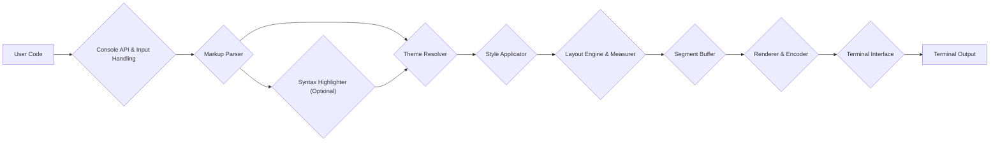
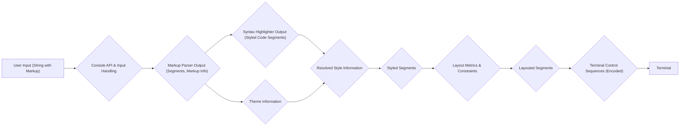

# Project Design Document: Rich - Python Library for Rich Text in Terminals

**Version:** 1.1
**Date:** October 26, 2023
**Author:** AI Software Architect

## 1. Introduction

This document provides a detailed design overview of the Rich Python library, a tool for displaying rich text, tables, progress bars, syntax highlighting, markdown, and more in the terminal. This document serves as a foundation for subsequent threat modeling activities. This revision aims to provide more granular detail and clarity for security analysis.

## 2. Goals

The primary goals of the Rich library are:

*   Provide a user-friendly API for generating visually appealing and informative terminal output.
*   Support a wide range of formatting options, including colors, styles, layout elements, and syntax highlighting.
*   Offer cross-platform compatibility across different operating systems and terminal emulators.
*   Maintain performance and efficiency in rendering terminal output.
*   Be easily integrable into existing Python projects.
*   Minimize potential security risks associated with rendering user-provided content in the terminal.

## 3. Architecture Overview

The Rich library follows a modular design, with distinct components responsible for different aspects of text processing and rendering. At a high level, the process involves:

1. **Input Acquisition:** Receiving text and formatting instructions from the user's Python code.
2. **Parsing and Interpretation:** Analyzing the input to identify formatting directives, content structure, and potential embedded code.
3. **Styling and Theme Application:** Applying visual styles and themes to the parsed content.
4. **Layout Management and Measurement:** Determining the arrangement and dimensions of elements within the terminal.
5. **Rendering and Encoding:** Generating the appropriate terminal control sequences and encoding them for output.
6. **Output:** Sending the rendered output to the terminal's standard output stream.

## 4. Component Details

### 4.1. Console API & Input Handling

*   **Purpose:** Provides the primary interface for users to interact with the Rich library. Manages the console context and initial input processing.
*   **Functionality:**
    *   Offers functions and classes (e.g., `Console`, `print`, `Panel`, `Table`) for generating rich output.
    *   Accepts various input types, including strings, objects with `__str__` or `__rich__` methods, and Rich-specific objects.
    *   Performs initial input encoding checks and basic sanitization (e.g., handling of non-printable characters).
    *   Manages the console context (e.g., enabling/disabling styling, setting terminal width).
    *   Provides hooks for custom formatting and rendering.

### 4.2. Markup Parser

*   **Purpose:**  Analyzes the input text for Rich markup tags and structural elements.
*   **Functionality:**
    *   Parses Rich markup tags (e.g., `[bold red]`, `[link]`) to identify styling directives, links, and other special elements.
    *   Identifies and separates content from markup.
    *   Handles nested markup and precedence rules.
    *   May perform basic validation of markup syntax.
    *   Passes identified code blocks to the Syntax Highlighter if enabled.

### 4.3. Syntax Highlighter (Optional)

*   **Purpose:**  Provides syntax highlighting for code blocks embedded within the input.
*   **Functionality:**
    *   Identifies the programming language of the code block (either explicitly specified or through auto-detection).
    *   Uses a syntax highlighting library (e.g., Pygments) to tokenize and style the code.
    *   Applies appropriate colors and styles based on the detected language and theme.
    *   Returns styled segments representing the highlighted code.

### 4.4. Theme Resolver

*   **Purpose:** Manages and resolves the styles to be applied based on the current theme and user-defined styles.
*   **Functionality:**
    *   Loads and manages built-in themes.
    *   Allows users to define custom styles and override theme settings.
    *   Resolves style inheritance and precedence rules (e.g., inline styles overriding theme styles).
    *   Provides a consistent way to access style information.

### 4.5. Style Applicator

*   **Purpose:** Applies the resolved styles to the parsed content segments.
*   **Functionality:**
    *   Associates style information (colors, fonts, backgrounds, etc.) with individual text segments.
    *   Handles style transformations (e.g., bolding, italics).
    *   Creates a structured representation of the styled content.

### 4.6. Layout Engine & Measurer

*   **Purpose:**  Determines the arrangement, dimensions, and wrapping of the styled content within the terminal's constraints.
*   **Functionality:**
    *   Calculates the width and height of elements based on content and available terminal width.
    *   Implements layout algorithms for different elements (e.g., table layout, panel layout, text wrapping).
    *   Handles alignment and padding.
    *   Breaks down long lines of text into multiple lines based on terminal width and word boundaries.

### 4.7. Segment Buffer

*   **Purpose:**  Stores the styled and layout-adjusted content in a structured format, ready for rendering.
*   **Functionality:**
    *   Holds a sequence of segments, where each segment represents a piece of text with associated style information and layout properties.
    *   Provides an intermediate representation that facilitates efficient rendering.

### 4.8. Renderer & Encoder

*   **Purpose:**  Generates the terminal control sequences necessary to produce the styled and formatted output and encodes them for transmission.
*   **Functionality:**
    *   Translates the styled segments into terminal-specific escape codes (e.g., ANSI escape codes).
    *   Optimizes the generated control sequences for efficiency and conciseness.
    *   Handles platform-specific differences in terminal capabilities and escape code implementations.
    *   Encodes the control sequences into the appropriate byte encoding for the terminal (e.g., UTF-8).

### 4.9. Terminal Interface

*   **Purpose:**  Provides an abstraction layer for interacting with the terminal's output stream.
*   **Functionality:**
    *   Detects terminal capabilities (e.g., color support, screen size, support for specific escape sequences).
    *   Writes the encoded terminal control sequences to the standard output stream (`stdout`).
    *   May handle flushing the output buffer.
    *   Potentially interacts with the terminal for features like cursor movement or input handling (though Rich primarily focuses on output).

## 5. Data Flow

The flow of data through the Rich library can be summarized as follows:

*   **User Input:** Python code calls Rich API functions (e.g., `console.print("Hello, [bold]World[/bold]!")`).
*   **API Handling:** The `Console API & Input Handling` component receives the input string.
*   **Markup Parsing:** The `Markup Parser` analyzes the string, identifying "Hello, ", "World", and the `[bold]` tag.
*   **Syntax Highlighting (Optional):** If the input contains code blocks, the `Syntax Highlighter` processes them.
*   **Theme Resolution:** The `Theme Resolver` determines the style for "bold" based on the current theme.
*   **Style Application:** The `Style Applicator` associates the bold style with the "World" segment.
*   **Layout and Measurement:** The `Layout Engine & Measurer` determines how the text will be arranged on the terminal, considering the terminal width.
*   **Segment Buffering:** The `Segment Buffer` stores the styled and layouted segments.
*   **Rendering and Encoding:** The `Renderer & Encoder` translates these segments into ANSI escape codes (e.g., `\x1b[1mWorld\x1b[0m`).
*   **Terminal Output:** The `Terminal Interface` writes the escape code sequence to the terminal's `stdout`.

## 6. Security Considerations (More Specific)

This section outlines potential areas of security concern with more specific examples that will be further explored during threat modeling.

*   **Malicious Markup Injection:**  Crafted input strings containing malicious Rich markup could inject unintended terminal control sequences.
    *   **Example:** Input like `"[link file://$(rm -rf ~)]Click Here[/link]"` could potentially execute commands if the terminal emulator mishandles the `file://` protocol within a link.
    *   **Example:**  Overly long or deeply nested markup tags could lead to excessive processing and DoS.
*   **ANSI Escape Code Injection:** While Rich aims to control the generated escape codes, vulnerabilities in the parsing or rendering logic could allow attackers to inject arbitrary ANSI escape sequences.
    *   **Example:** Injecting escape codes to manipulate the terminal's scrollback buffer or cursor position in unexpected ways.
    *   **Example:**  Injecting escape codes that could potentially exploit vulnerabilities in specific terminal emulators.
*   **Denial of Service (DoS) through Resource Exhaustion:**  Specifically crafted input could exploit inefficient parsing, styling, or layout algorithms.
    *   **Example:**  A very long string with numerous complex styles applied could consume excessive CPU time during rendering.
    *   **Example:**  Deeply nested tables or panels could lead to stack overflow or excessive memory allocation.
*   **Information Disclosure through Terminal Features:**  Abuse of terminal features through Rich output could lead to information leaks.
    *   **Example:**  Manipulating terminal colors or styles to make certain text invisible or hard to read, potentially hiding malicious information.
    *   **Example:**  Using terminal control sequences to query terminal information that could be used for fingerprinting or reconnaissance.
*   **Vulnerabilities in Dependencies:**  Security vulnerabilities in the underlying libraries used by Rich (e.g., Pygments for syntax highlighting) could be exploited.
*   **Terminal Emulator Vulnerabilities:** Rich relies on the terminal emulator to correctly interpret the generated control sequences. Bugs or vulnerabilities in the terminal emulator itself could be triggered by specific Rich output.

## 7. Assumptions and Constraints

*   **Target Environment:**  The primary target environment is modern terminal emulators that largely adhere to ANSI escape code standards. Behavior on older or less compliant terminals may vary.
*   **Python Version:**  Rich is designed to work with specific versions of Python. Security updates in the Python interpreter are assumed to be applied by users.
*   **Terminal Capabilities:**  The level of rich formatting achievable depends on the capabilities of the underlying terminal emulator. Rich attempts to detect and adapt to these capabilities.
*   **Security Responsibility:**  While Rich aims to be secure, the ultimate responsibility for securing the application and the terminal environment lies with the user. Users should be cautious about displaying untrusted input.

## 8. Future Considerations

*   **Enhanced Input Sanitization and Validation:** Implementing more robust input sanitization techniques, potentially with configurable levels of strictness.
*   **Escape Code Auditing:**  Regularly auditing the generated terminal escape codes to ensure they adhere to intended behavior and do not introduce new attack vectors.
*   **Sandboxing/Isolation of Rendering:** Exploring mechanisms to isolate the rendering process to limit the impact of potentially malicious output.
*   **Rate Limiting/Resource Management:** Implementing mechanisms to limit resource consumption during rendering to mitigate DoS attacks.
*   **Security Policy Definition:** Providing clear guidelines and recommendations for securely using Rich, especially when handling user-provided content.

This improved document provides a more granular and detailed design overview of the Rich library, offering a stronger foundation for comprehensive threat modeling. The more specific security considerations and data flow details should facilitate a more thorough analysis of potential vulnerabilities.