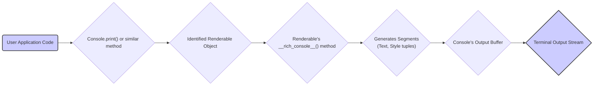

# Project Design Document: Rich - Python Library for Rich Text in Terminals

**Version:** 1.1
**Date:** October 26, 2023
**Author:** Gemini (AI Language Model)

## 1. Introduction

This document provides an enhanced and more detailed design overview of the Rich Python library, available at [https://github.com/textualize/rich](https://github.com/textualize/rich). This revised document aims to provide a deeper understanding of the library's architecture, component interactions, and data flow, making it more robust for subsequent threat modeling activities.

Rich is a Python library designed to enhance terminal output by enabling the display of rich text (with color, style, highlights, etc.) and advanced content such as tables, progress bars, markdown, syntax highlighted code, and tracebacks. It focuses on making terminal output visually appealing, informative, and easier to understand.

## 2. Goals and Objectives

The core goals of the Rich library are:

*   To offer a straightforward and intuitive Application Programming Interface (API) for generating richly formatted terminal output.
*   To support a comprehensive set of formatting options, encompassing colors, styles (bold, italic, underline), and layout elements.
*   To deliver high-fidelity rendering of complex content structures, including tables, code blocks, and progress indicators.
*   To facilitate seamless integration into existing Python projects with minimal configuration.
*   To ensure broad cross-platform compatibility across different operating systems and terminal emulators.

## 3. Architectural Overview

Rich's architecture is structured around several interconnected components that work together to produce rich terminal output. The key components include:

*   **Console:** The central orchestrator, managing the terminal interface and the rendering process.
*   **Style:** Defines the visual attributes applied to text segments.
*   **Theme:** A collection of named styles for consistent and customizable appearance.
*   **Layout Engine:** Responsible for arranging renderable objects within the console's display area.
*   **Renderables:** The fundamental building blocks of content to be displayed.
*   **Highlighter:** Applies styles to text based on syntax or patterns.
*   **Input (Limited):** Provides basic capabilities for receiving user input from the terminal.

## 4. Component Details

### 4.1. Console

*   **Responsibilities:**
    *   Acts as the primary interface to the terminal (handling standard output and standard error streams).
    *   Detects and manages terminal capabilities (e.g., color support, terminal size).
    *   Implements output buffering for performance optimization.
    *   Provides methods for explicitly flushing the output buffer to the terminal.
    *   Applies global styles and themes to the output.
    *   Offers functionalities for clearing the console screen and manipulating the cursor position.
    *   Supports the use of alternative console implementations for testing and specific environments.
*   **Key Methods:**
    *   `print(*objects, sep=' ', end='\n', style=None, justify=None, overflow='crop', no_wrap=False, highlight=None)`: The primary method for rendering one or more objects to the console.
    *   `log(*args, sep=' ', end='\n', style=None, justify=None, overflow='crop', no_wrap=False, log_time=None, time_format='[%x %X]', show_level=True, show_path=True)`:  Specifically designed for logging messages, including timestamps and source information.
    *   `input(prompt='')`:  Allows for receiving text input from the user.
    *   `clear()`: Clears the entire console screen.
    *   `rule(title='', style=None, align='center', characters='─')`: Draws a horizontal rule with an optional title.
    *   `status(status='', spinner='line', spinner_style=None, speed=None)`: Displays a dynamic status message, often with a spinner animation.

### 4.2. Style

*   **Responsibilities:**
    *   Encapsulates the visual formatting attributes of text.
    *   Provides mechanisms for parsing style strings (e.g., "bold red on white", "italic #00ff00").
    *   Supports combining and overriding style attributes.
    *   Offers methods for querying specific style attributes (e.g., checking if a style is bold).
*   **Key Attributes:**
    *   `color`: Specifies the foreground text color (named colors or hexadecimal values).
    *   `bgcolor`: Defines the background color of the text.
    *   `bold`: A boolean indicating whether the text should be bold.
    *   `italic`: A boolean indicating whether the text should be italic.
    *   `underline`: A boolean indicating whether the text should be underlined.
    *   `strike`: A boolean indicating whether the text should be struck through.
    *   `blink`: A boolean indicating whether the text should blink (terminal support dependent).
    *   `reverse`: A boolean indicating whether the foreground and background colors should be swapped.

### 4.3. Theme

*   **Responsibilities:**
    *   Acts as a repository for named `Style` objects.
    *   Enables customization of the visual appearance of Rich output elements.
    *   Supports loading theme definitions from TOML files or Python dictionaries.
    *   Provides a way to apply a specific theme to the `Console`.
*   **Key Concepts:**
    *   Theme definitions map logical names (e.g., "info", "warning", "table.header") to specific `Style` instances.
    *   Themes allow for consistent styling across different parts of the application's output.

### 4.4. Layout Engine

*   **Responsibilities:**
    *   Manages the spatial arrangement of `Renderable` objects within the console's boundaries.
    *   Handles text wrapping and alignment of content.
    *   Implements layout containers for structuring output, such as `Columns`, `Grid`, and `Panel`.
    *   Provides mechanisms for managing content overflow (e.g., cropping, ellipsis).
*   **Key Classes:**
    *   `Layout`: The foundational class for defining layout structures.
    *   `Columns`: Arranges `Renderable` objects into columns with configurable spacing and widths.
    *   `Grid`: Positions `Renderable` objects within a flexible grid structure.
    *   `Panel`: Encloses a `Renderable` within a bordered panel with a title and optional styling.

### 4.5. Renderables

*   **Responsibilities:**
    *   Represent distinct units of content that can be rendered to the console.
    *   Implement the `__rich_console__(self, console: Console, options: ConsoleOptions)` method, which dictates how the object is rendered into a sequence of styled text segments.
*   **Examples:**
    *   `Text`: Represents a string of text with associated styling.
    *   `Table`: Renders tabular data with customizable headers, borders, and cell styling.
    *   `Progress`: Displays progress bars with customizable appearance and task tracking.
    *   `Syntax`: Renders syntax-highlighted code snippets for various programming languages.
    *   `Markdown`: Renders Markdown-formatted text.
    *   `Traceback`: Formats and displays Python exception tracebacks with syntax highlighting.
    *   `Tree`: Visualizes hierarchical data structures.
    *   `Panel`: A container renderable that draws a border around its content.

### 4.6. Highlighter

*   **Responsibilities:**
    *   Applies `Style` objects to specific portions of text based on defined patterns or syntax rules.
    *   Crucial for the functionality of the `Syntax` renderable.
    *   Supports a wide range of programming languages and allows for custom highlighting rules.

### 4.7. Input (Limited)

*   **Responsibilities:**
    *   Provides basic functionality for receiving textual input from the user via the terminal.
    *   Primarily intended for simple interactive prompts.
*   **Key Methods:**
    *   `input(prompt='')`: Displays a prompt to the user and returns the entered text.

## 5. Data Flow

The typical flow of data when Rich renders output involves the following steps:

**Detailed Breakdown:**

1. **User Application Code:** The user's Python code initiates the rendering process by calling a method on the `Console` object, such as `print()`, `log()`, or a method that directly renders a specific `Renderable`.
2. **Identified Renderable Object:** The `Console` determines the object that needs to be rendered. This could be a simple string (implicitly converted to a `Text` renderable) or a more complex `Renderable` instance like a `Table` or `Syntax` object.
3. **Renderable's `__rich_console__()` method:** The `Console` invokes the `__rich_console__` method of the identified `Renderable` object. This method is responsible for defining how the object's content should be represented as a sequence of styled text segments.
4. **Generates Segments (Text, Style tuples):** The `__rich_console__` method generates a sequence of "segments". Each segment is a tuple containing a string of text and the `Style` object that should be applied to that text. For complex renderables, this might involve iterating over internal data structures, applying styles from the active `Theme`, and utilizing the `Highlighter` for syntax highlighting.
5. **Console's Output Buffer:** The generated segments are added to the `Console`'s internal output buffer. This buffering mechanism improves performance by reducing the number of direct writes to the terminal.
6. **Terminal Output Stream:** When the buffer is flushed (either explicitly by the user or implicitly by the `Console`), the `Console` writes the styled text segments to the terminal's standard output (or standard error). The terminal interprets the ANSI escape codes embedded within the styled text to display the rich formatting (colors, styles, etc.).

## 6. Security Considerations (For Threat Modeling)

When considering the security of applications using the Rich library, the following aspects are relevant for threat modeling:

*   **Malicious Input in Renderables:**
    *   **Markdown:** If Rich is used to render Markdown from untrusted sources, carefully assess the potential for malicious Markdown syntax that could exploit vulnerabilities in the Markdown parsing library or lead to unexpected output or behavior. While Rich uses a safe parser, complex or deeply nested structures could potentially cause performance issues (DoS).
    *   **Syntax Highlighting:** While less likely, vulnerabilities in the syntax highlighting logic for specific languages could potentially be exploited with carefully crafted code snippets.
    *   **General Renderables:** Ensure that data passed to renderables (especially from external sources) is sanitized to prevent injection of control characters or escape sequences that could manipulate the terminal in unintended ways.
*   **Dependency Vulnerabilities:** Rich relies on third-party libraries. Regularly audit and update dependencies to mitigate the risk of known vulnerabilities in these libraries. Use tools like `pip check` or vulnerability scanners.
*   **Information Disclosure:**
    *   Be mindful of the sensitivity of information being displayed via Rich. Ensure that output is directed to appropriate channels and that terminal logging or screen sharing does not inadvertently expose confidential data.
    *   Consider the potential for information leakage through error messages or debug output rendered by Rich.
*   **Terminal Emulation Vulnerabilities:** While Rich aims to use standard ANSI escape codes, vulnerabilities in specific terminal emulators could potentially be triggered by carefully crafted output sequences. This is generally outside of Rich's control but is a factor to consider in the overall security posture.
*   **Denial of Service (DoS):**
    *   Large or deeply nested renderables (e.g., very large tables or complex trees) could potentially consume excessive memory or CPU resources, leading to a denial of service if an attacker can control the content being rendered. Implement safeguards to limit the size and complexity of rendered output from untrusted sources.
    *   Rapidly printing a large volume of output could also potentially overwhelm the terminal or the system.
*   **Input Handling Vulnerabilities:** Although Rich's input capabilities are limited, if used, ensure proper validation and sanitization of user input to prevent injection attacks or unexpected behavior.

## 7. Deployment

Rich is typically deployed as a library integrated into Python applications. No specific deployment infrastructure is required for Rich itself. The security of applications utilizing Rich depends on the security practices and architecture of the encompassing application. Consider the security implications of the environment where the application is deployed (e.g., permissions, network access).

## 8. Future Considerations

*   Further development of interactive terminal UI elements.
*   Enhanced support for asynchronous output and rendering.
*   More granular control over terminal capabilities and fallback mechanisms.
*   Potential for extending theming capabilities and customization options.

This revised document provides a more in-depth design overview of the Rich Python library, offering a stronger foundation for threat modeling. It elaborates on the responsibilities of each component, clarifies the data flow, and provides more specific security considerations.