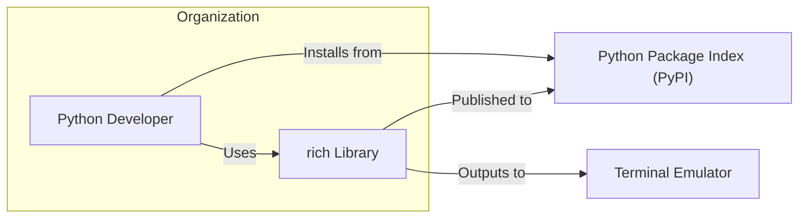
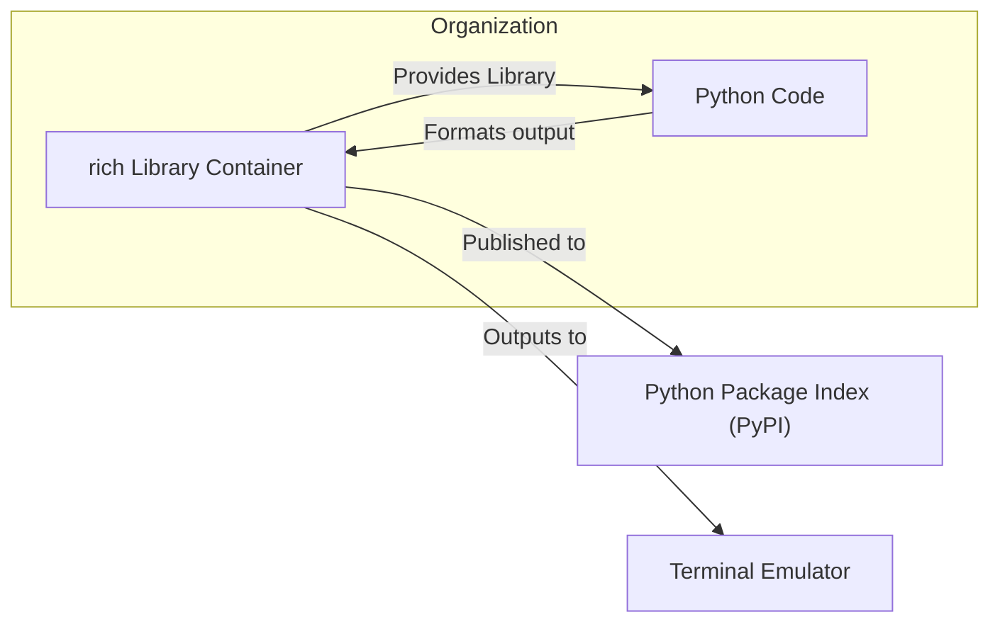
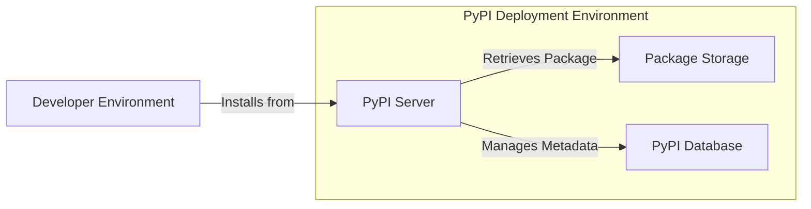
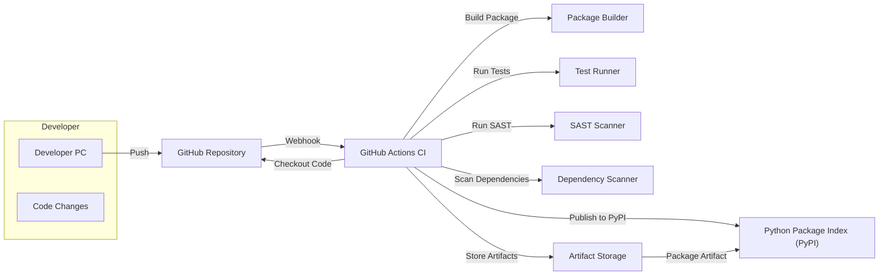

# BUSINESS POSTURE

This project is focused on providing a Python library named `rich` that enhances the visual output of text in terminal environments. The primary business goal is to improve developer experience and productivity by making terminal output more readable, informative, and visually appealing.

Business Priorities:
- Enhance developer productivity and user experience.
- Maintain a high-quality, well-documented, and easy-to-use library.
- Foster a strong open-source community around the library.

Business Risks:
- Supply chain vulnerabilities: If the library or its dependencies are compromised, it could affect projects that depend on it.
- Security vulnerabilities in the library itself could be exploited by malicious actors, although the direct impact is likely to be low as it's primarily a development tool.
- Reputation damage if the library is perceived as unreliable or insecure.

# SECURITY POSTURE

Existing Security Controls:
- security control: GitHub repository hosting with standard GitHub security features (access control, audit logs). Implemented by: GitHub platform.
- security control: Open-source development model with public code review. Implemented by: GitHub and community contributions.
- security control: PyPI package distribution with standard PyPI security features (package signing, malware scanning). Implemented by: PyPI platform.
- accepted risk: Reliance on open-source dependencies.
- accepted risk: Public accessibility of the source code.

Recommended Security Controls:
- security control: Implement automated dependency scanning to identify and address vulnerabilities in third-party libraries.
- security control: Integrate Static Application Security Testing (SAST) tools into the CI/CD pipeline to detect potential security flaws in the code.
- security control: Regularly update dependencies to patch known vulnerabilities.
- security control: Follow secure coding practices and guidelines during development.

Security Requirements:
- Authentication: Not directly applicable as `rich` is a library and does not handle user authentication.
- Authorization: Not directly applicable as `rich` is a library and does not handle user authorization.
- Input Validation: While `rich` primarily generates output, it does accept input to format. Input validation should be considered to prevent unexpected behavior or errors, especially when handling user-provided data to be formatted. Implemented in: `rich` library code.
- Cryptography: Not directly applicable as `rich` does not handle sensitive data or require cryptographic operations.

# DESIGN

## C4 CONTEXT

Context Diagram Elements:

- Element:
    - Name: Python Developer
    - Type: User
    - Description: Software developers who use the `rich` Python library to enhance the output of their Python applications and scripts in terminal environments.
    - Responsibilities: Utilize `rich` library to improve terminal output for debugging, logging, and user interfaces in command-line applications.
    - Security controls: Responsible for using `rich` library securely and updating to the latest versions.

- Element:
    - Name: rich Library
    - Type: System
    - Description: A Python library for rich text and beautiful formatting in the terminal. It provides a powerful API for creating visually appealing and informative terminal output.
    - Responsibilities: Format and render rich text, tables, progress bars, and other visual elements in terminal emulators.
    - Security controls: Input validation of formatting directives, secure handling of terminal output, dependency management.

- Element:
    - Name: Python Package Index (PyPI)
    - Type: External System
    - Description: The official repository for third-party Python packages. `rich` library is published and distributed through PyPI.
    - Responsibilities: Host and distribute Python packages, including `rich`. Provide package integrity and security checks.
    - Security controls: Package signing, malware scanning, access control for package publishing.

- Element:
    - Name: Terminal Emulator
    - Type: External System
    - Description: Software application that emulates a video terminal within some other display architecture. `rich` library outputs formatted text to terminal emulators.
    - Responsibilities: Display text and graphics output from applications, including formatted output from `rich`.
    - Security controls: Terminal emulators are responsible for their own security, including handling potentially malicious terminal escape sequences (though `rich` is designed to mitigate such risks).

## C4 CONTAINER

Container Diagram Elements:

- Element:
    - Name: rich Library Container
    - Type: Container (Python Library)
    - Description: This container represents the `rich` Python library itself, encompassing all its modules, code, and resources. It is distributed as a Python package.
    - Responsibilities: Provide APIs for rich text formatting, layout, and rendering in terminal environments. Manage dependencies and ensure compatibility with Python environments.
    - Security controls: Input validation within the library's formatting functions, secure handling of terminal escape sequences, dependency scanning, SAST during development.

- Element:
    - Name: Python Code
    - Type: Component (Python Modules)
    - Description: The internal modules and components that make up the `rich` library. This includes modules for console output, styling, layout, and various renderers.
    - Responsibilities: Implement the core functionality of the `rich` library, including text formatting, rendering, and terminal interaction.
    - Security controls: Secure coding practices, input validation within components, unit and integration testing.

## DEPLOYMENT

Deployment Architecture: PyPI Distribution

Deployment Diagram Elements (PyPI Distribution):

- Element:
    - Name: PyPI Server
    - Type: Infrastructure (Server)
    - Description: The PyPI server infrastructure responsible for handling package download requests, managing package metadata, and user authentication for publishing.
    - Responsibilities: Serve Python packages to users, manage package index, handle user authentication and authorization for package management.
    - Security controls: Access control, DDoS protection, intrusion detection, regular security updates, TLS encryption for communication.

- Element:
    - Name: Package Storage
    - Type: Infrastructure (Storage)
    - Description: Storage system where Python packages are physically stored on PyPI.
    - Responsibilities: Securely store Python package files. Ensure data integrity and availability.
    - Security controls: Access control, data encryption at rest, backup and recovery mechanisms, integrity checks.

- Element:
    - Name: PyPI Database
    - Type: Infrastructure (Database)
    - Description: Database used by PyPI to store metadata about Python packages, users, and permissions.
    - Responsibilities: Store and manage package metadata, user accounts, and access control information.
    - Security controls: Access control, data encryption at rest and in transit, regular backups, database security hardening.

- Element:
    - Name: Developer Environment
    - Type: Environment
    - Description: The local development environment of a Python developer where they install and use the `rich` library.
    - Responsibilities: Run Python code that utilizes the `rich` library.
    - Security controls: Security of the developer's machine is their responsibility. Using trusted package sources like PyPI.

## BUILD

Build Process: GitHub Actions CI/CD

Build Diagram Elements (GitHub Actions CI/CD):

- Element:
    - Name: Developer PC
    - Type: Environment
    - Description: The local development machine where developers write and test code for the `rich` library.
    - Responsibilities: Code development, local testing, committing and pushing code changes.
    - Security controls: Developer machine security, code review before commit.

- Element:
    - Name: GitHub Repository
    - Type: Code Repository
    - Description: The GitHub repository hosting the source code of the `rich` library.
    - Responsibilities: Version control, code storage, collaboration, triggering CI/CD pipelines.
    - Security controls: Access control, branch protection, audit logs, vulnerability scanning by GitHub.

- Element:
    - Name: GitHub Actions CI
    - Type: CI/CD System
    - Description: GitHub's built-in CI/CD service used to automate the build, test, and deployment process for the `rich` library.
    - Responsibilities: Automate build, test, security scans, and deployment workflows.
    - Security controls: Secure workflow definitions, secrets management, access control, audit logs.

- Element:
    - Name: Package Builder
    - Type: Build Tool
    - Description: Tool responsible for building the Python package (e.g., using `setuptools` or `poetry`).
    - Responsibilities: Compile code (if necessary), package files, create distribution archives (wheels, sdist).
    - Security controls: Build process isolation, integrity checks of build tools.

- Element:
    - Name: Test Runner
    - Type: Testing Tool
    - Description: Tool that executes automated tests (unit tests, integration tests) to verify the functionality of the library.
    - Responsibilities: Run tests, report test results, ensure code quality and functionality.
    - Security controls: Test environment isolation, secure test data management.

- Element:
    - Name: SAST Scanner
    - Type: Security Tool
    - Description: Static Application Security Testing tool used to analyze the source code for potential security vulnerabilities.
    - Responsibilities: Identify potential security flaws in the code without executing it.
    - Security controls: Regularly updated vulnerability rules, configuration for relevant security checks.

- Element:
    - Name: Dependency Scanner
    - Type: Security Tool
    - Description: Tool to scan project dependencies for known vulnerabilities.
    - Responsibilities: Identify vulnerable dependencies, report findings, and recommend updates.
    - Security controls: Regularly updated vulnerability database, integration with dependency management tools.

- Element:
    - Name: Artifact Storage
    - Type: Storage
    - Description: Storage location for build artifacts, such as compiled packages and test results, before publishing.
    - Responsibilities: Securely store build artifacts, versioning, access control.
    - Security controls: Access control, data integrity checks, secure storage.

- Element:
    - Name: Python Package Index (PyPI)
    - Type: Package Registry
    - Description: The Python Package Index where the `rich` library is published for public consumption.
    - Responsibilities: Host and distribute the `rich` Python package.
    - Security controls: PyPI security controls (package signing, malware scanning).

# RISK ASSESSMENT

Critical Business Processes:
- Maintaining the quality and security of the `rich` library to ensure developer trust and continued adoption.
- Efficient and secure distribution of the library to developers via PyPI.

Data to Protect:
- Source code of the `rich` library: Sensitivity - Public (open-source), but integrity and availability are important.
- Build artifacts (packages): Sensitivity - Public, but integrity is crucial to prevent supply chain attacks.
- PyPI publishing credentials: Sensitivity - High, must be kept secret to prevent unauthorized package updates.

Data Sensitivity:
- Publicly available open-source code and packages. The main concern is the integrity and availability of the code and packages, and preventing unauthorized modifications or malicious insertions.

# QUESTIONS & ASSUMPTIONS

Questions:
- What is the intended scope of threat modeling? Is it focused on the library itself, the build and release process, or the usage of the library in other projects?
- Are there any specific security concerns or past incidents related to the `rich` library or similar projects?
- What is the risk appetite of the organization or users relying on the `rich` library? (e.g., startup vs. Fortune 500).

Assumptions:
- BUSINESS POSTURE: The primary business goal is to provide a valuable tool for the Python developer community, and security is important for maintaining trust and reputation.
- SECURITY POSTURE: Standard open-source security practices are followed. The main security risks are related to supply chain vulnerabilities and potential code flaws.
- DESIGN: The library is distributed via PyPI and used by developers in their local environments. The build process is automated using GitHub Actions.