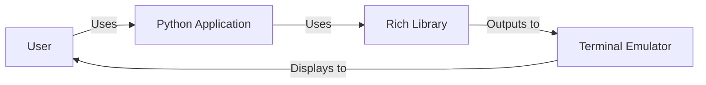
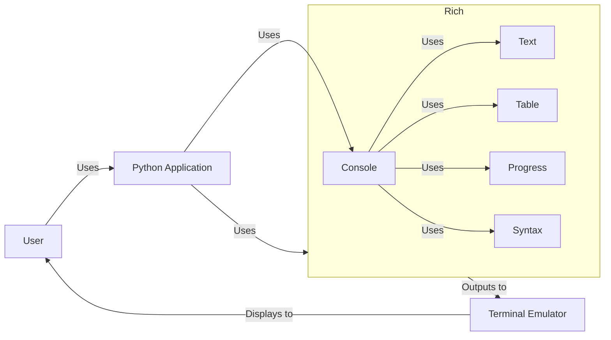
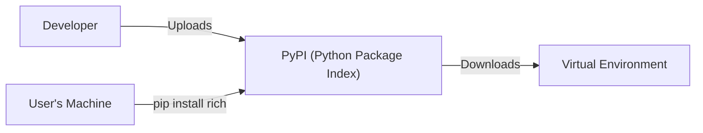
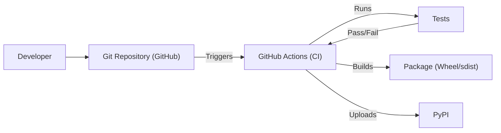

Okay, let's create a design document for the `rich` library, focusing on aspects relevant for threat modeling.

# BUSINESS POSTURE

Business Priorities and Goals:

*   Provide a user-friendly Python library for enhancing terminal output with rich text, colors, tables, progress bars, and other visual elements.
*   Improve the developer experience by making it easy to create visually appealing and informative command-line interfaces (CLIs).
*   Maintain a high level of code quality, test coverage, and documentation to ensure reliability and ease of use.
*   Foster a vibrant open-source community around the project, encouraging contributions and providing support.
*   Ensure the library is performant and does not introduce significant overhead to applications using it.
*   Compatibility across different operating systems (Windows, macOS, Linux) and terminal emulators.

Business Risks:

*   Malicious code injection via crafted input strings could lead to arbitrary code execution if not handled carefully. This is the most significant risk.
*   Denial of service (DoS) through resource exhaustion (e.g., excessive memory allocation) triggered by specially crafted input.
*   Compatibility issues with specific terminal emulators or operating systems could lead to degraded user experience or application crashes.
*   Undiscovered vulnerabilities in the library or its dependencies could be exploited by attackers.
*   Supply chain attacks targeting the library's build or distribution process.
*   Reputational damage due to security vulnerabilities or poor code quality.

# SECURITY POSTURE

Existing Security Controls:

*   security control: Input sanitization: The library likely performs some level of input sanitization to prevent injection vulnerabilities, although the specifics need to be verified in the code. (Implementation: needs verification in code)
*   security control: Testing: The project has a comprehensive test suite, which helps to identify and prevent security regressions. (Described: in GitHub repository, `tests/` directory)
*   security control: Code reviews: Contributions to the project are subject to code review, which helps to catch potential security issues before they are merged. (Described: in GitHub repository, pull request process)
*   security control: Dependency management: The project uses a dependency management system (likely `poetry` or `pip`) to manage its dependencies, which helps to ensure that known vulnerable versions are not used. (Described: in GitHub repository, `pyproject.toml` or `requirements.txt`)
*   security control: Static analysis: It's not explicitly mentioned, but static analysis tools might be used as part of the development process. (Needs verification)

Accepted Risks:

*   accepted risk: Limited control over terminal emulator vulnerabilities: The library relies on the underlying terminal emulator for rendering, and vulnerabilities in the terminal emulator itself are outside the control of the `rich` project.
*   accepted risk: User-provided input: The library is designed to handle user-provided input, which inherently carries some risk of malicious input. The library mitigates this risk through input sanitization, but complete elimination is impossible.

Recommended Security Controls:

*   security control: Fuzz testing: Implement fuzz testing to systematically test the library with a wide range of unexpected or malformed inputs to identify potential vulnerabilities.
*   security control: Regular security audits: Conduct regular security audits of the codebase and its dependencies to identify and address potential vulnerabilities.
*   security control: Content Security Policy (CSP) for terminal output (if applicable): If the library generates output that could be interpreted as HTML or other markup, consider implementing a CSP-like mechanism to restrict the execution of potentially malicious code. This is a novel concept for terminal output and would require careful design.
*   security control: Supply chain security measures: Implement measures to secure the build and distribution process, such as code signing and software bill of materials (SBOM).

Security Requirements:

*   Authentication: Not applicable, as `rich` is a library, not a service.
*   Authorization: Not applicable.
*   Input Validation:
    *   All input strings should be treated as potentially malicious.
    *   Input should be sanitized to prevent injection vulnerabilities (e.g., escaping special characters).
    *   Input length should be limited to prevent resource exhaustion attacks.
    *   Input should be validated against expected formats where applicable (e.g., color codes).
*   Cryptography: Not directly applicable, unless the library is used to handle sensitive data (which is not its primary purpose). If used for sensitive data, standard cryptographic best practices should be followed.

# DESIGN

## C4 CONTEXT

Element Descriptions:

*   Element:
    *   Name: User
    *   Type: Person
    *   Description: A person who interacts with a Python application that uses the Rich library.
    *   Responsibilities: Provides input to the application and views the output.
    *   Security controls: None (external to the system).

*   Element:
    *   Name: Python Application
    *   Type: Software System
    *   Description: A Python application that uses the Rich library to enhance its terminal output.
    *   Responsibilities: Implements the application's core logic and uses Rich for output formatting.
    *   Security controls: Application-specific security controls.

*   Element:
    *   Name: Rich Library
    *   Type: Software System (Library)
    *   Description: The Rich library itself.
    *   Responsibilities: Provides functions for formatting text, creating tables, rendering progress bars, etc.
    *   Security controls: Input sanitization, testing, code reviews, dependency management.

*   Element:
    *   Name: Terminal Emulator
    *   Type: Software System
    *   Description: The terminal emulator (e.g., iTerm2, GNOME Terminal, Windows Terminal) that renders the output from Rich.
    *   Responsibilities: Displays the formatted output to the user.
    *   Security controls: Terminal emulator's built-in security features.

## C4 CONTAINER

Since `rich` is a library, the container diagram is essentially the same as the context diagram, with the addition of internal components within the `Rich` library "container".  We'll represent some key modules as "components" within the library.

Element Descriptions:

*   Elements (User, Python Application, Terminal Emulator): Same as in the C4 Context diagram.

*   Element: Rich Library - Same as Context Diagram, but now expanded.

*   Element:
    *   Name: Console
    *   Type: Component
    *   Description: The main entry point for most Rich functionality.
    *   Responsibilities: Provides a high-level interface for writing to the terminal, managing styles, and handling output.
    *   Security controls: Input sanitization.

*   Element:
    *   Name: Text
    *   Type: Component
    *   Description: Handles text formatting and styling.
    *   Responsibilities: Applies styles, colors, and formatting to text.
    *   Security controls: Input sanitization, escaping of special characters.

*   Element:
    *   Name: Table
    *   Type: Component
    *   Description: Creates and renders tables.
    *   Responsibilities: Formats data into a tabular format.
    *   Security controls: Input sanitization for cell contents.

*   Element:
    *   Name: Progress
    *   Type: Component
    *   Description: Manages and displays progress bars.
    *   Responsibilities: Tracks progress and renders progress bar visualizations.
    *   Security controls: Input validation for progress values.

*   Element:
    *   Name: Syntax
    *   Type: Component
    *   Description: Provides syntax highlighting.
    *   Responsibilities: Parses and highlights code snippets.
    *   Security controls: Input sanitization, potentially using a safe parsing library.

## DEPLOYMENT

Deployment Solutions:

1.  Installation via `pip`: The standard way to install Python packages.
2.  Installation via `conda`:  Another popular package manager, especially in the data science community.
3.  Bundling with an application:  The library can be bundled with a Python application using tools like `pyinstaller` or `cx_Freeze`.
4.  System-wide installation:  Less common, but possible to install the library system-wide using the system's package manager (e.g., `apt`, `yum`).

Chosen Solution (pip):

Element Descriptions:

*   Element:
    *   Name: Developer
    *   Type: Person
    *   Description: The developers of the Rich library.
    *   Responsibilities: Write code, create releases, and upload packages to PyPI.
    *   Security controls: Code reviews, two-factor authentication for PyPI accounts.

*   Element:
    *   Name: PyPI (Python Package Index)
    *   Type: Software System (Package Repository)
    *   Description: The central repository for Python packages.
    *   Responsibilities: Stores and distributes Python packages.
    *   Security controls: PyPI's security measures (e.g., package signing, malware scanning).

*   Element:
    *   Name: User's Machine
    *   Type: Infrastructure Node
    *   Description: The machine where the user installs the Rich library.
    *   Responsibilities: Runs the `pip install` command.
    *   Security controls: Operating system security features, potentially a firewall.

*   Element:
    *   Name: Virtual Environment
    *   Type: Infrastructure Node
    *   Description: A Python virtual environment, isolating the installed package and its dependencies.
    *   Responsibilities: Provides an isolated environment for the Python application.
    *   Security controls: Isolation from other environments.

## BUILD

Build Process Description:

1.  Developer commits code to the Git repository (GitHub).
2.  GitHub Actions is triggered by events (e.g., push, pull request).
3.  The CI workflow runs tests (unit tests, integration tests, potentially static analysis).
4.  If tests pass, the workflow builds the package (wheel and sdist).
5.  The workflow uploads the package to PyPI (typically on a tagged commit).

Security Controls:

*   security control: GitHub Actions: Uses a CI/CD system (GitHub Actions) to automate the build and testing process.
*   security control: Automated Testing: Runs a comprehensive test suite on every commit/pull request.
*   security control: Dependency Management: Uses `pyproject.toml` (or similar) to manage dependencies and their versions.
*   security control: (Recommended) SAST: Integrate Static Application Security Testing (SAST) tools into the GitHub Actions workflow to scan for vulnerabilities in the code.
*   security control: (Recommended) SCA: Integrate Software Composition Analysis (SCA) tools to scan for vulnerabilities in dependencies.
*   security control: (Recommended) Code Signing: Sign the released packages to ensure their integrity.

# RISK ASSESSMENT

Critical Business Processes:

*   Providing a reliable and user-friendly library for enhancing terminal output.
*   Maintaining a positive reputation within the open-source community.

Data to Protect:

*   Source code: Sensitivity - Medium (public repository, but intellectual property).
*   User input (passed to the library): Sensitivity - Variable (depends on the application using Rich; could range from non-sensitive to highly sensitive).  Rich itself doesn't *store* this data, but it *processes* it.
*   Build artifacts (packages): Sensitivity - Medium (tampering could lead to malicious code distribution).

# QUESTIONS & ASSUMPTIONS

Questions:

*   What specific input sanitization techniques are currently implemented in the `rich` library?  Detailed code analysis is needed.
*   Are any static analysis tools currently used in the development process?
*   What is the exact process for releasing new versions of the library (including authentication and authorization to PyPI)?
*   Are there any known compatibility issues with specific terminal emulators or operating systems?
*   Has there been any prior security testing or audits of the library?

Assumptions:

*   BUSINESS POSTURE: The primary goal is to provide a useful and reliable library, not to handle highly sensitive data directly.
*   SECURITY POSTURE: The developers are security-conscious and follow basic security best practices.  The library uses a dependency management system.
*   DESIGN: The library's architecture is relatively simple, with a clear separation of concerns between different modules. The deployment process relies on standard Python packaging tools. The build process is automated using GitHub Actions.