## Project Design Document: Tornado Web Framework (Improved)

**1. Introduction**

This document provides an enhanced architectural design of the Tornado web framework, building upon the previous version. It aims to provide a more detailed understanding of the key components, their interactions, and the overall data flow within a typical Tornado application, specifically for threat modeling purposes.

**2. Project Overview**

Tornado is a Python web framework and asynchronous networking library, renowned for its performance and suitability for applications requiring high concurrency and long-lived connections, such as real-time web applications, WebSockets, and long polling. Its core strength lies in its non-blocking I/O and event loop architecture, enabling efficient handling of numerous concurrent connections.

**3. Architectural Diagram**

```mermaid
graph LR
    subgraph "External Environment"
        A["User Agent (Web Browser, API Client)"]
    end
    B["Load Balancer (Optional)"] --> C["Tornado Application Instance 1"];
    B --> D["Tornado Application Instance N"];
    C --> E["Request Router"];
    D --> F["Request Router"];
    E --> G["Request Handler (with Middleware Pipeline)"];
    F --> H["Request Handler (with Middleware Pipeline)"];
    G --> I["I/O Loop (Event Loop - epoll/kqueue/select)"];
    H --> I;
    I --> J["Asynchronous Operations (e.g., Database - Async Drivers, External API - aiohttp, File I/O - aiofiles)"];
    I --> K["Static File Server"];
    I --> L["WebSocket Connection Handler"];
    style A fill:#f9f,stroke:#333,stroke-width:2px
    style B fill:#ccf,stroke:#333,stroke-width:2px
    style C fill:#ccf,stroke:#333,stroke-width:2px
    style D fill:#ccf,stroke:#333,stroke-width:2px
    style E fill:#fff,stroke:#333,stroke-width:2px
    style F fill:#fff,stroke:#333,stroke-width:2px
    style G fill:#fff,stroke:#333,stroke-width:2px
    style H fill:#fff,stroke:#333,stroke-width:2px
    style I fill:#aaf,stroke:#333,stroke-width:2px
    style J fill:#eee,stroke:#333,stroke-width:2px
    style K fill:#eee,stroke:#333,stroke-width:2px
    style L fill:#eee,stroke:#333,stroke-width:2px
    A -- "HTTP Request/WebSocket Handshake" --> B;
    C -- "Routes Request" --> E;
    D -- "Routes Request" --> F;
    E -- "Dispatches to Handler" --> G;
    F -- "Dispatches to Handler" --> H;
    G -- "Registers I/O Callbacks" --> I;
    H -- "Registers I/O Callbacks" --> I;
    I -- "Manages Asynchronous Tasks" --> J;
    I -- "Serves Content" --> K;
    I -- "Manages Persistent Connections" --> L;
    L -- "Bi-directional Communication" --> A;
```

**4. Component Descriptions**

*   **User Agent (Web Browser, API Client):** The external entity initiating communication with the Tornado application. This encompasses web browsers, mobile applications, command-line tools, or other services interacting via HTTP or WebSockets.
*   **Load Balancer (Optional):** A component that distributes incoming user traffic across multiple instances of the Tornado application. This enhances application availability, scalability, and fault tolerance.
*   **Tornado Application Instance:** A single running process of the Tornado web application. It encapsulates the application's code, request handlers, middleware, and the central I/O loop.
*   **Request Router:** The part of the Tornado application responsible for mapping incoming HTTP requests to specific Request Handlers based on defined URL patterns.
*   **Request Handler (with Middleware Pipeline):**  A specific function or class within the Tornado application designed to process a particular type of request. It often includes a middleware pipeline that allows for pre-processing and post-processing of requests and responses (e.g., authentication, logging, request modification).
*   **I/O Loop (Event Loop - epoll/kqueue/select):** The core of Tornado's asynchronous model. It monitors file descriptors (sockets, pipes, etc.) for readiness events using mechanisms like `epoll` (on Linux), `kqueue` (on macOS/BSD), or `select` (fallback). When an event occurs, it triggers the associated callback function, enabling non-blocking I/O operations.
*   **Asynchronous Operations (e.g., Database - Async Drivers, External API - aiohttp, File I/O - aiofiles):** Represents interactions with external resources or services that are performed asynchronously to avoid blocking the I/O loop. Examples include database interactions using asynchronous drivers (like `asyncpg` for PostgreSQL), calls to external APIs using libraries like `aiohttp`, and asynchronous file operations using libraries like `aiofiles`.
*   **Static File Server:** The component responsible for efficiently serving static content like HTML, CSS, JavaScript files, images, and other assets directly to the user agent.
*   **WebSocket Connection Handler:** Manages persistent, bi-directional communication channels established via the WebSocket protocol. It handles the initial handshake, message routing, and connection management for WebSocket clients.

**5. Data Flow**

The typical flow of a request through a Tornado application involves the following steps:

1. A **User Agent** initiates an HTTP request or a WebSocket handshake.
2. The request may be received by a **Load Balancer**, which distributes it to an available **Tornado Application Instance**.
3. The **Tornado Application Instance**'s **Request Router** examines the incoming request's URL.
4. The **Request Router** determines the appropriate **Request Handler** to process the request.
5. The request passes through the **Middleware Pipeline** associated with the **Request Handler**. Middleware components can perform actions like authentication, authorization, logging, or modifying the request/response.
6. The **Request Handler** executes its logic to process the request. This may involve:
    *   Accessing request data (headers, parameters, body).
    *   Performing business logic.
    *   Initiating **Asynchronous Operations** (e.g., database queries, API calls).
7. When an **Asynchronous Operation** is initiated, the **Request Handler** registers a callback with the **I/O Loop**. The **I/O Loop** monitors the relevant file descriptor.
8. While waiting for asynchronous operations, the **I/O Loop** can handle other incoming requests, maintaining concurrency.
9. Upon completion of an asynchronous operation, the **I/O Loop** triggers the registered callback in the **Request Handler**.
10. The **Request Handler** constructs the response.
11. The response may pass through the **Middleware Pipeline** again for post-processing.
12. The **Tornado Application Instance** sends the response back to the **User Agent**.
13. For **WebSocket Connections**, after the initial handshake, the **WebSocket Connection Handler** manages the persistent, bi-directional communication flow between the **User Agent** and the application via the **I/O Loop**.

**6. Key Security Considerations**

This section outlines critical security considerations relevant to the Tornado architecture:

*   **Input Validation and Sanitization:**  Rigorous validation and sanitization of all user-provided input (from HTTP requests, WebSocket messages, etc.) are crucial to prevent injection attacks such as:
    *   **Cross-Site Scripting (XSS):** Malicious scripts injected into web pages viewed by other users. Implement proper output encoding/escaping and utilize Content Security Policy (CSP).
    *   **SQL Injection:** Exploiting vulnerabilities in database queries by injecting malicious SQL code. Use parameterized queries or ORM features with proper escaping.
    *   **Command Injection:** Injecting malicious commands into the server's operating system. Avoid direct execution of user-provided data as commands.
*   **Authentication and Authorization:** Securely verifying user identities and controlling access to resources and functionalities:
    *   Implement robust authentication mechanisms (e.g., OAuth 2.0, OpenID Connect).
    *   Enforce authorization policies to ensure users only access resources they are permitted to.
*   **Cross-Site Request Forgery (CSRF):** Preventing unauthorized actions performed on behalf of an authenticated user:
    *   Implement CSRF protection mechanisms like synchronizer tokens (CSRF tokens).
    *   Utilize `SameSite` cookie attribute where appropriate.
*   **WebSockets Security:** Securing WebSocket communication:
    *   Use WSS (WebSocket Secure) for encrypted communication.
    *   Implement authentication and authorization for WebSocket connections.
    *   Validate the origin of WebSocket connections to prevent cross-site WebSocket hijacking.
*   **Denial of Service (DoS) and Distributed Denial of Service (DDoS):** Protecting the application from attacks that aim to exhaust resources and make the service unavailable:
    *   Implement rate limiting to restrict the number of requests from a single source.
    *   Utilize connection limits.
    *   Consider using a Web Application Firewall (WAF) for traffic filtering.
*   **Dependency Management:** Maintaining the security of third-party libraries:
    *   Regularly update dependencies to patch known vulnerabilities.
    *   Use dependency scanning tools to identify potential security issues.
*   **Session Management:** Securely managing user sessions:
    *   Use secure, HTTP-only, and SameSite cookies for session identifiers.
    *   Implement session timeouts and proper logout functionality.
    *   Protect against session fixation and session hijacking attacks.
*   **Error Handling and Logging:** Implementing secure error handling and logging practices:
    *   Avoid exposing sensitive information in error messages.
    *   Implement comprehensive logging for security auditing and incident response.
*   **Configuration Security:** Securely configuring the Tornado application and its environment:
    *   Disable unnecessary features and modules.
    *   Set appropriate security headers (e.g., `Strict-Transport-Security`, `X-Content-Type-Options`, `X-Frame-Options`).
*   **Asynchronous Vulnerabilities:** Addressing potential vulnerabilities specific to asynchronous programming:
    *   Be mindful of race conditions in asynchronous code.
    *   Ensure proper handling of asynchronous callbacks and error propagation.

**7. Assumptions and Constraints**

*   This design document provides a general overview of the Tornado framework's architecture. Specific application implementations and external integrations will have their own unique security considerations.
*   The deployment environment and infrastructure (e.g., operating system, reverse proxy) are assumed to be configured securely.
*   It is assumed that developers using the Tornado framework are aware of common web security vulnerabilities and are implementing appropriate security measures in their application code.
*   The use of HTTPS for all communication is strongly assumed for production environments.

**8. Future Considerations**

*   Detailed design documents for specific application features built on top of Tornado.
*   Integration with specific security tools and services (e.g., intrusion detection/prevention systems, security information and event management (SIEM) systems).
*   Detailed analysis of specific deployment architectures and their security implications (e.g., containerization, serverless deployments).

This improved design document provides a more comprehensive understanding of the Tornado web framework's architecture, highlighting key components and data flows with a stronger focus on security considerations. This detailed information will be invaluable for conducting thorough threat modeling exercises.
