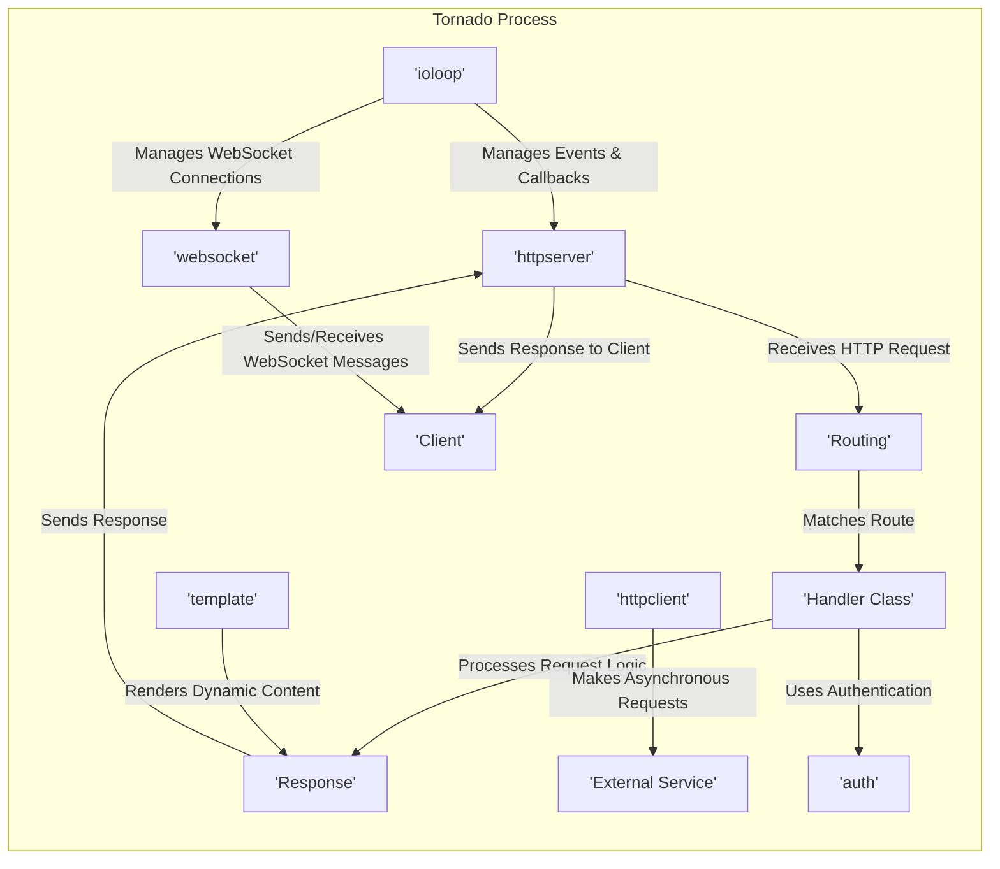
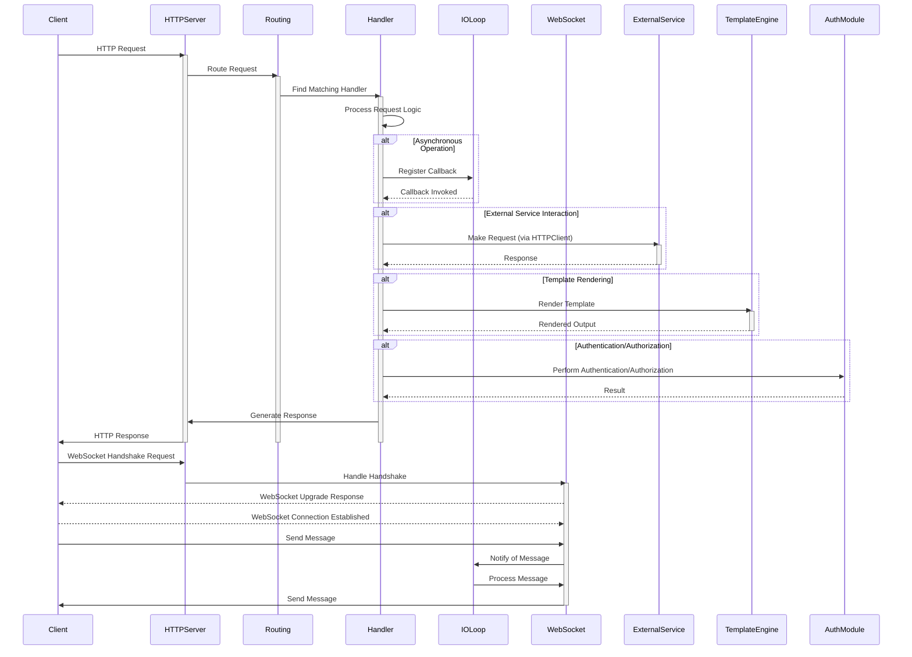

# Project Design Document: Tornado Web Framework

**Version:** 1.1
**Date:** October 26, 2023
**Prepared By:** Gemini (AI Language Model)

## 1. Introduction

This document provides an enhanced design overview of the Tornado web framework. It aims to provide a more detailed understanding of the key architectural components, data flows, and technologies involved. This document is intended to serve as a robust foundation for subsequent threat modeling activities. The information is based on the public repository of the Tornado project: [https://github.com/tornadoweb/tornado](https://github.com/tornadoweb/tornado).

## 2. Project Overview

Tornado is a widely-used Python web framework and asynchronous networking library, originally developed at FriendFeed. It excels in handling scenarios involving long-polling, WebSockets, and applications requiring persistent connections to numerous clients. Its core strengths include:

*   **Asynchronous, Non-blocking I/O Model:**  Leverages a single-threaded event loop, enabling efficient management of a high volume of concurrent connections without the overhead of traditional multi-threading.
*   **First-Class WebSocket Support:**  Provides built-in mechanisms for establishing and managing real-time, bidirectional communication channels between clients and the server.
*   **Performance and Scalability Focus:**  Architected for speed and the ability to handle increasing loads.
*   **Lightweight and Adaptable Design:**  Offers a balance of essential features without unnecessary complexity, allowing for flexible application development.
*   **Seamless Integration with Python Ecosystem:**  Designed to work harmoniously with standard Python libraries and tools.

## 3. System Architecture

Tornado's architecture is composed of several interconnected components, each with specific responsibilities:

*   **`ioloop` (Event Loop):**
    *   The central nervous system of Tornado, responsible for monitoring file descriptors (sockets, pipes, etc.) for events (e.g., data ready to be read, socket ready to accept a connection).
    *   Operates in a single thread, using non-blocking I/O operations to avoid waiting for slow operations.
    *   Dispatches events to registered callbacks, enabling asynchronous processing.
*   **`httpserver` (HTTP Server):**
    *   Listens for incoming HTTP connections on specified ports.
    *   Parses incoming HTTP requests, including headers and body.
    *   Manages connection lifecycle, including keep-alive connections.
    *   Dispatches requests to the appropriate handlers based on routing rules.
*   **`web` (Web Framework):**
    *   Provides the high-level framework for building web applications.
    *   Includes `Application` class for managing routing and application settings.
    *   Offers `RequestHandler` base class for handling individual requests.
    *   Provides utilities for working with HTTP requests and responses (e.g., accessing headers, setting cookies, sending responses).
*   **`httpclient` (Asynchronous HTTP Client):**
    *   Enables making non-blocking HTTP requests to external services.
    *   Integrates with `ioloop` to avoid blocking the main thread while waiting for responses.
    *   Supports various HTTP methods, headers, and request/response handling.
*   **`websocket` (WebSocket Implementation):**
    *   Handles the WebSocket protocol handshake process.
    *   Manages persistent, bidirectional communication channels with clients.
    *   Provides APIs for sending and receiving WebSocket messages.
*   **`template` (Templating Engine):**
    *   A simple and efficient templating engine for generating dynamic HTML or other text-based content.
    *   Supports features like variable substitution, control flow (if/else, for loops), and template inheritance.
*   **`auth` (Authentication Modules):**
    *   Offers modules for implementing common authentication schemes (e.g., cookie-based authentication, OAuth).
    *   Provides utilities for secure password hashing and user management.
*   **`iostream` (Non-blocking Stream Interface):**
    *   A low-level abstraction for reading and writing data to streams (sockets, files) in a non-blocking manner.
    *   Used internally by `httpserver` and `httpclient`.
*   **`netutil` (Networking Utilities):**
    *   Contains helper functions for various networking tasks, such as resolving hostnames and managing sockets.
*   **`routing` (Request Routing):**
    *   The mechanism for mapping incoming HTTP request URIs to specific handler classes or functions.
    *   Typically configured within the `web.Application` instance.

## 4. Data Flow

Understanding how data flows through a Tornado application is crucial for identifying potential security vulnerabilities. Here's a breakdown of typical request flows:

**HTTP Request Flow:**

1. **Client Initiates Request:** A client (e.g., web browser, API consumer) sends an HTTP request to the Tornado server.
2. **`httpserver` Accepts Connection:** The `httpserver` listens on a designated port and accepts the incoming TCP connection.
3. **Request Parsing:** `httpserver` parses the raw HTTP data into a structured request object, including headers, method, and body.
4. **Routing Decision:** The `Routing` component within the `web.Application` compares the request URI against defined routes.
5. **Handler Instantiation:** Once a matching route is found, the corresponding `Handler Class` is instantiated.
6. **Handler Method Invocation:** The appropriate HTTP method handler within the `Handler Class` (e.g., `get()`, `post()`) is called.
7. **Request Processing:** The handler executes its logic, potentially:
    *   Accessing request data (parameters, headers, cookies).
    *   Interacting with databases or other data stores.
    *   Making requests to external services using `httpclient`.
    *   Rendering templates using the `template` engine.
    *   Performing authentication and authorization checks using the `auth` modules.
8. **Response Generation:** The handler constructs an HTTP response, including headers (e.g., content type, status code) and a body (e.g., HTML, JSON).
9. **Response Transmission:** The `httpserver` sends the generated HTTP response back to the client.
10. **`ioloop` Orchestration:** Throughout this entire process, the `ioloop` manages the asynchronous operations, ensuring that no single operation blocks the event loop.

**WebSocket Connection Flow:**

1. **Client Sends Upgrade Request:** The client sends a special HTTP request with an `Upgrade` header to initiate the WebSocket handshake.
2. **`httpserver` Delegates to `websocket`:** The `httpserver` recognizes the upgrade request and passes control to the `websocket` component.
3. **Handshake Negotiation:** The `websocket` component performs the WebSocket handshake with the client, establishing a persistent connection.
4. **Connection Establishment:** If the handshake is successful, a WebSocket connection is established, allowing for bidirectional communication.
5. **Message Exchange:** Both the client and the server can send and receive messages over the established WebSocket connection.
6. **`ioloop` Manages Connection:** The `ioloop` monitors the WebSocket connection for incoming messages and manages sending outgoing messages asynchronously.

## 5. Key Technologies and Dependencies

Tornado's functionality relies on several underlying technologies and may integrate with others:

*   **Python:** The core programming language in which Tornado is written and applications are developed.
*   **Operating System (OS) Kernel:**  Leverages OS-level features for asynchronous I/O, such as `epoll` (Linux), `kqueue` (macOS), or `select` (cross-platform fallback).
*   **`selectors` Module (or `asyncio`):**  Internally uses the `selectors` module for efficient event loop management. While Tornado predates `asyncio`, it can interoperate with it.
*   **SSL/TLS Library (e.g., OpenSSL):**  Essential for providing secure communication over HTTPS and WSS, handling encryption and certificate management.
*   **`zlib`:** Used for optional compression of HTTP responses, reducing bandwidth usage.
*   **Optional Dependencies:**  Applications built with Tornado may utilize a wide range of other libraries depending on their specific requirements, including:
    *   Database drivers (e.g., `psycopg2`, `motor`).
    *   Message queue clients (e.g., `redis-py`, `pika`).
    *   Serialization libraries (e.g., `json`, `pickle`).
    *   Logging frameworks.

## 6. Deployment Considerations and Security

The security of a Tornado application is significantly influenced by its deployment environment and configuration. Consider these aspects:

*   **Standalone Deployment:**
    *   Simpler to set up but requires careful configuration of the Tornado process itself.
    *   SSL/TLS termination is handled by Tornado, requiring proper certificate management.
    *   Directly exposed to the internet, increasing the attack surface.
*   **Behind a Reverse Proxy (e.g., Nginx, HAProxy):**
    *   Recommended for production deployments.
    *   The reverse proxy handles tasks like SSL termination, load balancing, request routing, and potentially web application firewall (WAF) functionality.
    *   Reduces the attack surface of the Tornado application itself.
    *   Requires secure communication between the reverse proxy and the Tornado backend (e.g., using a private network).
*   **Containerized Environments (e.g., Docker, Kubernetes):**
    *   Provides isolation and simplifies deployment and scaling.
    *   Security considerations include container image security, network policies, and orchestration platform security.
*   **Platform as a Service (PaaS):**
    *   Offloads infrastructure management but requires understanding the PaaS provider's security model and configurations.

**Security Best Practices in Deployment:**

*   **HTTPS/WSS Enforcement:** Always use HTTPS for web traffic and WSS for WebSocket connections to encrypt data in transit.
*   **Strong TLS Configuration:** Configure TLS with strong ciphers and disable insecure protocols.
*   **Regular Security Updates:** Keep Tornado, its dependencies, and the underlying operating system updated to patch known vulnerabilities.
*   **Input Validation and Sanitization:** Implement robust input validation and sanitization to prevent injection attacks (e.g., XSS, SQL injection).
*   **Authentication and Authorization:** Use secure authentication mechanisms and implement proper authorization controls to restrict access to resources.
*   **Rate Limiting and DoS Protection:** Implement rate limiting and other mechanisms to protect against denial-of-service attacks.
*   **Security Headers:** Configure appropriate HTTP security headers (e.g., `Content-Security-Policy`, `Strict-Transport-Security`, `X-Frame-Options`).
*   **Secure Cookie Handling:** Use the `secure` and `httponly` flags for cookies to mitigate certain attacks.
*   **Logging and Monitoring:** Implement comprehensive logging and monitoring to detect and respond to security incidents.

## 7. Threat Modeling Focus Areas

This design document highlights several areas that warrant careful consideration during threat modeling exercises:

*   **HTTP Request Handling Pipeline:**
    *   **Input Validation:**  Analyze where user-provided data enters the application and how it's validated and sanitized.
    *   **Routing Logic:**  Examine the routing configuration for potential vulnerabilities, such as unintended access to sensitive endpoints.
    *   **Handler Logic:**  Assess the security of the code within request handlers, looking for injection flaws, business logic vulnerabilities, and insecure data handling.
*   **WebSocket Communication:**
    *   **Handshake Security:**  Ensure the WebSocket handshake is properly implemented and protected against hijacking.
    *   **Message Handling:**  Analyze how WebSocket messages are processed and validated to prevent injection attacks or other forms of abuse.
    *   **Authentication and Authorization:**  Verify that WebSocket connections are properly authenticated and authorized.
*   **Interaction with External Services (via `httpclient`):**
    *   **Secure Communication:**  Ensure communication with external services is encrypted (HTTPS).
    *   **Authentication and Authorization:**  Verify that the application properly authenticates with external services.
    *   **Data Integrity:**  Consider the integrity of data exchanged with external services.
*   **Authentication and Authorization Mechanisms:**
    *   **Authentication Strength:**  Evaluate the strength of the chosen authentication methods (e.g., password hashing, multi-factor authentication).
    *   **Authorization Logic:**  Thoroughly review the authorization logic to ensure that users only have access to the resources they are permitted to access.
    *   **Session Management:**  Analyze the security of session management, including session ID generation, storage, and expiration.
*   **Template Engine Security:**
    *   **Template Injection:**  Assess the potential for template injection vulnerabilities if user-controlled data is used in templates without proper escaping.
*   **Error Handling and Logging:**
    *   **Information Disclosure:**  Ensure that error messages and logs do not reveal sensitive information.
    *   **Logging Adequacy:**  Verify that sufficient information is logged for security auditing and incident response.
*   **Dependencies:**
    *   **Vulnerability Scanning:**  Regularly scan dependencies for known vulnerabilities.
    *   **Supply Chain Security:**  Consider the security of the sources of dependencies.
*   **Deployment Environment:**
    *   **Configuration Security:**  Review the security configuration of the deployment environment (e.g., web server, reverse proxy, container orchestration).
    *   **Network Security:**  Assess network security controls, such as firewalls and network segmentation.

This enhanced design document provides a more comprehensive understanding of the Tornado web framework, offering a solid foundation for conducting thorough threat modeling activities. By focusing on the areas outlined above, security professionals can effectively identify and mitigate potential risks.
