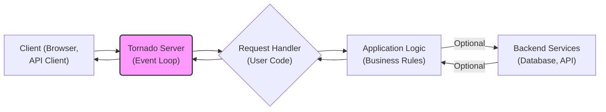
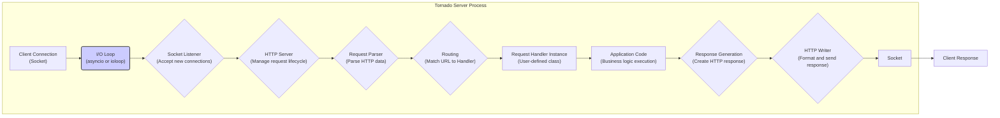

# Project Design Document: Tornado Web Framework

**Version:** 1.1
**Date:** October 26, 2023
**Author:** AI Software Architect

## 1. Introduction

This document provides a detailed design overview of the Tornado web framework, a Python library for building asynchronous web applications and services. It focuses on the architectural components, data flow, and interactions within the framework, specifically tailored for subsequent threat modeling activities.

## 2. Goals and Objectives

*   Provide a clear and comprehensive architectural description of the Tornado web framework.
*   Identify and describe the key components of Tornado and their responsibilities.
*   Illustrate the lifecycle of an HTTP request within Tornado, highlighting critical processing stages.
*   Detail important security considerations inherent in the framework's design and usage.
*   Serve as a foundational document for identifying potential threats, vulnerabilities, and attack vectors.

## 3. Architectural Overview

Tornado is designed around an asynchronous, non-blocking I/O model. This allows it to efficiently handle a large number of concurrent connections using a single thread (or a small number of threads). This architecture is particularly well-suited for applications requiring long-lived connections, such as real-time web applications using WebSockets or long polling.

### 3.1. High-Level Architecture

*   **Client:** Represents any external entity initiating an HTTP request to the Tornado server (e.g., a web browser, a mobile application, another service).
*   **Tornado Server (Event Loop):** The core of the framework. It listens for incoming connections, manages the event loop (typically `asyncio`), and dispatches requests to the appropriate handlers. Its asynchronous nature is a key architectural feature.
*   **Request Handler (User Code):** A Python class defined by the application developer. It receives incoming HTTP requests and generates responses. This is where the application's logic for handling specific endpoints resides.
*   **Application Logic (Business Rules):** The specific code within the request handler that implements the application's functionality, data processing, and business rules.
*   **Backend Services (Database, API):** Optional external systems that the application logic might interact with to persist data, retrieve information, or integrate with other services.

### 3.2. Detailed Architecture and Request Flow

*   **Client Connection (Socket):** An incoming network connection established by a client.
*   **I/O Loop (asyncio or ioloop):** The central event loop that drives Tornado's asynchronous operations. It monitors file descriptors (sockets) for events and triggers corresponding callbacks. Modern Tornado applications primarily use `asyncio`.
*   **Socket Listener (Accept new connections):**  Listens on a specified port for new incoming client connections.
*   **HTTP Server (Manage request lifecycle):** Accepts new connections, manages the state of HTTP requests and responses, and utilizes the request parser.
*   **Request Parser (Parse HTTP data):** Parses the raw HTTP data received from the client, extracting headers, body, HTTP method, and URL.
*   **Routing (Match URL to Handler):** Matches the requested URL against a set of defined routes to determine the appropriate `RequestHandler` to handle the request.
*   **Request Handler Instance (User-defined class):** An instance of the `RequestHandler` subclass that is responsible for processing the specific request.
*   **Application Code (Business logic execution):** The developer-written code within the `RequestHandler` that performs the core logic for the requested resource or action.
*   **Response Generation (Create HTTP response):** The process of constructing the HTTP response, including headers, status code, and the response body (e.g., HTML, JSON).
*   **HTTP Writer (Format and send response):** Formats the generated HTTP response according to the HTTP specification and sends it back to the client through the socket.
*   **Socket:** The network socket used for sending the response back to the client.
*   **Client Response:** The HTTP response received by the client.

## 4. Key Components

*   **`tornado.web`:** Provides the core web framework functionalities.
    *   **`Application`:** The central component that manages routing, application-level settings, and the overall request handling process.
    *   **`RequestHandler`:** The base class that developers subclass to implement specific endpoints and handle incoming HTTP requests. It provides methods for accessing request data, setting response headers, and writing the response body.
    *   **`Router` (or `URLSpec`):** Responsible for mapping incoming URLs to their corresponding `RequestHandler` classes. `URLSpec` objects define the URL patterns and their associated handlers.
    *   **`StaticFileHandler`:** A built-in handler for efficiently serving static files (e.g., CSS, JavaScript, images).
    *   **`WebSocketHandler`:**  A specialized handler for implementing WebSocket endpoints, enabling real-time bidirectional communication.
*   **`tornado.ioloop` (or `asyncio`):** The asynchronous event loop that is the foundation of Tornado's non-blocking I/O. It monitors file descriptors and triggers callbacks when events occur, allowing Tornado to handle many concurrent connections efficiently. Modern applications should leverage `asyncio`.
*   **`tornado.httpserver`:** Implements an HTTP server on top of the `ioloop`. It handles accepting new connections, parsing incoming HTTP requests, and managing the lifecycle of requests and responses.
*   **`tornado.httpclient`:** Provides an asynchronous HTTP client, allowing Tornado applications to make non-blocking HTTP requests to external services.
*   **`tornado.template`:** A simple and efficient templating engine for generating dynamic HTML content. It helps separate presentation logic from application code.
*   **`tornado.auth`:** Provides support for various third-party authentication schemes (e.g., OAuth, OpenID), simplifying the integration of external authentication providers.
*   **`tornado.escape`:** Contains utility functions for escaping and unescaping data for HTML, JSON, and URLs, crucial for preventing cross-site scripting (XSS) vulnerabilities.
*   **`tornado.locale`:**  Provides support for internationalization and localization, allowing applications to be adapted for different languages and regions.
*   **`tornado.options`:** A module for parsing command-line options, making it easier to configure Tornado applications.

## 5. Data Flow

The flow of data within a Tornado application follows the lifecycle of an HTTP request and response:

1. **Client initiates an HTTP request:** The client sends a request containing headers, an optional body, and targeting a specific URL on the Tornado server.
2. **Tornado Server receives the request:** The `ioloop` (or `asyncio` event loop) detects an incoming connection. The `HTTPServer` accepts the connection and begins processing the request.
3. **Request parsing:** The `RequestParser` analyzes the raw HTTP data, extracting key information such as headers, HTTP method (GET, POST, etc.), requested URL, and the request body.
4. **Routing:** The `Router` examines the requested URL and matches it against the defined `URLSpec`s to identify the appropriate `RequestHandler` to handle the request.
5. **Request Handler instantiation and invocation:** An instance of the matched `RequestHandler` is created (or potentially reused), and the relevant HTTP method handler (e.g., `get()`, `post()`) is invoked.
6. **Application logic execution:** The code within the `RequestHandler` executes, potentially interacting with models, databases, or external services to process the request and generate the necessary data for the response.
7. **Response generation:** The `RequestHandler` constructs the HTTP response. This involves setting response headers (e.g., content type, caching directives), setting the HTTP status code (e.g., 200 OK, 404 Not Found), and generating the response body (e.g., HTML, JSON data).
8. **Response writing:** The `HTTPWriter` takes the generated response data, formats it according to the HTTP protocol, and sends it back to the client through the network socket.
9. **Client receives the response:** The client receives and processes the HTTP response from the Tornado server.

## 6. Security Considerations

Security is a critical aspect of any web application. Here are key security considerations relevant to the design and use of the Tornado framework:

*   **Input Validation and Sanitization:** Tornado does not automatically validate or sanitize user input. Developers are responsible for implementing robust input validation within their `RequestHandlers` to prevent injection attacks (e.g., SQL injection, command injection, cross-site scripting). Sanitize user-provided data before using it in database queries or rendering it in HTML.
*   **Cross-Site Scripting (XSS) Prevention:**  Use Tornado's built-in escaping functions (`tornado.escape`) when rendering dynamic content in HTML templates to prevent XSS vulnerabilities. Be mindful of context-aware escaping.
*   **Cross-Site Request Forgery (CSRF) Protection:** Tornado provides mechanisms for CSRF protection, typically involving the use of anti-CSRF tokens. Ensure that CSRF protection is enabled and correctly implemented for all state-changing requests.
*   **Session Management Security:** Tornado offers basic cookie-based session management. Ensure that session cookies are configured with secure attributes (`HttpOnly`, `Secure`, `SameSite`) to mitigate risks like session hijacking. Consider using more robust session management solutions for sensitive applications.
*   **Authentication and Authorization:** Tornado provides building blocks for authentication (e.g., `tornado.auth`) but does not enforce a specific authentication scheme. Implement strong authentication mechanisms and appropriate authorization checks to control access to resources.
*   **Transport Layer Security (TLS/SSL):**  Always serve Tornado applications over HTTPS by configuring TLS/SSL certificates. This encrypts communication between the client and the server, protecting sensitive data in transit. This is often handled by a reverse proxy in front of Tornado.
*   **Denial of Service (DoS) Prevention:** While Tornado's asynchronous nature helps mitigate some DoS attacks, implement rate limiting, request size limits, and other strategies to protect against resource exhaustion.
*   **WebSocket Security:** When using WebSockets, validate the origin of incoming connections and sanitize any data received through the WebSocket to prevent attacks. Implement appropriate authentication and authorization for WebSocket connections.
*   **Dependency Management:** Keep Tornado and its dependencies up-to-date to patch any known security vulnerabilities. Regularly review and update project dependencies.
*   **Error Handling and Information Disclosure:** Implement proper error handling to avoid leaking sensitive information in error messages. Use generic error messages for production environments.
*   **Security Headers:** Configure appropriate HTTP security headers (e.g., `Content-Security-Policy`, `Strict-Transport-Security`, `X-Frame-Options`) to enhance the security of the application. This is often done at the reverse proxy level.

## 7. Deployment Considerations

The deployment environment significantly impacts the security and scalability of a Tornado application. Common deployment strategies include:

*   **Reverse Proxy (Nginx, HAProxy):**  Deploying Tornado behind a reverse proxy is a common and recommended practice. The reverse proxy can handle TLS termination, load balancing, static file serving, and provide an additional layer of security by filtering malicious requests and enforcing security headers.
*   **Process Managers (Supervisor, systemd):** Use process managers to ensure the Tornado application restarts automatically in case of failures and to manage the application's lifecycle.
*   **Containerization (Docker):** Containerizing Tornado applications with Docker provides a consistent and isolated environment for deployment, simplifying deployment and scaling.
*   **Cloud Platforms (AWS, Google Cloud, Azure):** Leverage cloud platform services for deployment, scaling, and management. These platforms often provide built-in security features and tools.
*   **Load Balancing:** For high-traffic applications, distribute traffic across multiple Tornado instances using a load balancer to ensure availability and performance.

Security considerations during deployment include:

*   **Secure Configuration:** Ensure that the deployment environment (operating system, reverse proxy, etc.) is securely configured.
*   **Firewall Rules:** Configure firewalls to restrict access to the Tornado server to only necessary ports and IP addresses.
*   **Secrets Management:** Securely manage sensitive information like API keys and database credentials using environment variables or dedicated secrets management services.
*   **Regular Security Audits:** Conduct regular security audits of the deployment environment and the Tornado application.

## 8. Future Considerations

*   **Adoption of Modern Python Features:** Continued integration with newer `asyncio` features and type hinting for improved code maintainability and potential performance benefits.
*   **Enhanced Security Defaults:**  Exploring opportunities to incorporate more secure defaults for session management, CSRF protection, and other security-sensitive areas.
*   **Improved Observability and Monitoring:**  Enhancing built-in support for metrics, logging, and tracing to facilitate monitoring and debugging of Tornado applications.
*   **Community Contributions and Ecosystem Growth:**  The future development of Tornado will continue to be influenced by community contributions and the evolving Python ecosystem.

This document provides a detailed design overview of the Tornado web framework, emphasizing aspects relevant to security and threat modeling. It serves as a valuable resource for understanding the framework's architecture and identifying potential security vulnerabilities.