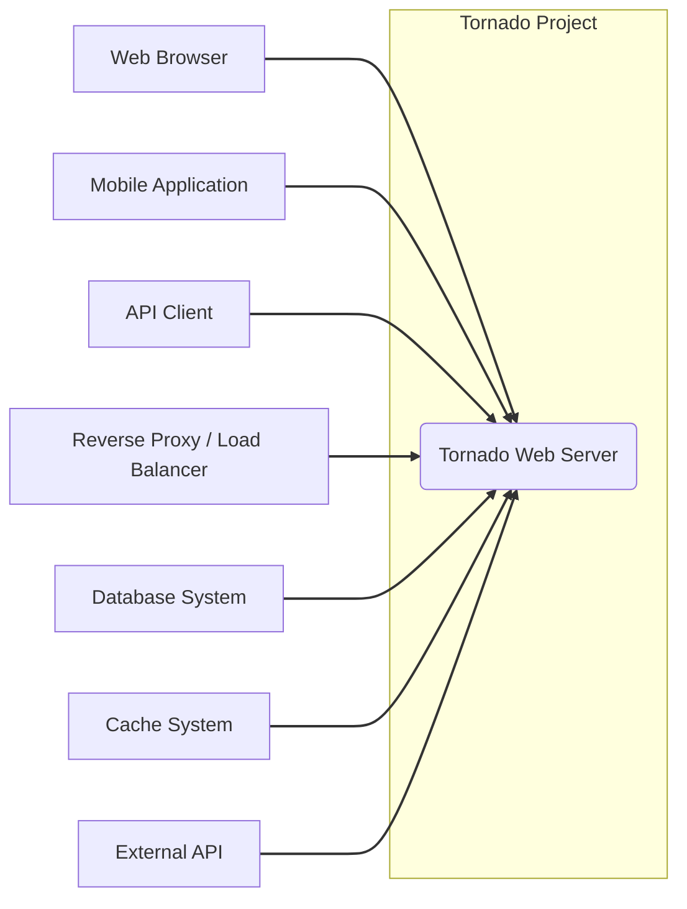
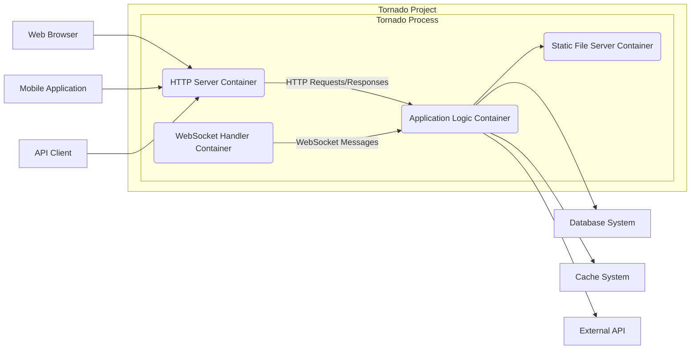
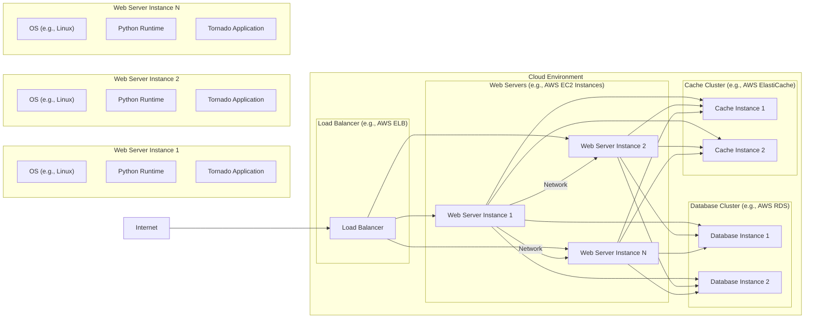
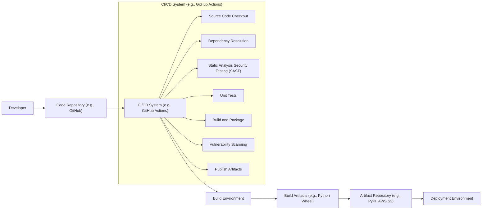

# BUSINESS POSTURE

- Business Priorities and Goals:
  - Provide a high-performance, scalable web server and asynchronous networking library.
  - Enable development of real-time web applications, long polling, WebSockets, and other applications requiring long-lived connections.
  - Offer a flexible and easy-to-use framework for building web applications in Python.
  - Maintain an active and supportive open-source community.

- Business Risks:
  - Performance bottlenecks under high load could impact application availability and user experience.
  - Security vulnerabilities in the web server or framework could lead to data breaches, service disruption, or other security incidents.
  - Lack of community support or slow response to security issues could deter adoption and impact user trust.
  - Compatibility issues with evolving Python versions or dependencies could require significant maintenance effort.
  - Misuse of asynchronous features could lead to complex code and potential concurrency bugs.

# SECURITY POSTURE

- Existing Security Controls:
  - security control: TLS/SSL support for HTTPS to encrypt communication. Implemented in `tornado.httpserver` and configurable via `ssl_options`.
  - security control: Input validation and sanitization are expected to be implemented by application developers using Tornado. Documented in Tornado documentation regarding request handling.
  - security control: Protection against common web vulnerabilities (e.g., XSS, CSRF) is the responsibility of the application developer using Tornado. Guidance and tools might be available in the documentation or community resources.
  - security control: Cookie security attributes (HttpOnly, Secure, SameSite) can be configured to mitigate cookie-based attacks. Implemented in `tornado.web.RequestHandler.set_cookie`.

- Accepted Risks:
  - accepted risk: Security of applications built on top of Tornado is primarily the responsibility of the application developers. Tornado provides tools and features, but secure application design and implementation are crucial.
  - accepted risk: Reliance on application developers to implement proper input validation and output encoding to prevent injection vulnerabilities.
  - accepted risk: Potential for denial-of-service attacks if applications are not designed to handle resource exhaustion or malicious requests.

- Recommended Security Controls:
  - security control: Implement automated security testing in the CI/CD pipeline, including Static Application Security Testing (SAST) and Dynamic Application Security Testing (DAST) to identify vulnerabilities early in the development lifecycle.
  - security control: Regularly perform dependency scanning to identify and address vulnerabilities in third-party libraries used by Tornado and applications built on it.
  - security control: Encourage and provide guidelines for developers to follow secure coding practices, including input validation, output encoding, and secure session management.
  - security control: Implement rate limiting and request throttling to mitigate denial-of-service attacks. This could be implemented at the application level or using a reverse proxy/load balancer.
  - security control: Conduct regular security audits and penetration testing to identify and address potential vulnerabilities in Tornado and applications built on it.

- Security Requirements:
  - Authentication:
    - Applications built with Tornado should implement robust authentication mechanisms to verify user identities.
    - Support for various authentication methods should be considered, such as username/password, multi-factor authentication, OAuth 2.0, and API keys, depending on the application requirements.
    - Tornado should provide mechanisms to integrate with existing authentication systems or libraries.
  - Authorization:
    - Applications should implement fine-grained authorization controls to manage user access to resources and functionalities.
    - Role-Based Access Control (RBAC) or Attribute-Based Access Control (ABAC) should be considered based on application complexity.
    - Tornado should provide mechanisms to enforce authorization policies within request handlers.
  - Input Validation:
    - All user inputs, including HTTP headers, query parameters, request body, and file uploads, must be thoroughly validated to prevent injection attacks (e.g., SQL injection, command injection, cross-site scripting).
    - Input validation should be performed on both the client-side and server-side.
    - Tornado applications should utilize input validation libraries and frameworks to simplify and standardize validation processes.
  - Cryptography:
    - Sensitive data at rest and in transit must be protected using strong encryption algorithms.
    - HTTPS should be enforced for all communication involving sensitive data.
    - Secure storage of cryptographic keys and secrets is essential.
    - Tornado applications should leverage secure cryptographic libraries for encryption, hashing, and digital signatures.

# DESIGN

## C4 CONTEXT

- Context Diagram Elements:
  - - Name: Tornado Web Server
    - Type: Software System
    - Description: Tornado is a Python web framework and asynchronous networking library. It is used to build web applications and services that require high performance and scalability, especially for long-lived connections like WebSockets and long polling.
    - Responsibilities:
      - Handling HTTP requests and responses.
      - Managing WebSocket connections.
      - Providing asynchronous networking capabilities.
      - Routing requests to appropriate handlers.
      - Serving static files.
    - Security controls:
      - TLS/SSL for HTTPS.
      - Input validation (application responsibility).
      - Authorization (application responsibility).
      - Cookie security attributes.

  - - Name: Web Browser
    - Type: User
    - Description: End-users accessing web applications served by Tornado through web browsers (e.g., Chrome, Firefox, Safari).
    - Responsibilities:
      - Sending HTTP requests to Tornado applications.
      - Rendering HTML, CSS, and JavaScript served by Tornado.
      - Interacting with web applications through a graphical user interface.
    - Security controls:
      - Browser security features (e.g., Content Security Policy, XSS protection).
      - User authentication (browser-based sessions, cookies).

  - - Name: Mobile Application
    - Type: User
    - Description: End-users accessing web applications or APIs served by Tornado through mobile applications (e.g., iOS, Android apps).
    - Responsibilities:
      - Sending HTTP requests to Tornado applications or APIs.
      - Displaying data received from Tornado.
      - Interacting with applications through a mobile user interface.
    - Security controls:
      - Application-level security controls (e.g., API keys, OAuth 2.0).
      - Mobile OS security features.

  - - Name: API Client
    - Type: External System
    - Description: Other software systems or services that interact with Tornado applications through APIs (e.g., backend services, third-party integrations).
    - Responsibilities:
      - Sending API requests to Tornado applications.
      - Processing API responses from Tornado.
      - Integrating with Tornado-based services for data exchange or functionality.
    - Security controls:
      - API authentication and authorization mechanisms (e.g., API keys, OAuth 2.0, JWT).
      - Secure API communication (HTTPS).

  - - Name: Reverse Proxy / Load Balancer
    - Type: Infrastructure System
    - Description: A reverse proxy or load balancer (e.g., Nginx, HAProxy) sitting in front of Tornado instances to distribute traffic, provide SSL termination, and enhance security and performance.
    - Responsibilities:
      - Distributing incoming requests across multiple Tornado instances.
      - SSL termination and certificate management.
      - Load balancing and traffic management.
      - Basic security features (e.g., rate limiting, request filtering).
    - Security controls:
      - TLS/SSL termination.
      - Rate limiting.
      - Request filtering (e.g., blocking malicious requests).
      - Web Application Firewall (WAF) capabilities (optional).

  - - Name: Database System
    - Type: Infrastructure System
    - Description: Databases (e.g., PostgreSQL, MySQL, MongoDB) used by Tornado applications to store and retrieve persistent data.
    - Responsibilities:
      - Storing application data.
      - Providing data persistence and retrieval.
      - Ensuring data integrity and availability.
    - Security controls:
      - Database authentication and authorization.
      - Data encryption at rest and in transit (optional, database-specific).
      - Database access controls (firewall rules, network segmentation).

  - - Name: Cache System
    - Type: Infrastructure System
    - Description: Caching systems (e.g., Redis, Memcached) used by Tornado applications to improve performance by caching frequently accessed data.
    - Responsibilities:
      - Caching frequently accessed data.
      - Reducing database load and improving response times.
      - Providing temporary data storage.
    - Security controls:
      - Cache access controls (authentication, network segmentation).
      - Data encryption in transit (optional, depending on cache system).

  - - Name: External API
    - Type: External System
    - Description: External APIs or services that Tornado applications may interact with to retrieve data or perform actions (e.g., payment gateways, social media APIs).
    - Responsibilities:
      - Providing external data or services to Tornado applications.
      - Processing requests from Tornado applications.
    - Security controls:
      - API authentication and authorization (API keys, OAuth 2.0).
      - Secure API communication (HTTPS).
      - API rate limiting and usage quotas.

## C4 CONTAINER

- Container Diagram Elements:
  - - Name: HTTP Server Container
    - Type: Container
    - Description: Responsible for handling incoming HTTP requests, managing connections, and routing requests to the Application Logic Container. This container utilizes Tornado's HTTP server implementation.
    - Responsibilities:
      - Accepting and managing HTTP connections.
      - Parsing HTTP requests.
      - Routing HTTP requests based on URL patterns.
      - Sending HTTP responses.
      - Handling TLS/SSL termination (or relying on reverse proxy).
    - Security controls:
      - TLS/SSL configuration.
      - HTTP header security (e.g., HSTS, X-Frame-Options).
      - Request parsing and validation (basic level, application-level validation in Application Logic Container).

  - - Name: WebSocket Handler Container
    - Type: Container
    - Description: Manages WebSocket connections, handles WebSocket messages, and interacts with the Application Logic Container for WebSocket-based functionalities. This container uses Tornado's WebSocket handler implementation.
    - Responsibilities:
      - Establishing and managing WebSocket connections.
      - Handling WebSocket handshake.
      - Sending and receiving WebSocket messages.
      - Routing WebSocket messages to the Application Logic Container.
    - Security controls:
      - WebSocket handshake validation.
      - Input validation of WebSocket messages (application responsibility).
      - Rate limiting for WebSocket connections and messages (optional).

  - - Name: Application Logic Container
    - Type: Container
    - Description: Contains the core application logic, request handlers, business logic, and data processing. This is where developers implement their specific application functionalities using Tornado's framework.
    - Responsibilities:
      - Implementing application-specific request handlers.
      - Handling business logic and data processing.
      - Interacting with databases, caches, and external APIs.
      - Implementing authentication and authorization logic.
      - Performing input validation and output encoding.
    - Security controls:
      - Application-level authentication and authorization.
      - Input validation and sanitization.
      - Output encoding and escaping.
      - Secure session management.
      - Protection against common web vulnerabilities (XSS, CSRF, injection).

  - - Name: Static File Server Container
    - Type: Container
    - Description: Serves static files (e.g., HTML, CSS, JavaScript, images) to clients. This container utilizes Tornado's static file handling capabilities.
    - Responsibilities:
      - Serving static files from a designated directory.
      - Handling HTTP caching for static files.
      - Potentially serving compressed static files.
    - Security controls:
      - Access control to static files (optional, can be configured).
      - Content Security Policy (CSP) headers for static files.
      - Prevention of directory traversal vulnerabilities (handled by Tornado framework).

## DEPLOYMENT

- Deployment Options:
  - Standalone Deployment: Tornado application runs directly on a server, listening on a specific port. Suitable for simple applications or development environments.
  - Deployment behind Reverse Proxy/Load Balancer: Tornado application runs behind a reverse proxy (e.g., Nginx, HAProxy) or load balancer. Recommended for production environments for scalability, security, and SSL termination.
  - Containerized Deployment (Docker, Kubernetes): Tornado application is containerized using Docker and deployed in container orchestration platforms like Kubernetes. Suitable for modern cloud-native deployments, scalability, and management.
  - Serverless Deployment (AWS Lambda, Google Cloud Functions):  While less common for full Tornado applications, specific components or API endpoints could potentially be deployed as serverless functions if the application architecture allows.

- Detailed Deployment (Deployment behind Reverse Proxy/Load Balancer):

- Deployment Diagram Elements (Deployment behind Reverse Proxy/Load Balancer):
  - - Name: Load Balancer (e.g., AWS ELB)
    - Type: Infrastructure Component
    - Description: Distributes incoming traffic from the internet across multiple web server instances running Tornado applications. Provides SSL termination, load balancing, and potentially other features like WAF.
    - Responsibilities:
      - Load balancing and traffic distribution.
      - SSL/TLS termination.
      - Health checks for web server instances.
      - Routing requests to healthy instances.
      - Potentially providing Web Application Firewall (WAF) functionality.
    - Security controls:
      - TLS/SSL configuration and certificate management.
      - Rate limiting and request throttling.
      - Web Application Firewall (WAF) rules (if applicable).
      - Access control lists (ACLs) to restrict access.

  - - Name: Web Server Instance (e.g., AWS EC2 Instance)
    - Type: Infrastructure Component
    - Description: Virtual machines or physical servers running the Tornado application, Python runtime, and operating system. Multiple instances are deployed for scalability and high availability.
    - Responsibilities:
      - Running the Tornado application.
      - Processing HTTP requests and WebSocket connections.
      - Interacting with databases and cache systems.
      - Serving static files.
    - Security controls:
      - Operating system security hardening.
      - Security groups/firewall rules to restrict network access.
      - Regular security patching and updates.
      - Intrusion detection systems (IDS) and intrusion prevention systems (IPS) (optional).

  - - Name: OS (e.g., Linux)
    - Type: Software Component
    - Description: Operating system running on the web server instances, providing the base environment for the Python runtime and Tornado application.
    - Responsibilities:
      - Providing the underlying operating system functionalities.
      - Managing system resources.
      - Handling system-level security.
    - Security controls:
      - OS hardening and security configuration.
      - Regular OS security patching and updates.
      - User and access management.

  - - Name: Python Runtime
    - Type: Software Component
    - Description: Python interpreter and libraries required to run the Tornado application.
    - Responsibilities:
      - Executing Python code.
      - Providing Python standard library and dependencies.
    - Security controls:
      - Keeping Python runtime updated with security patches.
      - Dependency management and vulnerability scanning for Python packages.

  - - Name: Tornado Application
    - Type: Software Component
    - Description: The deployed Tornado web application code, including application logic, request handlers, and static files.
    - Responsibilities:
      - Implementing application functionalities.
      - Handling requests and responses.
      - Interacting with other containers and systems.
    - Security controls:
      - Application-level security controls (authentication, authorization, input validation, etc.).
      - Secure coding practices.
      - Regular security testing and code reviews.

  - - Name: Database Cluster (e.g., AWS RDS)
    - Type: Infrastructure Component
    - Description: Clustered database system used by the Tornado application for persistent data storage.
    - Responsibilities:
      - Storing and managing application data.
      - Providing data persistence and retrieval.
      - Ensuring data integrity and availability.
    - Security controls:
      - Database authentication and authorization.
      - Data encryption at rest and in transit (database-specific).
      - Database access controls (firewall rules, network segmentation).
      - Regular database security patching and updates.

  - - Name: Cache Cluster (e.g., AWS ElastiCache)
    - Type: Infrastructure Component
    - Description: Clustered cache system used by the Tornado application for caching frequently accessed data to improve performance.
    - Responsibilities:
      - Caching frequently accessed data.
      - Reducing database load.
      - Improving application response times.
    - Security controls:
      - Cache access controls (authentication, network segmentation).
      - Data encryption in transit (cache-specific).
      - Regular cache security patching and updates.

## BUILD

- Build Process Description:
  - Developer writes code and commits it to a code repository (e.g., GitHub).
  - CI/CD system (e.g., GitHub Actions, Jenkins) is triggered by code changes.
  - CI/CD system checks out the source code.
  - Dependencies are resolved and installed in the build environment.
  - Static Application Security Testing (SAST) tools are used to scan the code for potential vulnerabilities.
  - Unit tests are executed to ensure code quality and functionality.
  - The application is built and packaged into build artifacts (e.g., Python wheel, Docker image).
  - Vulnerability scanning is performed on dependencies and build artifacts.
  - Build artifacts are published to an artifact repository (e.g., PyPI, AWS S3, Docker Registry).
  - Deployment process retrieves artifacts from the repository and deploys them to the target environment.

- Build Diagram Elements:
  - - Name: Developer
    - Type: Person
    - Description: Software developer writing and maintaining the Tornado application code.
    - Responsibilities:
      - Writing secure and functional code.
      - Committing code changes to the repository.
      - Participating in code reviews.
      - Addressing security vulnerabilities identified during build and testing.
    - Security controls:
      - Secure coding practices training.
      - Code review process.
      - Access control to code repository.

  - - Name: Code Repository (e.g., GitHub)
    - Type: Software System
    - Description: Version control system used to store and manage the source code of the Tornado application.
    - Responsibilities:
      - Storing and versioning source code.
      - Managing code branches and merges.
      - Triggering CI/CD pipelines on code changes.
    - Security controls:
      - Access control and authentication for code repository.
      - Branch protection rules.
      - Audit logging of code changes.

  - - Name: CI/CD System (e.g., GitHub Actions)
    - Type: Software System
    - Description: Automated system for building, testing, and deploying the Tornado application.
    - Responsibilities:
      - Automating the build, test, and deployment process.
      - Running security checks during the build process.
      - Publishing build artifacts.
    - Security controls:
      - Secure configuration of CI/CD pipelines.
      - Access control to CI/CD system and configurations.
      - Secrets management for credentials used in CI/CD pipelines.
      - Audit logging of CI/CD activities.

  - - Name: Build Environment
    - Type: Infrastructure Component
    - Description: Isolated environment where the build process is executed, including necessary tools, libraries, and dependencies.
    - Responsibilities:
      - Providing a consistent and reproducible build environment.
      - Isolating build processes from each other.
    - Security controls:
      - Secure configuration of build environment.
      - Access control to build environment.
      - Regular patching and updates of build environment.

  - - Name: Build Artifacts (e.g., Python Wheel)
    - Type: Software Artifact
    - Description: Packaged and built software components ready for deployment (e.g., Python wheel files, Docker images).
    - Responsibilities:
      - Containing the compiled and packaged application code and dependencies.
      - Being deployable to target environments.
    - Security controls:
      - Vulnerability scanning of build artifacts.
      - Digital signatures or checksums for artifact integrity verification (optional).

  - - Name: Artifact Repository (e.g., PyPI, AWS S3)
    - Type: Software System
    - Description: Repository for storing and managing build artifacts, making them available for deployment.
    - Responsibilities:
      - Storing and managing build artifacts.
      - Providing access to artifacts for deployment processes.
    - Security controls:
      - Access control and authentication for artifact repository.
      - Encryption at rest for stored artifacts (optional, depending on repository).
      - Audit logging of artifact access and modifications.

  - - Name: Deployment Environment
    - Type: Infrastructure Component
    - Description: Target environment where the Tornado application is deployed and running (e.g., web server instances, Kubernetes cluster).
    - Responsibilities:
      - Running the deployed application.
      - Providing runtime environment for the application.
    - Security controls:
      - Security controls of the deployment environment as described in the DEPLOYMENT section.

# RISK ASSESSMENT

- Critical Business Processes:
  - Serving web applications and APIs to end-users and other systems.
  - Handling real-time communication via WebSockets for interactive applications.
  - Providing asynchronous networking capabilities for high-performance applications.
  - Ensuring availability and performance of web services built on Tornado.

- Data to Protect and Sensitivity:
  - Application data: Data processed and stored by applications built on Tornado. Sensitivity depends on the specific application (e.g., user data, financial transactions, personal information).
  - User session data: Data related to user sessions, potentially including authentication tokens or session identifiers. Sensitivity is high as compromise can lead to unauthorized access.
  - Application configuration data: Configuration settings for Tornado applications, potentially including database credentials or API keys. Sensitivity is high as compromise can lead to system compromise.
  - Logs: Application and server logs, potentially containing sensitive information depending on logging practices. Sensitivity depends on the content of logs.

# QUESTIONS & ASSUMPTIONS

- Questions:
  - What are the specific types of applications being built using Tornado in the target context? (e.g., real-time chat, API server, web dashboard). This would help to refine security requirements and risk assessment.
  - What is the expected scale and performance requirements for Tornado deployments? This will influence deployment architecture and security controls (e.g., DDoS protection).
  - What are the compliance requirements (e.g., GDPR, HIPAA, PCI DSS) that the applications built on Tornado need to adhere to? This will dictate specific security controls and data protection measures.
  - What existing security infrastructure and tools are already in place in the target environment? This will help to integrate recommended security controls effectively.

- Assumptions:
  - BUSINESS POSTURE: The primary business goal is to build and deploy high-performance, scalable web applications and services. Security is a significant concern, but performance and availability are also critical.
  - SECURITY POSTURE: Security is considered important, but the current focus might be more on functionality and development speed. There are basic security controls in place (TLS), but more comprehensive security measures are needed. Application developers are expected to handle application-level security.
  - DESIGN: Tornado is deployed in a typical web application architecture, likely behind a reverse proxy/load balancer, with database and cache systems. The build process involves standard CI/CD practices, but security checks might not be fully integrated yet.