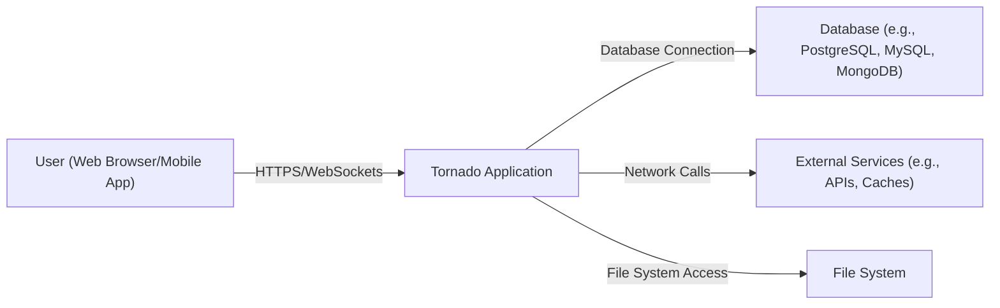
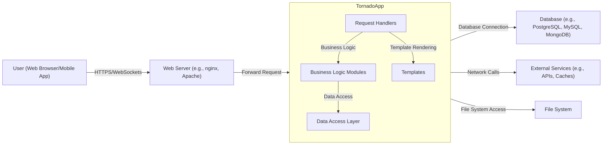
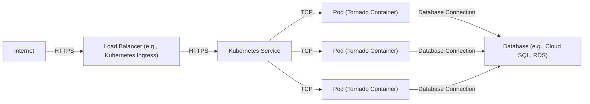
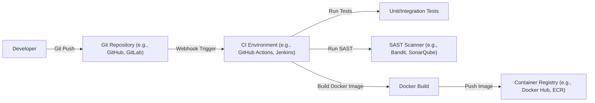

Okay, let's create a design document for the Tornado web framework, suitable for later threat modeling.

# BUSINESS POSTURE

Tornado is a Python web framework and asynchronous networking library.  It's designed for handling long-lived connections (like WebSockets) and high network traffic.  It's often used for real-time applications, APIs, and services that require high concurrency.  The business priorities and goals that Tornado addresses are:

*   Scalability:  Handling a large number of concurrent connections efficiently. This is crucial for applications with many users or devices connected simultaneously.
*   Performance:  Minimizing latency and maximizing throughput for fast response times.  This is important for real-time applications and user experience.
*   Real-time Capabilities:  Supporting persistent connections for bidirectional communication between clients and servers. This enables features like live updates, chat, and streaming.
*   Developer Productivity: Providing a relatively simple and easy-to-use framework for building asynchronous applications.
*   Open Source: Being freely available and community-supported, reducing development costs and fostering collaboration.

Based on these priorities, the most important business risks are:

*   Denial of Service (DoS):  The ability to handle a large number of connections makes Tornado applications potential targets for DoS attacks.  If the application isn't properly configured or protected, attackers could overwhelm it with requests, making it unavailable to legitimate users.
*   Data Breaches:  If security vulnerabilities exist in the application or its dependencies, attackers could gain unauthorized access to sensitive data.
*   Application Downtime:  Any bugs or errors in the application code could lead to crashes or instability, resulting in downtime and disruption of service.
*   Resource Exhaustion:  Improperly managed asynchronous operations or memory leaks could lead to resource exhaustion, impacting performance and stability.
*   Supply Chain Attacks: Vulnerabilities in third-party libraries used by the Tornado application or Tornado itself could be exploited by attackers.

# SECURITY POSTURE

Existing security controls and accepted risks, based on the Tornado documentation and common practices:

*   security control: Input Validation: Tornado provides mechanisms for handling user input, but it's the developer's responsibility to validate and sanitize all input to prevent common web vulnerabilities like Cross-Site Scripting (XSS) and SQL Injection. (Described in Tornado documentation and best practices for web development).
*   security control: Cross-Site Request Forgery (CSRF) Protection: Tornado includes built-in support for CSRF protection via the `xsrf_cookies` setting and the `xsrf_form_html()` method. (Described in Tornado documentation: [https://www.tornadoweb.org/en/stable/guide/security.html](https://www.tornadoweb.org/en/stable/guide/security.html)).
*   security control: Secure Cookies: Tornado allows setting secure cookie attributes (e.g., `secure`, `httponly`, `samesite`) to protect cookies from being intercepted or manipulated. (Described in Tornado documentation).
*   security control: Output Encoding: Developers are responsible for properly encoding output to prevent XSS vulnerabilities. Tornado provides some helper functions, but secure coding practices are essential. (Described in Tornado documentation and best practices for web development).
*   security control: Asynchronous Security Considerations: Tornado's asynchronous nature introduces specific security considerations. Developers must be careful to avoid race conditions and ensure that asynchronous operations are handled securely. (Described in Tornado documentation and best practices for asynchronous programming).
*   accepted risk: Limited Built-in Authentication/Authorization: Tornado provides basic building blocks, but developers often need to implement custom authentication and authorization mechanisms or integrate with external libraries/services.
*   accepted risk: Dependency Management: Tornado relies on external libraries (e.g., `asyncio`).  Developers are responsible for keeping these dependencies up-to-date and addressing any security vulnerabilities in them.
*   accepted risk: Deployment Security: Tornado itself doesn't dictate deployment security.  Secure deployment practices (e.g., using HTTPS, firewalls, secure server configurations) are the responsibility of the deployer.

Recommended Security Controls (High Priority):

*   security control: Implement robust authentication and authorization mechanisms, potentially using established libraries like `PyJWT` for JSON Web Tokens or integrating with an external identity provider.
*   security control: Enforce HTTPS to encrypt all communication between clients and the server.
*   security control: Implement rate limiting and other DoS protection measures to mitigate the risk of attacks.
*   security control: Regularly conduct security audits and penetration testing to identify and address vulnerabilities.
*   security control: Use a Web Application Firewall (WAF) to filter malicious traffic.
*   security control: Implement Content Security Policy (CSP) to mitigate XSS and other code injection attacks.
*   security control: Implement Subresource Integrity (SRI) to ensure that fetched resources haven't been tampered with.

Security Requirements:

*   Authentication:
    *   All endpoints that access sensitive data or perform sensitive actions MUST require authentication.
    *   Authentication mechanisms MUST use strong, industry-standard algorithms and protocols (e.g., bcrypt for password hashing, JWT with secure signing).
    *   Multi-factor authentication (MFA) SHOULD be considered for high-security applications.
*   Authorization:
    *   Access to resources and functionality MUST be controlled based on user roles and permissions (Role-Based Access Control - RBAC).
    *   Authorization checks MUST be performed on every request, not just at the initial login.
    *   The principle of least privilege MUST be followed, granting users only the minimum necessary access.
*   Input Validation:
    *   All user input MUST be validated against a strict whitelist of allowed characters and formats.
    *   Input validation MUST be performed on both the client-side (for user experience) and the server-side (for security).
    *   Input validation rules MUST be centralized and reusable.
*   Cryptography:
    *   All sensitive data MUST be encrypted at rest and in transit.
    *   Strong, industry-standard encryption algorithms MUST be used (e.g., AES-256 for symmetric encryption, RSA or ECC for asymmetric encryption).
    *   Cryptographic keys MUST be managed securely, using a key management system or hardware security module (HSM) where appropriate.
    *   Avoid using deprecated or weak cryptographic algorithms (e.g., MD5, SHA1).

# DESIGN

## C4 CONTEXT

C4 Context Element List:

*   Element:
    *   Name: User
    *   Type: Person
    *   Description: A user interacting with the Tornado application through a web browser or mobile app.
    *   Responsibilities: Initiates requests, views responses, interacts with the application's features.
    *   Security controls: Browser security features (e.g., same-origin policy, HTTPS enforcement), user-implemented security measures (e.g., strong passwords, antivirus).

*   Element:
    *   Name: Tornado Application
    *   Type: Software System
    *   Description: The core web application built using the Tornado framework.
    *   Responsibilities: Handles incoming requests, processes data, interacts with databases and external services, generates responses.
    *   Security controls: Input validation, CSRF protection, secure cookies, output encoding, authentication, authorization, rate limiting, DoS protection, CSP, SRI.

*   Element:
    *   Name: Database
    *   Type: Software System
    *   Description: A database system used to store and retrieve application data.
    *   Responsibilities: Stores data persistently, provides data access to the Tornado application.
    *   Security controls: Database access controls, encryption at rest, auditing, regular backups.

*   Element:
    *   Name: External Services
    *   Type: Software System
    *   Description: External APIs, caching services, or other systems that the Tornado application interacts with.
    *   Responsibilities: Provides specific functionalities or data to the Tornado application.
    *   Security controls: Secure communication protocols (e.g., HTTPS), API keys, authentication, authorization, rate limiting (on the external service side).

*   Element:
    *   Name: File System
    *   Type: Software System
    *   Description: Local file system.
    *   Responsibilities: Storing and serving static assets, like images, CSS, JS files.
    *   Security controls: File system permissions, access control lists.

## C4 CONTAINER

C4 Container Element List:

*   Element:
    *   Name: User
    *   Type: Person
    *   Description: A user interacting with the Tornado application.
    *   Responsibilities: Initiates requests, views responses.
    *   Security controls: Browser security features, user-implemented security.

*   Element:
    *   Name: Web Server
    *   Type: Container (Software)
    *   Description: A web server (e.g., nginx, Apache) that acts as a reverse proxy and load balancer for the Tornado application.
    *   Responsibilities: Handles TLS termination, static file serving, request routing, load balancing.
    *   Security controls: TLS configuration, WAF, access controls, request filtering.

*   Element:
    *   Name: Tornado Application
    *   Type: Container (Software)
    *   Description: The core web application built using Tornado.
    *   Responsibilities: Handles requests, processes data, interacts with other components.
    *   Security controls: Input validation, CSRF protection, secure cookies, output encoding.

*   Element:
    *   Name: Request Handlers
    *   Type: Component
    *   Description: Tornado request handlers that receive and process incoming requests.
    *   Responsibilities: Parses requests, calls business logic, generates responses.
    *   Security controls: Input validation, authentication, authorization.

*   Element:
    *   Name: Business Logic Modules
    *   Type: Component
    *   Description: Modules containing the core application logic.
    *   Responsibilities: Implements business rules, processes data.
    *   Security controls: Secure coding practices, input validation (again, as a defense-in-depth measure).

*   Element:
    *   Name: Templates
    *   Type: Component
    *   Description: Templates used to generate dynamic HTML responses.
    *   Security controls: Output encoding, context-aware escaping.

*   Element:
    *   Name: Data Access Layer
    *   Type: Component
    *   Description: A layer that abstracts database interactions.
    *   Responsibilities: Provides a consistent interface for accessing data, potentially uses an ORM.
    *   Security controls: Parameterized queries (to prevent SQL injection), secure connection configuration.

*   Element:
    *   Name: Database
    *   Type: Container (Software)
    *   Description: The database system.
    *   Responsibilities: Stores data persistently.
    *   Security controls: Database access controls, encryption at rest, auditing.

*   Element:
    *   Name: External Services
    *   Type: Container (Software)
    *   Description: External APIs and services.
    *   Responsibilities: Provides specific functionalities.
    *   Security controls: Secure communication, API keys, authentication.

*   Element:
    *   Name: File System
    *   Type: Container (Software)
    *   Description: Local file system.
    *   Responsibilities: Storing and serving static assets.
    *   Security controls: File system permissions, access control lists.

## DEPLOYMENT

Possible deployment solutions:

1.  Single Server: Simplest setup, suitable for development or low-traffic applications.
2.  Multiple Servers with Load Balancer:  Distributes traffic across multiple Tornado instances for increased capacity and redundancy.
3.  Containerized Deployment (Docker, Kubernetes):  Provides portability, scalability, and resource isolation.
4.  Cloud-Based Deployment (AWS, Google Cloud, Azure): Leverages cloud services for infrastructure management, scalability, and security.

Chosen solution (for detailed description): Containerized Deployment (Docker, Kubernetes)

Deployment Element List:

*   Element:
    *   Name: Internet
    *   Type: External
    *   Description: The public internet.
    *   Responsibilities: Source of incoming requests.
    *   Security controls: Network firewalls, intrusion detection/prevention systems.

*   Element:
    *   Name: Load Balancer
    *   Type: Infrastructure Node (Software)
    *   Description: A load balancer (e.g., Kubernetes Ingress) that distributes traffic across multiple pods.
    *   Responsibilities: Distributes incoming traffic, handles TLS termination.
    *   Security controls: TLS configuration, WAF, access controls.

*   Element:
    *   Name: Service
    *   Type: Infrastructure Node (Software)
    *   Description: A Kubernetes Service that provides a stable endpoint for accessing the Tornado application pods.
    *   Responsibilities: Provides a single point of access to the application, handles service discovery.
    *   Security controls: Network policies, access controls.

*   Element:
    *   Name: Pod (Tornado Container)
    *   Type: Infrastructure Node (Software)
    *   Description: A Kubernetes Pod containing a Docker container running the Tornado application.
    *   Responsibilities: Runs the Tornado application.
    *   Security controls: Container security best practices (e.g., minimal base image, non-root user), resource limits, network policies.

*   Element:
    *   Name: Database
    *   Type: Infrastructure Node (Software)
    *   Description: A managed database service (e.g., Cloud SQL, RDS).
    *   Responsibilities: Stores application data.
    *   Security controls: Database access controls, encryption at rest, auditing, firewall rules.

## BUILD

Build Process Description:

1.  Developer commits code to a Git repository (e.g., GitHub, GitLab).
2.  A webhook triggers a build in a CI environment (e.g., GitHub Actions, Jenkins).
3.  The CI environment runs unit and integration tests.
4.  A Static Application Security Testing (SAST) scanner (e.g., Bandit, SonarQube) analyzes the code for security vulnerabilities.
5.  If tests and SAST checks pass, a Docker image is built.
6.  The Docker image is pushed to a container registry (e.g., Docker Hub, Amazon ECR).

Security Controls in Build Process:

*   security control: Git Repository Access Control: Restricting access to the Git repository to authorized developers.
*   security control: CI Environment Security: Securing the CI environment itself (e.g., using strong authentication, limiting access).
*   security control: Automated Tests: Running unit and integration tests to catch bugs and regressions.
*   security control: SAST Scanning: Using a SAST scanner to identify potential security vulnerabilities in the code.
*   security control: Dependency Scanning: Scanning dependencies for known vulnerabilities (this could be part of the SAST process or a separate step).
*   security control: Secure Docker Build: Using a minimal base image, avoiding running the container as root, and following other Docker security best practices.
*   security control: Container Registry Authentication: Using secure credentials to access the container registry.
*   security control: Image Signing: Signing Docker images to ensure their integrity and authenticity.

# RISK ASSESSMENT

*   Critical Business Processes:
    *   Real-time communication (if applicable, e.g., for chat applications).
    *   API access for client applications.
    *   Data processing and storage.
    *   User authentication and authorization.

*   Data Sensitivity:
    *   User data (PII, credentials, preferences): High sensitivity.
    *   Application data (depending on the specific application): Could range from low to high sensitivity.
    *   Session data: Medium sensitivity.
    *   Logs: Medium sensitivity (should be treated carefully to avoid leaking sensitive information).

# QUESTIONS & ASSUMPTIONS

*   Questions:
    *   What specific types of user data will be stored?
    *   What external services will the application interact with?
    *   What are the specific performance and scalability requirements?
    *   What is the expected user base and traffic volume?
    *   What are the regulatory compliance requirements (e.g., GDPR, HIPAA)?
    *   What level of logging and auditing is required?
    *   Will there be any file uploads, and if so, what types of files will be allowed?
    *   What is the existing infrastructure and deployment environment?

*   Assumptions:
    *   BUSINESS POSTURE: The primary goal is to build a high-performance, scalable web application. Cost is a factor, but performance and reliability are prioritized.
    *   SECURITY POSTURE: A moderate level of security is required, balancing security with development speed and operational complexity.  Basic security measures are in place, but there's room for improvement.
    *   DESIGN: The application will use a standard web architecture with a database and potentially external services.  The deployment environment will be containerized (Docker/Kubernetes). The build process will be automated using a CI/CD pipeline.