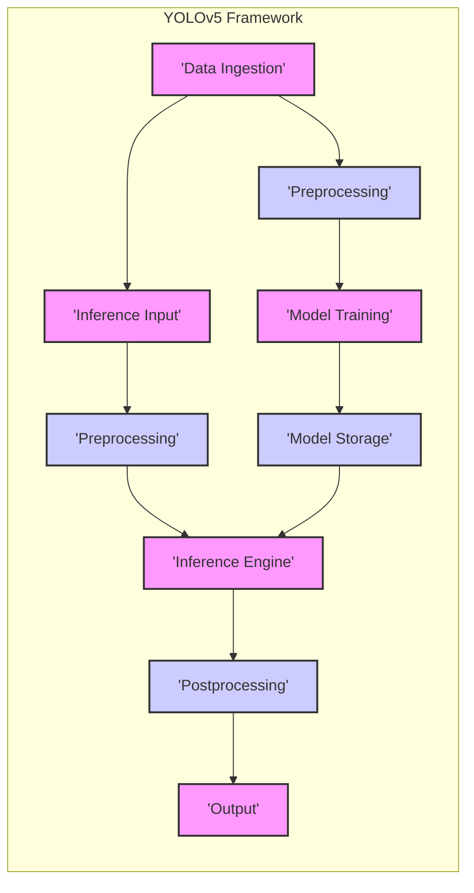
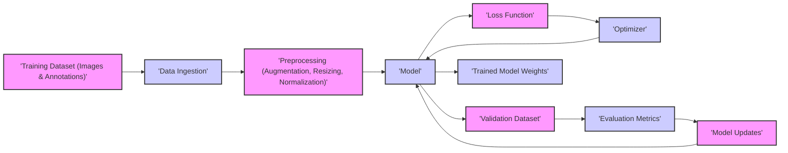

## Project Design Document: YOLOv5 Object Detection Framework (Improved)

**1. Introduction**

This document provides an enhanced design overview of the YOLOv5 object detection framework, based on the codebase available at [https://github.com/ultralytics/yolov5](https://github.com/ultralytics/yolov5). The purpose of this document is to offer a comprehensive understanding of the system's architecture, its constituent components, and the flow of data within it. This detailed description will serve as a robust foundation for subsequent threat modeling activities, enabling a thorough analysis of potential security vulnerabilities.

**2. Goals**

*   To provide a clear and detailed explanation of the YOLOv5 framework's architecture and its individual components.
*   To meticulously describe the data flow within the system, distinguishing between the training and inference processes.
*   To identify the core functionalities of the framework and elucidate their interactions.
*   To establish a solid basis for identifying potential security vulnerabilities, attack vectors, and areas of risk within the system.

**3. Scope**

This document focuses on the software architecture and data flow of the core YOLOv5 framework as represented in the provided GitHub repository. The scope includes a detailed examination of:

*   Mechanisms for data ingestion and preprocessing steps.
*   The processes involved in model training, including validation procedures.
*   The architecture and configuration options of the YOLOv5 model.
*   The inference process and prediction generation.
*   Considerations for model deployment in various scenarios.

This document explicitly excludes:

*   Specific hardware implementations or low-level hardware optimizations.
*   The detailed mathematical underpinnings of the YOLOv5 algorithm.
*   Integrations with third-party services or libraries beyond the core dependencies essential for its operation.
*   Specific deployment environments or platforms (e.g., detailed configurations for AWS, Azure, or specific edge devices).

**4. System Overview**

The YOLOv5 framework is a Python-based deep learning system designed for real-time object detection. It leverages the PyTorch library as its foundational deep learning framework for model construction and training. The primary functions of the system are to train a model using a dataset of images with labeled objects and subsequently utilize this trained model to detect objects within new, previously unseen images or video streams.

**5. Component Details**

*   **Data Ingestion:**
    *   Functionality to load image and annotation data from diverse sources, including local file systems, remote URLs, and potentially cloud storage.
    *   Support for various annotation formats such as YOLO format, COCO format, and potentially others.
    *   Implementation of data loading pipelines, potentially including mechanisms for shuffling and batching data.

*   **Preprocessing:**
    *   Transforms raw input data into a format suitable for the YOLOv5 model.
    *   Includes image resizing to a consistent input size, normalization of pixel values, and color space conversions (e.g., RGB to BGR).
    *   May involve more advanced techniques like image augmentation (e.g., flips, rotations, color adjustments) applied primarily during training to improve model robustness.
    *   This component is utilized in both the training and inference pipelines.

*   **Model Training:**
    *   The core process of training the object detection model using the provided dataset.
    *   Leverages the PyTorch framework for defining the model architecture (various YOLOv5 architectures like `yolov5s`, `yolov5m`, etc.), specifying loss functions (e.g., BCEWithLogitsLoss, CIoULoss), and selecting optimization algorithms (e.g., SGD, Adam).
    *   Involves iterative forward and backward propagation through the neural network to adjust model weights based on the calculated loss.
    *   Includes validation steps where the model's performance is evaluated on a held-out validation dataset to monitor generalization and prevent overfitting.

*   **Model Storage:**
    *   Responsible for saving the trained model's weights and configuration parameters.
    *   Typically involves saving the model's state dictionary (containing the learned weights) to files, often in the `.pt` format used by PyTorch.
    *   May also involve saving model configuration details, such as the architecture definition and training hyperparameters.

*   **Inference Engine:**
    *   Loads a pre-trained YOLOv5 model from storage.
    *   Takes preprocessed input images or video frames and performs a forward pass through the neural network to generate predictions.
    *   Can be optimized for different hardware platforms, potentially utilizing GPUs for accelerated computation via CUDA or other acceleration libraries.

*   **Postprocessing:**
    *   Processes the raw output tensors from the inference engine to refine the object detections.
    *   Crucially includes Non-Maximum Suppression (NMS) to filter out redundant and overlapping bounding box predictions for the same object.
    *   May involve applying confidence thresholds to filter out detections with low confidence scores.
    *   Transforms the processed output into a more user-friendly format, such as lists of bounding box coordinates, class labels, and associated confidence scores.

*   **Output:**
    *   Represents the final results of the object detection process.
    *   Can be presented in various forms:
        *   Visually overlaid bounding boxes and labels on the input image or video frame.
        *   Structured data formats (e.g., JSON, CSV) containing the detected object information.
        *   Integration with other systems or applications via APIs or data streams.

*   **Configuration:**
    *   Manages various settings and parameters that govern the behavior of the YOLOv5 framework.
    *   Includes:
        *   Model architecture selection (e.g., `yolov5s.yaml`, `yolov5m.yaml`).
        *   Training hyperparameters (e.g., learning rate, batch size, number of epochs).
        *   Paths to training and validation datasets.
        *   Inference parameters (e.g., confidence threshold, NMS IoU threshold).
    *   Configurations are often defined in YAML files or passed as command-line arguments.

*   **Dependencies:**
    *   Relies on a set of external libraries and frameworks, with PyTorch being the primary dependency for deep learning operations.
    *   Other common dependencies include:
        *   `torchvision`: Provides datasets, model architectures, and image transformations for PyTorch.
        *   `numpy`: For numerical computations and array manipulation.
        *   `opencv-python` (cv2): For image and video processing tasks.
        *   `Pillow` (PIL): Another image processing library.
        *   `PyYAML`: For parsing YAML configuration files.
        *   Potentially other utility libraries for tasks like logging, argument parsing, etc.

**6. Data Flow**

The data flow within the YOLOv5 framework can be distinctly separated into two primary workflows: the training process and the inference process.

**6.1. Training Data Flow**

*   **Training Dataset (Images & Annotations):** The initial input, consisting of a collection of images paired with corresponding annotations that define the objects present within each image (e.g., bounding box coordinates, class labels).
*   **Data Ingestion:** The process of loading the training images and their associated annotations from their storage locations.
*   **Preprocessing (Augmentation, Resizing, Normalization):** Applying transformations to the training images, including data augmentation techniques to increase the diversity of the training data, resizing images to the expected input size of the model, and normalizing pixel values.
*   **Model:** The specific YOLOv5 neural network architecture being trained (e.g., YOLOv5s, YOLOv5m).
*   **Loss Function:** A function that calculates the discrepancy between the model's predictions and the ground truth annotations, guiding the learning process.
*   **Optimizer:** An algorithm (e.g., Stochastic Gradient Descent, Adam) that adjusts the model's internal parameters (weights and biases) to minimize the loss function.
*   **Validation Dataset:** A separate set of labeled images held back from the training process, used to evaluate the model's performance on unseen data during training.
*   **Evaluation Metrics:** Metrics used to quantify the model's performance on the validation set (e.g., precision, recall, mAP).
*   **Model Updates:** The process of adjusting the model's weights based on the gradients calculated during backpropagation, driven by the optimizer.
*   **Trained Model Weights:** The final learned parameters of the YOLOv5 model after the training process is complete.

**6.2. Inference Data Flow**

```mermaid
graph LR
    A["'Input Image/Video'"] --> B["'Data Ingestion'"];
    B --> C["'Preprocessing (Resizing, Normalization)'"];
    C --> D["'Trained Model'"];
    D --> E["'Raw Predictions'"];
    E --> F["'Postprocessing (NMS)'"];
    F --> G["'Detected Objects (Bounding Boxes, Labels, Confidence)'"];
    style A fill:#f9f,stroke:#333,stroke-width:2px
    style B fill:#ccf,stroke:#333,stroke-width:2px
    style C fill:#f9f,stroke:#333,stroke-width:2px
    style D fill:#ccf,stroke:#333,stroke-width:2px
    style E fill:#f9f,stroke:#333,stroke-width:2px
    style F fill:#ccf,stroke:#333,stroke-width:2px
    style G fill:#f9f,stroke:#333,stroke-width:2px
```

*   **Input Image/Video:** The new, previously unseen image or video stream on which object detection is to be performed.
*   **Data Ingestion:** Loading the input image or video frame into the system.
*   **Preprocessing (Resizing, Normalization):** Transforming the input data to match the format expected by the trained model, typically involving resizing and normalization.
*   **Trained Model:** The previously trained YOLOv5 model loaded into memory.
*   **Raw Predictions:** The initial output from the model, typically consisting of a tensor containing bounding box coordinates, class probabilities, and objectness scores for potential detections.
*   **Postprocessing (NMS):** Applying postprocessing techniques, primarily Non-Maximum Suppression, to filter and refine the raw predictions, removing duplicate or overlapping detections.
*   **Detected Objects (Bounding Boxes, Labels, Confidence):** The final output of the inference process, providing the location (bounding box coordinates), identified class label, and confidence score for each detected object.

**7. Deployment Considerations**

The YOLOv5 framework offers flexibility in deployment, suitable for various environments:

*   **Local Machines:** Running inference directly on a user's personal computer or workstation, often utilizing local CPU or GPU resources.
*   **Cloud Environments:** Deploying the model on cloud platforms (e.g., AWS, Azure, GCP) for scalable inference, leveraging cloud-based compute resources and potentially specialized hardware like TPUs or GPUs. This often involves containerization (e.g., Docker) and orchestration (e.g., Kubernetes).
*   **Edge Devices:** Deploying the model on resource-constrained edge devices (e.g., embedded systems, mobile phones, IoT devices) for real-time object detection at the source of data. This often requires model optimization techniques like quantization or pruning.

The chosen deployment method significantly impacts security considerations, particularly concerning data access controls, model protection strategies, and the security of communication channels.

**8. Security Considerations (Initial)**

Based on the architecture and data flow, several potential security considerations emerge:

*   **Data Poisoning during Training:** Maliciously crafted or manipulated training data could be injected into the training pipeline, leading to a compromised model that performs poorly on specific inputs or exhibits biased behavior. For example, attackers could introduce images with incorrect labels or manipulate existing images to skew the model's learning.
*   **Model Theft and Reverse Engineering:** Trained YOLOv5 models represent valuable intellectual property. Attackers might attempt to steal trained model files from storage or memory. Furthermore, the model architecture and weights could be reverse-engineered to understand the model's inner workings or to create adversarial attacks.
*   **Vulnerabilities in Dependencies:** The YOLOv5 framework relies on numerous external libraries. Security vulnerabilities in these dependencies (e.g., known flaws in specific versions of PyTorch, OpenCV, or NumPy) could be exploited to compromise the system. Regular dependency scanning and updates are crucial.
*   **Manipulation of Input Data during Inference:** Attackers could manipulate input images or video streams provided to the inference engine to cause unexpected behavior. This could involve adversarial attacks designed to fool the model into making incorrect predictions or even crashing the system.
*   **Tampering with Output Data:** The output of the model (detected objects) could be intercepted and altered by malicious actors, potentially leading to incorrect information being used by downstream systems or applications. Secure communication channels are necessary to protect output integrity.
*   **Unauthorized Access to Resources:** Lack of proper access controls could allow unauthorized individuals or processes to access training data, trained models, or inference endpoints. This could lead to data breaches, model theft, or denial-of-service attacks.
*   **Code Injection Vulnerabilities:** If user-provided data or configurations (e.g., paths to datasets, model configurations) are not properly sanitized, it could create opportunities for code injection attacks, allowing attackers to execute arbitrary code on the system.
*   **Denial of Service (DoS) Attacks:** Attackers could flood the inference engine with a large number of requests, potentially overwhelming the system and making it unavailable.

**9. Future Considerations**

*   Implementation of robust access control mechanisms to protect training data, models, and inference endpoints, potentially leveraging role-based access control (RBAC).
*   Exploration and implementation of model encryption or obfuscation techniques to protect trained models from unauthorized access and reverse engineering.
*   Establishment of a process for regular security audits and vulnerability scanning of all dependencies to identify and address potential security flaws proactively.
*   Implementation of rigorous input validation and sanitization techniques to prevent malicious input from compromising the system.
*   Utilization of secure communication channels (e.g., HTTPS, TLS) for data transfer and API endpoints to protect data in transit.
*   Consideration of techniques for detecting and mitigating adversarial attacks on the inference engine.
*   Implementation of logging and monitoring mechanisms to detect suspicious activity and potential security breaches.

This improved design document provides a more detailed and comprehensive understanding of the YOLOv5 framework's architecture and data flow. This enhanced information will be invaluable for conducting a more thorough and effective threat modeling exercise to identify and mitigate potential security risks associated with the system.