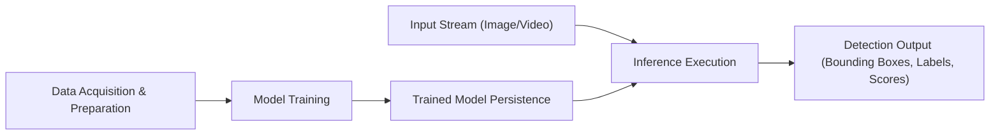
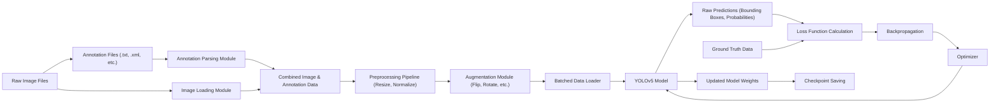
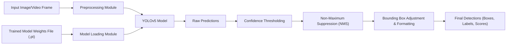

# Project Design Document: YOLOv5 Object Detection Framework - Improved

**Project Link:** https://github.com/ultralytics/yolov5

**1. Introduction**

This document provides an enhanced and more detailed design overview of the YOLOv5 object detection framework, as implemented in the provided GitHub repository. Building upon the previous version, this iteration aims to offer a more granular understanding of the system's architecture, data flow, and key components, with a stronger focus on aspects relevant to threat modeling. YOLOv5 is a widely recognized, real-time object detection model celebrated for its balance of speed and accuracy. This design emphasizes the software architecture, operational procedures, and potential security considerations within the framework.

**2. Goals and Objectives**

* **Provide a comprehensive and granular overview of the YOLOv5 framework's architecture, including internal module interactions.**
* **Detail the functionality and interdependencies of key components and their interactions within the system.**
* **Elucidate the data flow during both training and inference phases with increased clarity.**
* **Identify potential areas of interest for security considerations and threat modeling with more specific examples.**
* **Serve as a robust and informative document for security assessments, penetration testing, and vulnerability analysis.**
* **Facilitate a deeper understanding of the system for developers and security professionals.**

**3. High-Level Architecture**

The YOLOv5 framework can be broadly categorized into the following interconnected stages:

* **Data Acquisition & Preparation:** The process of obtaining, cleaning, annotating, and transforming data for training purposes.
* **Model Training:** The core process of learning the object detection model parameters from the prepared dataset.
* **Trained Model Persistence:** The mechanism for saving and retrieving the trained model weights and configuration.
* **Input Stream (Image/Video):** The source of data for real-time or batch object detection.
* **Inference Execution:** The process of applying the trained model to input data to detect objects.
* **Detection Output (Bounding Boxes, Labels, Scores):** The final results of the object detection process, including location, classification, and confidence.

**4. Detailed Architecture and Component Interaction**

The YOLOv5 framework is composed of several interconnected modules and processes:

* **Data Handling Subsystem:**
    * **Data Loading Modules (`data/dataset.py`):** Responsible for reading image and annotation data from disk or other sources.
    * **Preprocessing Pipelines:** Implementations for resizing, normalizing, and augmenting images.
    * **Annotation Parsing:** Logic to interpret annotation files (e.g., in YOLO format).
    * **Batching Mechanisms:**  Code to group data samples into batches for efficient processing.

* **Model Definition and Building (`models/yolo.py`, `models/common.py`):**
    * **Configuration Parsing:** Reading model architecture and hyperparameter settings from `.yaml` files.
    * **Layer Construction:** Building the neural network layers (convolutional, pooling, etc.) based on the configuration.
    * **Backbone Network (e.g., CSPDarknet):**  The feature extraction component of the model.
    * **Neck Network (e.g., PANet):**  Modules for feature aggregation and fusion across different scales.
    * **Head Network (YOLO Layer):**  The final layers responsible for predicting bounding boxes, objectness, and class probabilities.

* **Training Engine (`train.py`):**
    * **Optimizer Implementation:**  Algorithms (e.g., SGD, Adam) used to update model weights.
    * **Loss Function Calculation (`utils/loss.py`):**  Computing the difference between predictions and ground truth.
    * **Backpropagation and Gradient Descent:**  The core learning process of updating model parameters.
    * **Checkpoint Saving and Loading:**  Mechanisms to save and restore model training progress.
    * **Metrics Tracking (`utils/metrics.py`):**  Monitoring performance metrics like precision, recall, and mAP.
    * **Logging and Visualization:**  Tools for tracking training progress and debugging.

* **Inference Engine (`detect.py`):**
    * **Model Loading:**  Reading trained model weights from saved files.
    * **Input Preprocessing:**  Preparing input images or video frames for the model.
    * **Forward Pass:**  Passing the input through the trained model to generate predictions.
    * **Post-processing (`utils/general.py`):**
        *   **Confidence Thresholding:** Filtering predictions based on their confidence scores.
        *   **Non-Maximum Suppression (NMS):** Removing redundant overlapping bounding boxes.
        *   **Bounding Box Adjustment:** Scaling and formatting the output bounding boxes.

* **Export and Deployment Utilities (`export.py`):**
    * **Model Conversion:**  Tools to convert the PyTorch model to other formats (e.g., ONNX, TensorRT) for deployment on different platforms.
    * **Optimization Techniques:**  Scripts for applying optimization techniques like quantization.

* **Utility Modules (`utils/`):**
    * **General Utilities:** File handling, argument parsing, logging.
    * **PyTorch Utilities (`utils/torch_utils.py`):** Helper functions for PyTorch operations.
    * **Plotting and Visualization Tools.**

**5. Data Flow Diagrams**

**5.1 Detailed Training Data Flow:**

**5.2 Detailed Inference Data Flow:**

**6. Key Components and Modules (Elaborated)**

* **`models/yolo.py`:**  This module is central, defining the `YOLO` class which orchestrates the entire model architecture. It instantiates the backbone, neck, and head networks based on the configuration. It also includes the forward pass logic that dictates how input data flows through the network.
* **`models/common.py`:** This module provides reusable building blocks for constructing the neural network. It contains definitions for common layers like `Conv`, `Bottleneck`, `SPP` (Spatial Pyramid Pooling), and `C3` (Cross-Stage Partial connections) blocks, promoting modularity and code reuse.
* **`data/dataset.py`:** This script is crucial for handling the input data. It defines the `LoadImagesAndLabels` class, which is responsible for reading image files and their corresponding annotations. It also implements various data augmentation techniques specified in the configuration.
* **`utils/loss.py`:** This module defines the loss functions used to train the model. YOLOv5 typically employs a combination of losses, including classification loss, objectness loss, and bounding box regression loss. The specific loss functions and their parameters are defined here.
* **`utils/metrics.py`:** This module implements functions to calculate various evaluation metrics used to assess the performance of the trained model. Key metrics include precision, recall, mean Average Precision (mAP), and F1-score.
* **`utils/general.py`:**  A collection of general-purpose utility functions used throughout the project. This includes functions for file and directory manipulation, argument parsing, logging messages, plotting results, and other helper functionalities.
* **`utils/torch_utils.py`:** Contains utility functions specifically for working with PyTorch tensors and models. This might include functions for model initialization, layer manipulation, and other PyTorch-specific operations.
* **Configuration Files (`.yaml` in `models/` and `data/`):** These files are critical for configuring the model architecture, training hyperparameters, and dataset paths. They allow users to easily modify the model structure and training process without directly altering the code.

**7. Deployment Considerations (Expanded)**

The YOLOv5 framework offers flexibility in deployment, each with its own security implications:

* **Local Machine Deployment:**
    * **Pros:** Simple setup for development and testing.
    * **Cons:** Security relies on the user's machine security; potential for unauthorized access if the machine is compromised.

* **Cloud-Based Deployment (e.g., AWS, Google Cloud, Azure):**
    * **Pros:** Scalability, reliability, managed infrastructure.
    * **Cons:** Requires careful configuration of cloud security settings (IAM roles, network policies, data encryption); potential for cloud misconfigurations leading to vulnerabilities.

* **Edge Device Deployment (e.g., Embedded Systems, Mobile Devices):**
    * **Pros:** Low latency, offline capabilities, reduced bandwidth usage.
    * **Cons:** Resource constraints require model optimization; physical security of the device is crucial; potential for reverse engineering of the model on the device.

* **Web Application Integration (via APIs):**
    * **Pros:**  Accessibility from various clients.
    * **Cons:** Requires secure API design and implementation (authentication, authorization, input validation); potential for API abuse and injection attacks.

**8. Dependencies (Detailed)**

A thorough understanding of dependencies is crucial for security assessment:

* **Core Libraries:**
    * **Python (>=3.7):**  The foundation; vulnerabilities in the Python interpreter can impact the entire framework.
    * **PyTorch (>=1.7):** The deep learning backbone; security vulnerabilities in PyTorch could be exploited.
    * **Torchvision:** Provides essential datasets and utilities; vulnerabilities here can affect data handling.
    * **NumPy:** For numerical operations; vulnerabilities could lead to data manipulation issues.
    * **OpenCV (cv2):** For image and video processing; vulnerabilities in image decoding could be exploited with malicious inputs.

* **Utility Libraries:**
    * **YAML:** For configuration parsing; vulnerabilities could allow for injection of malicious configurations.
    * **Pillow (PIL):** For image manipulation; similar input vulnerabilities as OpenCV.
    * **Requests:** For making HTTP requests (e.g., downloading weights); potential for man-in-the-middle attacks if not used securely.
    * **Tqdm:** For progress bars; generally low security risk.
    * **Matplotlib:** For plotting; generally low security risk.

* **Operating System Libraries:** The underlying OS can introduce vulnerabilities if not properly patched and secured.

**Dependency Management:** Understanding how dependencies are managed (e.g., using `requirements.txt` and `pip`) is important for identifying potential supply chain risks.

**9. Security Considerations (Advanced)**

This section provides more specific examples of potential threats:

* **Data Security:**
    * **Training Data Poisoning:** Attackers injecting subtly modified or malicious data into the training set to cause the model to misclassify specific objects or introduce backdoors (e.g., making the model consistently misidentify stop signs). Mitigation: Strict data validation, source verification, anomaly detection in training data.
    * **Annotation Manipulation:**  Tampering with annotation files to misguide the training process. Mitigation: Secure storage and access control for annotation data, checksum verification.
    * **Exfiltration of Training Data:** Unauthorized access and copying of sensitive training images or videos. Mitigation: Access control, encryption at rest and in transit.

* **Model Security:**
    * **Adversarial Attacks (White-box/Black-box):** Crafting specific input images designed to fool the model into making incorrect predictions. Mitigation: Adversarial training, input sanitization, defensive distillation.
    * **Model Stealing/Extraction:**  Using queries to the model to reconstruct its parameters or functionality. Mitigation: Rate limiting, output perturbation, watermarking.
    * **Model Tampering:**  Directly modifying the trained model weights to introduce malicious behavior. Mitigation: Digital signatures, integrity checks.

* **Input Security:**
    * **Malicious Image/Video Injection:**  Providing crafted images or videos that exploit vulnerabilities in image processing libraries (e.g., buffer overflows in OpenCV). Mitigation: Input validation, sandboxing of processing, using secure decoding libraries.
    * **Denial of Service (DoS) Attacks:** Overwhelming the inference service with a large number of requests. Mitigation: Rate limiting, load balancing, input queue management.

* **Dependency Security:**
    * **Exploiting Known Vulnerabilities:** Attackers leveraging known vulnerabilities in outdated dependencies. Mitigation: Regular dependency updates, vulnerability scanning tools (e.g., Snyk, OWASP Dependency-Check).
    * **Supply Chain Attacks:**  Compromised dependencies injecting malicious code. Mitigation: Verifying package integrity (checksums), using trusted repositories.

* **Deployment Security:**
    * **Unauthorized Access to APIs:**  Exploiting insecure APIs to access or manipulate the model. Mitigation: Strong authentication and authorization mechanisms (OAuth 2.0), API rate limiting.
    * **Cloud Misconfigurations:**  Incorrectly configured cloud resources exposing the model or data. Mitigation: Infrastructure as Code (IaC) for consistent configurations, regular security audits.
    * **Compromised Edge Devices:**  Physical access to edge devices allowing for model extraction or tampering. Mitigation: Device hardening, encryption, secure boot.

* **Code Security:**
    * **Injection Vulnerabilities:**  Potential for code injection if user-supplied data is not properly sanitized (though less likely in the core numerical processing). Mitigation: Secure coding practices, input sanitization.
    * **Logic Flaws:**  Errors in the code that could be exploited. Mitigation: Thorough code reviews, static and dynamic analysis.

**10. Future Considerations**

* **Enhanced Security Features:**  Integrating features like model watermarking or differential privacy for training.
* **Formal Security Audits:**  Conducting professional security audits to identify potential vulnerabilities.
* **Improved Adversarial Robustness:**  Researching and implementing more advanced techniques to defend against adversarial attacks.
* **Standardized Security Best Practices Documentation:** Creating clear guidelines for secure development and deployment of YOLOv5 models.

This improved document provides a more detailed and nuanced understanding of the YOLOv5 framework, specifically tailored for threat modeling. It elaborates on component interactions, clarifies data flows, and offers more specific examples of potential security threats and mitigation strategies. This enhanced information will be valuable for security professionals conducting assessments and penetration testing.