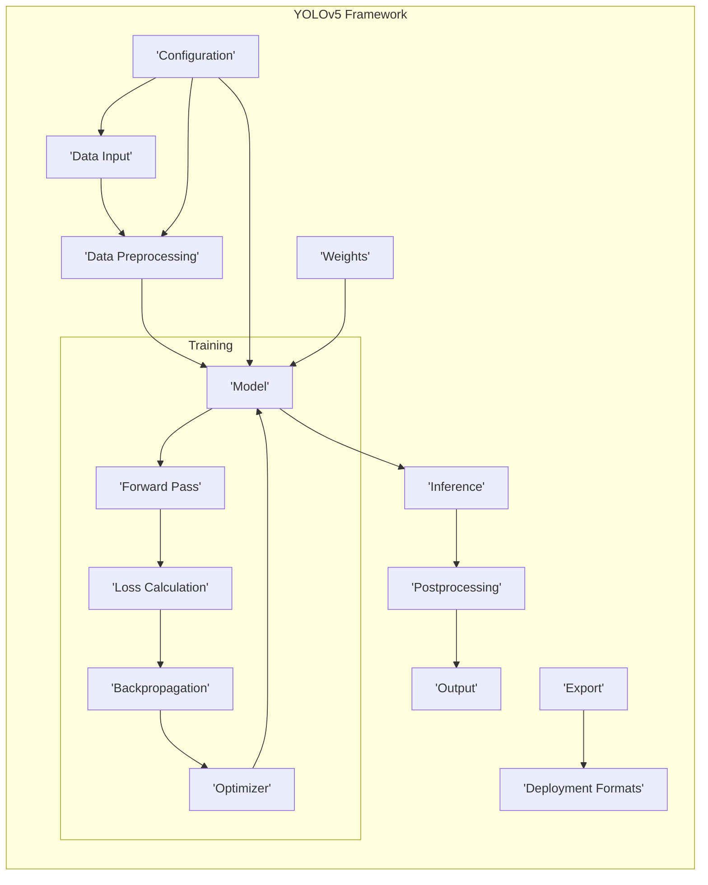

# Project Design Document: YOLOv5 Object Detection Framework

**Version:** 1.1
**Date:** October 26, 2023
**Prepared By:** AI Architecture Expert

## 1. Introduction

This document provides a detailed design overview of the YOLOv5 object detection framework, as represented by the codebase available at [https://github.com/ultralytics/yolov5](https://github.com/ultralytics/yolov5). This document aims to clearly articulate the system's architecture, components, data flows, and interactions. It will serve as a foundation for subsequent threat modeling activities.

### 1.1. Purpose

The primary purpose of this document is to provide a comprehensive architectural description of the YOLOv5 framework. This description will be used to identify potential security vulnerabilities and attack vectors during the threat modeling process. This document aims to be a living document, updated as the project evolves.

### 1.2. Scope

This document focuses on the software architecture of the YOLOv5 framework, including its core components, data processing pipelines, and interactions. It covers the training, validation, inference, and export aspects of the framework. It explicitly includes the configuration and weight management aspects. It does not delve into the specifics of the underlying hardware or operating system unless directly relevant to the software's functionality and security. This version focuses on the core framework and does not cover specific integrations or deployment environments in detail.

### 1.3. Goals

*   Clearly define the major functional components of the YOLOv5 framework.
*   Describe the flow of data and control within the system.
*   Identify key interactions and dependencies between components.
*   Provide sufficient technical detail for effective and targeted threat modeling.
*   Establish a common understanding of the system's architecture for security analysis.

## 2. System Overview

The YOLOv5 framework is a PyTorch-based object detection system. It allows users to train custom object detection models or utilize pre-trained models for inference. The core functionalities include data loading, preprocessing, model training, validation, inference, postprocessing, output, and export to various deployment formats.

**Key Components:**

*   **Data Input:**  Responsible for loading raw image and video data from various sources, along with associated annotations. This includes handling different file formats and data sources.
*   **Data Preprocessing:** Transforms the raw input data into a tensor format suitable for the YOLOv5 model. This involves resizing, normalization, data augmentation, and batching.
*   **Model:** Represents the core YOLOv5 neural network architecture, defined in PyTorch. This includes the various layers and connections that perform feature extraction and object detection.
*   **Training:** The iterative process of adjusting the model's internal parameters (weights) based on the training data and the calculated loss.
    *   **Forward Pass:**  The process of feeding input data through the model to generate predictions.
    *   **Loss Calculation:**  Computes the difference between the model's predictions and the ground truth annotations, quantifying the error.
    *   **Backpropagation:**  Calculates the gradients of the loss function with respect to the model's weights, indicating how to adjust the weights to reduce the loss.
    *   **Optimizer:**  Applies an optimization algorithm (e.g., SGD, Adam) to update the model's weights based on the calculated gradients.
*   **Inference:** The process of using a trained model to detect objects in new, unseen image or video data.
*   **Postprocessing:** Transforms the raw output of the inference process into meaningful object detections. This includes applying confidence thresholds, non-maximum suppression, and formatting the results.
*   **Output:**  Handles the presentation and storage of the final object detection results, such as displaying bounding boxes on images or saving the results to a file.
*   **Configuration:**  Manages the settings and parameters that control the behavior of the framework, including model architecture choices, training hyperparameters, and data loading options.
*   **Weights:**  Represents the learned parameters of the trained YOLOv5 model, stored in a file.
*   **Export:**  The functionality to convert the trained YOLOv5 model into various formats suitable for deployment on different platforms and devices.
*   **Deployment Formats:**  The different formats into which the model can be exported (e.g., ONNX, TensorFlow Lite, TorchScript), each with its own characteristics and intended use cases.

## 3. Detailed Design

This section provides a more granular view of the key components and their interactions, including specific responsibilities and data flows.

### 3.1. Data Handling

*   **Data Input Module:**
    *   **Description:**  Responsible for loading image and video data from various sources, including local file systems, network storage, and potentially cloud storage. It also handles parsing annotation files in different formats (e.g., YOLO, COCO, Pascal VOC).
    *   **Responsibilities:**
        *   Resolving file paths and accessing data sources.
        *   Decoding various image and video file formats (e.g., JPEG, PNG, MP4, AVI).
        *   Parsing annotation files and extracting bounding box coordinates and class labels.
        *   Handling potential errors during data loading (e.g., corrupted files, missing annotations).
    *   **Interactions:**  Initiated by the Training or Inference pipeline. Provides raw data to the Data Preprocessing module.
    *   **Data Flows:**  Receives file paths or data source identifiers. Outputs raw image/video data and corresponding annotation data.
    *   **Technology Stack:** Python, libraries like OpenCV, Pillow, potentially libraries for cloud storage access (e.g., boto3).

*   **Data Preprocessing Module:**
    *   **Description:** Transforms the raw input data into a numerical tensor format suitable for the YOLOv5 model. This involves a series of operations to normalize the data, augment it to improve model robustness, and batch it for efficient processing.
    *   **Responsibilities:**
        *   Resizing images to a consistent input size for the model.
        *   Normalizing pixel values to a specific range (e.g., 0 to 1).
        *   Applying data augmentation techniques such as random flips, rotations, scaling, and color adjustments.
        *   Converting image and annotation data into PyTorch tensors.
        *   Creating batches of data for parallel processing during training and inference.
    *   **Interactions:** Receives raw data from the Data Input module and configuration parameters. Sends preprocessed data tensors to the Model.
    *   **Data Flows:**  Receives raw image/video data and annotations. Outputs batches of preprocessed image tensors and corresponding target tensors.
    *   **Technology Stack:** PyTorch (torchvision.transforms), potentially custom augmentation implementations.

### 3.2. Model Architecture

*   **Model Definition:**
    *   **Description:** Defines the structure and layers of the YOLOv5 neural network. This includes convolutional layers for feature extraction, pooling layers for downsampling, and the YOLO head for predicting bounding boxes and class probabilities. Different model variants (e.g., YOLOv5s, m, l, x) have different depths and widths, affecting their performance and computational cost.
    *   **Responsibilities:**
        *   Defining the sequence and types of layers in the network.
        *   Specifying the connections between layers.
        *   Initializing the model's weights (either randomly or using pre-trained weights).
    *   **Interactions:**  Used by the Training and Inference modules. Receives configuration parameters specifying the model variant.
    *   **Data Flows:**  Receives preprocessed image tensors as input. Outputs raw prediction tensors containing bounding box coordinates, objectness scores, and class probabilities.
    *   **Technology Stack:** PyTorch (torch.nn).

*   **Weights Management:**
    *   **Description:** Handles the loading, saving, and management of the model's learned parameters (weights). This includes loading pre-trained weights, saving trained weights after training, and potentially managing different versions of weights.
    *   **Responsibilities:**
        *   Loading pre-trained weights from files.
        *   Saving trained model weights to files.
        *   Potentially managing different versions of trained weights.
        *   Ensuring the integrity and availability of weight files.
    *   **Interactions:** Interacts with the Training module (for saving) and the Inference module (for loading).
    *   **Data Flows:**  Reads weight files. Writes updated weight files.
    *   **Technology Stack:** Python, PyTorch (torch.save, torch.load).

### 3.3. Training Pipeline

*   **Forward Pass Module:**
    *   **Description:**  Executes the defined model architecture with the preprocessed input data to generate predictions. This involves passing the input tensors through the network's layers.
    *   **Responsibilities:**
        *   Feeding the input tensor through the model's layers.
        *   Generating the raw output predictions of the model.
    *   **Interactions:** Receives preprocessed data from the Data Preprocessing module and the Model definition. Sends raw prediction tensors to the Loss Calculation module.
    *   **Data Flows:**  Receives preprocessed image tensors. Outputs raw prediction tensors.
    *   **Technology Stack:** PyTorch.

*   **Loss Calculation Module:**
    *   **Description:**  Calculates the difference between the model's predictions and the ground truth annotations using a defined loss function. This quantifies how well the model is performing on the training data. YOLOv5 typically uses a combination of loss functions for bounding box regression, objectness, and classification.
    *   **Responsibilities:**
        *   Comparing the model's predicted bounding boxes, objectness scores, and class probabilities with the ground truth.
        *   Calculating the loss value based on the chosen loss function(s).
    *   **Interactions:** Receives raw prediction tensors from the Forward Pass module and ground truth annotations from the Data Input or Preprocessing module. Sends the calculated loss value to the Backpropagation module.
    *   **Data Flows:**  Receives raw prediction tensors and ground truth annotations. Outputs a scalar loss value.
    *   **Technology Stack:** PyTorch (torch.nn.functional), potentially custom loss function implementations.

*   **Backpropagation Module:**
    *   **Description:**  Calculates the gradients of the loss function with respect to the model's weights. These gradients indicate the direction and magnitude of the changes needed to the weights to reduce the loss.
    *   **Responsibilities:**
        *   Propagating the loss backward through the network's layers.
        *   Calculating the gradient of the loss with respect to each trainable parameter (weight) in the model.
    *   **Interactions:** Receives the loss value from the Loss Calculation module and interacts with the Model to access its parameters. Sends the calculated gradients to the Optimizer module.
    *   **Data Flows:**  Receives a scalar loss value. Outputs gradients for each model parameter.
    *   **Technology Stack:** PyTorch (autograd).

*   **Optimizer Module:**
    *   **Description:**  Updates the model's weights based on the calculated gradients using an optimization algorithm. This algorithm determines how the weights are adjusted to minimize the loss function. Common optimizers include Stochastic Gradient Descent (SGD) and Adam.
    *   **Responsibilities:**
        *   Applying the chosen optimization algorithm to update the model's weights.
        *   Potentially adjusting learning rates and other optimization parameters.
    *   **Interactions:** Receives gradients from the Backpropagation module and updates the Model's weights.
    *   **Data Flows:**  Receives gradients. Updates the model's internal weight parameters.
    *   **Technology Stack:** PyTorch (torch.optim).

### 3.4. Inference Pipeline

*   **Inference Module:**
    *   **Description:**  Utilizes a trained model to perform object detection on new, unseen input data. This involves loading the trained model weights and performing a forward pass on the input data.
    *   **Responsibilities:**
        *   Loading the trained model weights from a file.
        *   Performing the forward pass of the model on the input data.
    *   **Interactions:** Receives preprocessed data from the Data Preprocessing module and loads weights from the Weights Management module. Sends raw prediction tensors to the Postprocessing module.
    *   **Data Flows:**  Receives preprocessed image tensors. Outputs raw prediction tensors.
    *   **Technology Stack:** PyTorch.

*   **Postprocessing Module:**
    *   **Description:** Transforms the raw output of the inference process into final, usable object detections. This includes filtering detections based on confidence scores, applying non-maximum suppression to remove redundant detections, and formatting the output.
    *   **Responsibilities:**
        *   Applying a confidence threshold to filter out low-confidence detections.
        *   Performing Non-Maximum Suppression (NMS) to eliminate overlapping bounding boxes for the same object.
        *   Formatting the output detections into a structured format (e.g., bounding box coordinates, class labels, confidence scores).
    *   **Interactions:** Receives raw prediction tensors from the Inference module. Sends final detection results to the Output module.
    *   **Data Flows:**  Receives raw prediction tensors. Outputs a list of detected objects with bounding boxes, class labels, and confidence scores.
    *   **Technology Stack:** Python, potentially custom NMS implementations or libraries like torchvision.ops.

### 3.5. Output and Export

*   **Output Module:**
    *   **Description:**  Handles the presentation and storage of the final object detection results. This can involve displaying bounding boxes and labels on images or videos, saving the results to files in various formats, or sending the results to other systems or applications.
    *   **Responsibilities:**
        *   Drawing bounding boxes and class labels on input images or video frames.
        *   Saving detection results to files (e.g., JSON, CSV, text files).
        *   Potentially streaming results to other applications or services.
    *   **Interactions:** Receives final detection results from the Postprocessing module.
    *   **Data Flows:**  Receives detected objects (bounding boxes, labels, scores). Outputs visualized images/videos or saved detection results.
    *   **Technology Stack:** Python, libraries like OpenCV, Pillow, potentially libraries for data serialization (e.g., json, csv).

*   **Export Module:**
    *   **Description:**  Converts the trained YOLOv5 model into different formats suitable for deployment on various platforms and devices. This may involve optimizing the model for specific hardware or software environments.
    *   **Responsibilities:**
        *   Converting the PyTorch model to formats like ONNX, TensorFlow Lite, or TorchScript.
        *   Optimizing the model for inference speed and memory usage on target platforms.
        *   Generating deployment-ready model files.
    *   **Interactions:** Interacts with the Model and Weights Management modules.
    *   **Data Flows:**  Receives the model definition and weights. Outputs exported model files in the specified format.
    *   **Technology Stack:** PyTorch, ONNX, TensorFlow, other relevant libraries and tools.

### 3.6. Configuration Management

*   **Configuration Files:**
    *   **Description:** Stores various settings and parameters that control the behavior of the YOLOv5 framework. These files typically define model architecture choices, training hyperparameters (e.g., learning rate, batch size), data paths, and other operational settings.
    *   **Responsibilities:**
        *   Loading configuration parameters from files (e.g., YAML, JSON, Python scripts).
        *   Providing default configuration values.
        *   Allowing users to customize the framework's behavior.
    *   **Interactions:** Read by various modules, including Data Input, Data Preprocessing, Model Definition, Training, and Inference.
    *   **Data Flows:**  Configuration parameters are read from files.
    *   **Technology Stack:** YAML, Python, potentially other configuration file formats.

## 4. Security Considerations (For Threat Modeling)

This section outlines potential security concerns and vulnerabilities associated with the YOLOv5 framework, providing a basis for detailed threat modeling.

*   **Data Input Module:**
    *   **Threat:** Maliciously crafted image or video files could exploit vulnerabilities in decoding libraries (e.g., buffer overflows).
    *   **Threat:** Accessing data sources without proper authorization could lead to data breaches.
    *   **Threat:**  Loading annotation files from untrusted sources could introduce malicious code or incorrect labels, leading to model poisoning.
*   **Data Preprocessing Module:**
    *   **Threat:**  Exploiting vulnerabilities in data augmentation libraries could lead to unexpected behavior or crashes.
    *   **Threat:**  Manipulating preprocessing steps could subtly alter the training data, leading to biased models.
*   **Model Architecture:**
    *   **Threat:**  If the model definition itself is loaded from an untrusted source, it could contain malicious code or be a backdoor.
*   **Weights Management:**
    *   **Threat:** Unauthorized access to weight files could allow attackers to steal the trained model or use it for malicious purposes.
    *   **Threat:** Loading weights from untrusted sources could introduce backdoors or vulnerabilities into the model.
    *   **Threat:**  Weight files could be corrupted or tampered with, leading to model malfunction.
*   **Training Pipeline:**
    *   **Threat:** Data poisoning during training could lead to models that perform poorly on specific inputs or exhibit biased behavior.
    *   **Threat:**  Manipulating training hyperparameters could lead to unstable training or the creation of vulnerable models.
*   **Inference Pipeline:**
    *   **Threat:**  Adversarial attacks could craft inputs that cause the model to make incorrect predictions.
    *   **Threat:**  Denial-of-service attacks could overload the inference service with excessive requests.
*   **Postprocessing Module:**
    *   **Threat:**  Vulnerabilities in NMS implementations could be exploited to manipulate detection results.
*   **Output Module:**
    *   **Threat:**  Saving results to insecure locations could expose sensitive information.
    *   **Threat:**  Displaying results without proper sanitization could lead to cross-site scripting (XSS) vulnerabilities in web-based applications.
*   **Export Module:**
    *   **Threat:**  Exporting the model to insecure formats or without proper protection could expose intellectual property.
    *   **Threat:**  Vulnerabilities in export libraries could be exploited.
*   **Configuration Management:**
    *   **Threat:**  Loading configuration files from untrusted sources could lead to arbitrary code execution.
    *   **Threat:**  Sensitive information (e.g., API keys, database credentials) stored in configuration files could be exposed.

## 5. Deployment Considerations

The security implications of deploying YOLOv5 vary significantly depending on the deployment environment.

*   **Cloud Deployments:** Require careful consideration of cloud security best practices, including access control, network security, and data encryption. Vulnerabilities in the cloud platform itself could also pose a risk.
*   **Edge Deployments:**  Often involve resource-constrained devices with limited security features. Physical security of the devices becomes more important, as does secure communication between the edge device and other systems.
*   **Local Deployments:**  Security depends on the security posture of the local machine or network. Access control and malware protection are key considerations.

## 6. Future Considerations

*   Implementation of robust input validation and sanitization across all data entry points.
*   Integration of secure model loading and verification mechanisms.
*   Enhancement of logging and monitoring capabilities for security auditing.
*   Regular security assessments and penetration testing.
*   Adoption of secure coding practices and dependency management.
*   Consideration of differential privacy techniques for training data.

This improved design document provides a more detailed and structured overview of the YOLOv5 framework, enhancing its utility for subsequent threat modeling activities. The added details on responsibilities, data flows, and specific security considerations aim to facilitate a more comprehensive and targeted security analysis.