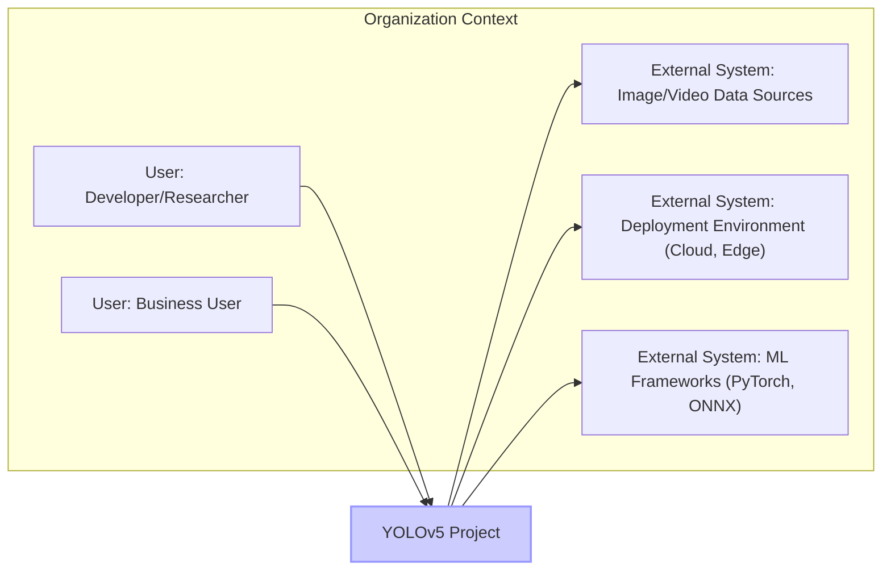
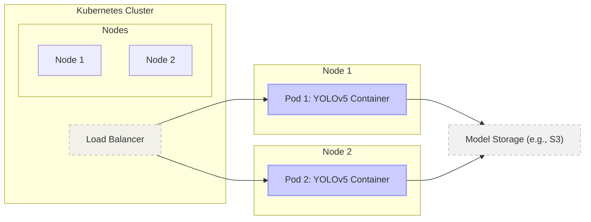

# BUSINESS POSTURE

The YOLOv5 project provides a cutting-edge object detection framework. It aims to be highly performant, accurate, and easy to use for developers and researchers interested in computer vision tasks. The primary business goal is to empower users to build and deploy object detection solutions efficiently across various platforms, from research and development to production environments.

- Business priorities:
  - High performance and accuracy in object detection.
  - Ease of use and accessibility for a wide range of users.
  - Flexibility and adaptability to different hardware and software environments.
  - Active community support and continuous improvement.

- Business risks:
  - Misuse of object detection technology for unethical purposes (e.g., unauthorized surveillance).
  - Vulnerabilities in the YOLOv5 framework leading to security breaches in systems that utilize it.
  - Lack of trust in the technology due to security concerns or data privacy issues.
  - Dependence on open-source community for security updates and maintenance.

# SECURITY POSTURE

- Security control: Open source code repository on GitHub, allowing for community review and contributions. Implemented: GitHub repository.
- Security control: Use of Python and PyTorch, benefiting from the security features and community support of these ecosystems. Implemented: Software stack selection.
- Accepted risk: Reliance on community contributions for identifying and addressing security vulnerabilities.
- Accepted risk: Potential for vulnerabilities in dependencies (Python packages, PyTorch, CUDA, etc.).
- Accepted risk: Security of user-developed applications built using YOLOv5 is the responsibility of the user.

- Recommended security controls:
  - security control: Implement automated dependency scanning to identify and address vulnerabilities in third-party libraries.
  - security control: Integrate Static Application Security Testing (SAST) tools into the development pipeline to detect potential code-level vulnerabilities.
  - security control: Conduct regular security audits and penetration testing to identify and remediate security weaknesses.
  - security control: Provide secure deployment guidelines and best practices for users to minimize security risks in their applications.

- Security requirements:
  - Authentication: Not directly applicable to the YOLOv5 framework itself as it is a library. However, if deployed as a service or API, authentication will be required to control access.
  - Authorization: Access control mechanisms may be needed if YOLOv5 is used in a multi-user environment or if access to models and data needs to be restricted.
  - Input validation: Implement robust input validation to prevent injection attacks and ensure that input data (images, videos, model configurations) is properly sanitized and validated.
  - Cryptography: Consider using cryptography to protect sensitive data, such as trained models or user data, if applicable to the deployment scenario. For example, encrypting models at rest or in transit if confidentiality is critical.

# DESIGN

## C4 CONTEXT



- Context Diagram Elements:
  - Element:
    - Name: User: Developer/Researcher
    - Type: Person
    - Description: Software developers, machine learning researchers, and students who use YOLOv5 to build, train, and experiment with object detection models.
    - Responsibilities: Utilize YOLOv5 library to develop and train object detection models, integrate models into applications, contribute to the project.
    - Security controls: Responsible for secure coding practices when integrating YOLOv5, securing their development environments.
  - Element:
    - Name: User: Business User
    - Type: Person
    - Description: Business professionals who leverage applications built with YOLOv5 for various purposes such as analytics, automation, and security.
    - Responsibilities: Utilize applications powered by YOLOv5, consume object detection results, provide feedback on application performance.
    - Security controls: Rely on application providers to ensure the security of YOLOv5 based applications, manage access to sensitive data processed by applications.
  - Element:
    - Name: External System: Image/Video Data Sources
    - Type: External System
    - Description: External sources of image and video data used as input for YOLOv5 models. These can be local files, network streams, databases, or cloud storage.
    - Responsibilities: Provide image and video data for model training and inference.
    - Security controls: Implement access controls to data sources, ensure data integrity and confidentiality, protect against unauthorized access and data breaches.
  - Element:
    - Name: External System: Deployment Environment (Cloud, Edge)
    - Type: External System
    - Description: Various environments where YOLOv5 models and applications are deployed, including cloud platforms (AWS, GCP, Azure), edge devices (Raspberry Pi, mobile phones), and on-premise servers.
    - Responsibilities: Provide infrastructure for running YOLOv5 models and applications.
    - Security controls: Implement security controls specific to the deployment environment, such as network security, access management, and infrastructure hardening.
  - Element:
    - Name: External System: ML Frameworks (PyTorch, ONNX)
    - Type: External System
    - Description: Underlying machine learning frameworks that YOLOv5 depends on, primarily PyTorch. ONNX is used for model export and interoperability.
    - Responsibilities: Provide core machine learning functionalities, numerical computation, and model execution.
    - Security controls: Rely on the security of the underlying ML frameworks, stay updated with security patches and best practices for these frameworks.
  - Element:
    - Name: YOLOv5 Project
    - Type: Software System
    - Description: The YOLOv5 object detection framework, providing tools and libraries for training, validating, and deploying object detection models.
    - Responsibilities: Provide high-performance object detection capabilities, maintain code quality and security, offer documentation and support.
    - Security controls: Implement secure coding practices, conduct security testing, manage dependencies securely, provide security guidance to users.

## C4 CONTAINER

```mermaid
flowchart LR
    subgraph "YOLOv5 Project Containers"
        A["Python Application: YOLOv5 Library"]
        B["Model Zoo: Pre-trained Models"]
        C["Training Pipeline: Scripts & Utilities"]
        D["Inference Engine: Detection Code"]
        E["API (Optional): REST/gRPC Interface"]
    end

    A --> B: Uses
    A --> C: Uses
    A --> D: Uses
    E --> A: Uses

    style A fill:#ccf,stroke:#99f,stroke-width:2px
    style B fill:#eee,stroke:#999,stroke-width:1px,stroke-dasharray:5,opacity:0.8
    style C fill:#eee,stroke:#999,stroke-width:1px,stroke-dasharray:5,opacity:0.8
    style D fill:#eee,stroke:#999,stroke-width:1px,stroke-dasharray:5,opacity:0.8
    style E fill:#eee,stroke:#999,stroke-width:1px,stroke-dasharray:5,opacity:0.8
```

- Container Diagram Elements:
  - Element:
    - Name: Python Application: YOLOv5 Library
    - Type: Container - Application
    - Description: The core Python library providing the object detection functionalities of YOLOv5. Includes modules for model loading, training, inference, and utilities.
    - Responsibilities: Object detection logic, model management, user interface (command-line, Python API).
    - Security controls: Input validation, secure coding practices, dependency management, SAST scanning during development.
  - Element:
    - Name: Model Zoo: Pre-trained Models
    - Type: Container - Data Store
    - Description: Collection of pre-trained YOLOv5 models for various object detection tasks. Models are typically stored as files (e.g., .pt, .onnx).
    - Responsibilities: Storage and distribution of pre-trained models.
    - Security controls: Access control to model files, integrity checks to ensure models are not tampered with, potentially cryptographic signing of models.
  - Element:
    - Name: Training Pipeline: Scripts & Utilities
    - Type: Container - Application
    - Description: Scripts and utilities for training custom YOLOv5 models. Includes data preprocessing, training loops, evaluation metrics, and configuration files.
    - Responsibilities: Model training, data processing, experiment management.
    - Security controls: Secure handling of training data, input validation for training configurations, access control to training infrastructure.
  - Element:
    - Name: Inference Engine: Detection Code
    - Type: Container - Application
    - Description: The part of the library responsible for performing object detection inference on input images or videos using trained models.
    - Responsibilities: Efficient and accurate object detection inference.
    - Security controls: Input validation, memory safety, protection against denial-of-service attacks during inference.
  - Element:
    - Name: API (Optional): REST/gRPC Interface
    - Type: Container - Application
    - Description: Optional REST or gRPC API that can be built on top of the YOLOv5 library to expose object detection as a service.
    - Responsibilities: Provide network-accessible object detection service.
    - Security controls: Authentication, authorization, input validation, rate limiting, secure communication (HTTPS/TLS), API security best practices.

## DEPLOYMENT

Deployment scenario: Cloud Deployment using Docker containers on a Kubernetes cluster.



- Deployment Diagram Elements:
  - Element:
    - Name: Kubernetes Cluster
    - Type: Infrastructure - Cluster
    - Description: A Kubernetes cluster providing container orchestration and management for deploying YOLOv5 applications.
    - Responsibilities: Container orchestration, scaling, load balancing, service discovery, health monitoring.
    - Security controls: Kubernetes RBAC, network policies, pod security policies, cluster security hardening, regular security updates.
  - Element:
    - Name: Nodes (Node 1, Node 2)
    - Type: Infrastructure - Compute Node
    - Description: Worker nodes in the Kubernetes cluster where YOLOv5 containers are deployed and executed.
    - Responsibilities: Running containerized applications, providing compute resources.
    - Security controls: Operating system hardening, container runtime security, node security monitoring, access control to nodes.
  - Element:
    - Name: Load Balancer
    - Type: Infrastructure - Network Device
    - Description: A load balancer distributing incoming traffic across multiple YOLOv5 container instances for high availability and scalability.
    - Responsibilities: Traffic distribution, load balancing, health checks.
    - Security controls: DDoS protection, TLS termination, access control lists, security monitoring.
  - Element:
    - Name: Pods (Pod 1, Pod 2): YOLOv5 Container
    - Type: Container - Application Instance
    - Description: Instances of the YOLOv5 application running in Docker containers within Kubernetes pods.
    - Responsibilities: Running YOLOv5 inference engine, processing object detection requests.
    - Security controls: Container image security scanning, resource limits, network segmentation, application-level security controls.
  - Element:
    - Name: Model Storage (e.g., S3)
    - Type: Infrastructure - Data Storage
    - Description: External storage service (like AWS S3) used to store YOLOv5 models, accessible by the YOLOv5 containers.
    - Responsibilities: Persistent storage for models, model versioning.
    - Security controls: Access control policies (IAM), encryption at rest and in transit, data integrity checks, regular backups.

## BUILD

```mermaid
flowchart LR
    A["Developer"] --> B["Code Repository (GitHub)"];
    B --> C["CI/CD Pipeline (GitHub Actions)"];
    C --> D["Build Environment (Docker)"];
    D --> E["Security Scanners (SAST, Dependency)"];
    E --> F["Build Artifacts (Docker Image, Python Package)"];
    F --> G["Artifact Repository (e.g., Docker Hub, PyPI)"];

    style C fill:#eee,stroke:#999,stroke-width:1px,stroke-dasharray:5,opacity:0.8
    style D fill:#eee,stroke:#999,stroke-width:1px,stroke-dasharray:5,opacity:0.8
    style E fill:#eee,stroke:#999,stroke-width:1px,stroke-dasharray:5,opacity:0.8
    style F fill:#eee,stroke:#999,stroke-width:1px,stroke-dasharray:5,opacity:0.8
    style G fill:#eee,stroke:#999,stroke-width:1px,stroke-dasharray:5,opacity:0.8
```



- Build Process Elements:
  - Element:
    - Name: Developer
    - Type: Person
    - Description: Software developers contributing code to the YOLOv5 project.
    - Responsibilities: Writing code, committing changes, creating pull requests.
    - Security controls: Secure coding practices, code review, access control to code repository.
  - Element:
    - Name: Code Repository (GitHub)
    - Type: Tool - Version Control
    - Description: GitHub repository hosting the YOLOv5 source code.
    - Responsibilities: Version control, code collaboration, issue tracking.
    - Security controls: Access control (authentication, authorization), branch protection, audit logs.
  - Element:
    - Name: CI/CD Pipeline (GitHub Actions)
    - Type: Tool - Automation
    - Description: GitHub Actions workflows automating the build, test, and release process for YOLOv5.
    - Responsibilities: Automated build, testing, security scanning, artifact publishing.
    - Security controls: Secure pipeline configuration, secret management, access control to pipeline definitions, audit logs.
  - Element:
    - Name: Build Environment (Docker)
    - Type: Tool - Build Environment
    - Description: Docker containers used as isolated and reproducible build environments for compiling and packaging YOLOv5.
    - Responsibilities: Consistent build environment, dependency management.
    - Security controls: Base image security scanning, minimal image footprint, build process isolation.
  - Element:
    - Name: Security Scanners (SAST, Dependency)
    - Type: Tool - Security Scanning
    - Description: Static Application Security Testing (SAST) tools and dependency scanners integrated into the CI/CD pipeline to automatically detect vulnerabilities.
    - Responsibilities: Automated vulnerability detection, security gate in the build process.
    - Security controls: Regularly updated vulnerability databases, configurable scanning rules, reporting and alerting.
  - Element:
    - Name: Build Artifacts (Docker Image, Python Package)
    - Type: Artifact - Software Package
    - Description: Output of the build process, including Docker images and Python packages (e.g., for PyPI).
    - Responsibilities: Deployable software artifacts.
    - Security controls: Artifact signing, integrity checks, vulnerability scanning of artifacts before publishing.
  - Element:
    - Name: Artifact Repository (e.g., Docker Hub, PyPI)
    - Type: Tool - Artifact Storage
    - Description: Repositories for storing and distributing build artifacts, such as Docker Hub for Docker images and PyPI for Python packages.
    - Responsibilities: Artifact storage, versioning, distribution.
    - Security controls: Access control, vulnerability scanning of hosted artifacts, audit logs, secure distribution channels (HTTPS).

# RISK ASSESSMENT

- Critical business processes we are trying to protect:
  - Integrity and availability of object detection services built using YOLOv5.
  - Confidentiality and integrity of data processed by YOLOv5 applications (images, videos, detection results).
  - Reputation and trust in the YOLOv5 project and applications built with it.

- Data we are trying to protect and their sensitivity:
  - Input images and videos: Sensitivity depends on the application. Could contain personal identifiable information (PII), sensitive locations, or confidential business data. Sensitivity level: Low to High, depending on use case.
  - Trained models: Represent intellectual property and potentially sensitive training data. Sensitivity level: Medium to High, depending on the model and training data.
  - Detection results: Can reveal sensitive information depending on the input data and application. Sensitivity level: Low to High, depending on use case.
  - User data (if applicable, e.g., in a hosted service): User credentials, API keys, usage logs. Sensitivity level: High.

# QUESTIONS & ASSUMPTIONS

- Questions:
  - What are the primary target deployment environments for YOLOv5 applications (cloud, edge, on-premise)?
  - Are there specific regulatory compliance requirements that applications built with YOLOv5 need to adhere to (e.g., GDPR, HIPAA)?
  - What is the expected scale and performance requirements for typical YOLOv5 deployments?
  - Are there specific security certifications or standards that the YOLOv5 project or applications need to meet?
  - Is there a dedicated security team or individual responsible for security aspects of the YOLOv5 project?

- Assumptions:
  - BUSINESS POSTURE: The primary business goal is to provide a widely adopted and trusted object detection framework. Security is important for user trust and adoption.
  - SECURITY POSTURE: The project currently relies on open-source community security practices. There is room for improvement in implementing more proactive security controls in the development and deployment lifecycle.
  - DESIGN: YOLOv5 is primarily used as a library, but can be deployed in various architectures, including cloud-based services and edge applications. Security considerations need to be addressed at each deployment scenario.