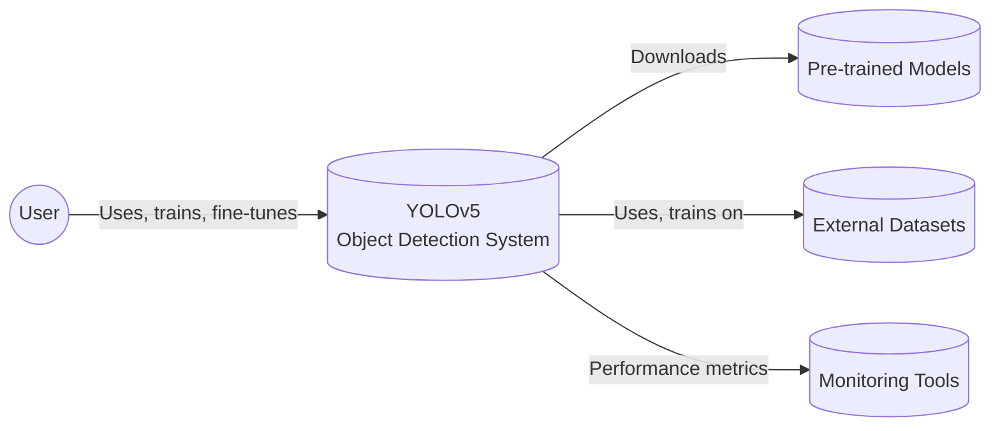
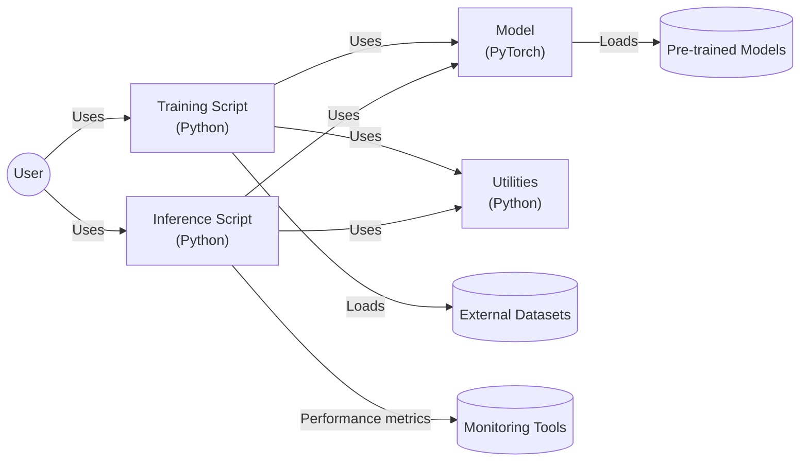
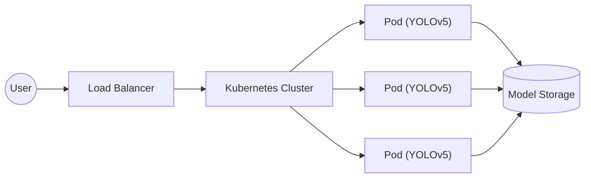
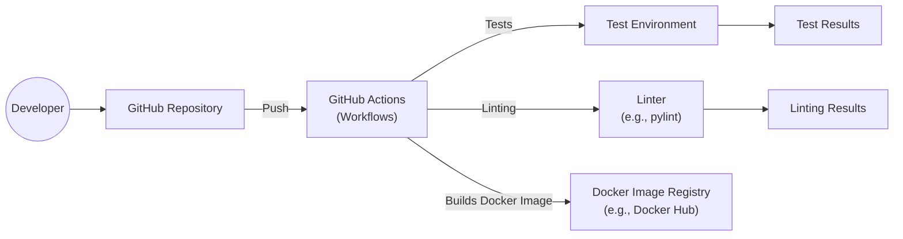

# BUSINESS POSTURE

The YOLOv5 project, hosted at the provided GitHub repository, appears to be a popular open-source project focused on real-time object detection. Given its nature, the following business priorities and goals can be inferred:

Priorities and Goals:

*   Maintainability and Extensibility: As an open-source project, it's crucial to have a codebase that is easy to understand, modify, and extend by a community of contributors.
*   Performance: Real-time object detection implies a strong need for high performance and efficiency in terms of both speed and accuracy.
*   Ease of Use: The project should be accessible to a wide range of users, including those with limited experience in deep learning. This includes clear documentation, simple APIs, and pre-trained models.
*   Community Engagement: A thriving open-source project relies on active community participation, contributions, and feedback.
*   Reproducibility: Users should be able to easily reproduce the results reported in research papers or other publications related to YOLOv5.
*   Wide Applicability: The project should be adaptable to a variety of use cases and environments, making it valuable to a broad audience.

Business Risks:

*   Malicious Use: The technology could be used for malicious purposes, such as unauthorized surveillance or creating deepfakes.
*   Intellectual Property: There might be risks associated with the use of specific datasets or algorithms that have licensing restrictions.
*   Dependency Risks: Reliance on external libraries and frameworks introduces potential risks if those dependencies become outdated, unmaintained, or contain vulnerabilities.
*   Reputation Risk: If the project is associated with security vulnerabilities, inaccurate results, or unethical applications, it could damage the reputation of the project and its contributors.
*   Lack of Funding/Support: As an open-source project, long-term sustainability depends on community contributions or finding a sustainable funding model.

# SECURITY POSTURE

Existing Security Controls:

*   security control: Code Reviews: The GitHub repository indicates a collaborative development process, suggesting that code reviews are likely part of the workflow. (Implicit in the pull request process on GitHub).
*   security control: Issue Tracking: The project uses GitHub Issues for tracking bugs and feature requests, which can include security-related issues. (Visible on the GitHub repository).
*   security control: Community Vetting: Being a popular open-source project, it benefits from a large number of users who may identify and report security issues. (Implicit due to the open-source nature).
*   security control: Dependency Management: The `requirements.txt` file specifies project dependencies, allowing for easier auditing and updates. (Visible in the repository).

Accepted Risks:

*   accepted risk: Reliance on Third-Party Libraries: The project depends on several third-party libraries (e.g., PyTorch, OpenCV), which introduces the risk of vulnerabilities in those dependencies.
*   accepted risk: Limited Formal Security Audits: While community vetting is valuable, there's no indication of regular, formal security audits.
*   accepted risk: Potential for Misuse: The technology can be used for malicious purposes, and the project maintainers have limited control over how it's deployed.
*   accepted risk: Evolving Threat Landscape: The field of object detection is constantly evolving, and new attack vectors or vulnerabilities may emerge.

Recommended Security Controls:

*   security control: Static Application Security Testing (SAST): Integrate SAST tools into the development workflow to automatically scan for common vulnerabilities.
*   security control: Software Composition Analysis (SCA): Use SCA tools to identify and track known vulnerabilities in third-party dependencies.
*   security control: Fuzz Testing: Implement fuzz testing to discover unexpected behavior and potential vulnerabilities by providing invalid or random inputs.
*   security control: Security Training: Provide security training to contributors to raise awareness of common vulnerabilities and secure coding practices.
*   security control: Clear Security Reporting Process: Establish a clear and documented process for users to report security vulnerabilities.

Security Requirements:

*   Authentication: Not directly applicable to the core object detection functionality, but may be relevant for related services (e.g., model serving APIs).
*   Authorization: Similar to authentication, not directly applicable to the core functionality, but may be relevant for related services.
*   Input Validation: Crucial for preventing vulnerabilities. The project should carefully validate all inputs, including image data, model parameters, and configuration files.
*   Cryptography: May be relevant if the project handles sensitive data or communicates with external services. If so, use strong, well-vetted cryptographic libraries and protocols.

# DESIGN

## C4 CONTEXT

Element Descriptions:

*   Element:
    *   Name: User
    *   Type: Person
    *   Description: Represents a person who interacts with the YOLOv5 system. This could be a developer, researcher, or end-user.
    *   Responsibilities: Uses the system for object detection, trains or fine-tunes models, provides input data, and interprets results.
    *   Security controls: Not directly applicable, as this is an external entity.

*   Element:
    *   Name: YOLOv5 Object Detection System
    *   Type: Software System
    *   Description: The core YOLOv5 system for real-time object detection.
    *   Responsibilities: Performs object detection, provides APIs for training and inference, manages models and configurations.
    *   Security controls: Input validation, dependency management, code reviews, community vetting.

*   Element:
    *   Name: Pre-trained Models
    *   Type: Data
    *   Description: Pre-trained models provided by Ultralytics or the community.
    *   Responsibilities: Provide a starting point for object detection tasks, reducing training time and resources.
    *   Security controls: Integrity checks (e.g., checksums) to ensure models haven't been tampered with.

*   Element:
    *   Name: External Datasets
    *   Type: Data
    *   Description: Datasets used for training and evaluating YOLOv5 models (e.g., COCO, ImageNet).
    *   Responsibilities: Provide labeled data for training and evaluating object detection models.
    *   Security controls: Data provenance tracking, integrity checks.

*   Element:
    *   Name: Monitoring Tools
    *   Type: Software System
    *   Description: External tools used to monitor the performance and resource usage of the YOLOv5 system.
    *   Responsibilities: Collect and visualize performance metrics, such as inference speed, accuracy, and resource utilization.
    *   Security controls: Secure communication channels, access controls.

## C4 CONTAINER

Element Descriptions:

*   Element:
    *   Name: User
    *   Type: Person
    *   Description: Represents a person who interacts with the YOLOv5 system.
    *   Responsibilities: Uses the system for object detection, trains or fine-tunes models, provides input data, and interprets results.
    *   Security controls: Not directly applicable.

*   Element:
    *   Name: Training Script
    *   Type: Python Script
    *   Description: Python script (`train.py`) used for training and fine-tuning YOLOv5 models.
    *   Responsibilities: Handles data loading, model training, hyperparameter optimization, and saving trained models.
    *   Security controls: Input validation (for configuration parameters and data paths), secure handling of sensitive data (if any).

*   Element:
    *   Name: Inference Script
    *   Type: Python Script
    *   Description: Python script (`detect.py`) used for performing object detection with trained YOLOv5 models.
    *   Responsibilities: Loads trained models, processes input images or videos, performs object detection, and outputs results.
    *   Security controls: Input validation (for image data, model paths, and configuration parameters), secure handling of output data.

*   Element:
    *   Name: Model
    *   Type: PyTorch Model
    *   Description: The core YOLOv5 object detection model, implemented using the PyTorch framework.
    *   Responsibilities: Performs the actual object detection calculations.
    *   Security controls: Regular updates to the PyTorch framework to address security vulnerabilities.

*   Element:
    *   Name: Utilities
    *   Type: Python Modules
    *   Description: Supporting Python modules providing various utility functions (e.g., data loading, image processing, non-maximum suppression).
    *   Responsibilities: Provide reusable functionality for training and inference.
    *   Security controls: Code reviews, static analysis.

*   Element:
    *   Name: Pre-trained Models
    *   Type: Data
    *   Description: Pre-trained models provided by Ultralytics or the community.
    *   Responsibilities: Provide a starting point for object detection tasks.
    *   Security controls: Integrity checks.

*   Element:
    *   Name: External Datasets
    *   Type: Data
    *   Description: Datasets used for training and evaluating YOLOv5 models.
    *   Responsibilities: Provide labeled data for training and evaluation.
    *   Security controls: Data provenance tracking, integrity checks.

*   Element:
    *   Name: Monitoring Tools
    *   Type: Software System
    *   Description: External tools used to monitor performance.
    *   Responsibilities: Collect and visualize performance metrics.
    *   Security controls: Secure communication channels, access controls.

## DEPLOYMENT

Possible deployment solutions:

1.  Local Machine: The simplest deployment option, suitable for development, testing, and small-scale applications.
2.  Cloud Virtual Machine (VM): Deploying on a cloud VM (e.g., AWS EC2, Google Compute Engine) provides more resources and scalability.
3.  Cloud Container Service: Using container services (e.g., Docker, Kubernetes, AWS ECS, Google Kubernetes Engine) offers better portability, scalability, and resource management.
4.  Serverless Functions: Deploying inference as a serverless function (e.g., AWS Lambda, Google Cloud Functions) can be cost-effective for low-volume or sporadic workloads.
5.  Edge Devices: Deploying on edge devices (e.g., NVIDIA Jetson) enables real-time object detection in resource-constrained environments.

Chosen deployment solution (Cloud Container Service with Kubernetes):

Element Descriptions:

*   Element:
    *   Name: User
    *   Type: Person
    *   Description: Represents a person who interacts with the deployed YOLOv5 system.
    *   Responsibilities: Sends requests to the system and receives object detection results.
    *   Security controls: Not directly applicable.

*   Element:
    *   Name: Load Balancer
    *   Type: Network Component
    *   Description: Distributes incoming requests across multiple instances of the YOLOv5 application.
    *   Responsibilities: Ensures high availability and scalability.
    *   Security controls: TLS termination, DDoS protection.

*   Element:
    *   Name: Kubernetes Cluster
    *   Type: Container Orchestration System
    *   Description: Manages the deployment, scaling, and operation of the YOLOv5 application containers.
    *   Responsibilities: Provides a platform for running and managing containerized applications.
    *   Security controls: Network policies, role-based access control (RBAC), pod security policies.

*   Element:
    *   Name: Pod (YOLOv5)
    *   Type: Kubernetes Pod
    *   Description: A single instance of the YOLOv5 application running within the Kubernetes cluster.
    *   Responsibilities: Performs object detection based on incoming requests.
    *   Security controls: Resource limits, security context constraints.

*   Element:
    *   Name: Model Storage
    *   Type: Persistent Storage
    *   Description: Stores the trained YOLOv5 models. This could be a cloud storage service (e.g., AWS S3, Google Cloud Storage) or a network file system.
    *   Responsibilities: Provides persistent storage for trained models.
    *   Security controls: Access controls, encryption at rest, encryption in transit.

## BUILD

The YOLOv5 project appears to use a combination of manual and automated build processes. There isn't a single, fully automated CI/CD pipeline defined in the repository, but there are elements that suggest some level of automation.

Build Process Description:

1.  Developer: Developers write code and push changes to the GitHub repository.
2.  GitHub Repository: The central repository for the YOLOv5 codebase.
3.  GitHub Actions: The project uses GitHub Actions for some automated tasks, such as running tests and linting. These are defined in workflow files within the `.github/workflows` directory.
4.  Test Environment: GitHub Actions likely sets up a test environment (e.g., using a specific Python version and installing dependencies) to run the tests.
5.  Linter: A linter (e.g., `pylint`, `flake8`) is used to check code style and identify potential errors.
6.  Docker Image Registry: While not explicitly defined in the repository, it's common practice to build Docker images for YOLOv5 deployments. This likely happens outside of the core repository's workflows, potentially triggered by releases or manual builds.
7.  Test Results: The results of the automated tests are reported back to GitHub Actions.
8.  Linting Results: The results of the linting checks are also reported back.

Security Controls in Build Process:

*   security control: Code Reviews: Enforced through the GitHub pull request process.
*   security control: Automated Testing: GitHub Actions run tests on each push, helping to catch bugs and regressions early.
*   security control: Linting: Static code analysis helps to enforce coding standards and identify potential issues.
*   security control: Dependency Management: `requirements.txt` and potentially `Pipfile`/`Pipfile.lock` (if used) manage dependencies, allowing for vulnerability scanning.

# RISK ASSESSMENT

Critical Business Processes:

*   Real-time object detection: The core functionality of the project.
*   Model training and fine-tuning: Enabling users to customize the model for their specific needs.
*   Community engagement and contribution: Maintaining a healthy open-source project.

Data and Sensitivity:

*   Input Images/Videos: Sensitivity depends on the use case. Could range from publicly available images to highly sensitive surveillance footage.
*   Trained Models: May contain proprietary information or reflect the characteristics of the training data.
*   Configuration Files: May contain API keys or other sensitive credentials if interacting with external services.
*   User Data (if applicable): If the project is used in a service that collects user data, that data would need to be protected according to relevant privacy regulations.

# QUESTIONS & ASSUMPTIONS

Questions:

*   Are there any specific compliance requirements (e.g., GDPR, HIPAA) that apply to the use cases of YOLOv5?
*   What is the expected threat model? Are there specific attackers or attack vectors that are of particular concern?
*   Are there any plans to monetize the project or offer commercial support?
*   What is the process for handling security vulnerabilities reported by external researchers?
*   Is there a specific budget allocated for security improvements?
*   What level of logging and monitoring is required for deployments?

Assumptions:

*   BUSINESS POSTURE: The primary goal is to provide a high-quality, open-source object detection system.
*   BUSINESS POSTURE: The project maintainers are willing to accept some level of risk associated with the open-source nature of the project.
*   SECURITY POSTURE: The project relies primarily on community contributions and best practices for security.
*   SECURITY POSTURE: There is no dedicated security team or formal security audit process.
*   DESIGN: The provided design reflects a common and reasonable deployment architecture, but specific deployments may vary.
*   DESIGN: The build process is partially automated, with some manual steps involved.