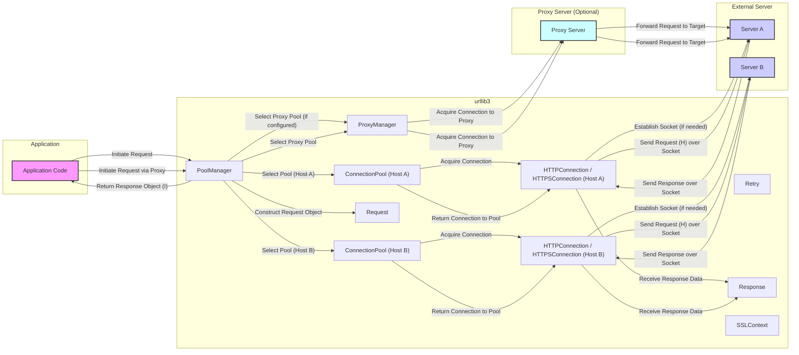

# Project Design Document: urllib3

**Version:** 1.1
**Date:** October 26, 2023
**Author:** AI Software Architect

## 1. Introduction

This document provides an enhanced design overview of the `urllib3` Python library, building upon the previous version. `urllib3` serves as a foundational HTTP client for Python, offering features beyond the standard library, such as robust connection management, SSL/TLS verification, and efficient request handling. This detailed design aims to facilitate comprehensive threat modeling by clearly articulating the architecture, component interactions, and data flow within `urllib3`.

## 2. Goals and Objectives

The core objectives of `urllib3` are to:

*   Offer a dependable and feature-rich HTTP client for Python applications.
*   Present a straightforward and intuitive API for making HTTP requests.
*   Manage intricate HTTP functionalities, including connection pooling, redirects, and retry mechanisms.
*   Ensure secure communication through thorough SSL/TLS certificate verification.
*   Maintain thread safety for concurrent operations in multithreaded environments.
*   Support a wide array of HTTP methods and data encoding formats.
*   Enable seamless integration into diverse Python projects.

## 3. Architectural Overview

`urllib3` employs a modular design centered around the efficient management of HTTP connections and requests. Key components collaborate to streamline the process of sending requests and processing responses. A central design principle is resource optimization, particularly through its connection pooling system, which minimizes the overhead of establishing new connections.

## 4. Component Design

This section provides a more detailed breakdown of the key components within `urllib3`, emphasizing their roles and interactions.

*   **`PoolManager`:**
    *   Serves as the primary interface for initiating HTTP requests.
    *   Maintains a collection of `ConnectionPool` instances, organized by target host.
    *   Selects the appropriate `ConnectionPool` based on the destination URL.
    *   Dynamically creates new `ConnectionPool` instances when necessary.
    *   Offers high-level methods for making requests, including:
        *   `request()`:  A general-purpose request method.
        *   `request_encode_url()`:  For requests where data is encoded in the URL.
        *   `urlopen()`:  A file-like interface for making requests.
*   **`ConnectionPool`:**
    *   Dedicated to managing a pool of persistent `HTTPConnection` or `HTTPSConnection` objects for a specific host.
    *   Significantly reduces the latency associated with establishing new connections for repeated requests to the same server.
    *   Implements mechanisms for:
        *   Connection recycling: Reusing existing connections.
        *   Connection timeouts: Preventing indefinite waits for a connection.
    *   Handles connection-related errors and may trigger request retries based on configured policies.
*   **`HTTPConnection` / `HTTPSConnection`:**
    *   Thin wrappers around Python's standard library modules: `http.client.HTTPConnection` and `http.client.HTTPSConnection`.
    *   Provide granular control over individual HTTP connections.
    *   Responsible for the low-level socket communication with the remote server.
    *   `HTTPSConnection` incorporates SSL/TLS encryption and certificate verification, leveraging the `SSLContext`.
*   **`Request`:**
    *   An internal representation of an HTTP request.
    *   Encapsulates all necessary information for a request:
        *   HTTP method (e.g., GET, POST, PUT, DELETE).
        *   Target URL.
        *   HTTP headers.
        *   Request body (if applicable).
    *   Constructed and used internally by `PoolManager` and `ConnectionPool`.
*   **`Response`:**
    *   Represents the HTTP response received from the server.
    *   Contains crucial information about the server's reply:
        *   HTTP status code (e.g., 200 OK, 404 Not Found).
        *   Response headers.
        *   Response body (the actual content returned by the server).
    *   Provides methods for accessing and processing the response data.
*   **`Retry`:**
    *   Implements configurable logic for automatically retrying failed requests.
    *   Allows customization of retry behavior based on:
        *   Specific HTTP status codes.
        *   Connection-related errors.
        *   Maximum number of retry attempts.
    *   Introduces delays between retry attempts to avoid overwhelming the server.
*   **`Timeout`:**
    *   Manages time limits for various stages of the request lifecycle, preventing indefinite blocking.
    *   Includes settings for:
        *   Connect timeout: The maximum time to establish a connection.
        *   Read timeout: The maximum time to wait for data to be received.
*   **`SSLContext`:**
    *   Centralizes the configuration of SSL/TLS settings for secure HTTPS connections.
    *   Handles critical security aspects:
        *   Loading trusted root certificates for server verification (often using the `certifi` package).
        *   Setting the minimum and maximum TLS protocol versions.
        *   Configuring cipher suites.
        *   Managing client certificates (for mutual TLS authentication).
*   **`ProxyManager`:**
    *   Functions similarly to `PoolManager`, but specifically designed for routing requests through a proxy server.
    *   Manages connections to the specified proxy server.
    *   Supports different proxy types (e.g., HTTP, SOCKS).
*   **`Fields` (Multipart Encoding):**
    *   Facilitates the encoding of data in the `multipart/form-data` format, commonly used for file uploads and complex form submissions.
    *   Handles the construction of the multipart message body, including proper boundary delimiters.

## 5. Data Flow

The following diagram illustrates the typical flow of data when making an HTTP request using `urllib3`, highlighting key components and interactions.

**Detailed Steps:**

1. The application initiates an HTTP request by calling a method on a `PoolManager` (or `ProxyManager`).
2. The `PoolManager` identifies the appropriate `ConnectionPool` based on the target host. If a pool doesn't exist, it's created.
3. The `ConnectionPool` attempts to retrieve a ready-to-use `HTTPConnection` or `HTTPSConnection` from its pool.
4. If no free connection is available, a new socket connection is established with the target server (or proxy), involving DNS resolution and TCP handshake. For `HTTPSConnection`, the `SSLContext` manages the SSL/TLS handshake, including certificate verification.
5. The `PoolManager` constructs a `Request` object containing the HTTP method, URL, headers, and body.
6. The `HTTPConnection` or `HTTPSConnection` transmits the request data over the established socket.
7. The external server processes the request and sends back an HTTP `Response`.
8. The `HTTPConnection` or `HTTPSConnection` receives the raw response data from the socket.
9. A `Response` object is created, encapsulating the status code, headers, and body of the server's response.
10. The connection is typically returned to the `ConnectionPool` for potential reuse by subsequent requests to the same host, improving efficiency.
11. The `PoolManager` returns the `Response` object to the calling application code.
12. If the request encounters errors (e.g., network issues, server errors), the `Retry` component may intervene to automatically retry the request based on predefined policies.

## 6. Security Considerations

Security is a paramount concern in the design of `urllib3`. Key security features and considerations include:

*   **Strict SSL/TLS Verification:**
    *   By default, `urllib3` enforces rigorous verification of server certificates when using `HTTPSConnection`.
    *   It relies on the `certifi` package, which provides a regularly updated bundle of trusted root certificates.
    *   Users have the option to configure custom certificates or disable verification entirely, but this is strongly discouraged in production environments due to the significant security risks.
    *   The `SSLContext` component allows fine-grained control over SSL/TLS settings, including protocol versions and cipher suites.
    *   **Threat Modeling Implication:**  Misconfiguration or disabling of certificate verification can expose applications to man-in-the-middle attacks.
*   **Hostname Verification:**
    *   `urllib3` verifies that the hostname presented in the server's certificate matches the hostname being requested in the URL.
    *   This crucial step prevents attackers from using valid certificates for different domains to impersonate legitimate servers.
    *   **Threat Modeling Implication:** Failure of hostname verification could lead to an application communicating with a malicious server.
*   **Secure Defaults:**
    *   `urllib3` is designed with secure defaults, such as enabling certificate verification and preferring secure TLS protocol versions.
    *   This reduces the likelihood of developers inadvertently introducing vulnerabilities through insecure configurations.
*   **Protection Against Injection Vulnerabilities:**
    *   While `urllib3` itself doesn't directly handle user-provided data that could lead to injection attacks (like SQL injection or command injection), it's essential that applications using `urllib3` diligently sanitize and validate any user input that is incorporated into URLs, headers, or request bodies.
    *   **Threat Modeling Implication:** Applications must implement their own input validation to prevent injection attacks when using `urllib3`.
*   **Proxy Security:**
    *   `urllib3` supports various proxy types (HTTP, SOCKS), each with its own security implications.
    *   When using proxies, it's crucial to trust the proxy server, as it has the potential to intercept and inspect traffic.
    *   Authentication mechanisms for proxies should be used where available.
    *   **Threat Modeling Implication:**  Compromised or malicious proxy servers can expose sensitive data.
*   **Cookie Handling:**
    *   `urllib3` adheres to HTTP standards for handling cookies.
    *   Applications need to be aware of the security implications of cookie usage, such as the risk of session hijacking if cookies are not properly protected (e.g., using the `HttpOnly` and `Secure` flags).
    *   **Threat Modeling Implication:**  Insecure cookie handling can lead to unauthorized access to user accounts.
*   **Robust Error Handling:**
    *   Proper error handling is vital to prevent information leaks or unexpected program behavior. `urllib3` provides specific exceptions for various error conditions, allowing applications to handle them gracefully.
    *   **Threat Modeling Implication:**  Verbose error messages in production environments could reveal sensitive information to attackers.
*   **Dependency Management and Security:**
    *   The security of `urllib3` is also dependent on the security of its dependencies, most notably `certifi`. Regularly updating dependencies is crucial to patch any known vulnerabilities.
    *   **Threat Modeling Implication:**  Vulnerabilities in dependencies can directly impact the security of `urllib3`.

## 7. Dependencies

`urllib3` relies on the following key dependencies:

*   **`certifi`:**  Provides a widely trusted collection of Certificate Authority (CA) root certificates, essential for verifying the authenticity of SSL/TLS connections. The security of `certifi` is paramount for `urllib3`'s secure operation.
*   **Standard Python Libraries:**  Leverages core Python libraries such as `socket`, `ssl`, `http.client`, and `io`, which are generally considered stable and well-maintained.

## 8. Deployment Considerations

When deploying applications that utilize `urllib3`, consider the following:

*   **Python Version Compatibility:** Ensure compatibility between the application's Python version and the installed version of `urllib3`.
*   **Dependency Management:** Employ tools like `pip` and virtual environments (`venv`) to isolate and manage `urllib3` and its dependencies. Regularly audit and update dependencies to address security vulnerabilities.
*   **Configuration Management:**  Properly configure `urllib3` settings, such as timeouts, retry policies, and SSL/TLS options, according to the application's security requirements. Avoid disabling certificate verification in production.
*   **Secure Credential Handling:**  If the application needs to authenticate with remote servers, ensure that credentials are handled securely (e.g., using environment variables or dedicated secrets management solutions) and are not hardcoded in the application.
*   **Network Security:**  Consider the network environment in which the application will be deployed. Implement appropriate network security measures, such as firewalls and intrusion detection systems, to protect against network-based attacks.
*   **Logging and Monitoring:** Implement comprehensive logging and monitoring to detect and respond to potential security incidents. Log relevant information about requests made using `urllib3`.

## 9. Future Considerations

Potential future enhancements and security considerations for `urllib3` include:

*   **Enhanced Asynchronous Support:**  Further improving support for asynchronous operations using `asyncio` to enhance performance and scalability, while ensuring the security of asynchronous operations.
*   **HTTP/3 Support:**  Adding support for the HTTP/3 protocol, which includes inherent security features like QUIC encryption.
*   **More Granular Control over Connection Security:**  Providing more fine-grained options for configuring connection security parameters.
*   **Improved Observability and Security Auditing:**  Adding more hooks and metrics for monitoring and security auditing of requests and connections.
*   **Standardized Security Hardening Guidance:**  Providing clear and comprehensive guidance on security best practices for configuring and using `urllib3`.

This enhanced design document provides a more in-depth understanding of the `urllib3` library's architecture, components, and security considerations. This detailed information is crucial for conducting thorough threat modeling and implementing appropriate security measures to protect applications that rely on `urllib3`.
