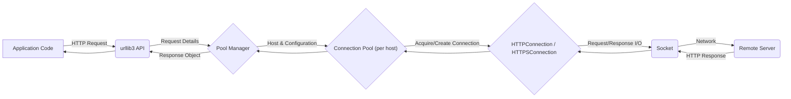
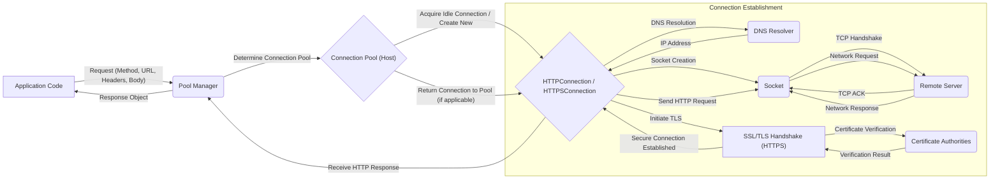

# Project Design Document: urllib3

**Version:** 1.1
**Date:** October 26, 2023
**Author:** AI Software Architect

## 1. Introduction

This document provides an enhanced and more detailed design overview of the urllib3 Python library, building upon the previous version. It aims to provide a comprehensive understanding of the library's architecture, component interactions, data flow, and crucial security considerations for effective threat modeling. urllib3 simplifies making HTTP requests in Python by abstracting away low-level details and offering features like connection pooling and retry mechanisms. This document serves as a robust foundation for understanding the library's inner workings and identifying potential security vulnerabilities with greater precision.

## 2. Goals and Objectives

The primary goals of this revised design document are to:

*   Provide an even more granular articulation of the urllib3 library's architecture.
*   Elaborate on the interactions between key components with specific examples.
*   Illustrate the flow of data during various operational scenarios with more detail.
*   Highlight security-relevant aspects of the design with concrete examples of potential risks.
*   Offer a more robust and detailed basis for conducting thorough threat modeling exercises.

## 3. Architectural Overview

urllib3 is designed to be efficient and reliable, offering a higher-level interface over Python's built-in HTTP capabilities. Its core strength lies in managing connections effectively, ensuring performance and stability.

### 3.1. High-Level Architecture

*   **Application Code:** The Python code utilizing urllib3 to perform HTTP operations.
*   **urllib3 API:** The public methods and classes exposed by the library for making requests and configuring behavior.
*   **Pool Manager:** The central component responsible for managing connection pools based on the target host and any specified configuration.
*   **Connection Pool (per host):**  Maintains a collection of reusable connections for a specific host, optimizing performance by reducing connection overhead.
*   **HTTPConnection / HTTPSConnection:** Handles the actual transmission and reception of data over HTTP or HTTPS, leveraging Python's standard library.
*   **Socket:** The fundamental network socket used for communication.
*   **Remote Server:** The destination server for the HTTP request.

### 3.2. Key Components

*   **`PoolManager`:**
    *   **Role:** Acts as the primary interface for making requests, managing the lifecycle of `ConnectionPool` instances.
    *   **Functionality:**
        *   Determines the appropriate `ConnectionPool` for a given request based on the host.
        *   Creates new `ConnectionPool` instances as needed.
        *   Handles proxy configurations, potentially using `ProxyManager`.
        *   Manages request-level timeouts and retry logic.
*   **`ConnectionPool`:**
    *   **Role:**  Efficiently manages a pool of persistent connections to a specific host.
    *   **Functionality:**
        *   Stores and reuses `HTTPConnection` or `HTTPSConnection` objects.
        *   Limits the maximum number of connections to prevent resource exhaustion.
        *   Handles connection timeouts and expiration.
        *   Implements connection cleanup and recycling.
*   **`HTTPConnection`:**
    *   **Role:**  Manages a single, non-secure HTTP connection to a server.
    *   **Functionality:**
        *   Extends Python's `http.client.HTTPConnection`.
        *   Handles sending HTTP requests (headers and body).
        *   Receives HTTP responses (headers and body).
        *   Manages the connection state.
*   **`HTTPSConnection`:**
    *   **Role:** Manages a secure HTTPS connection to a server using SSL/TLS.
    *   **Functionality:**
        *   Extends Python's `http.client.HTTPSConnection`.
        *   Performs the SSL/TLS handshake to establish a secure connection.
        *   Handles certificate verification against provided or default Certificate Authorities (CAs).
        *   Encrypts and decrypts data transmitted over the connection.
*   **`Request`:**
    *   **Role:** Represents an outgoing HTTP request.
    *   **Functionality:**
        *   Encapsulates the HTTP method (GET, POST, PUT, etc.).
        *   Stores the target URL.
        *   Contains request headers (e.g., User-Agent, Content-Type).
        *   Holds the request body (for methods like POST and PUT).
*   **`Response`:**
    *   **Role:** Represents the HTTP response received from the server.
    *   **Functionality:**
        *   Stores the HTTP status code (e.g., 200 OK, 404 Not Found).
        *   Contains the response headers.
        *   Holds the response body (the actual content returned by the server).
        *   Provides methods to access the response content (e.g., `read()`, `json()`).
*   **`Retry`:**
    *   **Role:** Implements logic for retrying failed requests.
    *   **Functionality:**
        *   Determines if a request should be retried based on factors like connection errors, read timeouts, or specific HTTP status codes.
        *   Applies a backoff strategy to delay subsequent retry attempts.
        *   Limits the maximum number of retry attempts.
*   **`Timeout`:**
    *   **Role:** Manages timeouts for different stages of the request process.
    *   **Functionality:**
        *   Allows setting connection timeouts (the maximum time to establish a connection).
        *   Allows setting read timeouts (the maximum time to wait for data to be received).
*   **`ProxyManager`:**
    *   **Role:** A specialized `PoolManager` for routing requests through a proxy server.
    *   **Functionality:**
        *   Handles connection establishment to the proxy server.
        *   Implements proxy authentication mechanisms (e.g., Basic, Digest).
        *   Forwards requests to the target server via the proxy.
*   **`SSLContext`:**
    *   **Role:** Configures the SSL/TLS settings for secure connections.
    *   **Functionality:**
        *   Loads trusted CA certificates for server certificate verification.
        *   Specifies the required level of certificate verification (e.g., `CERT_REQUIRED`, `CERT_OPTIONAL`).
        *   Allows configuration of allowed SSL/TLS protocols and cipher suites.

## 4. Data Flow

This section details the flow of data during a typical HTTP request and response cycle using urllib3, highlighting key steps and potential security touchpoints.

1. **Application Initiates Request:** The application code calls a method on a `PoolManager` instance (e.g., `http.request('GET', 'https://example.com/data', headers={'X-Custom': 'value'})`). This includes the request method, URL, headers, and optionally a body.
2. **Pool Manager Processing:**
    *   The `PoolManager` parses the URL to determine the target host.
    *   It retrieves the appropriate `ConnectionPool` for that host. If one doesn't exist, it's created.
    *   If a proxy is configured, a `ProxyManager` might be involved instead.
3. **Connection Acquisition/Establishment:**
    *   The `ConnectionPool` checks for an available idle connection.
    *   If an idle connection exists, it's retrieved.
    *   If no idle connection is available and the pool has capacity, a new connection is established:
        *   **DNS Resolution:** The hostname is resolved to an IP address using system DNS resolvers.
        *   **Socket Creation:** A TCP socket is created to the resolved IP address and port.
        *   **TCP Handshake:** The standard TCP three-way handshake occurs.
        *   **TLS Handshake (for HTTPS):** If the URL uses HTTPS, an SSL/TLS handshake is performed, involving:
            *   Client Hello: The client sends its supported TLS versions and cipher suites.
            *   Server Hello: The server selects a TLS version and cipher suite.
            *   Certificate Exchange: The server sends its SSL certificate.
            *   Certificate Verification: The client (urllib3) verifies the server's certificate against configured CAs and performs hostname verification.
            *   Key Exchange and Session Key Generation: Secure keys are exchanged to encrypt communication.
4. **Request Transmission:**
    *   The `HTTPConnection` or `HTTPSConnection` formats the HTTP request message, including the method, path, headers, and body.
    *   The request message is sent over the established socket connection.
5. **Response Reception:**
    *   The `HTTPConnection` or `HTTPSConnection` listens for data on the socket.
    *   The server sends the HTTP response, including the status code, headers, and body.
    *   Data might be received in chunks.
6. **Response Processing:**
    *   The received data is parsed to extract the status code, headers, and body.
    *   Content encoding (e.g., gzip, deflate) is handled if specified in the headers.
    *   A `Response` object is created, encapsulating the response data.
7. **Connection Release/Pooling:**
    *   If connection pooling is enabled and the connection is reusable (e.g., keep-alive), the connection is returned to the `ConnectionPool` for future use.
    *   Otherwise, the connection is closed.
8. **Response Returned to Application:** The `Response` object is returned to the application code.

## 5. Security Considerations

This section provides a more detailed examination of potential security considerations within urllib3, crucial for identifying vulnerabilities during threat modeling.

*   **TLS/SSL Verification Failures:**
    *   **Risk:** If certificate verification is disabled or improperly configured, attackers can perform man-in-the-middle (MITM) attacks, intercepting and potentially modifying sensitive data.
    *   **Example:** Setting `cert_reqs='CERT_NONE'` bypasses verification, making the application vulnerable.
*   **Hostname Verification Bypass:**
    *   **Risk:** If hostname verification is not performed or is flawed, an attacker with a valid certificate for a different domain could impersonate the intended server.
    *   **Example:** A vulnerability in the hostname matching logic could allow a certificate for `attacker.com` to be accepted for `example.com`.
*   **Insecure Proxy Configurations:**
    *   **Risk:** Using unencrypted proxies or failing to authenticate with proxies can expose traffic to eavesdropping or manipulation by the proxy server.
    *   **Example:** Connecting to an HTTP proxy without TLS encryption means all traffic to and from the proxy is unencrypted.
*   **Injection Attacks (Indirect):**
    *   **Risk:** While urllib3 primarily *sends* requests, improper handling of user-supplied data used in URLs or headers could lead to issues on the server-side (e.g., Server-Side Request Forgery - SSRF).
    *   **Example:** An application might construct a URL using user input without proper sanitization, allowing an attacker to make the server request internal resources.
*   **Connection Hijacking (Lower Level):**
    *   **Risk:** Although less likely at the urllib3 level, vulnerabilities in the underlying socket or TLS implementation could theoretically allow attackers to hijack established connections.
    *   **Mitigation:** Relying on secure and updated versions of Python and its standard libraries is crucial.
*   **Cookie Security Issues:**
    *   **Risk:** While urllib3 handles cookies, the application using it must ensure secure cookie management (e.g., using the `HttpOnly` and `Secure` flags).
    *   **Example:** If the application doesn't set the `Secure` flag, cookies might be transmitted over unencrypted HTTP connections.
*   **Unsafe Redirect Handling:**
    *   **Risk:** Automatically following redirects to untrusted domains could expose sensitive information or lead to phishing attacks.
    *   **Example:** A malicious server could respond with a redirect to a phishing site, and urllib3 would automatically follow it.
*   **Information Disclosure through Error Messages:**
    *   **Risk:** Verbose error messages, especially during TLS handshake failures, could reveal information about the application's configuration or internal state.
    *   **Mitigation:** Ensure error handling is robust and doesn't expose sensitive details in production environments.
*   **Dependency Vulnerabilities:**
    *   **Risk:** Vulnerabilities in underlying libraries like `cryptography` (used for SSL/TLS) could directly impact urllib3's security.
    *   **Mitigation:** Regularly update dependencies to patch known vulnerabilities.
*   **Denial of Service (DoS):**
    *   **Risk:**  An attacker could potentially send a large number of requests to exhaust server resources or exploit vulnerabilities in connection handling.
    *   **Mitigation:** Implementing appropriate timeouts, connection limits, and retry strategies can help mitigate DoS risks.
*   **HTTP Response Smuggling:**
    *   **Risk:**  Subtle differences in how urllib3 and the remote server parse HTTP responses could be exploited to "smuggle" additional requests, potentially bypassing security controls.
    *   **Mitigation:**  Careful adherence to HTTP standards and testing against various server implementations is important.

## 6. Dependencies

urllib3 relies on the following core Python standard library modules for its functionality:

*   `http.client`: Provides the base classes for implementing HTTP and HTTPS protocol clients. This is fundamental for connection management and request/response handling.
*   `ssl`: Enables secure socket layer (SSL) and transport layer security (TLS) support, crucial for HTTPS connections and certificate verification.
*   `socket`: Provides low-level networking interfaces for creating and managing network connections.
*   `select`: Used for asynchronous I/O operations, particularly in connection pooling and handling multiple concurrent connections efficiently.
*   `urllib.parse`:  Used for parsing and manipulating URLs, essential for handling different parts of the URL (scheme, host, path, etc.).
*   `zlib`, `gzip`, `brotli`:  Used for decompressing HTTP response bodies that are compressed using these algorithms, ensuring proper handling of compressed content.

Optionally, urllib3 might interact with other libraries depending on specific configurations or features.

## 7. Deployment

urllib3 is primarily deployed as a library embedded within Python applications. Common deployment scenarios include:

*   **Web Applications (Backend):** Used by web frameworks (e.g., Flask, Django) to make outbound HTTP requests to external APIs or services. Security considerations here involve protecting API keys and handling sensitive data securely during transmission.
*   **Command-Line Tools:** Used in scripts and command-line utilities for tasks like downloading files, interacting with REST APIs, or automating web interactions. Security is important for protecting user credentials and ensuring data integrity.
*   **Microservices:**  Deployed within microservices architectures for inter-service communication over HTTP. Secure communication (HTTPS with proper verification) is crucial in this context.
*   **Data Processing Pipelines:** Used in data ingestion and processing pipelines to fetch data from various sources over HTTP. Securely handling authentication and authorization is key.

The security posture of urllib3 in a deployed environment depends on factors like the Python version, operating system, network configuration, and how the application utilizing urllib3 is implemented and secured.

## 8. Future Considerations

*   **Enhanced HTTP/3 Support:**  Fuller integration and optimization for the HTTP/3 protocol, leveraging QUIC for improved performance and security.
*   **Improved Asynchronous Capabilities:**  Further enhancements to asynchronous request handling, potentially using `asyncio` more extensively for better concurrency.
*   **More Granular TLS Configuration:**  Providing more fine-grained control over TLS settings, such as specifying minimum TLS versions or preferred cipher suites on a per-request basis.
*   **Standardized Metrics and Observability:**  Integration with common metrics libraries to provide better insights into urllib3's performance and behavior.
*   **Enhanced Proxy Authentication Methods:**  Adding support for more advanced proxy authentication schemes.
*   **Strengthened Security Defaults:**  Continuously reviewing and strengthening default security settings to minimize the risk of misconfiguration.

This improved design document provides a more detailed and nuanced understanding of urllib3's architecture and security considerations, making it a more effective tool for threat modeling and security analysis.