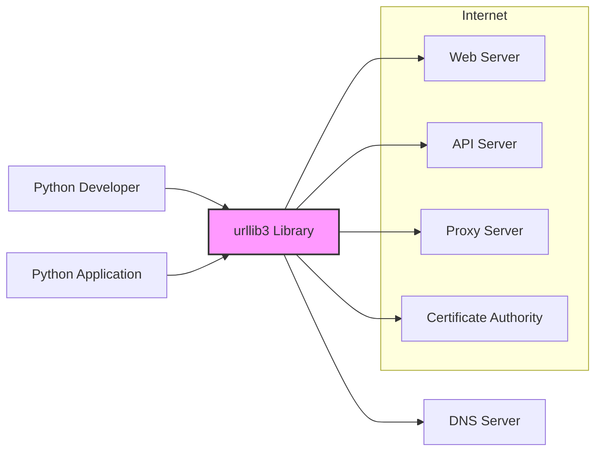
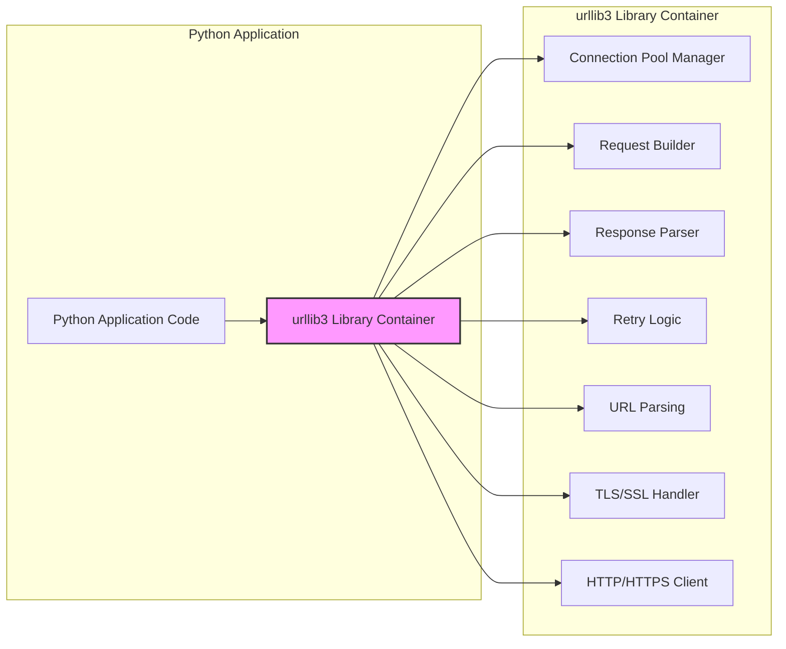

# BUSINESS POSTURE

- Business Priorities and Goals:
  - Provide a robust, reliable, and efficient HTTP client library for Python developers.
  - Ensure wide compatibility across different Python versions and platforms.
  - Maintain a high level of performance and minimize resource consumption.
  - Offer comprehensive features for handling various HTTP scenarios, including connection pooling, retries, redirects, and more.
  - Foster a strong open-source community around the library for continuous improvement and support.
  - Prioritize security to protect users and applications relying on urllib3 from HTTP-related vulnerabilities.

- Most Important Business Risks:
  - Security vulnerabilities in urllib3 could have widespread impact on Python applications, leading to data breaches, service disruptions, or other security incidents.
  - Performance regressions or instability could negatively affect applications relying on urllib3, impacting user experience and business operations.
  - Lack of maintenance or community support could lead to stagnation, security vulnerabilities, and decreased adoption.
  - Compatibility issues with new Python versions or platforms could limit the usability and adoption of urllib3.
  - Reputational damage due to security incidents or lack of responsiveness to user issues.

# SECURITY POSTURE

- Existing Security Controls:
  - security control: Open Source Development - The project is developed openly on GitHub, allowing for community review and scrutiny of the codebase. Implemented: GitHub repository.
  - security control: Code Reviews - Pull requests are reviewed by maintainers before being merged, providing a level of code quality and security assurance. Implemented: GitHub pull request process.
  - security control: Vulnerability Reporting - The project likely has a process for reporting and addressing security vulnerabilities, although not explicitly documented in the provided context. Implemented: Typically via GitHub issues or security-specific channels.
  - security control: Security Releases - The project releases new versions to address reported security vulnerabilities. Implemented: PyPI release process.
  - security control: HTTPS enforced for website and documentation access. Implemented: Web server configuration for urllib3.readthedocs.io and urllib3.palletsprojects.com.
  - security control: Dependency management - Using `pip` and `requirements.txt` to manage dependencies. Implemented: Project build and development process.

- Accepted Risks:
  - accepted risk: Vulnerabilities in dependencies - Urllib3 relies on other libraries, and vulnerabilities in those dependencies could indirectly affect urllib3.
  - accepted risk: Undiscovered vulnerabilities - Despite security efforts, there is always a risk of undiscovered vulnerabilities in the codebase.
  - accepted risk: Misuse by users - Users might misuse urllib3 in insecure ways in their applications, which is outside the control of the urllib3 project itself.

- Recommended Security Controls:
  - security control: Automated Dependency Scanning - Implement automated scanning of dependencies for known vulnerabilities in CI/CD pipeline.
  - security control: Static Application Security Testing (SAST) - Integrate SAST tools into the CI/CD pipeline to automatically detect potential security flaws in the codebase.
  - security control: Fuzzing - Employ fuzzing techniques to proactively discover potential vulnerabilities by providing unexpected or malformed inputs.
  - security control: Security Audits - Conduct periodic security audits by external security experts to identify and address potential weaknesses.
  - security control: Signed releases - Sign releases to ensure integrity and authenticity of the urllib3 package.
  - security control: Software Bill of Materials (SBOM) - Generate and publish SBOM for each release to improve supply chain transparency.

- Security Requirements:
  - Authentication:
    - Requirement: Support for various HTTP authentication schemes (Basic, Digest, Bearer, etc.) to allow users to authenticate requests when needed.
    - Requirement: Secure handling of authentication credentials, avoiding storage in plaintext and promoting secure storage practices for users.
  - Authorization:
    - Requirement: Urllib3 itself does not handle authorization, but it should provide mechanisms for users to implement authorization logic in their applications based on responses from servers.
    - Requirement: Ensure that urllib3 does not inadvertently bypass any authorization mechanisms implemented by users or servers.
  - Input Validation:
    - Requirement: Robust parsing and validation of HTTP requests and responses to prevent injection attacks and other input-related vulnerabilities.
    - Requirement: Proper handling of various HTTP headers and data formats to avoid unexpected behavior or security issues.
    - Requirement: Protection against common HTTP vulnerabilities like header injection, request smuggling, and others.
  - Cryptography:
    - Requirement: Secure implementation of TLS/SSL for HTTPS connections, using up-to-date cryptographic libraries and best practices.
    - Requirement: Proper certificate validation and handling to prevent man-in-the-middle attacks.
    - Requirement: Support for modern TLS features and cipher suites while maintaining compatibility with older systems where necessary.
    - Requirement: Avoidance of insecure cryptographic practices and algorithms.

# DESIGN

## C4 CONTEXT



- Context Diagram Elements:
  - - Name: Python Developer
    - Type: Person
    - Description: Software developers who use the urllib3 library to build Python applications.
    - Responsibilities: Develop Python applications that require HTTP communication, integrate urllib3 into their projects.
    - Security controls: Secure development practices, secure coding guidelines, dependency management in their projects.
  - - Name: Python Application
    - Type: Software System
    - Description: Applications written in Python that utilize the urllib3 library for making HTTP requests.
    - Responsibilities: Perform business logic, interact with web services and APIs, handle data processing.
    - Security controls: Application-level security controls, input validation, authorization, secure data handling, logging and monitoring.
  - - Name: urllib3 Library
    - Type: Software System
    - Description: A Python library providing a comprehensive and efficient HTTP client. This is the system being designed.
    - Responsibilities: Handle HTTP connection management, request construction, response parsing, connection pooling, retries, redirects, TLS/SSL encryption, and more.
    - Security controls: Input validation, secure TLS/SSL configuration, protection against HTTP vulnerabilities, secure coding practices, vulnerability management.
  - - Name: Web Server
    - Type: Software System
    - Description: Servers on the internet hosting websites and web applications that Python applications might interact with via HTTP.
    - Responsibilities: Serve web content, process HTTP requests, manage web application logic.
    - Security controls: Web server security configurations, firewalls, intrusion detection systems, application firewalls, access control lists.
  - - Name: API Server
    - Type: Software System
    - Description: Servers providing APIs that Python applications consume using HTTP requests.
    - Responsibilities: Provide data and services through APIs, authenticate and authorize API requests, manage API access.
    - Security controls: API security gateways, authentication and authorization mechanisms (OAuth 2.0, API keys), input validation, rate limiting, logging and monitoring.
  - - Name: Proxy Server
    - Type: Software System
    - Description: Intermediary servers that forward HTTP requests between Python applications and web/API servers.
    - Responsibilities: Forward requests, provide caching, enforce security policies, anonymize requests.
    - Security controls: Proxy server security configurations, access control lists, authentication for proxy access, TLS/SSL encryption for proxy communication.
  - - Name: Certificate Authority
    - Type: External System
    - Description: Trusted entities that issue digital certificates used for TLS/SSL encryption.
    - Responsibilities: Verify identities, issue and revoke digital certificates, maintain certificate revocation lists (CRLs).
    - Security controls: Physical security of CA infrastructure, secure key management, strict certificate issuance policies.
  - - Name: DNS Server
    - Type: External System
    - Description: Domain Name System servers that translate domain names into IP addresses.
    - Responsibilities: Resolve domain names to IP addresses, ensure availability and integrity of DNS records.
    - Security controls: DNSSEC (Domain Name System Security Extensions), DNS server security hardening, DDoS protection.

## C4 CONTAINER



- Container Diagram Elements:
  - - Name: urllib3 Library Container
    - Type: Library
    - Description: Represents the urllib3 library as a whole, encapsulating its core functionalities.
    - Responsibilities: Provide a high-level API for Python applications to perform HTTP requests, manage underlying components.
    - Security controls: Secure coding practices, input validation at API boundaries, vulnerability management for the library itself.
  - - Name: Connection Pool Manager
    - Type: Component
    - Description: Manages connection pooling to reuse HTTP connections and improve performance.
    - Responsibilities: Maintain a pool of active HTTP connections, reuse connections for subsequent requests, handle connection timeouts and errors.
    - Security controls: Secure connection handling, proper connection closure, prevention of connection leaks, TLS/SSL session reuse.
  - - Name: Request Builder
    - Type: Component
    - Description: Constructs HTTP requests based on user input and library parameters.
    - Responsibilities: Build HTTP request messages, handle headers, body, and method, implement request encoding.
    - Security controls: Input validation for request parameters, prevention of header injection and request smuggling vulnerabilities, secure handling of request data.
  - - Name: Response Parser
    - Type: Component
    - Description: Parses HTTP responses received from servers.
    - Responsibilities: Parse HTTP response messages, extract headers, body, and status code, handle response decoding.
    - Security controls: Input validation for response data, protection against response splitting and other response-related vulnerabilities, proper handling of different response encodings.
  - - Name: Retry Logic
    - Type: Component
    - Description: Implements retry mechanisms for handling transient network errors and server issues.
    - Responsibilities: Implement retry policies, handle different retry conditions, manage retry attempts.
    - Security controls: Avoidance of excessive retries that could lead to denial-of-service, secure handling of retry-related parameters.
  - - Name: URL Parsing
    - Type: Component
    - Description: Parses URLs to extract components like scheme, host, port, and path.
    - Responsibilities: Parse URLs according to RFC standards, validate URL format.
    - Security controls: Input validation for URLs to prevent URL injection and other URL-related vulnerabilities, proper handling of different URL schemes.
  - - Name: TLS/SSL Handler
    - Type: Component
    - Description: Handles TLS/SSL encryption and certificate validation for HTTPS connections.
    - Responsibilities: Establish secure TLS/SSL connections, perform certificate validation, manage cipher suites and TLS versions.
    - Security controls: Secure TLS/SSL configuration, proper certificate validation, protection against man-in-the-middle attacks, use of secure cryptographic libraries.
  - - Name: HTTP/HTTPS Client
    - Type: Component
    - Description: The core component responsible for sending HTTP/HTTPS requests and receiving responses over the network.
    - Responsibilities: Establish network connections, send requests, receive responses, handle network errors.
    - Security controls: Secure socket handling, protection against network-level attacks, proper handling of network timeouts and errors.

## DEPLOYMENT

- Deployment Architecture:
  - Urllib3 is primarily deployed as a Python package distributed via PyPI (Python Package Index). Python developers install it using `pip` or similar package managers and integrate it into their Python applications. The deployment is essentially the distribution of the library and its integration into various Python environments.

```mermaid
flowchart LR
    A[Python Developer Machine] --> B[PyPI (Python Package Index)]
    B --> C[Target Environment (e.g., Server, Cloud Instance, Desktop)]
    C --> D[Python Application Instance]
    D --> E[urllib3 Library Instance]

    style E fill:#f9f,stroke:#333,stroke-width:2px
```

- Deployment Diagram Elements:
  - - Name: Python Developer Machine
    - Type: Environment
    - Description: The development environment where Python developers write and test their applications.
    - Responsibilities: Code development, testing, dependency management, packaging.
    - Security controls: Developer workstation security, code repositories, version control, secure development practices.
  - - Name: PyPI (Python Package Index)
    - Type: Infrastructure
    - Description: The public repository for Python packages, where urllib3 is published and distributed.
    - Responsibilities: Host Python packages, manage package versions, provide package download services.
    - Security controls: Infrastructure security, access control, malware scanning, package signing (if implemented).
  - - Name: Target Environment (e.g., Server, Cloud Instance, Desktop)
    - Type: Environment
    - Description: The environment where the Python application using urllib3 is deployed and executed. This could be a server, cloud instance, desktop computer, or any other environment capable of running Python applications.
    - Responsibilities: Run Python applications, provide runtime environment, network connectivity.
    - Security controls: Server/instance hardening, operating system security, network security, firewalls, intrusion detection systems, access control lists.
  - - Name: Python Application Instance
    - Type: Software Instance
    - Description: A running instance of a Python application that utilizes the urllib3 library.
    - Responsibilities: Execute application logic, make HTTP requests using urllib3, process data.
    - Security controls: Application-level security controls, runtime environment security, logging and monitoring.
  - - Name: urllib3 Library Instance
    - Type: Software Instance
    - Description: An instance of the urllib3 library loaded and used by the Python application instance.
    - Responsibilities: Handle HTTP communication for the Python application instance.
    - Security controls: Library-level security controls, memory protection, secure execution within the Python runtime.

## BUILD

- Build Process:
  - The urllib3 project likely uses a CI/CD system (like GitHub Actions, based on common open-source practices) to automate the build, test, and release process.
  - Developers commit code changes to the GitHub repository.
  - CI/CD system triggers builds upon code changes (e.g., pull requests, merges to main branch, tagged commits).
  - Build process includes:
    - Running linters and static analysis tools.
    - Executing unit and integration tests.
    - Building distribution packages (e.g., wheels, source distributions).
    - Potentially running security scans (SAST, dependency checks).
    - Publishing packages to PyPI upon release.

```mermaid
flowchart LR
    A[Developer] --> B[GitHub Repository]
    B --> C[CI/CD System (e.g., GitHub Actions)]
    C --> D[Build Environment]
    D --> E{Linters, SAST, Tests}
    E -- Pass --> F[Build Artifacts (Packages)]
    E -- Fail --> G[Build Failure Notification]
    F --> H[PyPI (Python Package Index)]

    style C fill:#ccf,stroke:#333,stroke-width:2px
    style D fill:#eee,stroke:#333,stroke-width:1px
    style E fill:#eee,stroke:#333,stroke-width:1px
    style F fill:#eee,stroke:#333,stroke-width:1px
```

- Build Diagram Elements:
  - - Name: Developer
    - Type: Person
    - Description: Software developers contributing code to the urllib3 project.
    - Responsibilities: Write code, commit changes, create pull requests, address code review feedback.
    - Security controls: Secure coding practices, code review participation, access control to the repository.
  - - Name: GitHub Repository
    - Type: Code Repository
    - Description: The Git repository hosted on GitHub where the urllib3 source code is stored and managed.
    - Responsibilities: Version control, code storage, collaboration platform, pull request management.
    - Security controls: Access control, branch protection, audit logging, vulnerability scanning (GitHub Dependabot).
  - - Name: CI/CD System (e.g., GitHub Actions)
    - Type: Automation System
    - Description: An automated system that builds, tests, and potentially deploys the urllib3 library.
    - Responsibilities: Automate build process, run tests, perform security checks, publish packages.
    - Security controls: Secure CI/CD configuration, access control, secret management, build environment security.
  - - Name: Build Environment
    - Type: Environment
    - Description: The environment where the build process is executed, typically a virtualized or containerized environment.
    - Responsibilities: Provide a consistent and isolated environment for building the library.
    - Security controls: Secure build environment configuration, minimal software installation, isolation from other systems.
  - - Name: Linters, SAST, Tests
    - Type: Security Checks
    - Description: Automated tools and processes used to check code quality, identify potential security vulnerabilities (SAST), and ensure functionality through tests.
    - Responsibilities: Code quality checks, static analysis for security flaws, functional testing.
    - Security controls: Configuration and maintenance of linters, SAST tools, and test suites.
  - - Name: Build Artifacts (Packages)
    - Type: Software Artifacts
    - Description: The packaged versions of the urllib3 library, ready for distribution (e.g., wheels, source distributions).
    - Responsibilities: Distributable packages of the library.
    - Security controls: Integrity checks, signing of packages (if implemented), secure storage of artifacts before publishing.
  - - Name: PyPI (Python Package Index)
    - Type: Package Repository
    - Description: The public repository where urllib3 packages are published for users to download and install.
    - Responsibilities: Host and distribute urllib3 packages.
    - Security controls: PyPI infrastructure security, malware scanning, package signing (if implemented).
  - - Name: Build Failure Notification
    - Type: Notification System
    - Description: System to notify developers and maintainers about build failures.
    - Responsibilities: Alert stakeholders about issues in the build process.
    - Security controls: Secure notification channels, access control to notification system.

# RISK ASSESSMENT

- Critical Business Processes:
  - Secure and reliable HTTP communication for Python applications. This is critical because many applications rely on HTTP for various functionalities, including accessing web services, APIs, and other resources. Failures or vulnerabilities in HTTP communication can disrupt these processes and lead to security incidents.

- Data to Protect and Sensitivity:
  - Data transmitted over HTTP/HTTPS by applications using urllib3. The sensitivity of this data varies greatly depending on the application. It can range from publicly available data to highly sensitive personal or financial information.
  - Examples of sensitive data could include:
    - User credentials (usernames, passwords, API keys)
    - Personal Identifiable Information (PII)
    - Financial transaction data
    - Confidential business data
  - The sensitivity level is application-dependent, but urllib3 must be designed and maintained to handle potentially sensitive data securely in transit.

# QUESTIONS & ASSUMPTIONS

- Questions:
  - What is the process for reporting and handling security vulnerabilities in urllib3? (Assumption: There is a process, but details are needed).
  - Are there any specific compliance requirements that urllib3 needs to adhere to (e.g., PCI DSS, HIPAA)? (Assumption: No specific compliance mentioned in the input, but general security best practices are expected).
  - What is the intended threat model for urllib3? (Assumption: Protect against common HTTP vulnerabilities, ensure secure TLS/SSL communication, maintain library integrity).
  - Are there any specific performance requirements that have security implications? (Assumption: Performance is important, but security should not be compromised for performance gains).
  - Is there a formal security testing process beyond unit and integration tests? (Assumption: Security testing is likely part of the development process, but the extent and type are unclear).

- Assumptions:
  - BUSINESS POSTURE:
    - Reliability and security are high priorities for urllib3.
    - Wide adoption and community support are important for the project's success.
  - SECURITY POSTURE:
    - Security is a key consideration in the development and maintenance of urllib3.
    - The project aims to follow secure coding practices and address security vulnerabilities promptly.
    - Users of urllib3 expect it to provide secure HTTP communication capabilities.
  - DESIGN:
    - The current design of urllib3 is modular and component-based.
    - The library is designed to be flexible and extensible to support various HTTP scenarios.
    - TLS/SSL and secure communication are core design considerations.
  - GENERAL:
    - The provided GitHub repository is the primary source of truth for the urllib3 project.
    - The project is actively maintained and developed by a community of contributors.