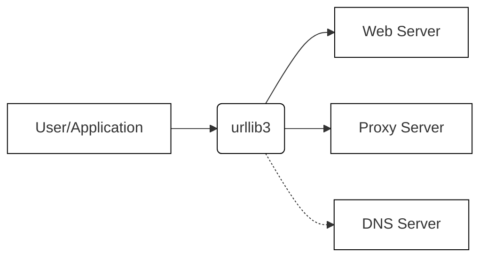
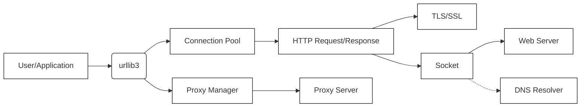
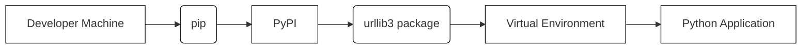
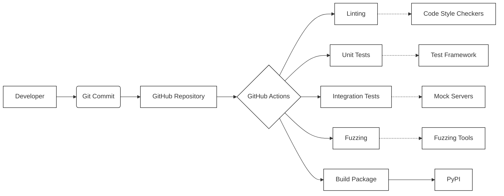

# BUSINESS POSTURE

Urllib3 is a widely used HTTP client library for Python. It's a foundational component for many Python applications and libraries that interact with web services.

Priorities and Goals:

*   Provide a user-friendly, robust, and reliable HTTP client library.
*   Maintain backward compatibility where possible, while still evolving the library.
*   Ensure high performance and efficiency for handling HTTP requests and responses.
*   Support a wide range of Python versions and environments.
*   Maintain a high level of security to protect users from common web vulnerabilities.
*   Provide comprehensive documentation and support to users.

Business Risks:

*   Security vulnerabilities in urllib3 could be exploited to compromise a vast number of applications that depend on it. This is the most significant risk due to the library's widespread use.
*   Performance bottlenecks or inefficiencies could impact the performance of dependent applications.
*   Compatibility issues with different Python versions or environments could limit adoption or cause problems for users.
*   Lack of features or support for modern HTTP standards could make it less attractive compared to alternative libraries.
*   Bugs or reliability issues could disrupt applications that rely on it.
*   Reputational damage due to security vulnerabilities, performance issues, or poor support.

# SECURITY POSTURE

Existing Security Controls:

*   security control: Input validation: Urllib3 performs validation on URLs and headers to prevent common injection vulnerabilities. (Implemented in the library's code.)
*   security control: TLS/SSL verification: Urllib3 supports TLS/SSL verification to ensure secure connections to HTTPS servers. (Implemented in the library's code and relies on system-provided or bundled CA certificates.)
*   security control: Header handling: Urllib3 carefully handles HTTP headers to prevent header injection attacks. (Implemented in the library's code.)
*   security control: Redirect handling: Urllib3 follows redirects by default but provides options to control this behavior to mitigate potential security risks. (Implemented in the library's code.)
*   security control: Timeout handling: Urllib3 allows setting timeouts for requests to prevent denial-of-service vulnerabilities. (Implemented in the library's code.)
*   security control: Regular security audits and reviews: The project maintainers and community conduct security reviews and address reported vulnerabilities. (Described in the project's security policy and contribution guidelines.)
*   security control: Dependency management: The project carefully manages its dependencies to minimize the risk of supply chain attacks. (Described in `pyproject.toml` and `requirements.txt` files.)
*   security control: Fuzzing: Urllib3 uses fuzzing to test the robustness of the library against unexpected inputs. (Described in the project's documentation and CI configuration.)

Accepted Risks:

*   accepted risk: Reliance on system-provided or bundled CA certificates for TLS/SSL verification. This could be a risk if the system's CA store is compromised or outdated.
*   accepted risk: Potential for denial-of-service attacks if timeouts are not configured appropriately by users.
*   accepted risk: Limited protection against advanced HTTP attacks that are not yet well-understood or mitigated.

Recommended Security Controls:

*   security control: Implement stricter validation of URLs and headers, potentially using a dedicated parsing library.
*   security control: Provide more granular control over TLS/SSL verification, such as allowing users to specify custom CA certificates or pin certificates.
*   security control: Implement mechanisms to detect and prevent HTTP request smuggling attacks.
*   security control: Consider adding support for HTTP/2 and HTTP/3 to improve performance and security.
*   security control: Enhance fuzzing efforts to cover more code paths and edge cases.
*   security control: Integrate with static analysis tools to automatically detect potential security vulnerabilities during development.

Security Requirements:

*   Authentication:
    *   Support for various authentication mechanisms, including Basic Auth, Bearer Token, and API keys.
    *   Secure handling of credentials to prevent leakage or misuse.
*   Authorization:
    *   Urllib3 itself does not handle authorization, as it is an HTTP client library. Authorization is the responsibility of the server and the application using urllib3.
*   Input Validation:
    *   Strict validation of all user-provided inputs, including URLs, headers, and request bodies.
    *   Prevention of common injection vulnerabilities, such as cross-site scripting (XSS) and SQL injection.
*   Cryptography:
    *   Secure handling of TLS/SSL connections, including proper certificate verification.
    *   Support for modern cryptographic algorithms and protocols.
    *   Protection against known cryptographic attacks, such as padding oracle attacks.

# DESIGN

## C4 CONTEXT

Element Descriptions:

*   Element:
    *   Name: User/Application
    *   Type: External Entity
    *   Description: A Python application or library that uses urllib3 to make HTTP requests.
    *   Responsibilities: Initiates HTTP requests, processes responses, and handles errors.
    *   Security controls: Implements application-specific security controls, such as authentication and authorization.
*   Element:
    *   Name: urllib3
    *   Type: Project
    *   Description: The urllib3 HTTP client library.
    *   Responsibilities: Provides a high-level interface for making HTTP requests, handling connections, and managing responses.
    *   Security controls: Input validation, TLS/SSL verification, header handling, redirect handling, timeout handling.
*   Element:
    *   Name: Web Server
    *   Type: External System
    *   Description: A remote server that hosts the web resources being accessed.
    *   Responsibilities: Responds to HTTP requests, serves content, and enforces access controls.
    *   Security controls: Implements server-side security controls, such as authentication, authorization, and input validation.
*   Element:
    *   Name: Proxy Server
    *   Type: External System
    *   Description: An intermediary server that forwards requests from urllib3 to the web server.
    *   Responsibilities: Relays requests and responses, potentially modifies headers, and enforces network policies.
    *   Security controls: Implements proxy-specific security controls, such as access control lists and content filtering.
*   Element:
    *   Name: DNS Server
    *   Type: External System
    *   Description: A server that resolves domain names to IP addresses.
    *   Responsibilities: Translates domain names into IP addresses that urllib3 can use to connect to web servers.
    *   Security controls: Implements DNS security measures, such as DNSSEC, to prevent DNS spoofing and cache poisoning.

## C4 CONTAINER

Element Descriptions:

*   Element:
    *   Name: User/Application
    *   Type: External Entity
    *   Description: A Python application or library that uses urllib3 to make HTTP requests.
    *   Responsibilities: Initiates HTTP requests, processes responses, and handles errors.
    *   Security controls: Implements application-specific security controls.
*   Element:
    *   Name: urllib3
    *   Type: Library
    *   Description: The main entry point for the urllib3 library.
    *   Responsibilities: Provides a high-level interface for making HTTP requests.
    *   Security controls: Input validation, header handling, redirect handling, timeout handling.
*   Element:
    *   Name: Connection Pool
    *   Type: Component
    *   Description: Manages a pool of reusable connections to web servers.
    *   Responsibilities: Optimizes performance by reusing existing connections, handles connection timeouts and retries.
    *   Security controls: Enforces connection limits and timeouts.
*   Element:
    *   Name: HTTP Request/Response
    *   Type: Component
    *   Description: Handles the creation and parsing of HTTP requests and responses.
    *   Responsibilities: Formats requests according to the HTTP protocol, parses responses, and handles headers.
    *   Security controls: Input validation, header handling.
*   Element:
    *   Name: TLS/SSL
    *   Type: Component
    *   Description: Handles TLS/SSL encryption and decryption for secure connections.
    *   Responsibilities: Establishes secure connections, verifies certificates, and encrypts/decrypts data.
    *   Security controls: TLS/SSL verification, certificate pinning (optional).
*   Element:
    *   Name: Socket
    *   Type: Component
    *   Description: Provides a low-level interface for network communication.
    *   Responsibilities: Sends and receives data over the network.
    *   Security controls: None directly, relies on the operating system's security features.
*   Element:
    *   Name: Web Server
    *   Type: External System
    *   Description: A remote server that hosts the web resources being accessed.
    *   Responsibilities: Responds to HTTP requests.
    *   Security controls: Implements server-side security controls.
*   Element:
    *   Name: Proxy Manager
    *   Type: Component
    *   Description: Manages connections to proxy servers.
    *   Responsibilities: Configures and uses proxy servers for HTTP requests.
    *   Security controls: Proxy authentication (if required).
*   Element:
    *   Name: Proxy Server
    *   Type: External System
    *   Description: An intermediary server that forwards requests.
    *   Responsibilities: Relays requests and responses.
    *   Security controls: Implements proxy-specific security controls.
*   Element:
    *   Name: DNS Resolver
    *   Type: Component
    *   Description: Resolves domain names to IP addresses.
    *   Responsibilities: Uses system DNS resolver.
    *   Security controls: Relies on system DNS resolver security.

## DEPLOYMENT

Urllib3 is a library, not a standalone application, so it doesn't have a traditional deployment process in the sense of deploying a server or service. Instead, it's *installed* as a dependency within a Python environment. However, we can consider the different ways it can be used and the environments it might be part of.

Possible Deployment Solutions:

1.  Local Development Environment: Installed directly using pip.
2.  Virtual Environment: Installed within a virtual environment using pip.
3.  System-wide Installation: Installed globally on the system (not recommended).
4.  Containerized Environment (e.g., Docker): Installed within a container image.
5.  Cloud Environment (e.g., AWS Lambda, Google Cloud Functions): Included as a dependency in a serverless function deployment.
6.  Embedded Systems: Potentially cross-compiled and included in an embedded system's firmware.

Chosen Deployment Solution (Virtual Environment):

This is the most common and recommended way to use urllib3, as it isolates the library and its dependencies from other projects.

Element Descriptions:

*   Element:
    *   Name: Developer Machine
    *   Type: Environment
    *   Description: The machine where the developer writes and tests code.
    *   Responsibilities: Hosts the development tools and environment.
    *   Security controls: Standard developer machine security practices (e.g., firewall, antivirus).
*   Element:
    *   Name: pip
    *   Type: Tool
    *   Description: The Python package installer.
    *   Responsibilities: Downloads and installs Python packages.
    *   Security controls: Verifies package signatures (if available).
*   Element:
    *   Name: PyPI
    *   Type: External System
    *   Description: The Python Package Index, a repository of Python packages.
    *   Responsibilities: Stores and serves Python packages.
    *   Security controls: PyPI's security measures (e.g., access controls, malware scanning).
*   Element:
    *   Name: urllib3 package
    *   Type: Artifact
    *   Description: The packaged version of urllib3.
    *   Responsibilities: Contains the library's code and metadata.
    *   Security controls: Package signing (if available).
*   Element:
    *   Name: Virtual Environment
    *   Type: Environment
    *   Description: An isolated Python environment.
    *   Responsibilities: Provides a dedicated space for a project's dependencies.
    *   Security controls: Isolation from other projects.
*   Element:
    *   Name: Python Application
    *   Type: Application
    *   Description: The application that uses urllib3.
    *   Responsibilities: Performs the application's logic, including making HTTP requests using urllib3.
    *   Security controls: Application-specific security controls.

## BUILD

Urllib3's build process involves several steps, from development to packaging and distribution. The project uses GitHub Actions for continuous integration and automation.

Build Process Description:

1.  Developer: A developer writes code and commits it to the Git repository.
2.  Git Commit: The commit triggers a workflow in GitHub Actions.
3.  GitHub Repository: The central repository for the urllib3 source code.
4.  GitHub Actions: The CI/CD platform used by urllib3. It orchestrates the build, test, and packaging process.
5.  Linting: Static analysis tools (like flake8, ruff) check the code for style and potential errors.
6.  Unit Tests: The test suite is run to verify the functionality of individual components.
7.  Integration Tests: Tests that verify the interaction between different parts of the library.
8.  Fuzzing: Fuzzing tools (like Atheris) are used to test the library with unexpected inputs.
9.  Build Package: If all tests pass, the library is packaged into a distributable format (wheel and source distribution).
10. PyPI: The package is uploaded to PyPI, making it available for installation via pip.
11. Code Style Checkers: Tools used for linting.
12. Test Framework: Framework used for running tests (e.g., pytest).
13. Mock Servers: Simulated servers used for testing interactions with external services.
14. Fuzzing Tools: Tools used for fuzzing.

Security Controls in Build Process:

*   security control: Linting: Identifies potential code quality and security issues early in the development process.
*   security control: Unit and Integration Tests: Ensure that the code behaves as expected and helps prevent regressions.
*   security control: Fuzzing: Tests the library's robustness against unexpected inputs, helping to discover vulnerabilities.
*   security control: Automated Build: Ensures consistency and reproducibility of the build process.
*   security control: Dependency Management: Dependencies are pinned to specific versions to mitigate the risk of supply chain attacks.
*   security control: GitHub Actions: Provides a secure and controlled environment for running the build process.

# RISK ASSESSMENT

Critical Business Processes:

*   Making HTTP requests: This is the core functionality of urllib3. Any disruption to this process would impact all applications that rely on the library.
*   Secure communication: Ensuring that data transmitted over HTTPS is protected from eavesdropping and tampering.
*   Reliable operation: Providing a stable and dependable library that applications can rely on.

Data Sensitivity:

*   Request data: May include sensitive information such as API keys, authentication tokens, personal data, or business-critical data, depending on how the library is used. Sensitivity: Variable, can range from low to high.
*   Response data: May contain sensitive information, depending on the web service being accessed. Sensitivity: Variable, can range from low to high.
*   URLs: May reveal information about the services being accessed or the structure of an application. Sensitivity: Generally low, but can be higher in some cases.
*   Headers: May contain sensitive information such as cookies, authentication tokens, or custom headers. Sensitivity: Variable, can range from low to high.

# QUESTIONS & ASSUMPTIONS

Questions:

*   Are there any specific compliance requirements (e.g., PCI DSS, HIPAA) that apply to applications using urllib3? This would influence the security controls needed.
*   What is the expected threat model for typical applications using urllib3? Are they primarily concerned with web-based attacks, or are there other threats to consider?
*   What level of security expertise can be assumed for users of urllib3? This will affect the design of security-related features and documentation.
*   What are the performance requirements for urllib3? Are there any specific use cases that require very high throughput or low latency?
*   What are plans for future development and support of new HTTP standards (HTTP/2, HTTP/3)?

Assumptions:

*   BUSINESS POSTURE: The primary goal is to provide a secure, reliable, and performant HTTP client library for a wide range of users and applications.
*   BUSINESS POSTURE: The project maintainers are committed to addressing security vulnerabilities promptly and responsibly.
*   SECURITY POSTURE: Users of urllib3 are responsible for implementing appropriate security controls in their own applications, such as authentication, authorization, and input validation.
*   SECURITY POSTURE: Users will configure urllib3 correctly, including setting appropriate timeouts and handling redirects securely.
*   SECURITY POSTURE: The underlying operating system and network infrastructure are reasonably secure.
*   DESIGN: The library will be used primarily in environments with access to the internet.
*   DESIGN: The library will be used in a variety of applications, ranging from simple scripts to complex web applications.
*   DESIGN: The build process is secure and reliable.