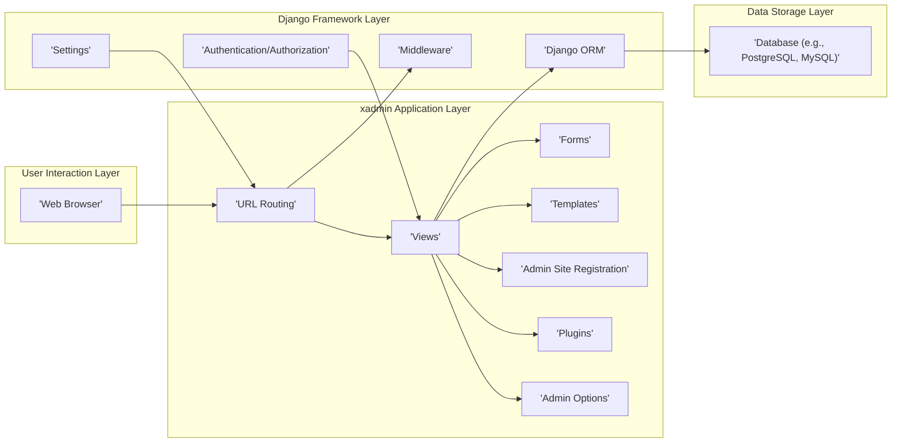
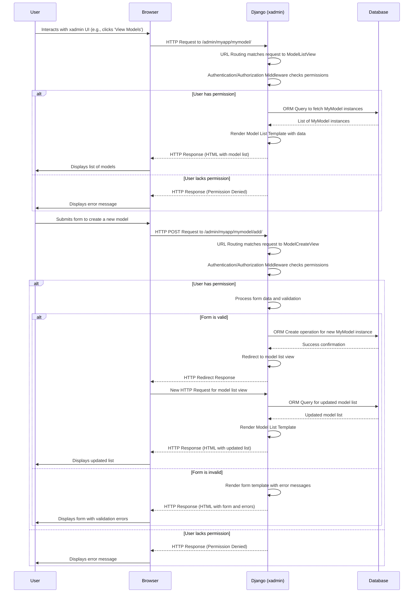

# Project Design Document: xadmin - Extensible Django Admin Panel

**Version:** 1.1
**Date:** October 26, 2023
**Author:** AI Software Architect

## 1. Introduction

This document provides an enhanced and detailed design overview of the xadmin project, an extensible admin panel for the Django web framework. This document serves as a robust foundation for understanding the system's architecture, components, and data flow, which is crucial for subsequent threat modeling activities. xadmin aims to provide a more feature-rich, customizable, and user-friendly alternative to the default Django admin interface. This revision incorporates further detail and clarifies certain aspects of the system.

## 2. Goals and Objectives

The primary goals of xadmin are:

*   Provide a highly user-friendly and intuitive web interface for efficiently managing Django models and application data.
*   Offer extensive and granular customization options for the admin interface's appearance, functionality, and behavior.
*   Significantly enhance the functionality of the default Django admin with built-in features such as:
    *   Asynchronous (Ajax-based) interactions for a more responsive user experience.
    *   Advanced and flexible filtering and searching capabilities.
    *   Robust import and export functionalities for various data formats.
    *   Customizable dashboard widgets for at-a-glance information.
    *   Comprehensive theme support for branding and visual customization.
*   Maintain strict compatibility with standard Django best practices, conventions, and the underlying framework architecture.
*   Facilitate easy extensibility through a well-defined plugin system and custom configurations, allowing developers to tailor the admin panel to specific project needs.

## 3. High-Level Architecture

The xadmin project is architected as a standard Django application that seamlessly integrates with existing Django projects. It leverages core Django functionalities including the Object-Relational Mapper (ORM), template system, URL routing mechanisms, and authentication/authorization framework.

**Components:**

*   **Web Browser:** The client-side interface through which administrative users interact with the xadmin application.
*   **URL Routing:** Django's core mechanism for mapping incoming HTTP requests to specific view functions within the xadmin application.
*   **Views:** Python functions within xadmin responsible for handling user requests, interacting with Django models via the ORM, processing data, and rendering appropriate templates to generate HTTP responses. xadmin provides a set of base views that are extended and customized for listing, creating, updating, and deleting model instances.
*   **Forms:** Django forms are utilized for data input, validation, and processing within the admin interface. xadmin extends standard Django forms with enhanced features and widgets.
*   **Templates:** HTML files that define the structure, layout, and presentation logic of the admin interface. xadmin provides a base set of templates that can be customized, extended, or overridden to alter the visual appearance and user experience.
*   **Admin Site Registration:** The process of explicitly registering Django models with the xadmin administration site. This registration makes the models manageable through the xadmin interface, defining how they are displayed and interacted with.
*   **Plugins:** A central feature of xadmin, enabling developers to extend and customize the admin interface with new functionalities, UI elements (like widgets), custom views, and business logic. Plugins provide a modular way to add features without modifying the core xadmin code.
*   **Admin Options:** Classes associated with registered models that define specific admin configurations, such as list display columns, filters, search fields, form layouts, and more. These options control how models are presented and managed within xadmin.
*   **Django ORM (Object-Relational Mapper):** Django's abstraction layer for interacting with databases. xadmin relies heavily on the ORM to perform Create, Read, Update, and Delete (CRUD) operations on the registered models.
*   **Middleware:** Django's system for processing requests and responses at a global level. xadmin leverages middleware for tasks such as authentication, session management, and request processing.
*   **Settings:** Django's configuration system, used to configure various aspects of the xadmin application, including themes, default behaviors, and plugin configurations.
*   **Authentication/Authorization:** Django's built-in framework for managing user authentication (verifying identity) and authorization (controlling access to resources and actions). xadmin integrates with this framework to secure the admin interface and control user permissions.
*   **Database:** The underlying persistent data store where the application's data is stored and managed. xadmin supports various database backends supported by Django.

## 4. Detailed Design

### 4.1. User Interface

*   **Layout Structure:** xadmin typically employs a consistent and intuitive layout, often featuring:
    *   A persistent navigation sidebar providing access to registered models, admin sections, and potentially custom menu items.
    *   A primary content area where lists of model instances, forms for creating/editing data, and dashboard widgets are displayed.
    *   An optional right sidebar that can be used for supplementary information, contextual actions, or filtering options.
*   **Themes and Styling:** xadmin offers robust theming capabilities, allowing for complete customization of the admin interface's visual appearance through CSS and template overrides. Several pre-built themes may be available, and developers can create custom themes to match project branding.
*   **Responsiveness:** The user interface is designed to be responsive and adapt gracefully to various screen sizes and devices, ensuring a consistent experience across desktops, tablets, and mobile phones.
*   **Asynchronous Interactions (Ajax):**  xadmin leverages Ajax to enhance the user experience by performing many actions, such as filtering, searching, and inline editing, without requiring full page reloads. This results in a more fluid and responsive interface.

### 4.2. Model Administration - Enhanced Features

*   **List Views:** Provide a highly configurable and interactive way to display and manage collections of model instances.
    *   **Column Configuration:** Administrators can define which model fields are displayed as columns in the list view and control their order.
    *   **Advanced Filtering:** xadmin offers powerful filtering capabilities, allowing users to narrow down the list based on various criteria, including field lookups (e.g., exact match, contains, greater than), date ranges, and related model fields. Filters can be customized and extended.
    *   **Dynamic Search:**  A search bar allows users to perform keyword searches across specified model fields. The search functionality can be customized to use different search strategies.
    *   **Customizable Ordering:** Users can sort the list of instances by clicking on column headers. The default ordering can be configured.
    *   **Pagination:** For models with a large number of instances, xadmin implements pagination to display results across multiple pages, improving performance and usability. The number of items per page is configurable.
    *   **Action Framework:**  Provides a mechanism for defining and executing actions on selected model instances. This includes built-in actions like deletion and custom actions defined by developers.
*   **Form Views (Create/Update):** Offer user-friendly forms for creating new model instances and editing existing ones.
    *   **Automatic Form Generation:** xadmin automatically generates forms based on the model's fields, leveraging Django's form field types for appropriate input controls and validation.
    *   **Customizable Form Layout:** Developers can customize the layout of form fields, group related fields, and add help text or custom widgets.
    *   **Inline Relationships:** xadmin supports inline editing of related models directly within the parent model's form, simplifying the management of one-to-many and many-to-many relationships.
    *   **Form Validation:**  Leverages Django's form validation framework to ensure data integrity. Custom validation rules can be added.
*   **Detail Views:** Display comprehensive information about a single model instance, often presenting fields in a clear and organized manner.
*   **Import/Export Functionality:**  Provides tools for importing data into models from various file formats (e.g., CSV, Excel) and exporting data from models into these formats. This feature often includes options for handling data transformations and error handling.

### 4.3. Authentication and Authorization - Deep Dive

*   **Django's Auth System:** xadmin fundamentally relies on Django's robust authentication and authorization framework (`django.contrib.auth`). This includes user accounts, groups, and permissions.
*   **Permission Management:** Access to xadmin functionalities and specific models is controlled through Django's permission system. Permissions are typically assigned to groups, and users are then added to these groups.
*   **Granular Permissions:** xadmin respects Django's model-level permissions (add, change, delete, view). This allows for fine-grained control over what actions users can perform on specific models.
*   **Custom Permissions:**  While leveraging Django's framework, xadmin's plugin system can potentially introduce custom permission checks or extend the existing permission model for more specific control within plugin functionalities.
*   **Login Security:**  Security best practices for Django authentication should be followed, such as using HTTPS, strong password policies, and potentially implementing features like login throttling to prevent brute-force attacks.

### 4.4. Plugins - Extensibility and Customization

*   **Plugin Architecture:** xadmin's plugin system is a core design principle, enabling developers to extend and modify the admin interface without altering the core xadmin codebase.
*   **Plugin Types:** Plugins can introduce various types of extensions:
    *   **New Admin Views:** Adding entirely new pages or functionalities to the admin interface.
    *   **Template Tags and Filters:** Creating reusable template logic for customizing the presentation layer.
    *   **Custom Form Fields and Widgets:**  Introducing specialized input controls and data handling mechanisms.
    *   **Dashboard Widgets:** Adding custom informational panels to the admin dashboard.
    *   **Menu Items:**  Modifying or adding entries to the admin navigation menu.
    *   **Model Admin Extensions:**  Customizing the behavior and presentation of specific models within the admin interface (e.g., adding custom buttons, modifying list views).
    *   **Middleware:**  Integrating custom request/response processing logic within the xadmin context.
*   **Plugin Registration:** Plugins are typically registered within the Django application's configuration, allowing xadmin to discover and load them.
*   **Plugin Interaction:** Plugins can interact with the core xadmin framework and other plugins through well-defined APIs and hooks.

### 4.5. Data Flow - Detailed Request Lifecycle

1. A user initiates an action within the xadmin interface in their web browser (e.g., navigating to a model list, submitting a form, clicking a filter).
2. The browser sends an HTTP request to the Django application, targeting a specific URL associated with an xadmin view.
3. Django's URL routing mechanism intercepts the request and maps it to the appropriate xadmin view function.
4. The xadmin view function receives the request and performs the necessary processing:
    *   **Authentication and Authorization Checks:** Django's middleware verifies the user's identity and permissions to access the requested resource or perform the action.
    *   **Data Retrieval (if needed):** The view interacts with the Django ORM to query the database for the required data based on the request parameters (e.g., fetching a list of model instances, retrieving a specific instance for editing).
    *   **Form Processing (for form submissions):** If the request involves submitting a form, the view processes the submitted data, performs validation, and interacts with the ORM to create or update model instances.
    *   **Plugin Hooks:** At various points in the request lifecycle, xadmin may trigger hooks or signals that allow registered plugins to execute custom logic or modify the behavior.
    *   **Template Rendering:** The view uses Django's template engine to render an HTML response. This involves selecting the appropriate template, passing data to the template context, and generating the HTML markup.
5. The xadmin view sends the generated HTML response back to the web browser.
6. The browser receives the HTML response and renders it, updating the user interface to reflect the result of the action.

## 5. Security Considerations (For Threat Modeling) - Enhanced

*   **Authentication and Authorization Vulnerabilities:**
    *   **Weak Password Policies:** If Django's default password policies are not enforced or are too weak, it can lead to easier brute-force attacks.
    *   **Insecure Session Management:**  Failure to use HTTPS, set `HttpOnly` and `Secure` flags on session cookies, or implement proper session invalidation can lead to session hijacking.
    *   **Insufficient Permission Granularity:** Overly broad permissions granted to users or groups can lead to unauthorized access to sensitive data or functionalities.
    *   **Bypassable Authorization Checks:**  Flaws in the implementation of permission checks within custom views or plugins could allow unauthorized access.
*   **Input Validation and Injection Attacks:**
    *   **SQL Injection:**  Improperly sanitized user input used in database queries can allow attackers to execute arbitrary SQL commands.
    *   **Cross-Site Scripting (XSS):** Failure to sanitize user-provided data before rendering it in templates can allow attackers to inject malicious scripts that execute in other users' browsers. This includes both stored and reflected XSS.
    *   **Cross-Site Request Forgery (CSRF):**  Without proper CSRF protection (e.g., using Django's CSRF middleware and tokens), attackers can trick authenticated users into performing unintended actions on the application.
    *   **Command Injection:** If user input is used to construct system commands without proper sanitization, attackers could execute arbitrary commands on the server.
    *   **LDAP Injection:** If xadmin integrates with LDAP and user input is not sanitized, it could be vulnerable to LDAP injection attacks.
*   **Session Management Weaknesses:**
    *   **Session Fixation:** Attackers can force a user to use a known session ID, allowing them to hijack the session.
    *   **Predictable Session IDs:** If session IDs are not generated securely, attackers might be able to predict valid session IDs.
*   **Data Protection Deficiencies:**
    *   **Exposure of Sensitive Data:** Sensitive information might be unintentionally exposed in logs, error messages, or debug pages in production environments.
    *   **Inadequate Data Encryption:**  Lack of encryption for sensitive data at rest in the database or in transit (requiring HTTPS) can lead to data breaches.
*   **Dependency Vulnerabilities:**
    *   **Third-Party Library Exploits:** Vulnerabilities in third-party libraries used by xadmin or its plugins can be exploited if dependencies are not regularly updated.
*   **Plugin Security Risks:**
    *   **Malicious Plugins:**  Installation of untrusted or poorly vetted plugins can introduce security vulnerabilities.
    *   **Plugin Vulnerabilities:**  Even well-intentioned plugins might contain security flaws if not developed with security best practices in mind.
*   **Information Disclosure:**
    *   **Verbose Error Messages:**  Detailed error messages in production can reveal sensitive information about the application's internal workings.
    *   **Directory Listing:**  Improper server configuration could allow attackers to browse application directories and access sensitive files.
*   **Denial of Service (DoS) Attacks:**
    *   **Resource Exhaustion:**  Attackers might try to overwhelm the server with excessive requests, consuming resources and making the application unavailable.
    *   **Slowloris Attacks:**  Sending slow, incomplete HTTP requests to tie up server resources.
*   **File Upload Vulnerabilities:**
    *   **Unrestricted File Uploads:** Allowing users to upload arbitrary files without proper validation can lead to the execution of malicious code on the server or storage of inappropriate content.
    *   **Path Traversal:**  Attackers might manipulate file paths during uploads to overwrite critical system files.

## 6. Deployment Considerations - Security Focused

*   **Secure Server Configuration:** Employing secure server configurations for web servers like Nginx or Apache, including disabling unnecessary features and setting appropriate security headers.
*   **HTTPS Enforcement:**  Mandatory use of HTTPS to encrypt all communication between the client and the server, protecting sensitive data in transit.
*   **Firewall Configuration:**  Implementing firewalls to restrict network access to the application and protect against unauthorized connections.
*   **Regular Security Audits and Penetration Testing:**  Conducting periodic security assessments to identify and address potential vulnerabilities.
*   **Keeping Software Up-to-Date:** Regularly updating the operating system, Python interpreter, Django framework, xadmin library, and all dependencies to patch known security vulnerabilities.
*   **Database Security:**  Securing the database server, including strong passwords, access controls, and potentially encryption at rest.
*   **Content Security Policy (CSP):** Implementing a strong CSP to mitigate the risk of XSS attacks by controlling the sources from which the browser is allowed to load resources.
*   **Subresource Integrity (SRI):** Using SRI to ensure that files fetched from CDNs or other external sources haven't been tampered with.

## 7. Future Considerations

*   Enhanced accessibility features to make the admin interface more usable for individuals with disabilities.
*   Improved support for managing complex data structures and non-relational databases.
*   More advanced reporting and analytics capabilities integrated directly into the admin panel.
*   Further refinement of the plugin API to enable even greater flexibility and customization.
*   Strengthening security features, such as built-in two-factor authentication options or more granular audit logging.
*   Integration with other Django ecosystem tools and libraries for enhanced functionality.

This revised document provides a more in-depth and comprehensive design overview of the xadmin project, with a stronger emphasis on security considerations relevant for threat modeling. Understanding these details is crucial for identifying potential vulnerabilities and implementing appropriate security measures.