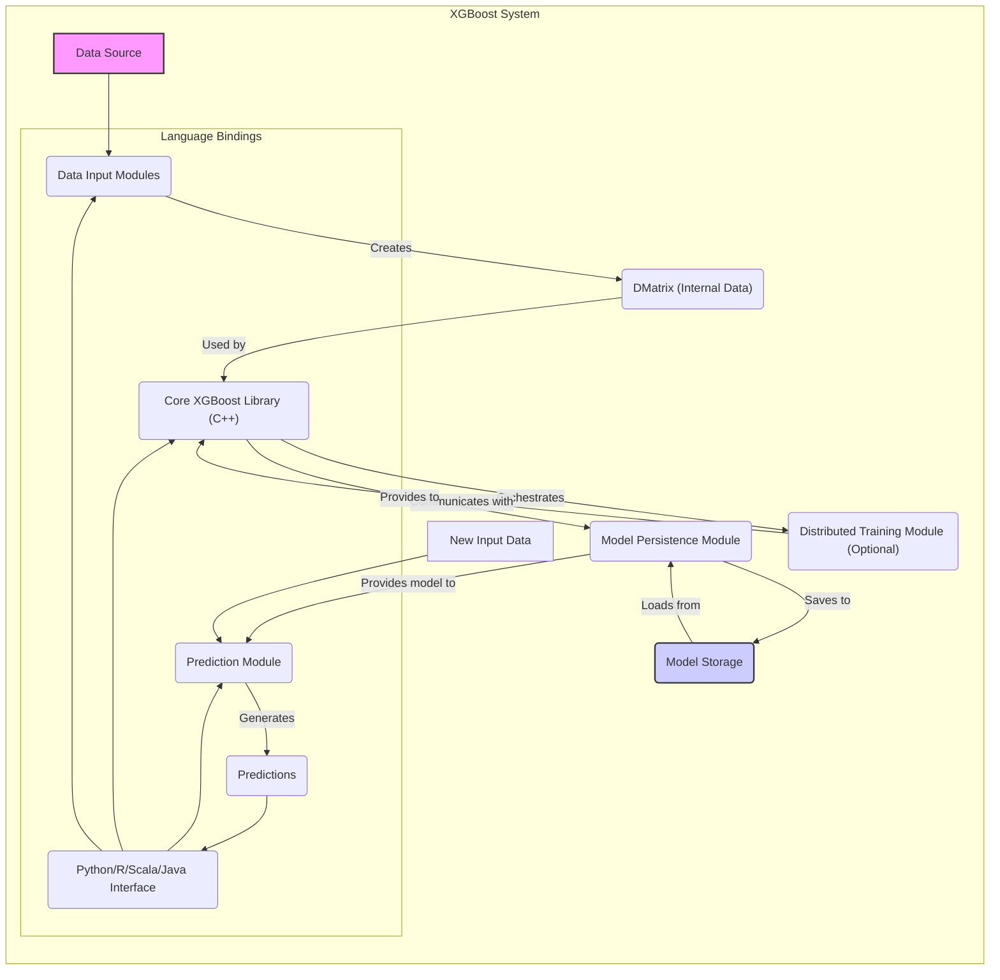

# Project Design Document: XGBoost

**Version:** 1.1
**Date:** October 26, 2023
**Prepared By:** AI Software Architect

## 1. Introduction

This document provides a detailed architectural design of the XGBoost (eXtreme Gradient Boosting) project, based on the information available in the provided GitHub repository: [https://github.com/dmlc/xgboost](https://github.com/dmlc/xgboost). This document aims to serve as a foundation for subsequent threat modeling activities. It outlines the key components, their interactions, and the overall data flow within the XGBoost ecosystem, with a focus on aspects relevant to security analysis.

## 2. Goals

*   Provide a comprehensive and improved overview of the XGBoost architecture.
*   Clearly identify key components and their responsibilities.
*   Precisely describe the data flow within the system, highlighting potential security touchpoints.
*   Emphasize potential areas of interest for security analysis and threat modeling with more specific examples.
*   Serve as a robust and well-formatted reference point for understanding the system's structure and behavior.

## 3. Target Audience

This document is intended for:

*   Security engineers and architects involved in threat modeling, security assessments, and penetration testing.
*   Software developers working on or integrating with XGBoost, requiring a deeper understanding of its architecture.
*   Operations and DevOps teams responsible for deploying, configuring, and maintaining XGBoost in various environments.

## 4. System Overview

XGBoost is an optimized distributed gradient boosting library designed for efficiency, flexibility, and portability. It implements machine learning algorithms under the Gradient Boosting framework, excelling in speed and performance. The core of XGBoost is written in C++, providing performance and scalability. It offers well-defined and actively maintained interfaces for various programming languages, including Python, R, Scala, and Java, making it accessible to a broad range of users and integration scenarios. XGBoost supports a wide array of supervised learning tasks such as classification, regression, ranking, and even user-defined prediction objectives. It is designed to operate efficiently on single machines and scale effectively in distributed environments, handling large datasets and complex models.

## 5. Architectural Design

The XGBoost architecture is modular and can be broken down into the following key components, each with specific responsibilities:

*   **Core XGBoost Library (C++):**
    *   **Responsibility:** Implements the core gradient boosting algorithms, including tree building, node splitting, and model training logic. Manages data structures (`DMatrix`), memory, and resource allocation. Provides the fundamental API for all operations.
    *   **Details:** Includes implementations for various objective functions (e.g., regression, logistic), evaluation metrics, and tree boosters (`gbtree`, `dart`, `linear`). Incorporates regularization techniques (L1, L2) to prevent overfitting. Handles parallel computation within a single machine.

*   **Language Bindings (Python, R, Scala, Java):**
    *   **Responsibility:** Provides language-specific interfaces for users to interact with the Core XGBoost Library. Handles data conversion and marshaling between the respective language environments and the C++ library.
    *   **Details:** Wraps the C++ API using techniques like SWIG or JNI. Offers higher-level abstractions and convenience functions tailored to each language's idioms. Manages the lifecycle of XGBoost objects within the language environment.

*   **Data Input Modules:**
    *   **Responsibility:** Reads, parses, and potentially performs basic preprocessing of input data from various sources. Converts data into the internal `DMatrix` format.
    *   **Details:** Supports formats like LIBSVM/SVMLight, CSV, and integration with in-memory data structures (NumPy arrays in Python, data frames in Pandas/Spark). May involve interaction with local file systems, distributed file systems (e.g., HDFS), or cloud storage (e.g., S3).

*   **Distributed Training Module:**
    *   **Responsibility:** Enables training XGBoost models across multiple machines or compute nodes in a cluster. Manages data partitioning, communication, and synchronization between nodes.
    *   **Details:** Utilizes communication libraries like MPI (Message Passing Interface) or the Rabit (Reliable Allreduce and Broadcast Interface) library. Handles gradient aggregation and model updates across the distributed environment. Supports fault tolerance and resilience.

*   **Model Persistence Module:**
    *   **Responsibility:** Handles the serialization and deserialization of trained XGBoost models to and from persistent storage. Ensures the integrity and compatibility of saved models.
    *   **Details:** Typically uses a custom binary format for efficient storage. Includes metadata about the model structure, parameters, and training environment. May involve writing to local file systems or cloud storage.

*   **Prediction Module:**
    *   **Responsibility:**  Loads trained models and applies them to new input data to generate predictions. Provides efficient prediction capabilities for both single instances and batches of data.
    *   **Details:**  Optimized for speed and low latency in deployment scenarios. Can operate on data in various formats, often mirroring the input formats.

## 6. Data Flow

The typical data flow within XGBoost can be visualized as follows:

*   **Data Ingestion:**
    *   Raw data is read from a specified source (file system, database, in-memory structure) by the **Data Input Modules**.
    *   The data is parsed, potentially preprocessed, and converted into XGBoost's internal optimized data structure, the `DMatrix`.

*   **Training Phase:**
    *   The training process is initiated via the **Language Bindings**, which interact with the **Core XGBoost Library**.
    *   Training data (in `DMatrix` format) and training parameters (objective function, hyperparameters) are passed to the core library.
    *   For distributed training, the **Distributed Training Module** orchestrates the distribution of data and computation across multiple nodes.
    *   The **Core XGBoost Library** iteratively builds decision trees, optimizing the model based on the training data and the specified objective function. Gradients and other training information are exchanged between nodes in distributed scenarios.

*   **Model Saving:**
    *   Once training is complete, the trained model (including tree structures and learned parameters) is passed to the **Model Persistence Module**.
    *   The **Model Persistence Module** serializes the model into a binary file and saves it to a designated storage location.

*   **Prediction Phase:**
    *   To make predictions, a trained model is loaded from storage by the **Model Persistence Module**.
    *   New input data is provided to the **Prediction Module**, often through the **Language Bindings**.
    *   The **Prediction Module** applies the loaded model to the input data to generate predictions.
    *   The predictions are returned to the user through the **Language Bindings**.



## 7. Key Technologies

*   **Core Programming Language:** C++
*   **Primary Language Bindings:** Python, R, Scala, Java
*   **Distributed Communication Libraries:** MPI, Rabit
*   **Data Input Formats:** LIBSVM/SVMLight, CSV, NumPy arrays, SciPy sparse matrices, Pandas DataFrames, Spark DataFrames
*   **Model Serialization Format:** Custom binary format (implementation details within the `src/` directory of the repository)
*   **Build System:** CMake
*   **Testing Frameworks:** gtest (for C++), language-specific testing frameworks (e.g., pytest for Python)

## 8. Deployment Considerations

XGBoost's versatility allows for deployment in various environments, each with its own security implications:

*   **Local Machine:** Primarily for development, experimentation, and training on smaller, non-sensitive datasets. Security risks are generally lower but depend on the security posture of the local machine.
*   **Cloud Environments (AWS, Azure, GCP):** Leveraging cloud-based virtual machines, container services (e.g., ECS, AKS, GKE), or managed machine learning services (e.g., SageMaker, Azure ML, Vertex AI). Security relies on the cloud provider's security measures and the configuration of the deployed resources.
*   **Containerized Environments (Docker, Kubernetes):** Provides consistent and reproducible deployments, simplifying management and scaling. Security considerations include container image security, orchestration platform security, and network policies.
*   **Distributed Computing Frameworks (Apache Spark, Hadoop):** For large-scale data processing and distributed training. Security involves securing the underlying framework (e.g., Kerberos authentication for Hadoop) and the communication between XGBoost components.

## 9. Security Considerations (For Threat Modeling)

This section expands on potential security concerns, providing more specific examples for threat modeling:

*   **Data Input Vulnerabilities:**
    *   **Maliciously Crafted Data:** Exploiting vulnerabilities in the Data Input Modules to inject data that causes buffer overflows, format string bugs, or denial-of-service. For example, providing extremely large or malformed CSV files.
    *   **Injection Attacks:** If data sources are external and not properly sanitized, injection attacks (e.g., SQL injection if data is read from a database) could compromise the training process.
    *   **Data Poisoning:** Injecting subtly altered data to manipulate the training process and cause the model to make incorrect predictions in specific scenarios.

*   **Model Security Threats:**
    *   **Model Tampering:** Unauthorized modification of trained model files, potentially leading to compromised predictions or the introduction of backdoors.
    *   **Model Theft:** Unauthorized access and copying of trained models, which can represent significant intellectual property.
    *   **Model Poisoning (at rest):**  Modifying a saved model file directly to alter its behavior.
    *   **Supply Chain Attacks:** Compromising the process of obtaining or building XGBoost, potentially introducing malicious code into the library itself.

*   **Distributed Training Security Risks:**
    *   **Man-in-the-Middle Attacks:** Intercepting communication between training nodes to eavesdrop on sensitive data (e.g., gradients) or inject malicious data.
    *   **Unauthorized Node Participation:**  Unauthenticated or unauthorized nodes joining the training process, potentially disrupting training or injecting malicious updates.
    *   **Denial of Service:** Overwhelming training nodes with excessive communication or resource requests.

*   **Language Binding Security Concerns:**
    *   **Memory Corruption:** Vulnerabilities in the language bindings could lead to memory corruption in the underlying C++ library.
    *   **Unsafe Data Handling:** Improper handling of data passed between the language environment and the C++ library could introduce vulnerabilities.

*   **Dependency Vulnerabilities:**
    *   XGBoost relies on third-party libraries (e.g., for linear algebra, communication). Vulnerabilities in these dependencies could be exploited. Regular dependency scanning and updates are crucial.

*   **Access Control Weaknesses:**
    *   Insufficient access controls on data sources, model storage, or the XGBoost deployment environment could allow unauthorized access and modification.

*   **Code Injection Risks:**
    *   If XGBoost is used in a context where user-provided code or configurations are executed (e.g., custom objective functions), there is a risk of code injection vulnerabilities if input is not properly sanitized.

## 10. Future Considerations

*   Further detailed analysis of the source code, particularly within the `src/` directory, is recommended for a more in-depth security assessment.
*   Investigating the specific security features and configurations available for the distributed training module (e.g., encryption, authentication).
*   Analyzing the model serialization format for potential vulnerabilities and considering options for model signing or encryption.
*   Reviewing the project's security development lifecycle and vulnerability management processes.

## 11. Appendix

### 11.1. High-Level Component Diagram

```mermaid
graph LR
    subgraph "XGBoost System"
        A("Language Bindings")
        B("Core XGBoost Library")
        C("Data Input Modules")
        D("Distributed Training")
        E("Model Persistence")
        F("Prediction Module")
        A -- "Uses API of" --> B
        A -- "Utilizes" --> C
        A -- "Triggers" --> F
        B -- "Processes data from" --> C
        B -- "Coordinates" --> D
        B -- "Interacts with" --> E
        D -- "Communicates with" --> B
        E -- "Manages" --> "Trained Models"
        F -- "Uses" --> E
    end
```

### 11.2. Data Flow Diagram (Detailed)

```mermaid
graph LR
    A["Raw Data\n(Files, Databases, etc.)"] --> B("Data Input Modules\n(Parsing, Preprocessing)");
    B -- "Converts to" --> C("DMatrix\n(Internal Representation)");
    C -- "Used for" --> D("Training Process\n(Core XGBoost Library)");
    D -- "Communicates via" --> E("Distributed Training Module\n(MPI, Rabit)");
    E -- "Updates" --> D;
    D -- "Generates" --> F("Trained Model\n(In Memory)");
    F -- "Serialized by" --> G("Model Persistence Module");
    G -- "Stored in" --> H("Model Storage\n(File System, Cloud Storage)");
    I["New Input Data"] --> J("Prediction Module\n(Loads Model)");
    H -- "Loads Model" --> J;
    J -- "Applies Model" --> K("Predictions");
    style H fill:#ccf,stroke:#333,stroke-width:2px
