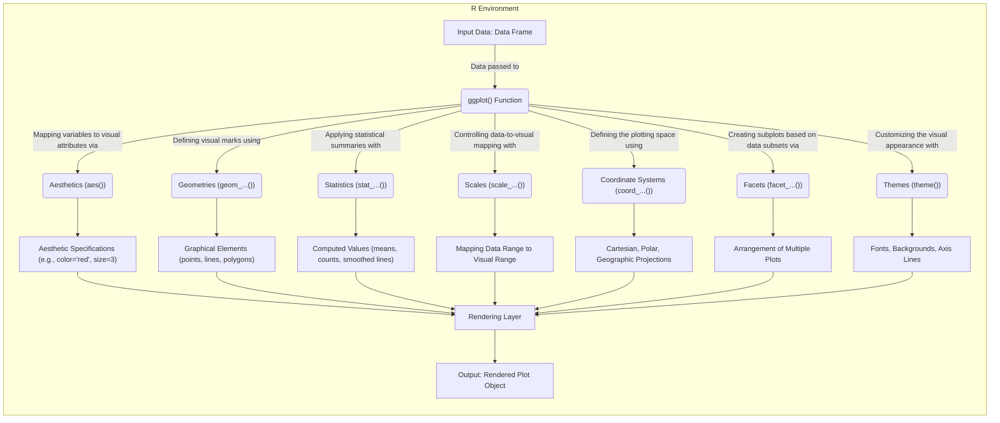
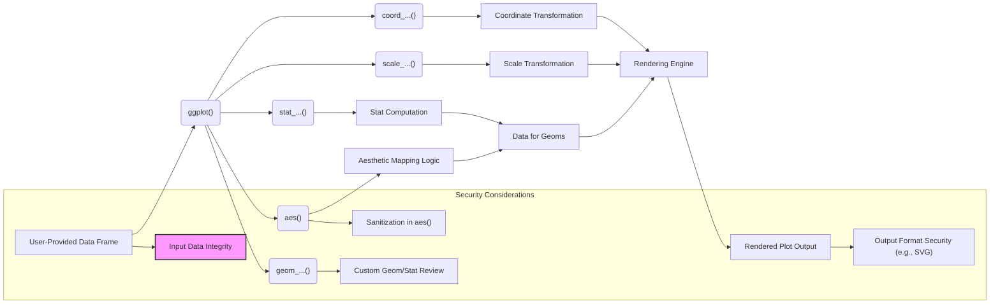

# Project Design Document: ggplot2

**Version:** 1.1
**Date:** October 26, 2023
**Author:** AI Software Architect

## 1. Introduction

This document provides an enhanced architectural design of the `ggplot2` R package, specifically tailored for threat modeling. `ggplot2` is a widely used and influential system for creating declarative statistical graphics based on the grammar of graphics. This revised document offers a more granular view of its internal workings, data flow, and potential security considerations to facilitate a comprehensive threat analysis.

## 2. Goals and Objectives

The fundamental goal of `ggplot2` is to empower users to create a wide array of statistical graphics in a principled and reproducible manner. Key objectives include:

*   **Declarative Graphics Specification:**  Allowing users to describe the desired graphic in terms of its components rather than imperative drawing commands.
*   **Extensible Grammar:** Providing a flexible framework that can be extended with new geometric objects, statistical transformations, and aesthetic mappings.
*   **Separation of Concerns:**  Distinguishing between the data, the aesthetic mappings, and the geometric representations.
*   **High-Quality Output:** Generating visually appealing and informative graphics suitable for publication and presentation.
*   **Integration with the R Ecosystem:** Seamlessly working with other R packages for data manipulation and analysis.

## 3. Architectural Overview

`ggplot2`'s architecture is centered around the "grammar of graphics," a conceptual framework that decomposes a graphic into a set of independent components. These components are combined to create visualizations. The following diagram illustrates the core components and their interactions within the R environment:

### 3.1. Detailed Component Descriptions

*   **Input Data: Data Frame:** The primary input to `ggplot2`. It's crucial that this data is well-formed and potentially sanitized before being used.
*   **`ggplot()` Function:**  The initial function call that creates the foundation for a plot, linking the data to the plotting environment.
*   **Aesthetics (`aes()`):** Defines the mapping between variables in the input data frame and visual properties of the plot (e.g., `x`, `y`, `color`, `fill`, `size`, `shape`). This is a key area where user-provided data influences the visual output.
*   **Geometries (`geom_...()`):**  Specify the type of graphical mark used to represent the data. Examples include `geom_point` for scatter plots, `geom_line` for line graphs, and `geom_bar` for bar charts. Each geom function adds a layer to the plot.
*   **Statistics (`stat_...()`):**  Perform statistical transformations on the data before it is rendered. Examples include `stat_summary` for calculating summary statistics and `stat_smooth` for adding smoothed lines. These functions operate on the input data and generate new data for plotting.
*   **Scales (`scale_...()`):** Control how the data values are mapped to the visual range of the aesthetics. For example, `scale_color_gradient` maps numerical data to a color gradient. Scales ensure that the visual representation accurately reflects the data.
*   **Coordinate Systems (`coord_...()`):** Define the coordinate system in which the data is plotted. The default is Cartesian, but others like polar coordinates (`coord_polar`) and map projections (`coord_sf`) are available.
*   **Facets (`facet_...()`):**  Enable the creation of small multiples of the same plot, where each subplot displays a subset of the data based on one or more categorical variables.
*   **Themes (`theme()`):**  Control the non-data ink elements of the plot, such as axis labels, titles, legend appearance, and background colors. Themes provide a way to customize the overall visual style.
*   **Rendering Layer:** The internal engine that takes the specifications from the other components and translates them into graphical output using the `grid` graphics system.
*   **Output: Rendered Plot Object:** The final graphical output, which can be displayed, saved to a file (e.g., PNG, PDF, SVG), or further processed.

## 4. Data Flow with Security Considerations

The data flow within `ggplot2` involves several stages where data is processed and transformed. Understanding this flow is crucial for identifying potential security vulnerabilities:

1. **Data Ingestion:** The process begins with the user providing a data frame to the `ggplot()` function. **Security Note:**  The integrity and trustworthiness of this input data are paramount. Maliciously crafted data could potentially exploit vulnerabilities in subsequent processing steps or lead to unexpected behavior.

2. **Aesthetic Mapping:** The `aes()` function maps data variables to visual attributes. **Security Note:** If user-controlled strings are directly used within `aes()` without proper sanitization, it could potentially lead to issues if these strings are later interpreted as code or commands (though this is more relevant in interactive R environments).

3. **Geom and Stat Application:** Geom and stat functions process the data to generate the graphical elements. **Security Note:**  While `ggplot2` itself primarily uses built-in functions, if custom geoms or stats are used (which is possible), their implementation needs to be carefully reviewed for potential vulnerabilities.

4. **Scaling and Coordinate Transformation:** Scales and coordinate systems transform the data values into visual coordinates. **Security Note:**  The logic within these transformations is generally safe, but unexpected data ranges could potentially lead to rendering issues or resource exhaustion.

5. **Rendering:** The rendering engine translates the plot specifications into graphical output. **Security Note:**  The output format (e.g., SVG) can be a potential attack vector if the rendered output is displayed in a context that executes embedded scripts.

## 5. Security Considerations (Detailed)

This section expands on the preliminary security considerations, providing more specific potential threats:

*   **Malicious Data Injection:** If the input data frame originates from an untrusted source, it could contain crafted data designed to exploit vulnerabilities in `ggplot2` or the underlying R environment. This could lead to unexpected errors, resource exhaustion, or even code execution if combined with other vulnerabilities.
*   **Cross-Site Scripting (Indirect via SVG Output):** If plots are saved as SVGs and displayed in a web context without proper sanitization, malicious scripts embedded within the SVG could be executed in the user's browser.
*   **Denial of Service (Resource Exhaustion):**  Extremely large datasets or complex plot specifications could potentially consume excessive memory or processing power, leading to a denial of service.
*   **Code Injection (Indirect via Unsafe String Evaluation):** While `ggplot2` itself doesn't directly evaluate arbitrary code, if user-provided strings are used in contexts where R might evaluate them (e.g., within expressions or formulas passed to certain geoms or stats), it could potentially lead to code injection. This is more of an R environment concern but relevant in the context of `ggplot2` usage.
*   **Information Disclosure:**  Carelessly visualizing sensitive data without proper anonymization or aggregation could lead to unintended information disclosure. This is a user responsibility but worth noting in the context of `ggplot2`'s capabilities.
*   **Dependency Vulnerabilities:** `ggplot2` relies on other R packages. Vulnerabilities in these dependencies could indirectly affect `ggplot2`'s security. Regular updates and security audits of dependencies are crucial.
*   **Integer Overflow/Underflow:** While less likely in a high-level language like R, potential vulnerabilities related to integer handling in underlying C/C++ libraries (if used by dependencies) could theoretically exist.

## 6. Technologies Used

*   **R Programming Language (>= 3.1):** The primary language for `ggplot2`'s implementation.
*   **grid Graphics System:** The low-level graphics engine in R that `ggplot2` builds upon.
*   **R Packages (Dependencies):**  `ggplot2` depends on various other R packages for core functionalities, including:
    *   `rlang`: Provides tools for working with R code.
    *   `dplyr`: For data manipulation.
    *   `tidyr`: For data tidying.
    *   `scales`: For scaling functions.
    *   `munsell`: For color manipulation.
    *   `glue`: For string interpolation.
*   **Potentially Compiled Code (C/C++):** Some underlying computations within dependencies might be implemented in compiled languages for performance.

## 7. Deployment and Usage Scenarios

`ggplot2` is primarily used within the R ecosystem in various deployment scenarios:

*   **Interactive R Sessions (R Console, RStudio):** Users directly create and display plots during interactive data analysis.
*   **R Scripts and Automated Workflows:** Plots are generated programmatically as part of batch processing or data analysis pipelines.
*   **R Markdown Documents and Quarto Documents:** Plots are embedded in reproducible reports and presentations.
*   **Shiny Web Applications:** `ggplot2` is a core component for creating dynamic and interactive visualizations in web applications built with the Shiny framework.
*   **R Packages:** Other R packages may utilize `ggplot2` internally for generating visualizations.

## 8. Future Considerations and Potential Security Impacts

*   **WebAssembly Compilation:** If R and its packages, including `ggplot2`, are compiled to WebAssembly for browser-based execution, new security considerations related to the browser's security model will arise.
*   **Enhanced Interactivity:**  Future versions might introduce more interactive elements, potentially increasing the attack surface if not implemented securely.
*   **Integration with Cloud Platforms:** As R and `ggplot2` are increasingly used in cloud environments, security considerations related to cloud deployments (e.g., access control, data encryption) become relevant.
*   **New Output Formats:**  Support for new output formats could introduce new security risks depending on the format's capabilities (e.g., embedded scripts in certain document formats).

This enhanced design document provides a more detailed and security-focused view of `ggplot2`'s architecture and data flow, serving as a solid foundation for subsequent threat modeling activities.
