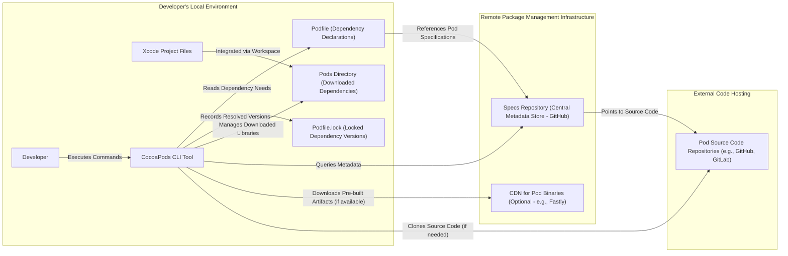

# Project Design Document: CocoaPods

**Version:** 1.1
**Date:** October 26, 2023
**Author:** Gemini (AI Language Model)

## 1. Introduction

This document provides an enhanced and detailed design overview of the CocoaPods project, a widely adopted dependency manager for Swift and Objective-C Cocoa projects. The primary objective of this document is to furnish a clear and comprehensive understanding of the system's architecture, core components, and intricate data flows. This detailed design serves as a foundational resource for subsequent threat modeling activities, enabling a thorough assessment of potential security vulnerabilities.

## 2. Goals and Objectives

The fundamental goals driving the development and operation of CocoaPods are:

*   **Simplified Dependency Integration:** To significantly streamline the process of incorporating external, third-party libraries (referred to as dependencies or "Pods") into Xcode-based projects for iOS, macOS, watchOS, and tvOS.
*   **Robust Dependency Management:** To effectively manage the versions of these dependencies, ensuring consistency and preventing conflicts across diverse development environments and teams.
*   **Automated Project Configuration:** To automate the often complex and manual tasks of linking and configuring dependencies within Xcode projects, reducing the potential for errors and saving developer time.
*   **Centralized Library Discovery:** To offer a centralized and easily searchable repository for discovering and managing a vast ecosystem of open-source and proprietary libraries.
*   **Reproducible Builds:** To ensure that project builds are reproducible by locking down dependency versions.

## 3. High-Level Architecture

CocoaPods functions primarily as a command-line interface (CLI) tool that interacts with various local and remote components to facilitate dependency management. The following diagram illustrates the high-level architectural relationships:

**Component Descriptions:**

*   **Developer:** The software engineer or user who interacts with the CocoaPods tool to manage project dependencies.
*   **Xcode Project Files:** The collection of files that constitute the target iOS, macOS, watchOS, or tvOS project.
*   **Podfile (Dependency Declarations):** A plain-text file residing in the root of the Xcode project, where the developer declares the project's dependencies and their version requirements.
*   **Podfile.lock (Locked Dependency Versions):** A file automatically generated and managed by CocoaPods, which precisely records the versions of all direct and transitive dependencies that were resolved and installed during the last successful `pod install` or `pod update` operation. This ensures build reproducibility.
*   **Pods Directory (Downloaded Dependencies):** A directory created within the Xcode project structure, containing the downloaded source code or pre-built binaries of the specified dependencies.
*   **CocoaPods CLI Tool:** The command-line interface application (`pod`) that developers use to interact with the CocoaPods system. It handles tasks such as installing, updating, searching for, and managing dependencies.
*   **Specs Repository (Central Metadata Store - GitHub):** A canonical, centralized repository (typically hosted on GitHub) that stores `Podspec` files. These files contain metadata about each available library, including its name, version, source code location, dependencies, and build settings.
*   **CDN for Pod Binaries (Optional - e.g., Fastly):** A Content Delivery Network that can optionally host pre-built binary frameworks or libraries for certain Pods. This allows for faster installation times by avoiding the need to compile source code locally.
*   **Pod Source Code Repositories (e.g., GitHub, GitLab):** The external repositories (often hosted on platforms like GitHub or GitLab) where the source code of individual libraries (Pods) is maintained.

## 4. Detailed Design

This section provides a more granular view of the key functionalities and components within the CocoaPods ecosystem.

### 4.1. Core Functionalities Explained

*   **Declarative Dependency Management via Podfile:**
    *   Developers explicitly define their project's dependencies within the `Podfile` using a Ruby-based Domain Specific Language (DSL).
    *   The `Podfile` allows for specifying the names of desired libraries (Pods), along with optional version constraints (e.g., specific versions, version ranges, optimistic operators).
    *   The CocoaPods CLI parses this `Podfile` to understand the project's dependency requirements.
*   **Intelligent Dependency Resolution:**
    *   The CocoaPods CLI interacts with the Specs Repository to retrieve the `Podspec` files corresponding to the declared dependencies.
    *   A sophisticated resolver algorithm analyzes these `Podspec` files to determine the optimal set of dependency versions that satisfy all specified constraints, including transitive dependencies (dependencies of dependencies).
    *   The resolver aims to prevent version conflicts and ensure compatibility between different libraries.
*   **Efficient Pod Installation Process:**
    *   Once the dependency resolution is complete, the CocoaPods CLI proceeds with the installation phase.
    *   It downloads the necessary source code or pre-built binaries for the resolved dependencies.
    *   Source code is typically cloned directly from the Pod's designated source code repository (e.g., using Git).
    *   If specified in the `Podspec` and available, pre-built binaries can be downloaded from a configured CDN, significantly accelerating the installation process.
    *   Downloaded dependencies are organized and stored within the `Pods` directory of the Xcode project.
*   **Seamless Xcode Project Integration:**
    *   CocoaPods generates an Xcode workspace (`.xcworkspace`) that encapsulates both the original Xcode project and a newly created "Pods" Xcode project.
    *   The "Pods" project is responsible for building the downloaded dependencies into static libraries or frameworks.
    *   CocoaPods automatically configures the original Xcode project to link against these compiled dependencies from the "Pods" project.
    *   This integration involves modifying crucial build settings, such as library search paths, header search paths, and linker flags, ensuring that the project can correctly access and utilize the installed dependencies.
*   **Dependency Version Locking with Podfile.lock:**
    *   Following a successful installation or update, CocoaPods generates or updates the `Podfile.lock` file.
    *   This file acts as a snapshot, meticulously recording the precise versions of all direct and transitive dependencies that were ultimately installed.
    *   Subsequent installations using the `pod install` command will prioritize using the exact versions specified in the `Podfile.lock`, guaranteeing consistent dependency versions across different developer machines and over time, leading to more reproducible builds.
    *   The `pod update` command allows developers to intentionally update dependencies to the latest compatible versions, which will then update the `Podfile.lock` accordingly.
*   **Centralized Metadata via Specs Repository:**
    *   The Specs Repository serves as a central hub for metadata about available libraries.
    *   Each library has a corresponding `Podspec` file within the repository.
    *   The `Podspec` file is a Ruby file that contains essential information about the library, including its name, version number, a summary description, the location of its source code, any dependencies it relies on, licensing information, and specific build settings required for integration.
    *   The CocoaPods CLI efficiently fetches and parses these `Podspec` files to gather the necessary information for dependency resolution and installation.

### 4.2. Key Components Breakdown

*   **`pod` Command (CLI Entry Point):** The primary executable command (`pod`) that developers use to interact with CocoaPods. It offers a range of subcommands, including:
    *   `install`: Installs the dependencies specified in the `Podfile`.
    *   `update`: Updates dependencies to the latest compatible versions.
    *   `search`: Allows developers to search the Specs Repository for available libraries.
    *   `init`: Creates a default `Podfile` in the project directory.
    *   `outdated`: Checks for available updates to installed dependencies.
    *   `repo`: Manages local Specs Repository clones.
*   **Resolver Component:** The core logic responsible for analyzing the `Podfile` and `Podspec` files to determine the optimal and compatible versions of all required dependencies. This component implements sophisticated conflict resolution algorithms.
*   **Downloader Component:**  Handles the process of retrieving the source code or pre-built binaries of the resolved dependencies from their designated locations (source code repositories or CDNs). It typically utilizes Git for cloning repositories and HTTP/HTTPS for downloading binaries.
*   **Installer Component:** Orchestrates the installation process, encompassing downloading dependencies, potentially building them from source, and integrating them into the Xcode project structure. This involves creating the `Pods` directory and managing its contents.
*   **Generator Component:** Responsible for creating and managing the Xcode workspace (`.xcworkspace`) and for modifying the original Xcode project's settings to correctly link against the installed dependencies.
*   **Specs Manager Component:** Manages the interaction with the Specs Repository, including fetching, caching, and updating the `Podspec` files.

### 4.3. Detailed Data Flow - Installing a Pod (Step-by-Step)

1. The developer executes the `pod install` command within their project's directory via the terminal.
2. The CocoaPods CLI tool parses and interprets the contents of the `Podfile` to identify the project's declared dependencies and any specified version constraints.
3. The Resolver component analyzes the `Podfile` and initiates queries to the configured Specs Repository to retrieve the `Podspec` files for the listed dependencies.
4. The Resolver meticulously evaluates the retrieved `Podspec` files, considering version constraints and dependencies between libraries, to determine the most suitable and compatible versions for all direct and transitive dependencies.
5. The Downloader component takes over, retrieving the necessary source code or pre-built binary artifacts for the resolved dependencies. Source code is typically cloned from the respective Git repositories, while binaries might be downloaded from a CDN if available.
6. The Installer component organizes the downloaded files, placing them within the designated `Pods` directory within the Xcode project structure.
7. If the downloaded dependencies are in source code form, the Installer may trigger the compilation process to build them into static libraries or frameworks.
8. The Generator component creates or updates the Xcode workspace file (`.xcworkspace`), which will be used to work with the project and its dependencies.
9. The Generator modifies the original Xcode project's build settings, including library search paths, header search paths, and linker flags, to ensure that the project correctly links against the installed dependencies located within the `Pods` project in the workspace.
10. The CocoaPods CLI writes the precise versions of all resolved dependencies into the `Podfile.lock` file, effectively locking down these versions for future installations.
11. The developer then opens the generated `.xcworkspace` file in Xcode to work on the project, now with the integrated and managed dependencies.

## 5. Security Considerations (In-Depth)

This section expands on potential security considerations, providing more specific examples and potential threats.

*   **Compromised Dependency Content:**
    *   **Threat:** Malicious actors could potentially compromise Pod source code repositories or CDN delivery mechanisms to inject malicious code into dependency libraries.
    *   **Impact:** This could lead to arbitrary code execution within the developer's application, data breaches, or other security vulnerabilities.
    *   **Mitigation Considerations:**  Code signing for Pods, checksum verification of downloaded files, and community vetting of popular libraries.
*   **Specs Repository Manipulation:**
    *   **Threat:** If the central Specs Repository is compromised, attackers could modify `Podspec` files to point to malicious code repositories or binaries.
    *   **Impact:** Developers unknowingly installing these manipulated Pods would introduce vulnerabilities into their projects.
    *   **Mitigation Considerations:** Strong security measures for the Specs Repository infrastructure, multi-factor authentication for maintainers, and mechanisms for reporting and verifying `Podspec` integrity.
*   **Supply Chain Attacks via Dependencies:**
    *   **Threat:** A seemingly benign dependency could have a vulnerable transitive dependency, creating an indirect attack vector.
    *   **Impact:** Exploiting vulnerabilities in these transitive dependencies could compromise the application.
    *   **Mitigation Considerations:** Dependency scanning tools, security audits of popular dependencies, and mechanisms for reporting and addressing vulnerabilities in the CocoaPods ecosystem.
*   **CDN Vulnerabilities:**
    *   **Threat:** If a CDN used for distributing pre-built Pod binaries is compromised, attackers could replace legitimate binaries with malicious ones.
    *   **Impact:** Developers downloading these compromised binaries would unknowingly integrate malicious code.
    *   **Mitigation Considerations:**  HTTPS enforcement, integrity checks (e.g., checksums) for downloaded binaries, and robust security practices by CDN providers.
*   **Local Machine Security:**
    *   **Threat:** Insufficient file system permissions on the developer's machine could allow attackers to modify the `Podfile`, `Podfile.lock`, or the contents of the `Pods` directory.
    *   **Impact:** This could lead to the installation of unintended or malicious dependencies.
    *   **Mitigation Considerations:**  Educating developers on secure file permissions and practices.
*   **Network Interception:**
    *   **Threat:** Man-in-the-middle attacks could potentially intercept communication between the developer's machine and the Specs Repository, CDN, or source code repositories.
    *   **Impact:** Attackers could potentially inject malicious responses or redirect downloads to compromised locations.
    *   **Mitigation Considerations:**  Enforcing HTTPS for all communication channels.
*   **Vulnerabilities in the CocoaPods CLI Tool:**
    *   **Threat:** Security vulnerabilities in the CocoaPods CLI itself could be exploited by attackers.
    *   **Impact:** This could allow for arbitrary code execution on the developer's machine or manipulation of the dependency management process.
    *   **Mitigation Considerations:** Regular security audits, penetration testing, and timely patching of vulnerabilities in the CocoaPods CLI.
*   **Lack of Dependency Verification:**
    *   **Threat:** Without robust mechanisms to verify the authenticity and integrity of Pods, developers rely on trust in the ecosystem.
    *   **Impact:** Increased risk of unknowingly incorporating malicious or vulnerable dependencies.
    *   **Mitigation Considerations:** Exploring and implementing mechanisms for dependency signing and verification.

## 6. Deployment Model

CocoaPods operates primarily as a client-side tool installed on individual developer machines. Its interaction involves both local file system operations and communication with remote services.

*   **Installation Method:** Developers typically install the CocoaPods CLI using the RubyGems package manager (`gem install cocoapods`).
*   **Local Execution:** The `pod` command is executed directly on the developer's local machine within the context of an Xcode project.
*   **Remote Interactions:** During its operation, CocoaPods interacts with remote resources, including:
    *   The central Specs Repository (typically hosted on GitHub) to retrieve `Podspec` files.
    *   Optional CDNs to download pre-built binary frameworks.
    *   Remote Git repositories to clone the source code of dependencies.
*   **Xcode Integration:** CocoaPods integrates deeply with Xcode projects by modifying project files and generating a workspace to manage dependencies.

## 7. Assumptions and Constraints

*   **Reliable Network Connectivity:**  CocoaPods assumes a stable internet connection is available for interacting with remote repositories and downloading dependencies.
*   **Functional Ruby Environment:**  A working Ruby environment (including RubyGems) is a prerequisite for installing and running CocoaPods.
*   **Git Availability:** Git is a fundamental requirement for cloning source code repositories of dependencies.
*   **Xcode Presence:** CocoaPods is specifically designed to manage dependencies for Xcode projects and assumes Xcode is installed on the developer's machine.
*   **Trust in the Ecosystem:** The security model inherently relies on a degree of trust in the maintainers of the Specs Repository and individual Pod libraries.

## 8. Future Considerations

*   **Enhanced Security Measures:**  Exploring and implementing more robust security features, such as mandatory dependency signing and improved verification mechanisms for Pod integrity.
*   **Decentralized Package Management Options:** Investigating alternative, potentially decentralized models for dependency distribution to reduce reliance on a single central repository.
*   **Broader Build System Integration:**  Considering extending support to other build systems beyond Xcode to increase its applicability.
*   **Improved Vulnerability Reporting and Management:**  Developing clearer processes for reporting and addressing security vulnerabilities within the CocoaPods ecosystem and its dependencies.

This enhanced design document provides a more detailed and comprehensive understanding of the CocoaPods project. The expanded descriptions, refined data flow, and in-depth security considerations offer a solid foundation for conducting thorough threat modeling and identifying potential areas for security improvement.