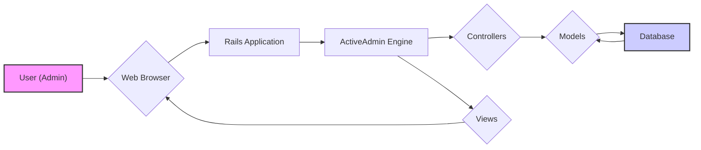
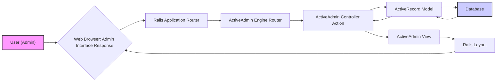

# Project Design Document: ActiveAdmin

**Version:** 1.1
**Date:** October 26, 2023
**Author:** AI Software Architect

## 1. Introduction

This document provides a detailed design overview of the ActiveAdmin project, an administration framework for Ruby on Rails applications. This document is specifically tailored to facilitate effective threat modeling by clearly articulating the architecture, components, and data flow within ActiveAdmin. It will serve as a crucial reference point for security assessments, penetration testing, and security-focused discussions.

## 2. Goals and Objectives

*   Provide a comprehensive and security-focused architectural overview of ActiveAdmin.
*   Clearly identify key components and their interactions, highlighting potential security implications.
*   Describe the data flow within the system with an emphasis on data handling and potential vulnerabilities.
*   Pinpoint specific areas of security concern to guide subsequent threat modeling exercises.
*   Serve as a clear, concise, and up-to-date reference for developers, security professionals, and auditors.

## 3. High-Level Architecture

ActiveAdmin functions as a Ruby on Rails engine, designed to be seamlessly integrated within an existing Rails application. It provides a user-friendly administrative interface for managing the application's data and resources.

*   **User (Admin):**  The individual interacting with the ActiveAdmin interface, possessing administrative or privileged access.
*   **Web Browser:** The client application used by the administrator to access and interact with ActiveAdmin.
*   **Rails Application:** The primary Ruby on Rails application where the ActiveAdmin engine is mounted and operates.
*   **ActiveAdmin Engine:** The core component responsible for providing the administrative interface functionality and logic.
*   **Controllers:** Handle incoming HTTP requests from the browser, interact with models to retrieve or manipulate data, and select appropriate views for rendering.
*   **Models:** Represent the data structures and business logic of the application, typically inherited from the parent Rails application.
*   **Database:** The persistent storage for the application's data, accessed and managed through the models.
*   **Views:** Render the HTML interface presented to the user in the web browser, displaying data and providing interactive elements.

## 4. Detailed Component Design

ActiveAdmin's architecture is based on the Model-View-Controller (MVC) pattern within the context of a Rails engine. Understanding the responsibilities of each component is crucial for identifying potential security vulnerabilities.

*   **Registration DSL (Domain Specific Language):**
    *   Provides a declarative way for developers to register models and customize their administrative interfaces.
    *   Defines how resources are displayed, edited, and managed, including specifying fields, filters, actions, and navigation elements.
    *   **Security Implication:** Misconfigurations or vulnerabilities in the DSL processing could lead to unintended exposure of data or functionality.
*   **Controllers:**
    *   Dynamically generated based on the registered resources, providing standard CRUD operations.
    *   Handle authentication and authorization checks before allowing access to specific actions.
    *   May include custom controller actions for specialized administrative tasks.
    *   **Security Implication:**  Vulnerabilities in controller logic, such as insufficient input validation or improper authorization checks, can lead to unauthorized access or data manipulation.
*   **Models:**
    *   Typically the existing models from the parent Rails application, representing the core data entities.
    *   ActiveAdmin interacts with these models to perform data management operations.
    *   May have specific scopes or methods defined for use within ActiveAdmin to tailor data access.
    *   **Security Implication:**  While ActiveAdmin doesn't directly manage model definitions, understanding how it interacts with models is crucial for assessing data access control.
*   **Views:**
    *   Dynamically generated to provide the user interface for managing resources, including forms, tables, and other UI elements.
    *   Utilize a set of pre-built UI components and layouts that can be customized.
    *   **Security Implication:**  Vulnerabilities in view rendering, such as improper output encoding, can lead to Cross-Site Scripting (XSS) attacks.
*   **Authentication and Authorization:**
    *   Primarily relies on the authentication mechanisms of the parent Rails application (e.g., Devise, custom solutions).
    *   Provides its own authorization framework to control access to specific resources and actions within the admin interface.
    *   Often integrates with popular authorization gems like CanCanCan or Pundit for more complex permission management.
    *   **Security Implication:**  The strength and configuration of authentication and authorization are paramount for securing ActiveAdmin. Weaknesses here can lead to unauthorized access.
*   **Form Builders:**
    *   Simplify the creation of forms for editing and creating resources, providing a consistent way to define input fields, validations, and associations.
    *   **Security Implication:**  Improperly configured form builders or insufficient input validation can lead to mass assignment vulnerabilities or allow injection of malicious data.
*   **Filter Framework:**
    *   Allows administrators to easily filter and search through large datasets based on resource attributes.
    *   Generates filter inputs dynamically.
    *   **Security Implication:**  Vulnerabilities in the filter framework could lead to SQL injection if user-provided filter values are not properly sanitized.
*   **Action Items:**
    *   Provide a mechanism to add custom actions to resource listings and individual resource pages, enabling specific administrative tasks.
    *   Can trigger custom logic or interact with external systems.
    *   **Security Implication:**  Custom action items represent potential entry points for vulnerabilities if not implemented securely, including authorization bypass or execution of malicious code.
*   **Menu System:**
    *   Organizes the administrative interface into logical sections, providing navigation for administrators.
    *   Dynamically generated based on the registered resources and user permissions.
    *   **Security Implication:**  While primarily a UI element, the menu system's structure reflects access permissions and can indirectly reveal information about available functionalities.
*   **Asset Pipeline Integration:**
    *   Leverages the Rails asset pipeline for managing CSS, JavaScript, and image assets.
    *   Provides a default set of styles and scripts that can be customized.
    *   **Security Implication:**  Vulnerabilities in third-party JavaScript libraries or insecurely managed assets can introduce security risks.

## 5. Data Flow

Understanding the data flow within ActiveAdmin is crucial for identifying potential points of vulnerability. The following diagram illustrates a typical CRUD operation:

1. **User Interaction:** An administrator interacts with the ActiveAdmin interface in their web browser (e.g., submitting a form, clicking a link).
2. **Browser Request:** The browser sends an HTTP request to the Rails application, targeting an ActiveAdmin route.
3. **Rails Routing:** The Rails router identifies the request as belonging to the mounted ActiveAdmin engine.
4. **ActiveAdmin Routing:** The ActiveAdmin engine's router maps the request to the appropriate controller and action based on the defined resources.
5. **Controller Action:** The designated ActiveAdmin controller action is invoked:
    *   **Authentication/Authorization:**  The action typically begins by verifying the user's identity and permissions to access the requested resource and action.
    *   **Data Retrieval/Manipulation:** The controller interacts with the relevant ActiveRecord model to fetch, create, update, or delete data based on the request.
6. **Model Interaction:** The ActiveRecord model executes database queries to perform the requested data operation.
7. **Database Operation:** The database processes the query and returns the results to the model.
8. **Model Response:** The ActiveRecord model returns the data (or confirmation of the operation) to the controller.
9. **View Rendering:** The controller selects the appropriate ActiveAdmin view template to render the response.
10. **Rails Layout:** The ActiveAdmin view is often rendered within the context of a broader Rails layout, providing the overall page structure.
11. **Response Generation:** The view renders the HTML response, incorporating the data received from the controller and the layout.
12. **Browser Response:** The Rails application sends the generated HTML response back to the user's web browser.
13. **Interface Update:** The browser renders the updated administrative interface, reflecting the results of the user's action.

## 6. Security Considerations (For Threat Modeling)

This section details specific security considerations relevant to ActiveAdmin, providing concrete examples for threat modeling:

*   **Authentication and Authorization Vulnerabilities:**
    *   **Threat:** Brute-force attacks against login forms if not properly protected (e.g., rate limiting, account lockout).
    *   **Threat:**  Bypassing authentication if the parent Rails application has vulnerabilities in its authentication logic.
    *   **Threat:**  Authorization bypass allowing unauthorized users to access or modify resources due to flaws in ActiveAdmin's permission checks or misconfigured roles.
*   **Cross-Site Scripting (XSS):**
    *   **Threat:** Stored XSS if user-provided data in admin forms (e.g., resource descriptions) is not properly sanitized before being displayed in other admin views or the main application.
    *   **Threat:** Reflected XSS if malicious scripts are injected into URL parameters used within ActiveAdmin and are reflected in error messages or other dynamic content.
*   **Cross-Site Request Forgery (CSRF):**
    *   **Threat:**  An attacker tricks an authenticated administrator into making unintended requests (e.g., creating a new admin user, deleting data) if CSRF protection is missing or improperly implemented in the parent Rails application or within custom ActiveAdmin actions.
*   **SQL Injection:**
    *   **Threat:**  Malicious SQL code injected through custom filters or search parameters if input is not properly sanitized before being used in database queries.
    *   **Threat:**  Vulnerabilities in custom controller actions that directly execute SQL queries without proper parameterization.
*   **Mass Assignment Vulnerabilities:**
    *   **Threat:**  An attacker can modify unintended model attributes by crafting malicious requests if strong parameters are not properly defined in ActiveAdmin resource configurations or custom controllers.
*   **Insecure Direct Object References (IDOR):**
    *   **Threat:**  Attackers can access or modify resources by manipulating IDs in URLs if proper authorization checks are not in place to verify the user's access to the specific resource being referenced.
*   **Session Management Weaknesses:**
    *   **Threat:** Session fixation or hijacking if the parent Rails application's session management is vulnerable (e.g., insecure cookie handling, lack of HTTPOnly or Secure flags).
*   **Dependency Vulnerabilities:**
    *   **Threat:**  Known security vulnerabilities in ActiveAdmin itself or its dependencies (gems) that could be exploited if not regularly updated.
*   **Information Disclosure:**
    *   **Threat:**  Sensitive information (e.g., database credentials, internal paths) exposed in error messages or debugging information if not properly handled in production environments.
    *   **Threat:**  Overly verbose logging that exposes sensitive data.
*   **Denial of Service (DoS):**
    *   **Threat:**  Exploiting resource-intensive operations within ActiveAdmin (e.g., exporting large datasets without pagination, triggering complex search queries) to overload the server.
*   **Insecure File Uploads:**
    *   **Threat:**  Uploading malicious files (e.g., web shells) if ActiveAdmin allows file uploads without proper validation of file types, sizes, and content.
*   **Insufficient Logging and Auditing:**
    *   **Threat:**  Lack of sufficient logging of administrative actions makes it difficult to detect and investigate security incidents or unauthorized activities.

## 7. Deployment Considerations

Secure deployment of ActiveAdmin is crucial to mitigate potential risks. Consider the following:

*   **Environment Isolation:** Deploy ActiveAdmin within a secure environment, separate from public-facing components if possible.
*   **Network Segmentation:** Restrict network access to the ActiveAdmin interface to authorized administrators only, using firewalls or VPNs.
*   **HTTPS Enforcement:**  Always enforce HTTPS to encrypt all communication between the administrator's browser and the server, protecting sensitive data in transit.
*   **Strong Authentication Policies:** Implement strong password policies and consider multi-factor authentication (MFA) for administrator accounts.
*   **Regular Security Updates:**  Keep ActiveAdmin, the underlying Rails application, and all dependencies up-to-date with the latest security patches.
*   **Security Headers:** Configure appropriate security headers (e.g., Content Security Policy, HTTP Strict Transport Security, X-Frame-Options) in the web server configuration to enhance browser security.
*   **Input Validation and Sanitization:** Implement robust input validation and output encoding throughout the ActiveAdmin application to prevent injection attacks.
*   **Regular Security Audits and Penetration Testing:** Conduct periodic security assessments to identify potential vulnerabilities and weaknesses in the ActiveAdmin implementation and its integration with the parent application.
*   **Secure File Upload Handling:** If file uploads are enabled, implement strict validation of file types, sizes, and content, and store uploaded files in a secure location with appropriate access controls.
*   **Rate Limiting:** Implement rate limiting on login attempts and other sensitive actions to prevent brute-force attacks.
*   **Monitoring and Alerting:** Set up monitoring and alerting for suspicious activity or security events related to ActiveAdmin.

## 8. Technologies Used

*   **Ruby on Rails:** The foundational web application framework.
*   **Ruby Programming Language:** The language in which ActiveAdmin is developed.
*   **HTML, CSS, JavaScript:** Used for rendering the user interface.
*   **Active Record:** The ORM used for database interaction.
*   **Various Ruby Gems:** Including those for authentication (e.g., Devise), authorization (e.g., CanCanCan, Pundit), and UI components.

## 9. Future Considerations

*   **Enhanced Security Auditing Features:**  Explore adding more granular and configurable audit logging within ActiveAdmin itself.
*   **Built-in Two-Factor Authentication Support:**  Consider integrating native support for 2FA to simplify its implementation.
*   **Role-Based Access Control (RBAC) Enhancements:**  Investigate ways to provide more flexible and fine-grained RBAC within ActiveAdmin.
*   **Integration with Security Scanning Tools:**  Explore possibilities for better integration with static and dynamic application security testing (SAST/DAST) tools.
*   **Content Security Policy (CSP) Management:**  Provide more built-in mechanisms for managing and configuring CSP within ActiveAdmin.

This improved document provides a more detailed and security-focused design overview of ActiveAdmin, specifically tailored for effective threat modeling. It highlights potential vulnerabilities and provides a solid foundation for security assessments and discussions.