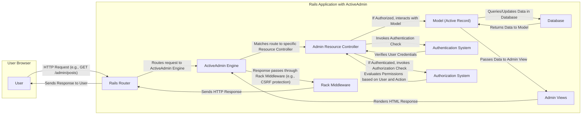

# Project Design Document: ActiveAdmin

**Version:** 1.1
**Date:** October 26, 2023
**Author:** AI Software Architecture Expert

## 1. Introduction

This document provides an enhanced design overview of the ActiveAdmin project, an administration framework for Ruby on Rails applications. This document is intended to serve as a robust foundation for subsequent threat modeling activities, providing a clear and detailed understanding of the system's architecture, components, and data flow. Improvements have been made to clarify certain aspects and add more detail relevant to security considerations.

## 2. Goals and Objectives

*   Clearly and comprehensively define the architecture and key components of ActiveAdmin.
*   Illustrate the typical user interaction and data flow within the framework, with specific attention to security-relevant interactions.
*   Identify and categorize potential areas of interest for security considerations and threat modeling, providing concrete examples.
*   Provide a comprehensive and actionable overview suitable for both technical and security stakeholders.

## 3. Target Audience

*   Security engineers and architects responsible for threat modeling, security assessments, and penetration testing.
*   Developers working with, extending, or maintaining ActiveAdmin implementations.
*   Operations teams responsible for deploying, configuring, and monitoring applications utilizing ActiveAdmin.

## 4. System Architecture

ActiveAdmin is a Ruby on Rails engine that provides a structured and configurable framework for building administration interfaces. It adheres to the Model-View-Controller (MVC) architectural pattern inherent in Rails and leverages its conventions.

*   **Rails Engine Integration:** ActiveAdmin is packaged and integrated as a Rails engine, seamlessly extending the functionality of a host Rails application without requiring significant modifications to the core application. This modular design allows for clear separation of concerns.
*   **Configuration via DSL:** The admin interface's structure, functionality, and behavior are primarily defined through a Ruby-based Domain Specific Language (DSL). This declarative approach simplifies configuration and allows developers to define resources, actions, display elements, and permissions within Ruby code.
*   **Resource-Centric Design:** ActiveAdmin's core concept revolves around managing application resources, which typically map to Active Record models. It provides standardized interfaces for performing CRUD operations on these resources.
*   **Extensible and Customizable UI:** While offering a default, functional user interface, ActiveAdmin is designed for significant customization. This includes the ability to modify layouts, apply custom stylesheets (CSS), and incorporate custom JavaScript for enhanced interactivity and branding.
*   **Delegation of Authentication and Authorization:** ActiveAdmin intentionally delegates authentication and authorization responsibilities to the underlying host Rails application. It provides well-defined extension points and adapters to integrate with popular authentication (e.g., Devise, Clearance) and authorization (e.g., Pundit, CanCanCan) gems. This promotes consistency and avoids reimplementing security logic.

## 5. Key Components

*   **Admin Dashboard:** The initial landing page of the administrative interface, providing a customizable overview with key metrics, recent activity, and navigation links to managed resources.
*   **Resource Controllers (Inherited):** Rails controllers dynamically generated by ActiveAdmin based on the configured resources. These controllers typically inherit from `ActiveAdmin::ResourceController`, providing a base set of actions for CRUD operations and customization hooks.
*   **Resource Views (Customizable):**  ERB (or other configured templating engine) files that define the HTML structure, layout, and presentation of the admin interface for each managed resource. These views are customizable to meet specific application requirements. Common views include `index`, `show`, `edit`, and `new`.
*   **Form Builders (Abstraction):** Components responsible for generating HTML forms used for creating and editing resource data. ActiveAdmin often integrates with form builder libraries like Formtastic, providing a more semantic and DRY way to define form fields and their attributes.
*   **Filtering Mechanisms:**  Built-in and customizable mechanisms to filter and search through resource data displayed on index pages. This often involves generating database queries based on user-provided filter criteria.
*   **Action Items (Contextual Actions):**  Custom buttons or links that can be added to resource pages (index, show, edit) to trigger specific, application-defined actions on individual or multiple resources.
*   **Batch Actions (Bulk Operations):**  Features allowing administrators to perform the same action on a selected group of resources. This requires careful security consideration to prevent unintended data modification or deletion.
*   **Navigation Menu (Configurable):**  A dynamically generated and configurable navigation menu that provides access to different admin resources and custom pages within the administrative interface.
*   **Authentication Adapter (Integration Point):** An interface or set of conventions that allows ActiveAdmin to seamlessly integrate with the host application's chosen authentication system. This ensures consistent user identity management.
*   **Authorization Adapter (Policy Enforcement):** An interface for integrating with the host application's authorization framework. This enables ActiveAdmin to enforce access control policies, determining which users can perform specific actions on resources.
*   **Configuration DSL (Declarative Definition):** Ruby code used to declaratively define admin resources, their attributes, associated actions, filtering options, form configurations, and other settings. This DSL is the primary way developers interact with and customize ActiveAdmin.
*   **Asset Pipeline Integration:** Leverages the Rails asset pipeline for managing and serving static assets such as CSS stylesheets, JavaScript files, and images used within the admin interface.

## 6. Data Flow

The following diagram illustrates a typical user interaction flow within ActiveAdmin, highlighting security-relevant steps:

**Detailed Flow:**

1. **User Initiates Request:** A user interacts with the ActiveAdmin interface via their web browser, sending an HTTP request (e.g., `GET /admin/posts` to view a list of posts, `POST /admin/posts` to create a new post).
2. **Rails Routing:** The Rails Router receives the incoming request and, based on the defined routes, directs it to the ActiveAdmin engine.
3. **ActiveAdmin Engine Processing:** The ActiveAdmin engine intercepts the request and matches it to the appropriate Admin Resource Controller based on the URL and configured routes.
4. **Authentication Check:** The Admin Resource Controller initiates an authentication check, typically by interacting with the configured Authentication System (e.g., Devise). This verifies the user's identity.
5. **Credential Verification:** The Authentication System validates the provided credentials (e.g., username and password, session token).
6. **Authorization Check (Conditional):** If authentication is successful, the controller proceeds to an authorization check by interacting with the configured Authorization System (e.g., Pundit).
7. **Permission Evaluation:** The Authorization System evaluates whether the authenticated user has the necessary permissions to perform the requested action on the target resource. This is based on defined policies and user roles.
8. **Model Interaction (Conditional):** If the user is authorized, the controller interacts with the relevant Active Record model to retrieve or manipulate data from the database.
9. **Database Interaction:** The Active Record model executes database queries (e.g., `SELECT`, `INSERT`, `UPDATE`, `DELETE`) against the database.
10. **Data Retrieval/Update:** The database returns the requested data or acknowledges the data modification to the model.
11. **View Rendering:** The controller passes the retrieved data (or confirmation of action) to the appropriate Admin View.
12. **HTML Response Generation:** The Admin View uses the configured templating engine (e.g., ERB) to generate the HTML markup for the response.
13. **Rack Middleware Processing:** The generated HTTP response passes through the Rack middleware stack. This is where security-related middleware (e.g., for CSRF protection, content security policy) can process the request or response.
14. **Response Delivery:** The Rails application sends the generated HTTP response back through the Rails Router to the user's browser.
15. **User Interface Update:** The user's browser renders the HTML, updating the administrative interface.

## 7. Security Considerations (Detailed)

This section provides a more detailed breakdown of potential security considerations, categorized for clarity during threat modeling.

*   **Authentication and Session Management:**
    *   **Insecure Integration:** Vulnerabilities arising from improper integration with the host application's authentication system (e.g., bypassing authentication checks).
    *   **Weak Session Management:** Risks associated with insecure session handling, such as session fixation, session hijacking, or predictable session IDs.
    *   **Insufficient Authentication Strength:** Use of weak or default credentials, lack of multi-factor authentication for privileged admin accounts.
*   **Authorization and Access Control:**
    *   **Authorization Bypass:** Flaws in the authorization logic or configuration allowing unauthorized users to access or modify resources.
    *   **Granularity Issues:**  Insufficiently granular authorization controls, leading to over-permissioning of admin users.
    *   **Privilege Escalation:** Vulnerabilities allowing a user with limited privileges to gain access to higher-level administrative functions.
*   **Input Validation and Output Encoding:**
    *   **Cross-Site Scripting (XSS):**  Failure to properly encode user-supplied input when rendering admin views, allowing injection of malicious scripts.
    *   **SQL Injection:** Vulnerabilities arising from unsanitized user input being directly incorporated into database queries. While ActiveRecord offers some protection, raw SQL or poorly constructed queries can still be vulnerable.
    *   **Cross-Site Request Forgery (CSRF):**  Lack of or improper CSRF protection on admin forms and actions, allowing attackers to perform actions on behalf of authenticated users.
    *   **Mass Assignment Vulnerabilities:**  Unprotected model attributes allowing attackers to modify sensitive data by manipulating request parameters.
*   **Data Protection and Information Disclosure:**
    *   **Exposure of Sensitive Data:**  Accidental disclosure of sensitive information through error messages, debug logs, or improperly secured views.
    *   **Insecure Data Storage:**  Storing sensitive data in the database without proper encryption or masking.
    *   **Insufficient Logging and Auditing:**  Lack of comprehensive logging of administrative actions, hindering incident response and forensic analysis.
*   **Third-Party Dependencies:**
    *   **Vulnerable Gems:** Security vulnerabilities in ActiveAdmin itself or its dependencies (e.g., Formtastic, Ransack, authentication/authorization gems). Keeping dependencies updated is crucial.
    *   **Supply Chain Attacks:** Risks associated with compromised third-party libraries or components.
*   **Operational Security:**
    *   **Insecure Deployment Configurations:**  Misconfigured web servers, databases, or operating systems hosting the ActiveAdmin interface.
    *   **Lack of Security Headers:**  Absence of security-related HTTP headers (e.g., Content Security Policy, HTTP Strict Transport Security) that can mitigate certain attacks.
    *   **Insufficient Monitoring and Alerting:**  Lack of monitoring for suspicious activity or security incidents within the admin interface.
*   **Specific ActiveAdmin Features:**
    *   **Batch Actions Security:**  Potential for misuse of batch actions to perform unauthorized bulk modifications or deletions. Proper authorization and auditing are essential.
    *   **File Upload Vulnerabilities:**  Risks associated with file upload functionality within the admin interface, such as uploading malware or exploiting path traversal vulnerabilities.
    *   **Search and Filtering Exploits:**  Potential for denial-of-service or information disclosure through maliciously crafted search or filter queries.

## 8. Deployment Considerations

Secure deployment practices are paramount for protecting ActiveAdmin interfaces:

*   **Enforce HTTPS:**  Mandatory use of HTTPS (TLS/SSL) for all communication with the admin interface to encrypt data in transit and prevent eavesdropping.
*   **Network Segmentation:** Isolate the administrative interface within a secure network segment, restricting access to authorized personnel and systems.
*   **Strong Access Controls:** Implement robust access control mechanisms (e.g., firewalls, VPNs) to limit network access to the admin interface.
*   **Regular Security Updates:**  Maintain up-to-date versions of the Rails application, ActiveAdmin gem, all dependencies, and the underlying operating system and web server to patch known vulnerabilities.
*   **Secure Server Configuration:**  Harden the web server (e.g., Puma, Unicorn) and database configurations according to security best practices.
*   **Web Application Firewall (WAF):** Consider deploying a WAF to provide an additional layer of protection against common web attacks.
*   **Regular Security Audits and Penetration Testing:** Conduct periodic security assessments and penetration tests to identify and address potential vulnerabilities.

## 9. Technologies Used

*   **Ruby on Rails:** The foundational web application framework providing the MVC structure and core functionalities.
*   **Ruby Programming Language:** The language in which ActiveAdmin and the host application are primarily written.
*   **HTML, CSS, JavaScript:**  Standard web technologies used for rendering the user interface and adding interactivity.
*   **ERB (or alternative templating engine):**  Used for generating dynamic HTML views within the admin interface.
*   **Active Record (ORM):**  Rails' Object-Relational Mapper, facilitating interaction with the database.
*   **Formtastic (Optional):** A semantic form builder library that simplifies the creation of HTML forms.
*   **Ransack (Optional):** A powerful search library that can be integrated for advanced filtering and searching capabilities.
*   **Authentication Libraries (e.g., Devise, Clearance):**  Used for handling user authentication and session management.
*   **Authorization Libraries (e.g., Pundit, CanCanCan):**  Used for implementing authorization logic and controlling access to resources and actions.
*   **Database (e.g., PostgreSQL, MySQL, SQLite):**  The persistent data store for the application.
*   **Web Server (e.g., Puma, Unicorn):**  The application server responsible for handling HTTP requests.

## 10. Future Considerations

*   **API Integration Security:** If ActiveAdmin is extended to interact with external APIs, security considerations around API authentication, authorization, and data transfer will be crucial.
*   **Real-time Features Security:**  The introduction of real-time features using technologies like WebSockets would require careful consideration of WebSocket security, including authentication and authorization for socket connections.
*   **Advanced Customization Security:** As the level of customization increases (e.g., custom dashboard widgets, complex JavaScript interactions), the potential for introducing security vulnerabilities grows, requiring thorough code review and testing.
*   **Integration with Security Scanning Tools:**  Exploring ways to integrate ActiveAdmin configurations and code with static and dynamic application security testing (SAST/DAST) tools to automate vulnerability detection.

This enhanced design document provides a more comprehensive and detailed understanding of ActiveAdmin, specifically tailored for effective threat modeling. By considering the architecture, data flow, and detailed security considerations, security professionals can more effectively identify and mitigate potential risks associated with ActiveAdmin implementations.