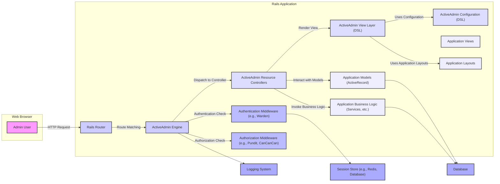

## Project Design Document: ActiveAdmin (Improved)

**1. Introduction**

This document provides an enhanced and more detailed design overview of the ActiveAdmin project, a powerful administration framework for Ruby on Rails applications. This revised document is specifically tailored to facilitate comprehensive threat modeling activities. It elaborates on the key components, architecture, data flow, and technologies involved in ActiveAdmin, with a stronger focus on security considerations.

**2. Project Overview**

ActiveAdmin is a Ruby on Rails engine designed to streamline the creation of sophisticated administration interfaces for web applications. It significantly reduces the development effort required for building admin panels by automating common functionalities such as CRUD operations, advanced filtering and searching, customizable dashboards, and integration with authentication and authorization systems within the administrative context. ActiveAdmin's architecture emphasizes configurability and extensibility, enabling developers to tailor the admin interface to the unique requirements of their applications.

**3. System Architecture**

ActiveAdmin is implemented as a modular Rails engine, allowing it to be seamlessly integrated into a parent Rails application. This design promotes a clear separation of concerns, isolating the administrative functionality from the core application logic.

**4. Component Breakdown**

*   **Rails Router:**  The entry point for all web requests. It interprets incoming URLs and directs them to the appropriate controllers, including those defined within the ActiveAdmin engine. This component is crucial for defining the administrative namespace (typically `/admin`).
*   **ActiveAdmin Engine:** The core component encapsulating all ActiveAdmin functionality. It manages routing within the admin namespace, dispatches requests to specific resource controllers, and orchestrates the rendering of admin views. It also integrates with authentication and authorization mechanisms.
*   **ActiveAdmin Resource Controllers:**  Controllers generated or defined for each managed resource (e.g., UsersController, PostsController within the admin context). These controllers inherit from ActiveAdmin base controllers and handle actions like index, show, new, create, edit, update, and destroy for the corresponding application models. They often contain custom logic for filtering, searching, and data manipulation specific to the admin interface.
*   **ActiveAdmin View Layer (DSL):**  ActiveAdmin provides a Domain Specific Language (DSL) for defining the structure and presentation of the admin interface. This includes defining index pages (tables), form layouts, show pages, and custom dashboards. The DSL simplifies the creation of consistent and feature-rich admin views.
*   **ActiveAdmin Configuration (DSL):**  Another key DSL within ActiveAdmin used to configure how each resource is managed. This includes specifying which attributes are displayed, which filters are available, which actions are permitted, and defining custom member or collection actions. This configuration drives the behavior of the resource controllers and view layer.
*   **Application Models (ActiveRecord):** The core data models of the main Rails application, typically inheriting from `ActiveRecord::Base`. ActiveAdmin interacts with these models to perform CRUD operations and display data in the admin interface. Security considerations around model attributes and relationships are relevant here.
*   **Application Business Logic (Services, etc.):**  While ActiveAdmin primarily focuses on data management, admin actions might trigger more complex business logic encapsulated in service objects, POROs (Plain Old Ruby Objects), or other parts of the application.
*   **Application Views:** Views belonging to the main Rails application, distinct from the ActiveAdmin views. ActiveAdmin can sometimes integrate elements from the main application's views or layouts.
*   **Application Layouts:**  The overall visual structure of the Rails application. ActiveAdmin often uses its own layouts but might inherit or integrate with elements from the main application's layouts.
*   **Authentication Middleware (e.g., Warden):**  Middleware responsible for verifying the identity of the administrator accessing the admin interface. Gems like Devise often utilize Warden. This component is critical for ensuring only authenticated users can access the admin panel.
*   **Authorization Middleware (e.g., Pundit, CanCanCan):** Middleware that enforces access control policies, determining what actions an authenticated administrator is permitted to perform on specific resources. This component is crucial for preventing unauthorized data manipulation or access.
*   **Database:** The persistent storage for the application's data. ActiveAdmin interacts with the database through the application's models.
*   **Session Store (e.g., Redis, Database):**  Used to store session data for authenticated administrators, maintaining their logged-in state. Security of the session store is important to prevent session hijacking.
*   **Logging System:**  Rails applications typically have a logging system to record events, including actions performed within the ActiveAdmin interface. This is valuable for auditing and security monitoring.

**5. Data Flow (Detailed)**

A typical data flow for an administrator interacting with ActiveAdmin involves the following steps:

1. **Administrator Action:** An administrator user interacts with the web browser, initiating an action within the ActiveAdmin interface (e.g., clicking a link, submitting a form).
2. **HTTP Request:** The browser sends an HTTP request (GET, POST, PUT, DELETE) to the Rails application.
3. **Rails Router:** The **Rails Router** receives the request and matches the URL against its defined routes. If the URL falls under the ActiveAdmin namespace (e.g., `/admin/users`), it's routed to the **ActiveAdmin Engine**.
4. **Authentication Check:** The **ActiveAdmin Engine** (or a preceding middleware like Warden) intercepts the request and checks if the user is authenticated. This typically involves verifying the presence and validity of a session cookie against the **Session Store**. If not authenticated, the user is redirected to the login page.
5. **Authorization Check:** Once authenticated, the **ActiveAdmin Engine** (or an authorization middleware like Pundit or CanCanCan) checks if the authenticated user has the necessary permissions to perform the requested action on the specific resource. This involves evaluating authorization policies based on the user's roles and the resource being accessed. If unauthorized, an error is typically displayed.
6. **Controller Action:** If both authentication and authorization pass, the request is dispatched to the appropriate **ActiveAdmin Resource Controller** action (e.g., `UsersController#index`, `PostsController#create`).
7. **Data Interaction:** The controller action interacts with the **Application Models (ActiveRecord)** to retrieve, create, update, or delete data from the **Database**. This might involve querying the database, performing data validation, and persisting changes.
8. **Business Logic Invocation (Optional):** The controller action might invoke **Application Business Logic** components (services, etc.) to perform more complex operations or orchestrate interactions with other parts of the application.
9. **View Rendering:** The controller action prepares the necessary data and selects the appropriate **ActiveAdmin View Layer (DSL)** template to render the response. The view uses the **ActiveAdmin Configuration (DSL)** to determine how the data should be displayed. It might also utilize **Application Layouts** for the overall page structure.
10. **HTTP Response:** The rendered HTML (or other format) is sent back to the administrator's web browser as an HTTP response.
11. **Logging:** Throughout the process, actions and events might be logged by the **Logging System** for auditing and monitoring purposes.

**6. Key Technologies**

*   **Ruby on Rails:** The foundational web application framework.
*   **Ruby:** The programming language.
*   **HTML:** For structuring web content.
*   **CSS:** For styling the user interface.
*   **JavaScript:** For enhancing interactivity and dynamic behavior.
*   **SQL (or NoSQL):** The database query language.
*   **Devise (or similar):** A popular authentication gem.
*   **Pundit/CanCanCan (or similar):** Authorization gems.
*   **RSpec/Minitest:** Testing frameworks.
*   **Warden:**  A general Rack authentication framework often used by Devise.
*   **Rack:**  A modular interface between web servers and Ruby frameworks.

**7. Deployment Model**

ActiveAdmin is deployed as an integral part of its parent Ruby on Rails application. The deployment process mirrors that of a standard Rails application and can utilize various platforms:

*   **Platform as a Service (PaaS):** Heroku, Render, Fly.io.
*   **Cloud Providers:** AWS (Elastic Beanstalk, EC2, ECS), Google Cloud Platform (App Engine, Compute Engine, Kubernetes Engine), Azure.
*   **Containerization:** Docker, Kubernetes.
*   **Traditional Server Deployments:** Using tools like Capistrano.

The security of the deployment environment is crucial, including secure server configurations, network security, and access controls.

**8. Security Considerations (Detailed)**

*   **Authentication Bypass:** Ensuring robust authentication mechanisms are in place to prevent unauthorized access to the admin interface. This includes strong password policies, multi-factor authentication (MFA), and protection against brute-force attacks.
*   **Authorization Vulnerabilities:**  Carefully defining and enforcing authorization rules to prevent privilege escalation and unauthorized actions. This involves granular permission management and thorough testing of authorization policies.
*   **Cross-Site Scripting (XSS):**  Sanitizing user inputs and encoding output in ActiveAdmin views to prevent the injection of malicious scripts. This includes both stored and reflected XSS vulnerabilities.
*   **Cross-Site Request Forgery (CSRF):**  Leveraging Rails' built-in CSRF protection mechanisms to prevent attackers from forging requests on behalf of authenticated administrators.
*   **SQL Injection:**  Protecting against SQL injection vulnerabilities when ActiveAdmin interacts with the database. This involves using parameterized queries and avoiding direct concatenation of user input into SQL statements.
*   **Mass Assignment Vulnerabilities:**  Carefully controlling which model attributes can be updated through ActiveAdmin forms to prevent unintended data modification. Using `strong_parameters` in controllers is crucial.
*   **Insecure Direct Object References (IDOR):**  Ensuring that administrators can only access and manipulate resources they are authorized to access, preventing them from directly accessing resources by manipulating IDs or other identifiers.
*   **Session Management Weaknesses:**  Implementing secure session management practices, including using secure cookies, setting appropriate session timeouts, and protecting against session fixation and hijacking.
*   **Dependency Vulnerabilities:**  Regularly updating the ActiveAdmin gem and its dependencies to patch known security vulnerabilities. Using tools like `bundler-audit` can help identify vulnerable dependencies.
*   **Information Disclosure:**  Preventing the exposure of sensitive information through error messages, logs, or publicly accessible files.
*   **Denial of Service (DoS):**  Considering potential DoS attack vectors against the admin interface and implementing appropriate mitigations, such as rate limiting.
*   **Insecure File Uploads:** If ActiveAdmin allows file uploads, implementing robust validation and sanitization to prevent the upload of malicious files.
*   **Logging and Monitoring:**  Implementing comprehensive logging of administrative actions for security auditing and incident response.

**9. Threat Landscape**

The ActiveAdmin interface, by its nature, provides privileged access to sensitive data and application functionality. Therefore, the threat landscape includes:

*   **Malicious Insiders:**  Administrators with malicious intent.
*   **Compromised Administrator Accounts:** Attackers gaining access through phishing, credential stuffing, or other means.
*   **External Attackers:**  Exploiting vulnerabilities in the ActiveAdmin interface or underlying application to gain unauthorized access.

**10. Future Considerations**

*   Enhanced integration with more granular and flexible authorization frameworks.
*   Improvements to the user interface and user experience, particularly around accessibility.
*   More robust support for complex data relationships and data visualization within the admin interface.
*   Further enhancements to security features and built-in security best practices.
*   Improved API for extending and customizing ActiveAdmin functionality.

This improved design document provides a more detailed and security-focused overview of the ActiveAdmin project. It serves as a stronger foundation for conducting thorough threat modeling exercises and identifying potential security vulnerabilities.