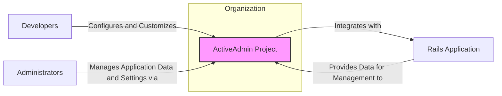
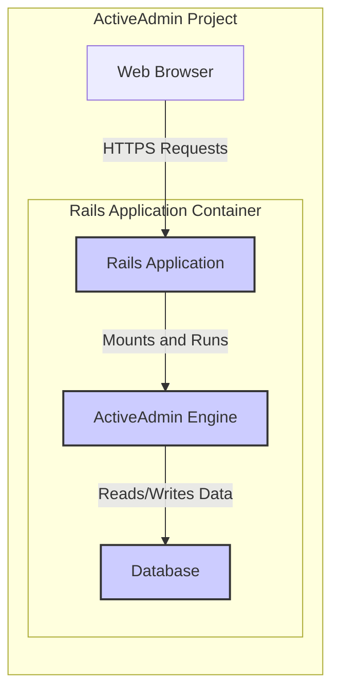
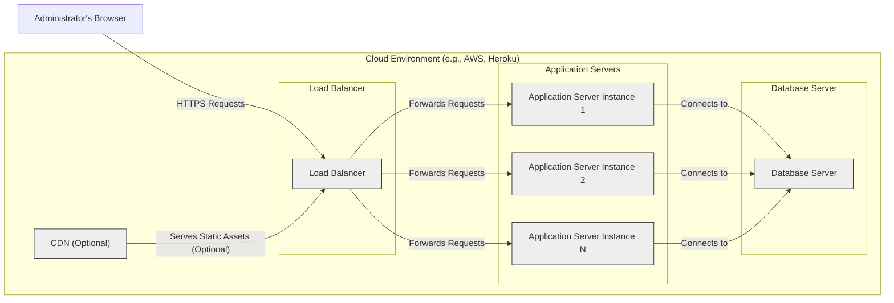

# BUSINESS POSTURE

This project, ActiveAdmin, aims to provide a rapid application development framework for creating administration interfaces within Ruby on Rails applications. The primary business priority is to significantly reduce the time and effort required to build and maintain administrative panels, allowing developers to focus on core application features. This framework targets businesses that need to manage data, users, and application settings through a user-friendly web interface.

Key business goals include:
- Accelerating the development of administrative interfaces.
- Providing a standardized and maintainable solution for admin panels.
- Empowering developers to quickly create feature-rich admin interfaces without extensive custom coding.
- Reducing the overall cost of developing and maintaining administrative functionalities.

The most important business risks associated with ActiveAdmin are:
- Security vulnerabilities in the framework could expose sensitive application data and functionalities to unauthorized access.
- Poorly configured or misused ActiveAdmin instances could lead to data breaches or operational disruptions.
- Dependency on an open-source project introduces a risk of delayed security updates or project abandonment, although ActiveAdmin is a mature and actively maintained project.
- Complexity of customization might lead to inconsistent security implementations across different projects using ActiveAdmin.

# SECURITY POSTURE

Existing security controls:
- security control: Authentication - ActiveAdmin provides built-in authentication mechanisms, often integrated with Rails authentication solutions like Devise. Implemented within ActiveAdmin framework and configurable in Rails application.
- security control: Authorization - ActiveAdmin includes authorization features to control access to resources and actions based on user roles or permissions. Implemented within ActiveAdmin framework and configurable in Rails application.
- security control: Input validation - Rails framework provides default input validation mechanisms, and ActiveAdmin leverages these for data handling within the admin interface. Implemented by Rails framework and used by ActiveAdmin.
- security control: Secure password storage - Rails framework encourages secure password storage practices, and ActiveAdmin relies on these practices when handling user credentials. Implemented by Rails framework and used by ActiveAdmin.
- accepted risk: Reliance on underlying Rails application security - ActiveAdmin's security is heavily dependent on the security of the underlying Rails application and its configurations.
- accepted risk: Open-source nature - Security vulnerabilities might be discovered and publicly disclosed before patches are available.

Recommended security controls:
- security control: Regular security audits and penetration testing of applications using ActiveAdmin to identify and address potential vulnerabilities.
- security control: Implementation of Content Security Policy (CSP) to mitigate risks of Cross-Site Scripting (XSS) attacks.
- security control: Rate limiting and throttling on login attempts and sensitive admin actions to prevent brute-force attacks.
- security control: Security scanning of dependencies to identify and mitigate vulnerabilities in third-party libraries used by ActiveAdmin and the Rails application.
- security control: Secure configuration management for ActiveAdmin and the underlying Rails application, including secure storage of secrets and API keys.

Security requirements:
- Authentication:
  - Requirement: Securely authenticate administrators accessing the ActiveAdmin interface.
  - Requirement: Support multi-factor authentication (MFA) for enhanced security.
  - Requirement: Implement strong password policies and enforce regular password changes.
- Authorization:
  - Requirement: Implement role-based access control (RBAC) to manage administrator permissions.
  - Requirement: Ensure granular authorization checks for accessing resources and performing actions within ActiveAdmin.
  - Requirement: Regularly review and update administrator roles and permissions.
- Input validation:
  - Requirement: Validate all user inputs within ActiveAdmin to prevent injection attacks (e.g., SQL injection, XSS).
  - Requirement: Sanitize user inputs before displaying them in the admin interface to prevent XSS.
  - Requirement: Implement proper error handling to avoid leaking sensitive information in error messages.
- Cryptography:
  - Requirement: Use HTTPS for all communication between administrators' browsers and the ActiveAdmin interface to protect data in transit.
  - Requirement: Securely store sensitive data at rest, such as API keys or configuration secrets, using encryption.
  - Requirement: Utilize strong cryptographic algorithms and libraries provided by the Rails framework and underlying Ruby environment.

# DESIGN

## C4 CONTEXT

### Context Diagram Elements

- Name: ActiveAdmin Project
  - Type: Software System
  - Description: A Ruby on Rails framework that provides tools for rapidly building administration interfaces for web applications. It simplifies the creation of admin panels for managing data, users, and application settings.
  - Responsibilities:
    - Generate admin interfaces based on application models and configurations.
    - Provide authentication and authorization mechanisms for admin access.
    - Offer UI components for data management, dashboards, and reporting.
    - Integrate with the underlying Rails application to access and manipulate data.
  - Security controls:
    - Security control: Authentication and authorization mechanisms to control access.
    - Security control: Input validation and output sanitization to prevent injection attacks.
    - Security control: Integration with Rails security features.

- Name: Developers
  - Type: Person
  - Description: Software developers who use ActiveAdmin to build and customize administration interfaces for their Rails applications.
  - Responsibilities:
    - Configure and customize ActiveAdmin to meet specific application requirements.
    - Integrate ActiveAdmin into existing Rails applications.
    - Ensure secure configuration and usage of ActiveAdmin.
  - Security controls:
    - Security control: Secure development practices when customizing ActiveAdmin.
    - Security control: Code reviews and testing of ActiveAdmin configurations.

- Name: Administrators
  - Type: Person
  - Description: Users who access the ActiveAdmin interface to manage application data, users, and settings.
  - Responsibilities:
    - Manage application data and settings through the ActiveAdmin interface.
    - Monitor application status and performance using ActiveAdmin dashboards.
    - Maintain the security of their administrator accounts.
  - Security controls:
    - Security control: Strong password management.
    - Security control: Adherence to organization's security policies.

- Name: Rails Application
  - Type: Software System
  - Description: The underlying Ruby on Rails web application that ActiveAdmin is integrated into. ActiveAdmin relies on the Rails application for data models, routing, and core functionalities.
  - Responsibilities:
    - Provide data and functionalities for ActiveAdmin to manage.
    - Handle core application logic and business processes.
    - Implement overall application security measures.
  - Security controls:
    - Security control: Rails framework security features (e.g., CSRF protection, parameter sanitization).
    - Security control: Application-level security controls implemented by developers.

## C4 CONTAINER

### Container Diagram Elements

- Name: Rails Application Container
  - Type: Application Runtime Environment
  - Description: The Ruby on Rails application runtime environment, typically a web server like Puma or Unicorn running the Rails application. This container hosts both the core application and the ActiveAdmin engine.
  - Responsibilities:
    - Execute the Rails application code and handle HTTP requests.
    - Manage application dependencies and configurations.
    - Provide a runtime environment for ActiveAdmin.
  - Security controls:
    - security control: Web server security configurations (e.g., TLS/SSL configuration).
    - security control: Operating system and runtime environment security hardening.
    - security control: Web Application Firewall (WAF) in front of the application.

- Name: ActiveAdmin Engine
  - Type: Web Application Engine/Gem
  - Description: The ActiveAdmin Ruby gem integrated into the Rails application. It provides the core logic, UI components, and functionalities of the admin interface. It runs within the Rails application container.
  - Responsibilities:
    - Generate admin interfaces based on Rails models and configurations.
    - Handle user authentication and authorization within the admin panel.
    - Process user requests and interact with the database.
    - Render UI components and manage user interactions.
  - Security controls:
    - security control: ActiveAdmin's built-in authentication and authorization mechanisms.
    - security control: Input validation and output encoding within ActiveAdmin code.
    - security control: Dependency vulnerability scanning of ActiveAdmin gem and its dependencies.

- Name: Database
  - Type: Data Store
  - Description: The database system used by the Rails application to store application data. ActiveAdmin interacts with this database to manage and display data in the admin interface.
  - Responsibilities:
    - Store and retrieve application data.
    - Enforce data integrity and consistency.
    - Provide data access to the Rails application and ActiveAdmin.
  - Security controls:
    - security control: Database access controls and authentication.
    - security control: Database encryption at rest and in transit.
    - security control: Regular database backups and security audits.

- Name: Web Browser
  - Type: Client Application
  - Description: The web browser used by administrators to access the ActiveAdmin interface.
  - Responsibilities:
    - Render the ActiveAdmin user interface.
    - Send HTTP requests to the Rails application.
    - Display data and interact with the admin panel.
  - Security controls:
    - security control: Browser security features (e.g., Content Security Policy enforcement).
    - security control: User awareness of phishing and other browser-based attacks.

## DEPLOYMENT

Deployment Solution: Cloud-based Deployment on Platform as a Service (PaaS) like Heroku or AWS Elastic Beanstalk.

### Deployment Diagram Elements

- Name: Load Balancer
  - Type: Network Component
  - Description: Distributes incoming HTTPS traffic across multiple application server instances to ensure high availability and scalability.
  - Responsibilities:
    - Load balancing of incoming requests.
    - TLS/SSL termination.
    - Health checks for application server instances.
  - Security controls:
    - security control: DDoS protection.
    - security control: TLS/SSL configuration and certificate management.
    - security control: Access control lists (ACLs) to restrict access.

- Name: Application Server Instance (1, 2, N)
  - Type: Compute Instance
  - Description: Virtual machines or containers running the Rails application and ActiveAdmin engine. Multiple instances are used for redundancy and scalability.
  - Responsibilities:
    - Run the Rails application and ActiveAdmin.
    - Process HTTP requests.
    - Interact with the database.
  - Security controls:
    - security control: Operating system and application runtime hardening.
    - security control: Security patching and updates.
    - security control: Instance-level firewalls.

- Name: Database Server
  - Type: Data Store Instance
  - Description: Managed database service (e.g., AWS RDS, Heroku Postgres) storing the application data.
  - Responsibilities:
    - Store and manage application data.
    - Ensure data persistence and availability.
    - Handle database backups and recovery.
  - Security controls:
    - security control: Database access controls and authentication.
    - security control: Database encryption at rest and in transit.
    - security control: Regular security audits and patching of the database server.

- Name: CDN (Optional)
  - Type: Content Delivery Network
  - Description: Optional CDN to cache and serve static assets (e.g., images, CSS, JavaScript) closer to administrators, improving performance.
  - Responsibilities:
    - Cache and serve static content.
    - Reduce latency for static asset delivery.
    - Offload traffic from application servers.
  - Security controls:
    - security control: CDN security configurations (e.g., access controls, TLS/SSL).
    - security control: Protection against CDN-specific attacks.

- Name: Administrator's Browser
  - Type: Client Application
  - Description: Web browser used by administrators to access ActiveAdmin.
  - Responsibilities:
    - Render ActiveAdmin UI.
    - Send requests and receive responses.
  - Security controls:
    - security control: Browser security features.
    - security control: User security awareness.

## BUILD

```mermaid
flowchart LR
    A["Developer"];
    B["Version Control System (e.g., GitHub)"];
    C["CI/CD Pipeline (e.g., GitHub Actions)"];
    D["Build Artifacts (e.g., Docker Image, Gems)"];
    E["Container Registry (e.g., Docker Hub) / Gem Repository"];
    F["Deployment Environment"];

    A -- "Code Changes" --> B
    B -- "Triggers Build" --> C
    C -- "Builds & Tests" --> D
    C -- "Security Scans (SAST, Dependency)" --> D
    D -- "Pushes Artifacts" --> E
    E -- "Pulls Artifacts" --> F

    style A fill:#eee,stroke:#333,stroke-width:1px
    style B fill:#eee,stroke:#333,stroke-width:1px
    style C fill:#eee,stroke:#333,stroke-width:1px
    style D fill:#eee,stroke:#333,stroke-width:1px
    style E fill:#eee,stroke:#333,stroke-width:1px
    style F fill:#eee,stroke:#333,stroke-width:1px
```

### Build Diagram Elements

- Name: Developer
  - Type: Person
  - Description: Software developer writing and modifying the ActiveAdmin codebase or applications using ActiveAdmin.
  - Responsibilities:
    - Write and commit code changes.
    - Perform local testing.
    - Adhere to coding standards and security best practices.
  - Security controls:
    - security control: Secure coding practices training.
    - security control: Code reviews before committing changes.
    - security control: Local development environment security.

- Name: Version Control System (e.g., GitHub)
  - Type: Code Repository
  - Description: Central repository for storing and managing the source code of ActiveAdmin and applications using it.
  - Responsibilities:
    - Store code versions and history.
    - Manage code branches and merges.
    - Trigger CI/CD pipelines on code changes.
  - Security controls:
    - security control: Access control and authentication for code repository.
    - security control: Branch protection and code review requirements.
    - security control: Audit logging of code changes.

- Name: CI/CD Pipeline (e.g., GitHub Actions)
  - Type: Automation System
  - Description: Automated system for building, testing, and deploying ActiveAdmin or applications using it.
  - Responsibilities:
    - Automate build process.
    - Run automated tests (unit, integration, security).
    - Perform security scans (SAST, dependency checks).
    - Package build artifacts.
    - Deploy to target environments.
  - Security controls:
    - security control: Secure configuration of CI/CD pipeline.
    - security control: Secrets management within CI/CD pipeline.
    - security control: Security scanning tools integration (SAST, dependency scanning).

- Name: Build Artifacts (e.g., Docker Image, Gems)
  - Type: Software Package
  - Description: Packaged software components produced by the build process, ready for deployment.
  - Responsibilities:
    - Contain compiled code, dependencies, and configurations.
    - Be deployable to target environments.
    - Be securely stored and managed.
  - Security controls:
    - security control: Signing and verification of build artifacts.
    - security control: Vulnerability scanning of build artifacts.
    - security control: Secure storage of build artifacts.

- Name: Container Registry (e.g., Docker Hub) / Gem Repository
  - Type: Artifact Repository
  - Description: Repository for storing and distributing build artifacts like Docker images or Ruby Gems.
  - Responsibilities:
    - Store and manage build artifacts.
    - Provide access to artifacts for deployment.
    - Ensure artifact integrity and availability.
  - Security controls:
    - security control: Access control and authentication for artifact repository.
    - security control: Vulnerability scanning of stored artifacts.
    - security control: Secure storage and transfer of artifacts.

- Name: Deployment Environment
  - Type: Target Infrastructure
  - Description: Target environment where ActiveAdmin application is deployed and running (e.g., Cloud environment, on-premises servers).
  - Responsibilities:
    - Run the application.
    - Provide runtime environment and resources.
    - Ensure application availability and performance.
  - Security controls:
    - security control: Infrastructure security controls (as described in Deployment section).
    - security control: Runtime environment security hardening.
    - security control: Monitoring and logging of deployed application.

# RISK ASSESSMENT

Critical business processes protected by ActiveAdmin:
- Data Management: ActiveAdmin is used to manage core application data, including creation, reading, updating, and deletion of records. This is crucial for the application's functionality and business operations.
- User Management: ActiveAdmin often manages user accounts, roles, and permissions, which is essential for controlling access to the application and its data.
- System Configuration: ActiveAdmin can be used to configure application settings and parameters, impacting the overall system behavior and business logic.
- Monitoring and Reporting: ActiveAdmin dashboards may provide insights into application performance and business metrics, supporting operational monitoring and decision-making.

Data being protected and their sensitivity:
- Application Data: The core data managed by the application, which varies depending on the application's purpose. Sensitivity depends on the nature of the data (e.g., customer data, financial records, health information). Sensitivity can range from low to high.
- User Credentials: Administrator usernames and passwords used to access ActiveAdmin. High sensitivity, as compromise can lead to unauthorized access and data breaches.
- Configuration Data: Application settings and parameters managed through ActiveAdmin. Sensitivity depends on the nature of the configuration (e.g., API keys, database connection strings). Sensitivity can range from medium to high.
- Audit Logs: Logs generated by ActiveAdmin and the application, recording administrator actions and system events. Medium sensitivity, as they can contain information about system usage and potential security incidents.

# QUESTIONS & ASSUMPTIONS

Questions:
- What is the specific sensitivity level of the data being managed through ActiveAdmin in the target application?
- What are the specific compliance requirements (e.g., GDPR, HIPAA, PCI DSS) that the application and ActiveAdmin need to adhere to?
- What is the expected user base and administrator roles for the ActiveAdmin interface?
- Are there any specific security features or integrations that are already in place in the target Rails application?
- What is the organization's risk appetite regarding open-source software and security vulnerabilities?

Assumptions:
- BUSINESS POSTURE: The primary business goal is rapid development and ease of use of admin interfaces, with security being a secondary but important consideration.
- SECURITY POSTURE: The application using ActiveAdmin is a web application handling sensitive data, requiring a strong security posture for the admin interface. Standard Rails security best practices are assumed to be in place.
- DESIGN: ActiveAdmin is deployed as part of a standard Ruby on Rails application in a cloud environment using a PaaS platform. The build process involves a typical CI/CD pipeline with security scanning.