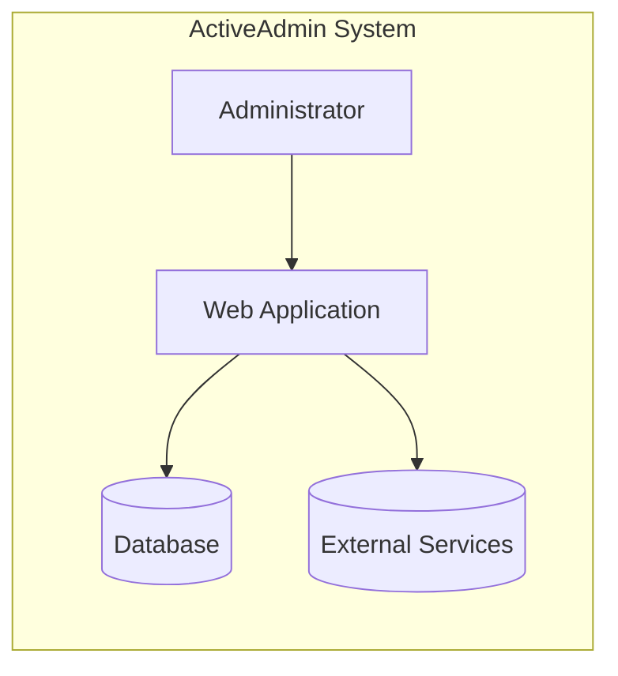
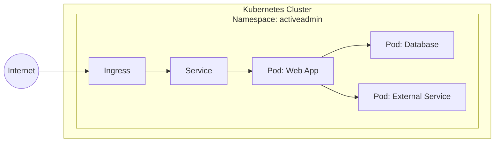
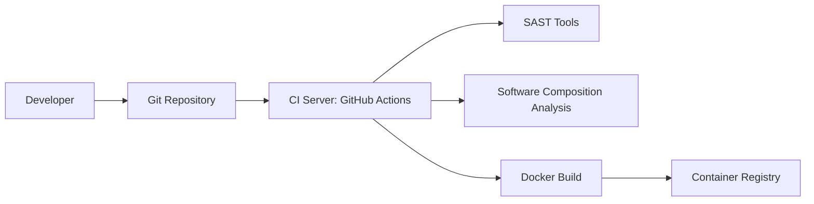

Okay, let's create a design document for the Active Admin project.

# BUSINESS POSTURE

Active Admin is a Ruby on Rails framework for creating elegant back-office-style administration interfaces.  It abstracts common business application patterns to make it simple for developers to implement beautiful and elegant interfaces with very little effort.

Priorities:

*   Ease of Use:  Enable developers to quickly and easily build admin interfaces.
*   Customizability: Allow extensive customization to fit specific business needs.
*   Maintainability:  Provide a stable and well-maintained framework.
*   Extensibility: Allow the addition of new features and integrations via plugins.
*   Convention over Configuration: Reduce the amount of boilerplate code needed.

Goals:

*   Reduce development time for admin interfaces.
*   Provide a consistent and user-friendly experience for administrators.
*   Improve developer productivity.
*   Offer a robust and reliable solution for managing application data and users.

Business Risks:

*   Data breaches: Unauthorized access to sensitive data managed through the admin interface.
*   Privilege escalation:  Exploitation of vulnerabilities to gain higher-level access than intended.
*   Data manipulation:  Unauthorized modification or deletion of data.
*   Denial of service:  Attacks that make the admin interface unavailable.
*   Injection attacks:  SQL injection, cross-site scripting (XSS), and other injection vulnerabilities.
*   Broken Authentication and authorization: Weak authentication mechanisms or flawed authorization logic.
*   Supply chain vulnerabilities: Compromised dependencies or plugins that introduce security risks.

# SECURITY POSTURE

Existing Security Controls:

*   security control: Authentication: Active Admin integrates with Devise, a popular authentication solution for Rails, to handle user authentication. (Described in Active Admin documentation and Devise documentation).
*   security control: Authorization: Active Admin provides a role-based access control (RBAC) system using CanCanCan, allowing fine-grained control over user permissions. (Described in Active Admin documentation and CanCanCan documentation).
*   security control: Input validation: Rails' built-in mechanisms for input validation and sanitization are used to mitigate injection attacks. (Described in Rails documentation).
*   security control: CSRF protection: Rails' built-in CSRF protection is enabled by default, preventing cross-site request forgery attacks. (Described in Rails documentation).
*   security control: Secure Defaults: Active Admin encourages secure defaults, such as requiring HTTPS in production. (Described in Active Admin documentation).

Accepted Risks:

*   accepted risk: Dependency vulnerabilities: While efforts are made to keep dependencies up-to-date, there's always a risk of zero-day vulnerabilities in third-party libraries.
*   accepted risk: Misconfiguration:  Incorrect configuration of Active Admin or its associated components (Devise, CanCanCan) can lead to security vulnerabilities.
*   accepted risk: Plugin vulnerabilities:  Third-party Active Admin plugins may introduce security risks if not properly vetted and maintained.

Recommended Security Controls:

*   security control: Regular security audits: Conduct periodic security audits and penetration testing to identify and address potential vulnerabilities.
*   security control: Content Security Policy (CSP): Implement a strong CSP to mitigate XSS attacks and control the resources the browser is allowed to load.
*   security control: Two-Factor Authentication (2FA): Encourage or require the use of 2FA for administrator accounts.
*   security control: Rate limiting: Implement rate limiting to prevent brute-force attacks and denial-of-service attacks.
*   security control: Security Headers: Implement security headers like Strict-Transport-Security (HSTS), X-Content-Type-Options, X-Frame-Options, and X-XSS-Protection.
*   security control: Audit Logging: Implement comprehensive audit logging to track all administrative actions.
*   security control: Dependency Scanning: Use automated tools to scan for known vulnerabilities in dependencies.
*   security control: Static Application Security Testing (SAST): Integrate SAST tools into the development pipeline.
*   security control: Dynamic Application Security Testing (DAST): Perform regular DAST scans on the deployed application.

Security Requirements:

*   Authentication:
    *   All administrative users must be authenticated before accessing any resources.
    *   Support for strong password policies.
    *   Integration with existing authentication systems (e.g., LDAP, OAuth) should be possible.
    *   Session management should be secure, with appropriate timeouts and protection against session hijacking.
*   Authorization:
    *   Implement fine-grained access control based on user roles and permissions.
    *   The principle of least privilege should be enforced.
    *   Authorization rules should be easy to define and manage.
*   Input Validation:
    *   All user input must be validated and sanitized to prevent injection attacks (SQL injection, XSS, etc.).
    *   Use whitelisting where possible, rather than blacklisting.
    *   Validation should occur on both the client-side and server-side.
*   Cryptography:
    *   Sensitive data (passwords, API keys, etc.) must be stored securely using strong encryption.
    *   Use industry-standard cryptographic algorithms and libraries.
    *   Proper key management practices must be followed.

# DESIGN

## C4 CONTEXT

```mermaid
graph LR
    subgraph ActiveAdmin System
        A[Active Admin Application]
    end
    U[Administrator] --> A
    D[Database] <-- A
    E[External Services] <-- A
    A --> E
    A --> D
    U -.-> A
```

Element Descriptions:

*   Element:
    *   Name: Administrator
    *   Type: User
    *   Description: A user who interacts with the Active Admin application to manage data and perform administrative tasks.
    *   Responsibilities:
        *   Logging in to the application.
        *   Viewing, creating, updating, and deleting data.
        *   Managing users and permissions.
        *   Configuring the application.
    *   Security controls:
        *   Authentication (Devise).
        *   Authorization (CanCanCan).
        *   Two-Factor Authentication (recommended).
        *   Rate limiting (recommended).

*   Element:
    *   Name: Active Admin Application
    *   Type: Web Application
    *   Description: The core Active Admin application, built on Ruby on Rails.
    *   Responsibilities:
        *   Providing the user interface for administrative tasks.
        *   Handling user authentication and authorization.
        *   Interacting with the database and external services.
        *   Enforcing security policies.
    *   Security controls:
        *   Input validation (Rails).
        *   CSRF protection (Rails).
        *   Secure defaults (Active Admin).
        *   Content Security Policy (recommended).
        *   Security headers (recommended).
        *   Audit logging (recommended).

*   Element:
    *   Name: Database
    *   Type: Database
    *   Description: The database used to store application data.
    *   Responsibilities:
        *   Storing and retrieving data.
        *   Ensuring data integrity.
    *   Security controls:
        *   Database access controls.
        *   Encryption at rest (recommended).
        *   Regular backups (recommended).

*   Element:
    *   Name: External Services
    *   Type: External System
    *   Description: Any external services that the Active Admin application interacts with (e.g., payment gateways, email providers).
    *   Responsibilities:
        *   Providing specific functionality as required by the application.
    *   Security controls:
        *   Secure communication (HTTPS).
        *   API keys and authentication tokens.
        *   Input validation and sanitization.

## C4 CONTAINER



Element Descriptions:

*   Element:
    *   Name: Web Application
    *   Type: Web Application
    *   Description: The main Active Admin application, handling user requests and business logic. This is a Ruby on Rails application.
    *   Responsibilities:
        *   Rendering views.
        *   Processing user input.
        *   Interacting with models.
        *   Managing controllers and routes.
        *   Handling authentication and authorization.
    *   Security controls:
        *   Authentication (Devise).
        *   Authorization (CanCanCan).
        *   Input validation (Rails).
        *   CSRF protection (Rails).
        *   Secure defaults (Active Admin).
        *   Content Security Policy (recommended).
        *   Security headers (recommended).
        *   Audit logging (recommended).

*   Element:
    *   Name: Database
    *   Type: Relational Database
    *   Description: Stores application data, including user information, configuration settings, and business data.
    *   Responsibilities:
        *   Data persistence.
        *   Data integrity.
        *   Query execution.
    *   Security controls:
        *   Database access controls.
        *   Encryption at rest (recommended).
        *   Regular backups (recommended).

*   Element:
    *   Name: External Services
    *   Type: External API
    *   Description: External services used by the application.
    *   Responsibilities:
        *   Provide specific functionality.
    *   Security controls:
        *   Secure communication (HTTPS).
        *   API keys and authentication tokens.

*   Element:
    *   Name: Administrator
    *   Type: User
    *   Description: A user who interacts with the Active Admin application.
    *   Responsibilities:
        *   Managing application data.
    *   Security controls:
        *   Authentication (Devise).
        *   Authorization (CanCanCan).

## DEPLOYMENT

Possible Deployment Solutions:

1.  Traditional Server Deployment (e.g., using Capistrano to deploy to a VPS).
2.  Platform as a Service (PaaS) Deployment (e.g., Heroku, AWS Elastic Beanstalk).
3.  Containerized Deployment (e.g., Docker, Kubernetes).

Chosen Solution: Containerized Deployment (Docker, Kubernetes)



Element Descriptions:

*   Element:
    *   Name: Internet
    *   Type: Network
    *   Description: The public internet.
    *   Responsibilities: Routing traffic to the Kubernetes cluster.
    *   Security controls: Firewall, DDoS protection.

*   Element:
    *   Name: Ingress
    *   Type: Kubernetes Ingress
    *   Description: Manages external access to the services in the cluster, typically HTTP.
    *   Responsibilities:
        *   Routing traffic to the appropriate service.
        *   TLS termination.
    *   Security controls:
        *   TLS encryption.
        *   Web Application Firewall (WAF) (recommended).

*   Element:
    *   Name: Service
    *   Type: Kubernetes Service
    *   Description: An abstraction which defines a logical set of Pods and a policy by which to access them.
    *   Responsibilities:
        *   Providing a stable IP address and DNS name for accessing the Pods.
        *   Load balancing traffic across multiple Pods.
    *   Security controls: Network policies.

*   Element:
    *   Name: Pod: Web App
    *   Type: Kubernetes Pod
    *   Description: A group of one or more containers (e.g., Docker containers) with shared storage/network, and a specification for how to run the containers. This pod contains the Active Admin application container.
    *   Responsibilities:
        *   Running the Active Admin application.
    *   Security controls:
        *   Container security best practices (e.g., running as non-root, using minimal base images).
        *   Network policies.
        *   Security context constraints.

*   Element:
    *   Name: Pod: Database
    *   Type: Kubernetes Pod
    *   Description: This pod contains the database container.
    *   Responsibilities:
        *   Running the database server.
    *   Security controls:
        *   Database access controls.
        *   Encryption at rest (recommended).
        *   Network policies.

*   Element:
    *   Name: Pod: External Service
    *   Type: Kubernetes Pod/External Service
    *   Description: Representation of connection to external service.
    *   Responsibilities:
        *   Provide specific functionality.
    *   Security controls:
        *   Secure communication (HTTPS).
        *   API keys and authentication tokens.

*   Element:
    *   Name: Namespace: activeadmin
    *   Type: Kubernetes Namespace
    *   Description: Provides a scope for names. Use of multiple namespaces is optional.
    *   Responsibilities:
        *   Isolating the Active Admin application from other applications in the cluster.
    *   Security controls:
        *   RBAC.
        *   Network policies.

## BUILD



Build Process Description:

1.  Developer: The developer writes code and commits it to the Git repository (e.g., GitHub).
2.  Git Repository: The code is stored in a Git repository.
3.  CI Server (GitHub Actions): A continuous integration (CI) server (e.g., GitHub Actions) is triggered by events in the Git repository (e.g., push, pull request).
4.  SAST Tools: Static Application Security Testing (SAST) tools (e.g., Brakeman) are run to analyze the code for security vulnerabilities.
5.  Software Composition Analysis: SCA tools (e.g., Bundler-audit) scan project dependencies.
6.  Docker Build: If the tests pass, a Docker image is built for the Active Admin application.
7.  Container Registry: The Docker image is pushed to a container registry (e.g., Docker Hub, Amazon ECR).

Security Controls:

*   security control: SAST (Brakeman): Scans the Ruby on Rails code for security vulnerabilities.
*   security control: SCA (Bundler-audit): Checks for known vulnerabilities in Ruby gems.
*   security control: Linting (RuboCop): Enforces code style and helps prevent common errors.
*   security control: Automated Builds: Ensures consistency and repeatability of the build process.
*   security control: Signed Commits: Verifies the integrity and authenticity of code changes.
*   security control: Container Image Scanning: Scans the Docker image for vulnerabilities before it is deployed.

# RISK ASSESSMENT

Critical Business Processes:

*   Data Management: The core function of Active Admin is to manage application data.  Compromise of this process could lead to data breaches, data loss, or data corruption.
*   User Management: Active Admin is used to manage user accounts and permissions.  Compromise of this process could lead to unauthorized access and privilege escalation.
*   Application Configuration: Active Admin allows configuration of the application itself.  Compromise of this process could lead to denial of service or other disruptions.

Data Sensitivity:

*   User Data:  May include personally identifiable information (PII), such as names, email addresses, and potentially other sensitive information depending on the application. Sensitivity: High.
*   Business Data:  The data managed by Active Admin will vary depending on the application, but may include financial data, customer data, or other confidential information. Sensitivity: Variable, potentially High.
*   Application Configuration:  Includes settings and configurations that could be exploited if compromised. Sensitivity: Medium.
*   Authentication Credentials: Passwords (hashed and salted) and session tokens. Sensitivity: High.

# QUESTIONS & ASSUMPTIONS

Questions:

*   What specific external services will Active Admin be interacting with?
*   What is the expected volume of data and users?
*   What are the specific compliance requirements (e.g., GDPR, HIPAA)?
*   What is the existing infrastructure and deployment environment?
*   Are there any existing security policies or guidelines that need to be followed?
*   What level of logging and monitoring is currently in place?
*   What is the process for managing and updating dependencies?
*   What is the process for handling security incidents?

Assumptions:

*   BUSINESS POSTURE: The organization has a moderate risk appetite, balancing the need for rapid development with the importance of security.
*   SECURITY POSTURE: Basic security controls are in place (authentication, authorization, CSRF protection), but there is room for improvement.
*   DESIGN: The application will be deployed using a containerized approach (Docker, Kubernetes). A relational database will be used. The application will interact with some external services.